# T1: local qualification

**Status: BLOCKED.** The E data file is absent during a successful bitwise restart with a complete hierarchy, but an incomplete-hierarchy restart still calls the EMSTRUMPET reader. All B level-15 grid builds segfault before the finest level exists. The E t = 0 constraints converge at fourth order only in the horizon shell; the full cavity, outer-ring and far-field masks do not. No gauge, evolution equation, AMR transfer, reader, or finder code was changed.

Build: `CHOMBO_HOME=/Users/auroradysis/Workspace/EMS-deps/Chombo/lib make -C Examples/EMS all DIM=2 -j4` (serial Chombo, Float64). Runs used four OpenMP threads except the single-thread restart check. The two source files are read-only inputs: E SHA-256 `2a8de074ae17c0b11d323d4b0933a6bdb7430a5305473c8cc7d4ce37f39fa793`, B `405a2b0e1f2f28b7dea2e3757ee1780cafdcb91538aba397b251cbbc10d5ba86`. Every supplied parameter file pins `sigma = 1`. Final run logs have no `Variable with name ... not found` or `Parameter: sigma not found` line; other optional parameters report their documented defaults.

## A. Data-file reachability and restart

| Call site (tree-relative unless noted) | Role and reachability |
| --- | --- |
| `Examples/EMS/EMSBH2DLevel.cpp:91-102` | Only production construction, `compute_1d_solution()`, and grid setter; all inside `initialData()`. |
| `Source/InitialConditions/EMSBH/EMSBH_trumpet_read.impl.hpp:29-31,50` | Initial-data reader delegates to profile `main()` and optional binary CTT companion. |
| `Source/InitialConditions/EMSBH/1D_SOL/EMSTrumpetSolution_read.impl.hpp:97-123` | `main → check_file → read_from_file → ifstream`; actual file access. |
| `Tests/EMSTrumpet/EMSTrumpetFixtureTest.cpp:230-237,293`; `EMSTrumpetGridConvergence.cpp:107-125`; `EMSTrumpetBinaryGridConvergence.cpp:136-137` | Standalone test calls, never evolution callbacks. |
| `Tests/EMSCTT/EMSCTTFixtureTest.cpp:331-332`; `EMSCTTGridConvergence.cpp:87-88` | Standalone CTT test calls, never evolution callbacks. |
| `Chombo/lib/src/AMRTimeDependent/AMR.cpp:456,1656,1757,1764` | Calls `initialData()` during new-run initialization. |
| `Chombo/lib/src/AMRTimeDependent/AMR.cpp:693-698` | **Failure path:** after checkpoint read, calls `initialData()` on every undefined level above the checkpoint's finest level, so the data file is required after t = 0 in that case. That path was stopped, not exercised. |

The exhaustive `rg -n` symbol and method audit is in `reader-sites.csv` (170 file:line records, including declarations and tests). No reader construction or call occurs in production tagging (`Examples/EMS/EMSBH2DLevel.cpp:259-281`), RHS, diagnostic hooks, RHFinder or AMR transfer. The T1 hierarchies use geometric tagging only during initialization, with all `regrid_interval` entries zero and derivative-tag thresholds `1e100`.

| E restart experiment | Result |
| --- | --- |
| `a-first.txt`: 2 coarse steps, then `a-restart.txt` to step 4 with the copied file renamed away; `a-continuous.txt`: direct 4 steps | Both exit 0; restart log contains no `Read EMSTRUMPET` line. |
| Final raw HDF5 checkpoint comparison | Byte-identical, SHA-256 `7066f6208aff3f3795663867dcd1e05f445ca3aeaffd8c7f7717f32c4e92edd5`; `h5diff` also reports no differences. |
| Scope | `max_level = finest_level = 0`, `h0 = 0.125 M`, `dt0 = 0.03125 M`, 1 rank × 1 thread. This proves the exercised complete-hierarchy restart path, not the incomplete-hierarchy path above. |

## B. Actual hierarchy census and cost

Domain `x ∈ [-224,224] M`, cartoon `y ∈ [0,224] M`; `512 × 256` base, `h0 = 0.875 M`, `dt0 = 0.21875 M`, 458 coarse steps modeled to 100 M, fixed ratio 2 and no radial map. Patch width is the nominal x-cell extent on each refined level; real boxes include Chombo tag and nesting buffers. `census-levels.csv` gives **every real level**: composite valid cells, total box cells, number of boxes, 3-layer ghost cells, `dx`, `dt`, and level steps. `W = 458 Σ_l (box cells)_l 2^l`, matching Chombo's updated-cell convention. Planned peak is `2 × (4 × 28 + 18) × 8 × Σ(box cells + ghost cells)` bytes: four RK evolution arrays, one diagnostic array, plus 100% headroom for patchers and allocator overhead. These are estimates, not measured RSS.

| Member | Max level | Patch width | W (cell steps) | Finest cells/R_h | Planned peak GiB | Inner ring level (cells/R) | Outer ring level (cells/R) | Real build |
| --- | ---: | ---: | ---: | ---: | ---: | ---: | ---: | --- |
| E | 12 | 384 | 3.0014e11 | 28.22 | 2.368 | 12 (125.3) | 7 (108.0) | yes |
| E | 12 | 192 | 8.1202e10 | 28.22 | 0.841 | 11 (62.6) | 6 (54.0) | yes |
| E | 12 | 96 | 2.3586e10 | 28.22 | 0.448 | 10 (31.3) | 6 (54.0) | yes |
| E | 13 | 384 | 6.0030e11 | 56.44 | 2.542 | 12 (125.3) | 7 (108.0) | yes |
| E | 13 | 192 | 1.6236e11 | 56.44 | 0.888 | 11 (62.6) | 6 (54.0) | yes |
| E | 13 | 96 | 4.7119e10 | 56.44 | 0.463 | 10 (31.3) | 6 (54.0) | yes |
| B | 14 | 384 | 1.2006e12 | 26.57 | 2.716 | 14 (136.3) | 7 (134.3) | yes |
| B | 14 | 192 | 3.2469e11 | 26.57 | 0.935 | 13 (68.1) | 6 (67.1) | yes |
| B | 14 | 96 | 9.4183e10 | 26.57 | 0.477 | 12 (34.1) | 5 (33.6) | yes |
| B | 15 | 384 | ≈2.4012e12 | 53.14 | ≈2.890 | unavailable | unavailable | SIGSEGV |
| B | 15 | 192 | ≈6.4934e11 | 53.14 | ≈0.981 | unavailable | unavailable | SIGSEGV |
| B | 15 | 96 | ≈1.8831e11 | 53.14 | ≈0.491 | unavailable | unavailable | SIGSEGV |

All B level-15 attempts stop while Chombo tags level 14 (`AMR.cpp:1656-1692`); the p96 case was repeated at one thread and exited 139. The level-15 `W` and memory entries are **unverified extensions** of the corresponding measured level-14 hierarchy with one equal-size top patch, not a real box census. Full-ring coverage is tested over 721 angles against the actual boxes. `rings.csv` derives isotropic light-ring radii from the delivered file's Chebyshev `Y(s)` and the independent areal-ring table. It is a pre-run resolution census only.

## C. t = 0 constraints

E uses `c-E-low/mid/high.txt` at `h0 = 0.875, 0.5833333333, 0.3888888889 M` (factor 3/2) and the **same physical** fixed tagging radii on all levels. The reference patch is nominal 192 × 96 cells on the low-resolution hierarchy. Norms are composite-grid cylindrical RMS: `sqrt(Σ y |C|² / Σ y)`, with covered coarse cells removed. Momentum is `sqrt(Mom1² + Mom2²)`; GaussE and GaussB are separate. Masks are fixed coordinate shells: horizon `[R_h,2R_h]`; inside inner ring `[2R_h,R_inner]`; inner-side cavity `[R_inner,R_stable]`; between unstable rings `[R_inner,R_outer]`; outer ring `[0.8 R_outer,1.2 R_outer]`; far `[4,8] M`. These cover both common meanings of “inner cavity.” `constraints-t0.csv` includes counts and norms; `orders-t0.csv` includes both observed orders. GaussB is identically zero at t = 0, so no order is assigned.

| E mask | Hamiltonian order (low→mid, mid→high) | Momentum order | GaussE order |
| --- | --- | --- | --- |
| Horizon | 4.007, 4.004 | 4.005, 4.006 | 4.017, 4.008 |
| Inside inner ring | 0.348, 0.391 | 1.115, 1.239 | 1.308, 1.368 |
| Inner-side cavity | 0.464, 0.478 | 1.469, 1.532 | 1.413, 1.445 |
| Between unstable rings | 0.477, 0.488 | 1.480, 1.540 | 1.424, 1.452 |
| Outer ring | 0.275, 0.353 | 1.173, 1.284 | 1.356, 1.277 |
| Far field | 0.424, 0.409 | 1.295, 1.314 | 1.309, 1.342 |

The CSV also records narrower registered core shells; they do not repair the low orders. The full-mask result is a **failed convergence gate**. Large t = 0 Hamiltonian values occur in cells near refinement patch corners; for example, E low's level-11 cavity cells reach `|Ham| = 2.19` while level-10 cavity interior reaches only `8.03e-7`. This is an observed AMR interface residual, not a fourth-order pass.

| B mask | p96/p384 Hamiltonian | p96/p384 momentum | p96/p384 GaussE |
| --- | ---: | ---: | ---: |
| Horizon | 1.00 | 1.00 | 1.00 |
| Inside inner ring | 1.02e6 | 2.06e3 | 2.52e4 |
| Inner-side cavity | 1.98 | 20.03 | 6.99 |
| Between unstable rings | 1.91 | 19.55 | 6.95 |
| Outer ring | 2.00 | 7.61 | 9.58 |
| Far field | 1.92 | 6.35 | 6.23 |

`patch-effects-t0.csv` also gives the p192 ratios and raw B norms. The compact B patch degrades constraints outside the horizon shell, catastrophically between `2R_h` and the inner light ring: Hamiltonian RMS `1.75e-6 → 1.79` from p384 to p96. The tested E p192 hierarchy fails the full-mask convergence gate; no qualifying E patch was established.

## D. Bounded E smoke (diagnostic only)

| Hierarchy | Planned peak | Wall watchdog | Completed coarse steps | Peak RSS | Finite fields / floor counts | Constraint change |
| --- | ---: | ---: | ---: | ---: | --- | --- |
| E level 12, nominal 192 × 96 | 0.841 GiB | 1200 s | 1 (4096 finest steps) | 0.432 GiB | 0 nonfinite evolved values; 0 saved floor-contact cells | Ham 0.766×, Mom 2.975×, GaussE 15.752× |

The run uses `d-E12-p192.txt` and is explicitly **not** C-qualified. It has fixed geometric boxes, no regridding, 28 evolved variables and 5 constraints in t = 0/end plots, checkpoint every coarse step, and no static profile use after initialization. End diagnostics use global composite norms without any profile-derived mask. `smoke-levels.csv` reports each level's exact completed step count (1, 2, …, 4096); `smoke.csv` reports t = 0 and t = 0.21875 M norms and field checks. The run exited 0 after 739.61 s and 177,297,152 updated cells, yielding 0.18057 s per finest-level step and 239,717 updated cells/s including initialization and I/O. On the 325,760 composite cells, global RMS changed: Ham `2.50574e-3 → 1.91843e-3`, Mom `0.116349 → 0.346125`, GaussE `4.63098e-4 → 7.29487e-3`; GaussB remained zero. End minima are χ `1.6385e-6` and lapse `2.8705e-3`, above their `1e-12` floors. The existing clamp has no activation counter; saved-state floor contacts are zero, while transient activation events are **unmeasured**.

## E. Throughput

| Source | Updated cells | Wall time | Rate |
| --- | ---: | ---: | ---: |
| `Chombo/lib/src/AMRTimeDependent/AMR.cpp:747-763,1186-1195` | Prints per-level and total counts only if `verbosity >= 2`; counts all box cells at every advance. | — | — |
| exp-0002 n64 `pout.0` | Absent (`verbosity = 0`); no recoverable counter. | 1.95 h for 100 M reported by operator | Cannot infer cell updates without the moving-grid history. |
| Local E diagnostic smoke, 4 threads, includes setup/plots | 177,297,152 | 739.61 s | 239,717 cells/s |
| Short exp-0002-like reference, 2 steps, 4 threads, includes setup/regrid | 15,161,344 | 74.08 s | 204,658 cells/s |

The local reference peak RSS was 0.744 GiB. These two short whole-process rates include different setup and output costs; they are measured local rates, not steady-state cluster throughput. `throughput.csv` records the conditions and exact counts.

## F. Lower-x mirror plane (read-only)

| Question | Finding |
| --- | --- |
| Does the implementation support it? | `BoundaryConditions.cpp:649-673` mirrors `i → -i-1` at the lower boundary and multiplies each component by its `vars_parity` sign. The supplied 28-entry array covers every evolved EMS variable. |
| Odd under x reflection | `h12`, `A12`, `Gamma1`, `shift1`, `B1`, `Lambda`, `By`, `Bz`, `Ex`; the remaining evolved variables are even under x. Magnetic `B` is axial, so `Bx` is even and `By/Bz` odd. |
| What a separate study would require | Use x-domain `[0,L_x]` with puncture/coordinate, tagging, extraction and finder centers on x=0; set `lo_boundary = 2 2`, retain reflective y=0, and verify output/diagnostic parities. The supplied diagnostic parity array leaves `Sx` even although an x-directed momentum density should be odd, so it needs an audit before diagnostic ghost use. No lower-x run was made here. |

## Artifacts

`params/` contains every run parameter file. `census-levels.csv` contains real built levels; `census-cases.csv` marks B15 model-only rows as failed; `rings.csv`, `reader-sites.csv`, `constraints-t0.csv`, `orders-t0.csv`, `patch-effects-t0.csv`, `smoke.csv`, `smoke-levels.csv`, and `throughput.csv` hold the call-site, geometric, t = 0, smoke, and rate measurements. `COMMIT-MANIFEST-T1.txt` hashes all delivered files except itself. Raw run logs and HDF5 outputs are under `/private/tmp/ems-t1-{a,b,c,d,e}` and are not included in the worktree.

# T2: local qualification

**Status: BLOCKED for E evolution.** The t = 0 defect is localized to coarse–fine ghost interpolation, but no tested remedy meets both the convergence and evolution gates. The opt-in after-t=0 initial-data guard and a parameter-only B15 grid remedy pass. No equation, gauge, RHFinder, Chombo library, radial coordinate, or data file was changed.

All runs are Float64 with `sigma = 1`. Input SHA-256 prefixes are E `2a8de074ae17c0b1`, B `405a2b0e1f2f28b7`, reference `6f0820a576620f1f` (full hashes in `COMMIT-MANIFEST-T2.txt`). E uses `max_level = 12`, `h0 = 0.875, 0.583333333333, 0.388888888889 M` on the registered 3/2 sequence, the same physical geometric tagging radii, and `regrid_interval = 0`. The extra `h0 = 0.259259259259 M` grid checks the Float64 limit. All norms use T1's fixed coordinate masks and composite cylindrical RMS. `t2-layout.csv` records 59 actual E/reference levels; every measured box union is rectangular.

## T2 A. Ghost source and cell localization

| Cells whose constraint stencil reads ghosts | t = 0 ghost source |
| --- | --- |
| Fine patch edge and convex corner | `GRAMRLevel::fillAllEvolutionGhosts` calls `FourthOrderFillPatch::fillInterp` first. `FourthOrderFillPatch.cpp:254-300` selects uncovered coarsened ghosts; `FourthOrderInterpStencil.cpp:145-195` builds weights with **cell-average** polynomial moments (`power1dcoarseind0avg`, `power1dfineind0avg`). EMS stores point values. |
| Internal seam between fine boxes | `m_state_new.exchange(a_comps, m_exchange_copier)` overwrites interpolated values where another fine box has valid cells. |
| Cartoon axis `y = 0` | `BoundaryConditions::fill_reflective_cell` mirrors ghosts with `vars_parity`; cells where the axis meets a patch x edge also need coarse interpolation. |
| Outer x and upper-y boundary | Sommerfeld boundaries: `fill_solution_boundaries` skips them at t = 0. The direct `initialData()` setter supplied these ghosts at t = 0; later RHS boundaries use Sommerfeld. |
| Re-entrant union corner | None in the measured E p192/p384 or reference hierarchies; no residual or order is assigned. |

The E p192 low level-11 union is a 208 × 104-cell rectangle in two boxes, with an internal same-level seam and exterior convex corners. Its block factor is 8, maximum box size 128, original grid buffer 8; the reference block factor is 16. Classes use two valid cell layers and remove covered coarse cells. This table gives **Hamiltonian RMS in the E cavity** (`R_inner ≤ ρ ≤ R_stable`) except the last boundary row. Orders are low→mid / mid→high. `t2-class-orders.csv` gives every field and mask.

| Cell class | Old low RMS | Old orders | Pointwise low RMS | Pointwise orders |
| --- | ---: | ---: | ---: | ---: |
| Straight patch edge | 0.777621 | 0.00679 / 0.01013 | 2.14927e-7 | 3.696 / 3.739 |
| Convex corner | 1.70053 | -0.0545 / -0.0376 | 2.51568e-7 | 3.650 / 3.785 |
| Axis × patch edge | 0.758064 | -0.0546 / -0.0381 | 6.72841e-6 | 3.559 / 3.715 |
| Cartoon axis away from interface | 8.55735e-7 | 3.763 / 3.843 | 8.55735e-7 | 3.763 / 3.843 |
| Internal box seam | 1.37890e-7 | 2.841 / 3.664 | 1.37890e-7 | 2.841 / 3.664 |
| Outer boundary, 1 M shell | 1.79808e-14 | roundoff; no order | 1.79808e-14 | roundoff; no order |
| Re-entrant corner | absent | — | absent | — |

The diagnostic-only `t2_exact_initial_ghost_diagnostic = true` rereads EMSTRUMPET **only for a `max_steps = 0`, `t = 0` plot**, computes the connection on scratch boxes, and substitutes only fine ghosts before constraint evaluation. It aborts before any file read at later times or in an evolving run. E low cavity patch-edge Hamiltonian falls `0.777621 → 2.35430e-8`, convex-corner `1.70053 → 5.51065e-9`, and axis-junction `0.758064 → 1.16421e-7`. This isolates interpolation from valid-cell data. The working reference member's exp-0002-like seven-level hierarchy has the same defect: patch-edge Hamiltonian in `2 ≤ ρ ≤ 4 M` is `1.76816e-3` old, `4.43832e-10` with the pointwise experiment, and `5.08968e-11` with exact t = 0 ghosts. All three reference runs have identical boxes; momentum, GaussE, and `[4,8] M` values are in `t2-localization.csv`.

## T2 B. Candidate tests

The rejected pointwise candidate uses a sixth-order tensor-product polynomial of **current coarse fields** and Chombo's RK4 coarse-time polynomial. It obeys the no-static-solution rule. The C++ code is archived only in `t2-pointwise-experiment.patch`, **not applied** to the active build. Its three-grid t = 0 composite constraint orders are measured, not rounded to fourth:

| E mask | Ham low→mid / mid→high | Mom | GaussE |
| --- | ---: | ---: | ---: |
| Horizon | 4.007 / 4.004 | 4.005 / 4.006 | 4.017 / 4.008 |
| Inside inner ring | 3.889 / 3.892 | 3.952 / 3.958 | 3.870 / 3.892 |
| Inner-side cavity | 3.843 / 3.780 | 3.898 / 3.932 | 3.791 / 3.849 |
| Between unstable rings | 3.850 / 3.788 | 3.909 / 3.940 | 3.788 / 3.849 |
| Outer ring | 3.773 / 3.829 | 3.569 / 3.701 | 3.556 / 3.696 |
| Far `[4,8] M` | 3.785 / 3.561 | 3.716 / 3.799 | 3.719 / 3.801 |

The minimum requested three-grid order is **3.556**, so a strict fourth-order gate is unproved. On the extra grid, momentum and GaussE reach about fourth order, but Hamiltonian drops to order 1.22 in the cavity and -0.047 in the far shell. This is consistent with Float64 second-derivative cancellation; the cause of that extra-grid limit was not isolated. Exact norms and the extra-grid orders are in `t2-orders.csv`.

Two coarse E steps reach `t = 0.4375 M` with p192, one rank × four threads. The unfixed first step is T1's run, restarted from its complete step-1 checkpoint for step 2; its step-1 plot data before and after restart are bitwise equal. The pointwise experiment ran continuously for two steps. Patch-edge Hamiltonian RMS is:

| Mask | Unfixed step 1 | Pointwise step 1 | Unfixed step 2 | Pointwise step 2 | Step-2 ratio |
| --- | ---: | ---: | ---: | ---: | ---: |
| Inside inner ring | 0.0276881 | 1.31938 | 0.00322416 | 1.03974 | 322.48 |
| Cavity | 0.0192615 | 0.413183 | 0.00348899 | 0.348143 | 99.78 |
| Outer ring | 0.000613773 | 0.00507743 | 0.0000860827 | 0.00493605 | 57.34 |
| Far field | 0.000145793 | 0.0000606907 | 0.0000114003 | 0.00000560364 | 0.492 |

`t2-smoke-comparison.csv` gives all constraints and class/mask combinations. The geometric p384 rectangles are the second substantive remedy: they recover about fourth order inside the inner ring by moving that interface, but cavity Hamiltonian orders remain `0.454 / 0.470`, outer-ring `0.388 / 0.424`, and far `0.432 / 0.454`; cavity patch-edge Hamiltonian remains about 0.72 at all three resolutions. Raising `grid_buffer_size` from 8 to 32 produced **identical boxes and norms**, so it did not move the interface. `t2-p384-orders.csv` and `t2-buffer32-orders.csv` give all fields. **Neither remedy passes the combined t = 0 and evolution gate; no production transfer change is applied.**

## T2 C. After-t=0 initial-data guard

`t2_guard_initial_data_after_t0 = true` (default false) makes `EMSBH2DLevel::initialData()` abort before constructing a reader when either the level time or AMR current time is positive. The AMR-time check covers undefined restart levels whose own time was never loaded. Starting from a checkpoint at `t = 0.0625 M`, `finest_level = 0`, with the source file absent, a normal `max_level = 0` restart exits 0 with no reader call; a constructed `max_level = 1` restart aborts with `initialData called after t=0 (incomplete restart hierarchy)` before reading. `t2-guard.csv` records both. The default-off incomplete-restart path retains the T1 problem and must not be used after t = 0.

## T2 D. B level 15

The macOS postmortem of T1's centered `N1 = 512`, p96 SIGSEGV resolves `TreeIntVectSet::clearTree ← TreeIntVectSet::grow ← GRAMRLevel::tagCells(14)`. Chombo's `TreeIntVectSet.cpp:248` and `TreeIntVectSet.H:314` use fixed 24-entry traversal arrays. The puncture's level-14 x index is `2^22`; tags cross that dyadic span edge and require an extra tree depth during `grow(3)`. The fixed-depth tree traversal is the root-cause diagnosis from the source, crash stack and layout perturbations; an instrumented memory trace was unavailable because LLDB could not launch under the sandbox. Shifting the fixed puncture and geometric tagging center **one base cell** to `x = 223.125 M` retains `N1 = 512`, `h0 = 0.875 M`, ratio 2 and all equations; level 15 initializes and the t = 0 run exits 0. Centered `N1 = 384` and `256` at the same h0 also build level 15. `t2-b15.csv` records these tests. No Chombo modification is needed for these layouts.

## T2 default-path identity and artifacts

The final build contains only opt-in guard and t = 0 diagnostic code, both default off. Against committed T1 output, the final default-off E t = 0 plot matches **all 52 datasets and 173 attributes bit for bit**; its two-step checkpoint matches all 4 datasets and 48 attributes. Normal restart with guard on also matches all 4 checkpoint datasets and 48 attributes. Raw HDF5 file bytes differ in container metadata, so raw-file identity is **not** claimed. `t2-bit-identity.csv` records each control. No run log reports a missing `sigma` or missing plot variable. All file reads in the two-step runs precede the first advance; no static solution is used after t = 0.

`t2-*.csv` files hold the layouts, residuals, orders, controls, guard, B15 and smoke results. `params/t2-*.txt` are the run parameters, including those for the rejected patch. Applying `t2-pointwise-experiment.patch` reconstructs that experiment and is **not recommended for evolution**. The active source changes are `Examples/EMS/EMSBH2DLevel.cpp`, `Examples/EMS/SimulationParameters.hpp`, and `Source/GRChomboCore/GRAMR.hpp`. `COMMIT-MANIFEST-T2.txt` hashes every delivered T2 file except itself, plus the read-only inputs. Raw HDF5 and logs are in `/private/tmp/ems-t2-*`, outside the worktree.

# T3: initial restriction and evolved convergence

**Status: BLOCKED.** The controller's proposed restriction mechanism is real, but applying restriction once at initialization does not pass the registered t = 0 constraint gate. The fixed-layout evolved controls below test whether it affects later residuals. All T3 evolution uses the existing equations, gauge, puncture, Float64, `sigma = 1`, fixed boxes, and only current evolved fields after t = 0.

## T3 A. Mechanism and t = 0 test

`GRAMRLevel::postInitialize()` previously only set `m_restart_time = 0`, whereas `postTimeStep()` calls the finer level's `CoarseAverage::averageToCoarse` before filling boundaries. Chombo calls `postInitialize()` finest to coarsest after all levels' `initialData()`. The opt-in `t3_restrict_initial_covered = true` (default false) now applies that same existing restriction once in `EMSBH2DLevel::postInitialize()`, followed by the same boundary fill. It reads no file and uses no static reference. All three E registered t = 0 hierarchies retain exactly the T1 boxes.

`t3-restriction-check.py` compares **every** covered coarse valid cell against the arithmetic 2 × 2 fine average in the HDF5 checkpoints: 64,896 cells on 12 interfaces, all 28 evolved fields. “Near interface” means two coarse layers by either x edge or the upper y edge of the fine rectangle (4,896 cells). All values below are maximum absolute differences, not constraint norms.

| E low state | All covered components | Near-interface components |
| --- | ---: | ---: |
| Unfixed t = 0 setter state | 1.05408 (`A12`, level 11) | 1.09814e-5 (`Ey`, level 9) |
| Unfixed after first coarse step | 8.88178e-16 | 2.22045e-16 |
| Opt-in restricted t = 0 | 1.77636e-15 | 2.22045e-16 |

At the low level-11 interface, the unfixed near-interface differences are 5.21261e-8 in χ, 1.19214e-7 in lapse, and 4.04574e-7 in φ. `t3-mechanism.csv` gives all 1,008 field/level/state checks. This establishes the change in the covered coarse representation and verifies that the opt-in hook actually performs the intended averaging.

Composite cylindrical RMS constraint orders on E's same low/mid/high 3/2 spacing sequence are below (low→mid / mid→high). Masks and light-ring landmarks were fixed before the runs as in T1; none enter evolution.

| E mask | Hamiltonian | Momentum | GaussE |
| --- | ---: | ---: | ---: |
| Horizon | 4.007 / 4.004 | 4.005 / 4.006 | 4.017 / 4.008 |
| Inside inner ring | 0.346 / 0.391 | 1.107 / 1.236 | 1.303 / 1.368 |
| Inner-side cavity | 0.465 / 0.478 | 1.487 / 1.527 | 1.420 / 1.444 |
| Between unstable rings | 0.478 / 0.488 | 1.498 / 1.536 | 1.430 / 1.451 |
| Outer ring | 0.273 / 0.352 | 1.169 / 1.281 | 1.359 / 1.273 |
| Far `[4,8] M` | 0.424 / 0.408 | 1.298 / 1.314 | 1.311 / 1.343 |

The cavity (`R_inner ≤ ρ ≤ R_stable`) classes show the interface failure directly:

| Cell class | Low Hamiltonian RMS | Hamiltonian order | Momentum order | GaussE order |
| --- | ---: | ---: | ---: | ---: |
| Straight patch edge | 0.646157 | 0.00591 / 0.00953 | 1.015 / 1.065 | 0.959 / 0.979 |
| Convex corner | 1.42344 | -0.0552 / -0.0381 | 0.704 / 0.798 | 0.848 / 0.897 |
| Axis × patch edge | 0.599889 | -0.0556 / -0.0389 | 2.264 / 1.845 | 0.844 / 0.891 |
| Cartoon axis away from edge | 0.0474497 | 0.480 / 0.485 | 2.313 / 1.808 | 1.345 / 1.393 |

The old low cavity edge and corner Hamiltonian RMS values were 0.777621 and 1.70053, so the one-time restriction makes a small improvement there; it makes the cartoon-axis-away class much worse than T2's 8.55735e-7. The order ≥ 3.5 acceptance fails in five of six full masks and the key interface classes. `t3-e-t0-localization.csv` and `t3-e-t0-orders.csv` include every measured T2 class, mask, field, cell count and both orders; absent or roundoff-only classes receive no pass claim. GaussB is identically zero at t = 0 and has no order. The remaining low orders after covered cells become exact fine averages show that this initialization mismatch alone cannot explain the t = 0 interface residual.

## T3 B. Evolved controls

The reference sequence was registered before the final runs: `h0 = 2, 4/3, 8/9 M`, ratio 3/2, `max_level = 6`, fixed `regrid_interval = 0`, `dt0 = h0/16`, and one plot per 0.5 M through 5 M. Separate pre-run geometric radii produce **identical physical patch unions** on every resolution: x half width and y height 64, 32, 16, 8, 4, 2 M on levels 1–6; `t3-reference-grid-check.csv` records all 18 verified rectangular extents and box counts. The individual same-level box splits differ. Low/mid/high outputs at 1, 2.5, 5 M are steps 8/12/18, 20/30/45, 40/60/90. Fixed masks are the T2 reference horizon, `[0.1,2]`, `[2,4]`, and `[4,8] M` shells; they are offline diagnostics only. All six final parameters are `params/t3-ref-match-*.txt`; `t3-grid-probes.csv` records exploratory geometry tuning, and the unmatched first low pair is excluded from the convergence fit.

The E low and mid opt-in p192 hierarchies each completed two coarse steps under their 90-minute per-run watchdogs: **2,385.18 s** (4 threads) and **4,686.08 s** (8 threads). The pre-run mid estimate was about 65 minutes in isolation from T1's low smoke cost and the measured low→mid setup ratio; the actual 78.10 minutes includes overlap with four-thread reference runs. Low step 2 is at `t = 0.4375 M`; mid step 2 is at `t = 0.291667 M`, so their values are a class comparison and **not** an observed spatial order. Patch-edge Hamiltonian RMS at step 2 is:

| E mask | T3 low restricted | T2 low unfixed | T2 low pointwise | T3 mid restricted |
| --- | ---: | ---: | ---: | ---: |
| Inside inner ring | 0.00330973 | 0.00322416 | 1.03974 | 0.00461742 |
| Inner-side cavity | 0.00347211 | 0.00348899 | 0.348143 | 0.00340290 |
| Outer ring | 8.31418e-5 | 8.60827e-5 | 0.00493605 | 1.11350e-4 |
| Far `[4,8] M` | 1.10388e-5 | 1.14003e-5 | 5.60364e-6 | 1.04956e-5 |

The one-time restriction stays close to the unfixed low run and does not reproduce the rejected pointwise candidate's interface growth in the inner/cavity/ring masks. The pointwise candidate is smaller in the far mask, as the table shows. `t3-e-smoke-localization.csv` gives all masks, classes, fields and steps; `t3-e-class-comparison.csv` joins the low values to T2. T2 contains no evolved mid-resolution control, so no mid/T2 ratio is assigned.

The four completed reference controls have these measured wall times: low off **365.75 s**, low on **392.05 s**, mid off **902.31 s**, mid on **1,175.59 s**. Each reached 5 M. The table gives observed **low→mid only** orders of Hamiltonian/momentum/GaussE composite cylindrical RMS. “Near hole” is `[0.1,2] M`, “ring” is `[2,4] M`; the other masks are the reference horizon shell and `[4,8] M`. These values alone are not a three-grid convergence claim.

| t/M | Mask | Default off H/M/G | Initial restriction on H/M/G |
| ---: | --- | --- | --- |
| 1 | Horizon | 2.625/3.675/7.876 | 2.625/3.676/7.876 |
| 1 | Near hole | 2.694/1.899/2.029 | 2.695/1.899/2.029 |
| 1 | Ring | 0.730/0.704/1.630 | 0.733/0.707/1.629 |
| 1 | Far | 0.752/0.720/1.667 | 0.759/0.724/1.665 |
| 2.5 | Horizon | 0.728/1.017/4.044 | 0.728/1.026/4.036 |
| 2.5 | Near hole | 2.450/2.095/1.961 | 2.451/2.095/1.961 |
| 2.5 | Ring | 1.199/0.912/1.630 | 1.213/0.923/1.629 |
| 2.5 | Far | 0.686/0.758/1.823 | 0.701/0.761/1.822 |
| 5 | Horizon | 0.920/0.856/6.215 | 0.929/0.864/6.221 |
| 5 | Near hole | 2.882/1.965/1.985 | 2.882/1.965/1.985 |
| 5 | Ring | 1.023/0.921/2.013 | 1.033/0.932/2.015 |
| 5 | Far | 1.170/1.023/1.961 | 1.178/1.031/1.960 |

For the ring's Hamiltonian cell classes, low→mid orders off/on at t = 1, 2.5, 5 M are: patch edge **0.994/0.997, 1.381/1.379, 1.264/1.288**; convex corner **0.982/0.985, 2.890/2.829, 1.329/1.343**; axis × patch edge **1.797/1.801, 1.956/1.941, 1.228/1.186**. `t3-reference-timeseries.csv` has every measured mask/class/field/half-M output; `t3-reference-orders.csv` has the first-pair orders and blank high-grid columns. GaussB remains zero in all 44 completed plots (`t3-reference-gaussb.csv`). There is no material first-pair improvement from the one-time restriction at the coarse–fine interface.

**PENDING: high-resolution reference off/on and all mid→high evolved orders.** The initially attached high-off run was interrupted at about 1.52 M solely to replace it with a detached run; its partial output is kept at `/private/tmp/ems-t3-ref/t3-ref-match-high-off-interrupted` and is excluded from analysis. The detached launcher `t3-run-pending.sh` runs high off then high on sequentially with eight OpenMP threads, stdout and stderr in each run's `run.log`. It was started with Python `subprocess.Popen(..., start_new_session=True, stdin=DEVNULL, close_fds=True)`; launcher PID and log are `/private/tmp/ems-t3-ref/t3-pending-launcher.pid` and `/private/tmp/ems-t3-ref/t3-pending-launcher.log`. The running off simulation has an open log descriptor independently of this agent session.

| Pending run | Command executed by detached launcher (from run directory) | Run directory | Log | Exit-code marker |
| --- | --- | --- | --- | --- |
| High off | `OMP_NUM_THREADS=8 /Users/auroradysis/Workspace/EMS-deps/worktrees/wt-native-t1/Examples/EMS/Main_EMSBH2DBH2d.Darwin.64.g++-16.gfortran.OPTHIGH.OPENMPCC.ex /Users/auroradysis/Workspace/EMS-deps/worktrees/wt-native-t1/Tests/EMSNative/params/t3-ref-match-high-off.txt` | `/private/tmp/ems-t3-ref/t3-ref-match-high-off` | `run.log` | `done.exit` |
| High on | `OMP_NUM_THREADS=8 /Users/auroradysis/Workspace/EMS-deps/worktrees/wt-native-t1/Examples/EMS/Main_EMSBH2DBH2d.Darwin.64.g++-16.gfortran.OPTHIGH.OPENMPCC.ex /Users/auroradysis/Workspace/EMS-deps/worktrees/wt-native-t1/Tests/EMSNative/params/t3-ref-match-high-on.txt` | `/private/tmp/ems-t3-ref/t3-ref-match-high-on` | `run.log` | `done.exit` |

Each command redirects stdout and stderr to the stated log; the launcher atomically writes the numeric exit code to the stated marker on return. The queued on run starts after a successful off run. After both markers read `0`, rerun `PYTHONDONTWRITEBYTECODE=1 /Users/auroradysis/miniconda3/bin/python Tests/EMSNative/t3-reference-analyze.py /private/tmp/ems-t3-ref`; this fills the high-grid columns of `t3-reference-orders.csv`, updates the time-series/layout/GaussB CSVs, and permits the two-pair orders at 1, 2.5, 5 M and the two high wall times to be reported. Recheck `pout` for missing variables and `sigma`, finish the read audit, and refresh the T3 manifest then. The current T3 status remains **BLOCKED** by the completed t = 0 gate even if the pending evolved orders improve.

## T3 C. Active-source clean-up and identity

The exact-ghost diagnostic was removed from `EMSBH2DLevel::prePlotLevel()` and its parameter removed from `SimulationParameters.hpp`. `t2-exact-ghost-diagnostic.patch` archives precisely that T2 experiment and passes `git apply --check` against the active source. Its recorded T2 measurements remain historical evidence. The active production EMSTRUMPET reader construction is now only inside `initialData()`; the opt-in after-t = 0 guard is retained. All T3 evolution parameter files enable that guard.

With both T3 flags absent/default off, the final build matches T2's E low t = 0 plot in all 52 datasets and 173 attributes, and its two-step complete-hierarchy checkpoint in all 4 datasets and 48 attributes, bit for bit (`t3-bit-identity.csv`). The raw HDF5 container bytes are not asserted equal. No source equation, gauge, RHFinder, Chombo library or radial coordinate was changed.

# T4: point transfer with RK4 stage ghosts

**Status: PARTIAL evolved convergence; the registered t = 0 acceptance gate remains BLOCKED.** The operator and wave checks pass, and default-off / restart controls are bitwise equal. The all-mask/all-class order ≥ 3.5 gate does not pass: 24 measured mask/class/constraint combinations fail at least one pair. All three detached reference runs to 2.5 M have completed with exit 0; the completed legacy/point comparison is in T4c below.

## T4 A. Scheme and scope

`amr_transfer = point` is the single new opt-in switch; absent or `legacy` retains the original paths. Ratio 2, DIM=2, three fine ghosts and Float64 are explicitly checked. Every delivered physics parameter pins `sigma = 1`. No equation, gauge, floor, RHFinder, coordinate, Chombo library or read-only EMS input is modified. No commit was made.

`Source/GRChomboCore/PointAMRTransfer.hpp` implements six-point tensor Lagrange prolongation, degree five in each coordinate, O(h^6). Ordinary evolution ghosts, diagnostic ghosts and regrid valid/boundary cells use the same spatial operator. At reflective boundaries the stencil remains centred through parity-filled coarse ghosts; four coarse buffer layers cover the three fine ghosts plus the six-point stencil. Same-level exchange wins at seams and periodic images. Point restriction uses the six-point midpoint weights `(3,-25,150,150,-25,3)/256` in each coordinate, with current fine ghosts filled before covered coarse cells are replaced. Accumulation anchors on a current source cell to preserve constants exactly. Initial valid point samples are retained; restriction occurs at synchronization, not as a second initial-data prescription.

The coarse RK4 initial value and four RHSs are saved into Chombo's existing dense polynomial. Each fine RHS uses the *start fraction of its fine step* and a distinct stage index 0–3; the two half-time stages are deliberately different. A local `PointRK4Interpolator` wrapper corrects Chombo's two `diff12` coefficients from r^2 to r^3, where r=dt_fine/dt_coarse. The exact generic vector-ODE jet witness gives old stage residuals `-H^3 F'^2 F/128` and `+H^3 F'^2 F/64` at ratio 2; the corrected residuals through H^3 are zero. The library file is untouched. Sources: [Chombo implementation](https://github.com/GRTLCollaboration/Chombo/blob/main/lib/src/AMRTimeDependent/TimeInterpolatorRK4.cpp) and [McCorquodale–Colella 2011, equations 43–49](https://msp.org/camcos/2011/6-1/camcos-v6-n1-p01-p.pdf); the local source/PDF text was inspected. Context7 did not index Chombo or GRChombo, so the pinned local source supplied the API contract.

`t3_restrict_initial_covered` is removed from the active parser and hook. Historical T3 parameter files and measurements retain their original provenance; the retired parameter has no active implementation. In point mode, `initialData()` aborts before constructing any reader after t=0, including an undefined restart level. The static data reader exists only in `initialData()`; transfer, RK RHS, regrid and synchronization take current arrays and grid/boundary metadata only. All masks below are the requested registered offline diagnostic shells; none enters the evolution, tagging, transfer or damping. `t4-static-read-audit.csv` and the absent-file restart controls record this scope.

Builds: `CHOMBO_HOME=/Users/auroradysis/Workspace/EMS-deps/Chombo/lib make -C Examples/EMS all DIM=2 -j4`, and the same command with `-C Tests/EMSNative` for `PointTransferTest`. The pristine cd92a4b executable is `/private/tmp/ems-t4/baseline.ex`; the current executable is in `Examples/EMS`. The runtime queues are serial; all measured run RSS bounds are below 12 GB. Peak RSS is recorded with Python `getrusage`, because the sandbox denies the sysctl used by `/usr/bin/time -l`. Within a queue the recorded RSS is conservative: it retains the largest earlier child's peak.

## T4 B. Operator checks

`PointTransferTest.cpp` exercises the compiled production operators, not a second Python implementation. It tests all 36 tensor monomials x^a y^b, a,b≤5, at N=32,64,128, with even/odd axis parity and two fine boxes. Direct analytic fine samples independently test restriction. Maximum polynomial errors are 1.3877787807814457e-17 for prolongation and 3.4694469519536142e-18 for restriction. The non-polynomial field is exp(2x) cos(3y), or exp(2x) sin(3y) for odd parity. The following orders use max errors at 32→64 / 64→128.

| Operator / parity | Whole tested patch | Axis, first two fine/coarse rows |
| --- | ---: | ---: |
| Prolongation, even | 6.056 / 6.028 | 6.056 / 6.028 |
| Restriction, even | 5.976 / 5.990 | 5.976 / 5.990 |
| Prolongation, odd | 6.056 / 6.029 | 7.054 / 7.027 |
| Restriction, odd | 5.973 / 5.988 | 6.973 / 7.010 |

The compiled RK stage wrapper is compared against independently constructed fine RK stages for u'=0.7u, fine-step start theta=0,1/2, H=1/8,1/16,1/32. Its largest stage errors are 1.0732744670782779e-6, 6.6931720610341472e-8, 4.1786385462927456e-9, with residual orders 4.003/4.002. `t4-operator-checks.csv` holds every error. The exact moment/vector-jet proof is rerunnable in `scripts/cas/t4-transfer-verify.py` with its JSON transcript and evidence card. CAS scope: algebraic identity — production physics not certified.

## T4 C. Registered t = 0 constraints

E uses the unchanged T1 3/2 sequence h0=0.875,0.583333333333,0.388888888889 M, max_level=12, fixed geometric tags, no regrid. Reference uses the T3 matched exp-0002-like h0=2,4/3,8/9 M, max_level=6. Reference physical patch half widths/heights remain 64,32,16,8,4,2 M; same-level splits differ. `t4-t0-layout.csv` records all 60 actual levels. Norms and classes reuse T2's classifier, covered coarse removal and cylindrical RMS weighting. The T1 core shells are included: cavity_core [0.055,0.075], outer_ring_core [0.85,1.0], far_core [6.5,8] M. `t2-localize.py` gained only an optional extra-mask argument, preserving existing callers.

Every full physical mask passes ≥3.5 at both pairs; this does not pass the required cell-class gate. Entries are low→mid / mid→high.

| Member / mask | Class | Ham | Mom | GaussE |
| --- | --- | ---: | ---: | ---: |
| E / horizon | all | 4.007/4.004 | 4.005/4.006 | 4.017/4.008 |
| E / inside_inner_ring | all | 3.886/3.890 | 3.952/3.958 | 3.870/3.892 |
| E / cavity | all | 3.834/3.776 | 3.898/3.932 | 3.791/3.849 |
| E / between_rings | all | 3.840/3.784 | 3.909/3.940 | 3.788/3.849 |
| E / outer_ring | all | 3.761/3.825 | 3.568/3.701 | 3.556/3.696 |
| E / far | all | 3.746/3.543 | 3.716/3.799 | 3.719/3.801 |
| E / cavity_core | all | 3.948/3.843 | 3.941/3.966 | 3.962/3.979 |
| E / outer_ring_core | all | 3.908/3.940 | 3.829/3.914 | 3.866/3.932 |
| E / far_core | all | 3.875/3.600 | 3.882/3.910 | 3.896/3.914 |

| Member / mask | Class | Ham | Mom | GaussE |
| --- | --- | ---: | ---: | ---: |
| ref / horizon | all | 4.013/4.011 | 4.033/4.012 | 4.032/4.023 |
| ref / near_hole | all | 3.898/4.096 | 3.923/3.999 | 5.863/6.025 |
| ref / ring | all | 4.053/4.045 | 3.989/3.995 | 3.997/3.999 |
| ref / far | all | 4.036/4.024 | 4.013/4.006 | 4.001/4.001 |

The requested interface classes show the remaining failures explicitly. “Absent” is a cell census result, not a convergence pass.

| Member / mask | Class | Ham | Mom | GaussE |
| --- | --- | ---: | ---: | ---: |
| E / inside_inner_ring | patch_edge | 3.716/3.806 | 3.730/3.832 | 3.881/3.932 |
| E / inside_inner_ring | axis_patch_junction | 3.602/3.437 | 3.632/3.763 | 3.790/3.876 |
| E / cavity | patch_edge | 3.686/3.732 | 4.123/4.090 | 3.849/3.900 |
| E / cavity | convex_corner | 3.652/3.775 | 3.638/3.741 | 4.121/4.120 |
| E / cavity | axis_patch_junction | 3.575/3.894 | 3.963/3.952 | 3.811/3.881 |
| E / between_rings | patch_edge | 3.729/3.762 | 4.152/4.102 | 3.877/3.912 |
| E / between_rings | convex_corner | 3.666/3.796 | 3.638/3.741 | 3.999/4.010 |
| E / between_rings | axis_patch_junction | 3.601/3.865 | 3.956/3.947 | 3.809/3.878 |
| E / outer_ring | patch_edge | 3.786/3.844 | 3.757/3.832 | 3.799/3.864 |
| E / outer_ring | axis_patch_junction | 3.711/3.781 | 3.525/3.672 | 3.691/3.800 |
| E / far | patch_edge | 3.827/2.489 | 3.726/3.816 | 3.734/3.821 |
| E / far | convex_corner | 2.551/2.937 | 5.727/3.793 | 5.495/3.812 |
| E / far | axis_patch_junction | 4.114/3.323 | 3.730/3.818 | 3.737/3.823 |
| E / cavity_core | patch_edge | 3.765/3.768 | 3.800/3.874 | 4.100/4.080 |
| E / cavity_core | convex_corner | 3.695/3.716 | 3.703/3.810 | 4.070/4.071 |
| E / outer_ring_core | patch_edge | 3.743/3.785 | 4.129/4.060 | 4.029/4.008 |
| E / outer_ring_core | convex_corner | 2.644/3.608 | 3.695/3.877 | 3.938/3.929 |
| E / far_core | patch_edge | 3.759/2.493 | 3.819/3.873 | 3.670/3.814 |
| E / far_core | convex_corner | 2.320/2.937 | 3.601/3.793 | 3.634/3.812 |

| Member / mask | Class | Ham | Mom | GaussE |
| --- | --- | ---: | ---: | ---: |
| ref / near_hole | patch_edge | 3.910/3.972 | 4.175/4.135 | 4.056/4.046 |
| ref / near_hole | axis_patch_junction | 3.952/3.971 | 4.244/4.181 | 4.146/4.106 |
| ref / ring | patch_edge | 3.811/3.818 | 4.087/4.034 | 3.961/3.924 |
| ref / ring | convex_corner | 4.101/4.065 | 5.520/5.311 | 4.393/4.269 |
| ref / ring | axis_patch_junction | 3.854/3.909 | 4.160/4.082 | 4.272/4.202 |
| ref / far | patch_edge | 3.964/3.917 | 3.979/3.941 | 4.119/4.055 |
| ref / far | convex_corner | 3.907/3.942 | 4.136/4.108 | 4.065/4.058 |
| ref / far | axis_patch_junction | 4.093/4.057 | 4.232/4.153 | 4.164/4.106 |

All 252 mask/class/constraint cases are in `t4-t0-orders.csv`: 197 pass, 24 fail, 21 have a class absent on at least one grid, and 10 have max RMS <1e-13 (reported as roundoff, no pass). This roundoff label was fixed in the analyzer and does not erase the 24 failures. All measured same-level seam, interior, axis-away and outer-boundary cases are retained in the CSV, including the failures. Re-entrant corners are absent from these rectangular unions. GaussB is identically zero and all saved plot values are finite (`t4-t0-field-checks.csv`). A cause for the remaining low class orders is not established; do not reinterpret the near-zero far-field Hamiltonian values or changing class membership as a passed gate.

## T4 D. Time-dependent two-level test

The test-only WaveLevel evolves u_t=v, v_t=∂xx u+∂yy u with the code's native fourth-order derivatives and native Kreiss–Oliger dissipation, sigma=1 on both fields. Initial data are a right-moving Gaussian exp(-((x-1.5)/0.4)^2), periodic in x, independent of y with reflective y boundaries. Domain [0,8]×[0,4], refinement strip [2,6]×[0,4], two fine boxes, ratio 2. The pulse crosses x=2 before t=0.75. No analytic value is used by the RHS or transfer after initialization.

N1=64,128,256, dt0=h0/8, 48/96/192 coarse steps to t=0.75. Fine steps are half the coarse dt. Independent six-point interpolation on the composite nonuniform output nodes evaluates 481 fixed x points in [1,4]. Self-convergence is log2(||U64-U128||/||U128-U256||); it is one three-grid order, not two separate constraint-to-zero orders.

| Scheme | Field | Low–mid RMS | Mid–high RMS | RMS order | Max order |
| --- | --- | ---: | ---: | ---: | ---: |
| legacy | u | 0.00242473734 | 0.000446288819 | 2.442 | 2.595 |
| legacy | v | 0.0116612692 | 0.00192840359 | 2.596 | 2.953 |
| point | u | 0.00197328007 | 0.0000931218346 | 4.405 | 4.306 |
| point | v | 0.0158387419 | 0.000785863332 | 4.333 | 4.333 |

`t4-wave-orders.csv` holds unrounded values. The final legacy runs took 3.998,12.981,47.489 s; point runs took 0.930,2.245,8.278 s, four threads. These include output and setup and are not a benchmark claim. Preliminary no-dissipation outputs are archived under `/private/tmp/ems-t4/wave-no-ko` and are excluded from this final sigma=1 qualification.

## T4 E. Bit identity and restart

The baseline executable was built directly from detached HEAD cd92a4b before any production edit. Comparisons check the bits of all numeric HDF5 values and attributes (compound-field padding and HDF5 container metadata are outside the claim). All ten comparisons pass; `t4-bit-identity.csv` records exact paths and counts.

| Control | E datasets / attributes | Reference datasets / attributes | Result |
| --- | ---: | ---: | --- |
| Registered low t=0 plot, default vs cd92a4b | 52 / 158 | 28 / 86 | bitwise equal |
| Small two-level t=0 plot | 8 / 26 | 8 / 26 | bitwise equal |
| Small two-level checkpoint after 2 steps | 8 / 26 | 8 / 26 | bitwise equal |
| Same checkpoint, regrid_interval=1 | 8 / 26 | 8 / 26 | bitwise equal; regrid callback exercised |
| Point continuous 4 steps vs restart at step 2 | 8 / 26 | 8 / 26 | bitwise equal; source path absent |

The small controls use domain [−4,4]×[0,4] M, N1=64,N2=32, max_level=1, one thread. Coarse dx=0.125 M; E dt0=0.03125 M, reference dt0=0.0078125 M. The 2-step checkpoint equality is scoped to these complete two-level hierarchies, not an E level-12 evolution. Point regrid smoke runs also exit 0. Default identity is not claimed for the removed T3-on path. No post-t=0 static-profile read occurs in the complete point restarts.

## T4 F. Detached reference evolution to 2.5 M

The registered T3 match inputs are copied to `params/t4-ref-{low,mid,high}-2p5M.txt`, with `amr_transfer=point`, sigma=1, max_steps=20/30/45, checkpoint at the endpoint, original plot cadence 4/6/9 (0.5 M), no regrid or run-time profile-driven placement. The time sequence is unchanged: dt0=h0/16 and each level subcycles by 2. One detached serial queue executes low then mid then high. Per-job allocation bound 4 GB is below the 12 GB gate; the completed t=0 queue's conservative peak was 1.0361 GiB. The launcher uses a new session, disconnected stdin, separate stdout/stderr log and atomic done.exit per run. It stops on a nonzero run; later markers then remain absent.

Launch command: `python3 Tests/EMSNative/t4-run.py --detach /private/tmp/ems-t4/evolution/plan.json`. Launcher PID and log are `/private/tmp/ems-t4/evolution/launcher.pid` and `/private/tmp/ems-t4/evolution/launcher.log`. Commands below run with OMP_NUM_THREADS=4 from their stated directories; the executable is the frozen snapshot `/private/tmp/ems-t4/point.ex` of this worktree's final EMS build, hashed in `t4-builds.csv`.

| Run (at launch) | Parameter path (tree relative) | Directory | stdout/stderr | Atomic marker |
| --- | --- | --- | --- | --- |
| ref-low | Tests/EMSNative/params/t4-ref-low-2p5M.txt | `/private/tmp/ems-t4/evolution/ref-low` | `/private/tmp/ems-t4/evolution/ref-low/run.log` | `/private/tmp/ems-t4/evolution/ref-low/done.exit` |
| ref-mid | Tests/EMSNative/params/t4-ref-mid-2p5M.txt | `/private/tmp/ems-t4/evolution/ref-mid` | `/private/tmp/ems-t4/evolution/ref-mid/run.log` | `/private/tmp/ems-t4/evolution/ref-mid/done.exit` |
| ref-high | Tests/EMSNative/params/t4-ref-high-2p5M.txt | `/private/tmp/ems-t4/evolution/ref-high` | `/private/tmp/ems-t4/evolution/ref-high/run.log` | `/private/tmp/ems-t4/evolution/ref-high/done.exit` |

The full absolute commands, memory bounds and remaining statuses are in `t4-runs.csv` and the detached plan JSON. This turn ends after launch; the controller watches the markers.

The launch-time remaining analysis is now completed in T4c below: all markers are 0, both times and both resolution pairs are measured, logs/floors/RHFinder availability are audited, and the manifest is refreshed. The T4c common-support analyzer replaces the launch-time proposed independent-class analysis; the original t=0 acceptance gate remains BLOCKED.

`COMMIT-MANIFEST-T4.txt` hashes the changed production source, reused analyzer change, every new T4 test/parameter/CSV, CAS witness/transcript/evidence and this README. Raw outputs, the baseline binary, logs, plan JSONs and markers remain under `/private/tmp/ems-t4`; local make products are excluded from the manifest. The read-only E/reference input hashes are in `t4-inputs.csv`.

# T4b: E failing-class census and Float64 sensitivity

**Result: MIXED.** The finest-grid Hamiltonian residuals in these 19 failed cases are compatible with the measured-field initialization sensitivity envelope; the momentum and electric-Gauss seam residuals remain above it. A floor-compatible envelope is not proof of floor saturation. The low/mid edge/corner signal has a real truncation component localized to coarse–fine **chi ghost prolongation**, while the seam orders compare substantially different physical cell samples. The registered T4 gate remains BLOCKED; no pass is inferred from this diagnosis.

The quoted minima are Ham −2.629 (box_seam/far_core), Mom 0.391 (box_seam/outer_ring_core), and GaussE 2.695 (box_seam/outer_ring). The three minima are different constraints, not three Hamiltonian orders. This section covers every FAIL row for E in box_seam, patch_edge and convex_corner, including the added T1 core masks.

All RMS values below come from the existing `/private/tmp/ems-t4/t0/E-{low,mid,high}/plt/EMS_Plot_000000.2d.hdf5` outputs, with T2's cylindrical weights, registered offline shells and covered-coarse removal. They have only ten saved variables. To estimate sensitivity without reconstructing a solution, three short **max_steps=0, stop_time=0** snapshots of the same frozen `point.ex` saved all 28 current evolution fields and the same diagnostics, with three ghost layers. Every original saved valid value is bitwise identical. The reader only initialized t=0. No evolution, static diagnostic ghost substitution, production edit, or reference-run inspection was performed.

## Raw failures and spacings

Triples are low / mid / high. Units are M for spacing. `h_min` is the finest spacing actually represented in that class/mask, not an unused innermost level. The whole hierarchy's level-12 spacings are 0.000213623046875 / 0.00014241536458333334 / 0.00009494357638888889 M. `t4b-roundoff.csv` also gives h_max, exact full-precision RMS, radial range, feature intersections and operation probes.

| Class | Mask | Constraint | Raw RMS, low / mid / high | Cells, low / mid / high | h_min, low / mid / high |
| --- | --- | --- | --- | --- | --- |
| box_seam | between_rings | GaussE | 3.701133e-08 / 4.193214e-09 / 1.159257e-09 | 964 / 8502 / 14784 | 4.272461e-04 / 2.848307e-04 / 1.898872e-04 |
| box_seam | between_rings | Ham | 5.025867e-08 / 1.572869e-08 / 3.673741e-09 | 964 / 8502 / 14784 | 4.272461e-04 / 2.848307e-04 / 1.898872e-04 |
| box_seam | cavity | GaussE | 9.120828e-08 / 1.064261e-08 / 2.875782e-09 | 424 / 3618 / 6332 | 4.272461e-04 / 2.848307e-04 / 1.898872e-04 |
| box_seam | cavity | Ham | 1.378898e-07 / 4.357875e-08 / 9.862898e-09 | 424 / 3618 / 6332 | 4.272461e-04 / 2.848307e-04 / 1.898872e-04 |
| box_seam | cavity_core | Ham | 1.571321e-08 / 1.747339e-08 / 3.491047e-09 | 96 / 737 / 1168 | 8.544922e-04 / 5.696615e-04 / 3.797743e-04 |
| box_seam | far | GaussE | 3.329830e-10 / 4.164935e-11 / 1.202889e-11 | 200 / 1760 / 3056 | 5.468750e-02 / 3.645833e-02 / 2.430556e-02 |
| box_seam | far | Ham | 2.071924e-10 / 1.512836e-10 / 3.856196e-11 | 200 / 1760 / 3056 | 5.468750e-02 / 3.645833e-02 / 2.430556e-02 |
| box_seam | far | Mom | 8.884828e-13 / 1.155746e-13 / 3.398316e-14 | 200 / 1760 / 3056 | 5.468750e-02 / 3.645833e-02 / 2.430556e-02 |
| box_seam | far_core | Ham | 2.676280e-11 / 7.770931e-11 / 9.230340e-12 | 56 / 292 / 560 | 1.093750e-01 / 7.291667e-02 / 4.861111e-02 |
| box_seam | inside_inner_ring | GaussE | 5.784140e-07 / 6.123720e-08 / 1.524239e-08 | 228 / 2245 / 3716 | 2.136230e-04 / 1.424154e-04 / 9.494358e-05 |
| box_seam | outer_ring | GaussE | 5.170542e-09 / 6.748822e-10 / 2.262721e-10 | 116 / 1076 / 1980 | 6.835938e-03 / 4.557292e-03 / 3.038194e-03 |
| box_seam | outer_ring | Ham | 2.756318e-08 / 7.084270e-09 / 1.550870e-09 | 116 / 1076 / 1980 | 6.835938e-03 / 4.557292e-03 / 3.038194e-03 |
| box_seam | outer_ring | Mom | 5.398567e-11 / 1.207649e-11 / 5.011810e-12 | 116 / 1076 / 1980 | 6.835938e-03 / 4.557292e-03 / 3.038194e-03 |
| box_seam | outer_ring_core | Mom | 8.217183e-12 / 7.012644e-12 / 1.404427e-12 | 44 / 241 / 448 | 1.367188e-02 / 9.114583e-03 / 6.076389e-03 |
| convex_corner | far | Ham | 1.766813e-10 / 6.281243e-11 / 1.909186e-11 | 8 / 8 / 8 | 2.734375e-02 / 3.645833e-02 / 2.430556e-02 |
| convex_corner | far_core | Ham | 1.608889e-10 / 6.281243e-11 / 1.909186e-11 | 6 / 8 / 8 | 5.468750e-02 / 3.645833e-02 / 2.430556e-02 |
| convex_corner | outer_ring_core | Ham | 1.618437e-08 / 5.540547e-09 / 1.283139e-09 | 6 / 8 / 8 | 6.835938e-03 / 4.557292e-03 / 3.038194e-03 |
| patch_edge | far | Ham | 2.255775e-10 / 4.780205e-11 / 1.742588e-11 | 808 / 1192 / 1768 | 5.468750e-02 / 3.645833e-02 / 2.430556e-02 |
| patch_edge | far_core | Ham | 2.343003e-10 / 5.102712e-11 / 1.856720e-11 | 344 / 440 / 596 | 5.468750e-02 / 3.645833e-02 / 2.430556e-02 |

## Constraint-specific Float64 estimates

epsilon = 2.220446049250313e-16. `B_cell` propagates epsilon times the magnitude of every saved stencil input and arithmetic result through the native Hamiltonian/momentum equations, the native fourth-order derivative weights, metric inverse and cartoon terms. It includes the native GammaCartoonCalculator sensitivity before differentiating the stored Gamma, so it includes both differentiation operations. The electric-Gauss contractions are the unchanged source expression, evaluated on those same saved fields. For a second derivative this contains epsilon times the absolute weighted field sum divided by h^2; `eps_chi_over_h2_rms` records the simpler epsilon*abs(chi)/h^2 proxy separately. No static field, reference or profile derivative supplies a scale.

`B_initial` adds a Float64 initialization sensitivity that a one-ulp field estimate omits. `EMSTrumpetSolution_read.impl.hpp:285` accepts its log-coordinate root residual below **100 epsilon**. A residual in that equation is a perturbation in log(R/ell). The extra current-field input scale is therefore `100*epsilon*abs(x*D_x U + y*D_y U)`, with slopes measured by native differences on the saved fields; one epsilon of local coordinate sensitivity is added. This is a first-order local estimate and uses the central slope as the neighbouring-stencil envelope. Native GCC 16 -O3 emits `fnmsub` for `(i+.5)*h-center` on this ARM build (`/private/tmp/ems-t4/t4b/coordinate.s`), so the estimate uses the local coordinate result rather than an unfused 224 M subtraction bound. No compactification or coordinate change is applied to evolution.

These are conservative L1 operation/sensitivity envelopes, **not certified intervals or stochastic RMS noise measurements**. RMS below B_initial is marked compatible with the Float64/100-epsilon initialization floor, not proven saturated. Above it is a resolved component under this estimate. The eight-point probe and current-metric term separation below distinguish resolved interpolation effects from mere envelope compatibility. `scripts/cas/t4b-verify.py` verifies the log-residual identity and P8 moments exactly, with independent Float64 checks; its scope does not certify the physical floor.

| Class | Mask | Constraint | B_cell, low / mid / high | B_initial, low / mid / high | High RMS / B_initial | High assessment |
| --- | --- | --- | --- | --- | ---: | --- |
| box_seam | between_rings | GaussE | 8.648e-13 / 1.678e-12 / 2.379e-12 | 9.306e-12 / 1.836e-11 / 2.601e-11 | 44.564 | above floor |
| box_seam | between_rings | Ham | 4.283e-10 / 1.085e-09 / 2.217e-09 | 5.644e-09 / 1.431e-08 / 2.926e-08 | 0.126 | floor-compatible |
| box_seam | cavity | GaussE | 2.437e-12 / 4.938e-12 / 6.897e-12 | 2.583e-11 / 5.314e-11 / 7.424e-11 | 38.737 | above floor |
| box_seam | cavity | Ham | 1.084e-09 / 2.861e-09 / 5.763e-09 | 1.384e-08 / 3.651e-08 / 7.361e-08 | 0.134 | floor-compatible |
| box_seam | cavity_core | Ham | 8.187e-10 / 1.866e-09 / 4.160e-09 | 1.044e-08 / 2.383e-08 / 5.312e-08 | 0.066 | floor-compatible |
| box_seam | far | GaussE | 5.088e-16 / 1.066e-15 / 1.460e-15 | 7.010e-15 / 1.490e-14 / 2.043e-14 | 588.655 | above floor |
| box_seam | far | Ham | 6.309e-12 / 1.661e-11 / 3.350e-11 | 3.295e-11 / 8.521e-11 / 1.721e-10 | 0.224 | floor-compatible |
| box_seam | far | Mom | 1.260e-18 / 2.259e-18 / 3.076e-18 | 1.645e-17 / 3.214e-17 / 4.387e-17 | 774.567 | above floor |
| box_seam | far_core | Ham | 2.436e-12 / 5.503e-12 / 1.233e-11 | 9.874e-12 / 2.202e-11 / 4.971e-11 | 0.186 | floor-compatible |
| box_seam | inside_inner_ring | GaussE | 1.441e-11 / 2.944e-11 / 4.136e-11 | 1.392e-10 / 2.858e-10 / 4.020e-10 | 37.919 | above floor |
| box_seam | outer_ring | GaussE | 3.135e-14 / 6.736e-14 / 8.969e-14 | 6.114e-13 / 1.332e-12 / 1.777e-12 | 127.348 | above floor |
| box_seam | outer_ring | Ham | 1.035e-10 / 2.906e-10 / 5.588e-10 | 1.462e-09 / 4.072e-09 / 7.838e-09 | 0.198 | floor-compatible |
| box_seam | outer_ring | Mom | 6.392e-16 / 1.201e-15 / 1.592e-15 | 9.337e-15 / 1.883e-14 / 2.500e-14 | 200.467 | above floor |
| box_seam | outer_ring_core | Mom | 2.272e-16 / 3.486e-16 / 5.297e-16 | 3.162e-15 / 5.194e-15 / 8.000e-15 | 175.564 | above floor |
| convex_corner | far | Ham | 1.534e-11 / 2.223e-11 / 4.981e-11 | 8.125e-11 / 8.595e-11 / 1.946e-10 | 0.098 | floor-compatible |
| convex_corner | far_core | Ham | 9.939e-12 / 2.223e-11 / 4.981e-11 | 3.789e-11 / 8.595e-11 / 1.946e-10 | 0.098 | floor-compatible |
| convex_corner | outer_ring_core | Ham | 2.132e-10 / 4.697e-10 / 1.041e-09 | 2.670e-09 / 5.929e-09 / 1.321e-08 | 0.097 | floor-compatible |
| patch_edge | far | Ham | 9.490e-12 / 2.120e-11 / 4.746e-11 | 4.111e-11 / 9.320e-11 / 2.108e-10 | 0.083 | floor-compatible |
| patch_edge | far_core | Ham | 9.712e-12 / 2.177e-11 / 4.886e-11 | 3.956e-11 / 8.927e-11 / 2.014e-10 | 0.092 | floor-compatible |

For the finer grids specifically: all 11 targeted Ham rows are compatible on **high** (RMS/B_initial = 0.0657–0.2240). On **mid**, cavity_core seam and all targeted patch/corner rows are compatible; between_rings, cavity, far, far_core and outer_ring seam Ham remain 1.10, 1.19, 1.78, 3.53 and 1.74 times their estimates. Every targeted Mom/GaussE row remains above the estimate on both finer grids; even on high the smallest ratio is 37.9. The earlier universal max-RMS<1e-13 label cannot diagnose this mixture: far seam Mom at 3.3983e-14 is still 775 times its initial sensitivity scale.

## Seam membership and feature coincidences

The seam class excludes the first two axis rows, the current level's outer patch edge/corner and covered coarse cells. Every targeted seam row has **zero covered cells and zero axis-class cells**. A separate nested Gamma stencil may touch axis parity ghosts in rows 2–3; those counts are retained below. “Near finer” means an uncovered coarse cell within two coarse cells of the next finer valid union, so its stencil can reach covered coarse cells. It is not a fine ghost fill on the cell being measured. Thus a seam can coincide with a *next* level's boundary even though it excludes its *own* level's boundary.

| Seam mask | All cells, low / mid / high | Near next-finer boundary, low / mid / high | Nested stencil reaches axis halo, low / mid / high |
| --- | --- | --- | --- |
| between_rings | 964 / 8502 / 14784 | 40 / 160 / 4160 | 0 / 38 / 40 |
| cavity | 424 / 3618 / 6332 | 16 / 64 / 1960 | 0 / 16 / 16 |
| cavity_core | 96 / 737 / 1168 | 0 / 24 / 180 | 0 / 0 / 0 |
| far | 200 / 1760 / 3056 | 8 / 32 / 896 | 0 / 8 / 8 |
| far_core | 56 / 292 / 560 | 0 / 24 / 332 | 0 / 0 / 0 |
| inside_inner_ring | 228 / 2245 / 3716 | 8 / 8 / 668 | 0 / 8 / 8 |
| outer_ring | 116 / 1076 / 1980 | 8 / 8 / 732 | 0 / 8 / 8 |
| outer_ring_core | 44 / 241 / 448 | 0 / 24 / 244 | 0 / 0 / 0 |

Every refined E union has 2 boxes on low and 8 on mid/high. At level 4 the physical patch half widths are 5.6875 / 5.541666666667 / 5.444444444444 M. Low has only the central x=0 seam. Mid has x seams at −2.916666666667, 0, +2.625 and y=2.625 M. High has x seams at −2.722222222222, 0, +2.722222222222 and y=2.722222222222 M. High's off-centre seams coincide exactly with the next finer union's x boundaries and upper-y boundary. Mid's asymmetric seams do not. The same pattern scales on the other refined levels; `t4b-layout.csv` records all 39 levels. Both the box splitting and snapped physical patch extent change, so the aggregate class does compare different locations, levels, angles and weights. Far_core corner membership is 6 / 8 / 8 cells rather than a fixed stencil sample.

As a diagnostic only, restrict the existing seam census to the central strip shared by all three grids, abs(x)<2h. This does not redefine the registered gate. Orders use the original log(3/2) denominator.

| Mask | Constraint | Original seam orders | Common-central seam orders | Common-central counts |
| --- | --- | --- | --- | --- |
| between_rings | GaussE | 5.371 / 3.171 | 3.759 / 3.847 | 964 / 1428 / 2124 |
| between_rings | Ham | 2.865 / 3.587 | 3.805 / 3.861 | 964 / 1428 / 2124 |
| cavity | GaussE | 5.298 / 3.227 | 3.766 / 3.849 | 424 / 628 / 932 |
| cavity | Ham | 2.841 / 3.664 | 3.827 / 3.881 | 424 / 628 / 932 |
| cavity_core | Ham | -0.262 / 3.972 | 4.206 / 1.761 | 96 / 140 / 208 |
| far | GaussE | 5.127 / 3.063 | 3.726 / 3.797 | 200 / 296 / 440 |
| far | Ham | 0.776 / 3.371 | 3.863 / 3.258 | 200 / 296 / 440 |
| far | Mom | 5.030 / 3.019 | 3.719 / 3.791 | 200 / 296 / 440 |
| far_core | Ham | -2.629 / 5.254 | 3.939 / 0.830 | 56 / 84 / 124 |
| inside_inner_ring | GaussE | 5.538 / 3.430 | 3.911 / 3.868 | 228 / 332 / 496 |
| outer_ring | GaussE | 5.022 / 2.695 | 3.510 / 3.718 | 116 / 164 / 248 |
| outer_ring | Ham | 3.351 / 3.746 | 3.716 / 3.849 | 116 / 164 / 248 |
| outer_ring | Mom | 3.693 / 2.169 | 3.429 / 3.593 | 116 / 164 / 248 |
| outer_ring_core | Mom | 0.391 / 3.966 | 4.128 / 4.061 | 44 / 68 / 100 |

All failing electric-Gauss seam cases regain ≥3.5 at both pairs on the common central seam. The outer_ring_core momentum minimum 0.391 becomes 4.128 / 4.061. The original failed outer_ring momentum mid→high pair becomes 3.593; the central low→mid value is 3.429, so this subset is not a new all-pair qualification. Negative cavity_core/far_core Ham low→mid orders become 4.206 / 3.939, while their finer central Ham orders deteriorate as the initialization sensitivity becomes comparable. The common-strip result and extra-seam census localize the anomalous aggregate orders to class membership and spatially varying native truncation/sensitivity, not to a bad same-level copy.

## Operation localization from current fields

1. **Same-level exchange:** every saved ghost overlap with another valid owner, including covered coarse owners, is identical in all 28 evolution fields. Numeric comparisons are 427728 / 2159136 / 3874752 values with **0 / 0 / 0** bit differences. The original ten valid plot fields compare 3906560 / 8494080 / 18677760 values with **0 / 0 / 0** bit differences (`t4b-identity.csv`). Replaying the native constraints differs from the plotted value by at most 0.02371 B_cell in RMS across these cases (scalar-expression/FMA ordering); this is inside the arithmetic envelope.
2. **Seam source:** its native derivative stencil uses same-level current valid values. The offline ghost probe changes *only* coarse–fine chi ghosts; every seam Hamiltonian change is exactly zero. The standard-mask seam Mom/GaussE values already match T2's legacy measurements to the CSV's final rounding (relative differences ≤2.23e-16). This is direct evidence that the seam failures predate the new transfer and are not caused by its prolongation or restriction.
3. **Patch/corner source:** independently interpolate current coarse chi with eight-point degree-seven Lagrange weights and replace *only* coarse–fine chi stencil entries in the offline constraint replay. No valid sample, other variable, axis ghost or same-level ghost is changed. This isolates chi prolongation feeding native second derivatives. Exact P8 moments through degree seven and 64 tensor-monomial Float64 checks pass; maximum error is 2.168404344971009e-19. This probe is not installed in production.

| Class / mask, Ham | Existing RMS, low / mid / high | Offline P8-chi-ghost replay RMS, low / mid / high |
| --- | --- | --- |
| convex_corner / far | 1.766813e-10 / 6.281243e-11 / 1.909186e-11 | 1.353243e-11 / 6.605970e-12 / 9.265502e-12 |
| convex_corner / far_core | 1.608889e-10 / 6.281243e-11 / 1.909186e-11 | 1.760231e-12 / 6.605970e-12 / 9.265502e-12 |
| convex_corner / outer_ring_core | 1.618437e-08 / 5.540547e-09 / 1.283139e-09 | 4.433796e-10 / 9.242201e-11 / 1.893993e-10 |
| patch_edge / far | 2.255775e-10 / 4.780205e-11 / 1.742588e-11 | 9.206305e-11 / 2.192481e-11 / 1.509934e-11 |
| patch_edge / far_core | 2.343003e-10 / 5.102712e-11 / 1.856720e-11 | 2.227455e-11 / 7.326503e-12 / 1.563158e-11 |

The low/mid reductions isolate a resolved chi-prolongation truncation contribution, especially the outer_ring_core corner (1.6184e-8 → 4.4339e-10 on low, 5.5405e-9 → 9.242e-11 on mid). They do not demonstrate an algebraic bug in the degree-five operator, whose polynomial and smooth-field checks pass. On high the far corner P8 replay is 9.266e-12, still compatible with the initialization sensitivity; neither its small RMS nor a ratio through that transition establishes a fourth-order interface gate. A separate native Ricci term split uses the same current metric/Gamma with chi-derivative terms omitted solely to report the existing metric contribution: high far corner is 2.793e-13 versus total 1.909e-11, and high far patch edge is 5.993e-13 versus total 1.743e-11. Current diagonal-metric stencil spans are 0 to 4.441e-16. Thus the observed Hamiltonian is not explained just by metric/Gamma arithmetic; chi derivatives and the t=0 sampling precision matter. Both term values are in `t4b-roundoff.csv`; no altered diagnostic quantity feeds evolution.

No new production non-roundoff copy/restriction defect is established. The remaining resolved interface component is localized to chi prolongation followed by second differentiation; the seam failures above the floor are dominated by changing cell-class membership and native truncation. The finest Hamiltonian floor statement remains sensitivity-compatible, not a saturation proof or an acceptance waiver.

## Reproduction and completed short runs

`PYTHONDONTWRITEBYTECODE=1 /Users/auroradysis/miniconda3/bin/python Tests/EMSNative/t4b-diagnose.py /private/tmp/ems-t4` builds the standalone native audit, checks original-value identity, verifies every original RMS/census, compares same-level ghost bits, and regenerates `t4b-roundoff.csv`, `t4b-layout.csv`, `t4b-identity.csv`, and `t4b-localization.csv`. It reads only the completed E t=0 plots and their completed diagnostic snapshots. `t4b-case-summary.csv` joins all 19 failures, spacings and sensitivity ratios. The CAS witness is `scripts/cas/t4b-verify.py`, with transcript `t4b-verify.json`.

The three snapshots were queued with `python Tests/EMSNative/t4-run.py --detach /private/tmp/ems-t4/t4b/state-plan.json`; all markers are 0. Each command was `/private/tmp/ems-t4/point.ex <absolute parameter path below>`, OMP_NUM_THREADS=1, from the stated directory. Each run has stdout/stderr in run.log, an atomic done.exit and no evolution steps. The maximum conservative child RSS is 545652736 bytes, below 12 GB. The detached reference directories and markers were not read, polled, changed or waited for in T4b.

| Scale | Parameter (tree relative) | Run directory | Log / atomic marker | Seconds | Conservative peak RSS bytes |
| --- | --- | --- | --- | ---: | ---: |
| low | Tests/EMSNative/params/t4b-E-low-state.txt | /private/tmp/ems-t4/t4b/E-low | run.log / done.exit=0 | 11.835895 | 208977920 |
| mid | Tests/EMSNative/params/t4b-E-mid-state.txt | /private/tmp/ems-t4/t4b/E-mid | run.log / done.exit=0 | 27.136814 | 386760704 |
| high | Tests/EMSNative/params/t4b-E-high-state.txt | /private/tmp/ems-t4/t4b/E-high | run.log / done.exit=0 | 62.459082 | 545652736 |

`COMMIT-MANIFEST-T4.txt` is refreshed for this analysis and its artifacts. No commit or production change was made in T4b.

# T4c: completed reference evolution and matched class samples

**Result: PARTIAL.** All three point-mode runs reached 2.5 M and exited 0. Ring and far pass order ≥ 3 for Hamiltonian, momentum and GaussE at both pairs at 1 M; far also passes at 2.5 M. The horizon shell passes at 2.5 M but fails Hamiltonian and the second momentum pair at 1 M. At 2.5 M the ring remains below 3 for Hamiltonian and momentum. The near-hole mask also has failures. Thus the requested exterior gate at both times does not pass. Of the 48 full-mask individual pair orders, 31 reach 3; 14 of 24 full-mask constraint cases pass both pairs. The earlier registered T4 t=0 class gate remains BLOCKED.

## Completed runs and log/field audit

No simulation was started in this analysis. The directories, commands and detached markers are those recorded in T4 F; `t4-runs.csv` now records completion. There is no separate pout file: `run.log` contains the serial pout stream and redirected stdout/stderr. Every log ends with `GRChombo finished.`. All runs use the frozen `point.ex`, `amr_transfer=point`, sigma=1, four threads, nan_check=1, and chi/lapse floors 1e-12.

| Scale | Atomic marker | Exit | Wall seconds | Conservative peak RSS bytes |
| --- | --- | ---: | ---: | ---: |
| low | /private/tmp/ems-t4/evolution/ref-low/done.exit | 0 | 108.320360 | 121913344 |
| mid | /private/tmp/ems-t4/evolution/ref-mid/done.exit | 0 | 202.674329 | 251084800 |
| high | /private/tmp/ems-t4/evolution/ref-high/done.exit | 0 | 704.000926 | 609697792 |

The peak child RSS is 609697792 bytes, below the 12 GB gate. Missing required variables: 0. The logs have 16 distinct optional parameters using their printed defaults (listed in `t4c-run-audit.csv`), including num_ghosts=3 and write_plot_ghosts=0; sigma and both floors are explicitly set in all three input files. Error/warning/nonfinite log lines: 0; nonfinite tokens in the three numeric .dat outputs per run: 0. Each run has 28 initial reader messages, all before the first `GRAMRLevel::advance`; reader messages after that point: 0. The analysis itself never opens the initial-data profile.

All 18 plots (t=0,0.5,1,1.5,2,2.5 M) contain the expected ten components, and the three final checkpoints contain all 28 evolution components. All stored numeric field arrays are Float64 and finite, including checkpoint ghosts and covered coarse cells. GaussB is exactly zero in every valid cell of all 18 plots; checkpoints do not store GaussB as a diagnostic. Saved valid and ghost chi/lapse values at or below their 1e-12 floors: 0. Saved valid chi below the existing momentum diagnostic regularizer 1e-6: 0. There are no runtime floor-activation counters, so this audit does not establish that every intermediate RK stage avoided clamping.

| Time M | Scale | Minimum saved valid chi | Minimum saved valid lapse |
| ---: | --- | ---: | ---: |
| 1 | low | 2.779341924279e-04 | 3.775059102610e-02 |
| 1 | mid | 1.222116801195e-04 | 2.680310769147e-02 |
| 1 | high | 5.402409064070e-05 | 1.893966465868e-02 |
| 2.5 | low | 2.876798629178e-04 | 7.154022880252e-02 |
| 2.5 | mid | 1.210610607483e-04 | 5.835141702248e-02 |
| 2.5 | high | 5.101475625633e-05 | 4.689607281897e-02 |

The pre-existing `min_chi.dat` is mislabeled: `EMSBH2DLevel.cpp` constructs `AMRReductions<VariableType::diagnostic>` and calls `min(c_chi)`. Evolution c_chi and diagnostic c_mod_F both have index 0, so that file reduces mod_F rather than chi. Its negative entries are not evidence of negative evolved chi. The table and floor counts above use the actual HDF5 chi/lapse arrays. No production diagnostic was changed.

## Masks, baseline and common support

The hierarchy has max_level=6, h0=2,4/3,8/9 M and finest spacings 1/32,1/48,1/72 M. The offline masks are exactly the registered T3 shells: horizon [0.63593977642346233,1.2718795528469247], near_hole [0.1,2], ring [2,4], far [4,8] M. Covered coarse cells are removed. These shell constants only select analysis samples; they are not used by evolution, transfer, tagging or a horizon finder. Constraints are measured from the saved current fields, with no static field, subtraction or constraint target supplied to the code.

The legacy baseline is restriction=off in the completed, read-only `/Users/auroradysis/Workspace/EMS-deps/worktrees/wt-native-t1/Tests/EMSNative/t3-reference-orders.csv`, SHA-256 `f017043b463094e52ad0dfcf98282f064bcfaa3d4f6eb85dfffbb831dc38e360`. Both legacy pairs are available; nothing is pending. The full-mask legacy orders below are the supplied CSV values. Recomputed native legacy RMS values and cell counts agree with that CSV on every available row at both times and all three resolutions (relative RMS tolerance 2e-13).

The cell-centred 3/2 grids have no coincident centres. Here “common cells” means the intersection of eligible physical cell footprints at the same composite AMR level, requiring each grid’s native radial-mask and T2-class membership. A shared lattice of spacing h_low/9 subdivides low/mid/high footprints into 9/6/4 cells per direction. Only intersections eligible on all three grids contribute. A native field value is retained for its footprint, with a fractional cylindrical weight; no evolved value is interpolated or resampled. The original T2 per-cell y weighting, without an h² factor between levels, is preserved. Assembly of every unfiltered mask/class reproduces T2’s native counts and RMS to relative 2e-13; full-footprint weight sums are also checked. The class columns labeled legacy-common and point-common use precisely the same support and weights. The raw legacy and point box arrays and physical bounds match at each scale/time.

The requested class rows therefore use shared footprints rather than their original independent cell censuses. The CSV retains the supplied legacy class orders in legacy_published_* columns alongside recalculated legacy-common and point-common orders, so a change in sampling can be distinguished from a scheme change. `t4c-common-support.csv` records each contributing level, overlay census, cylindrical physical measure and native cell counts; `t4c-common-norms.csv` records the RMS values and total weights. Participating native cells may be only partially weighted, and are not coincident point samples.

## Full-mask constraint orders

Each entry is low→mid / mid→high. These are constraint-to-zero RMS orders, log(RMS_coarse/RMS_fine)/log(1.5), not evolved-field self-difference orders. H=Hamiltonian, M=the joint norm of Mom1 and Mom2, G=GaussE. A large order through a small residual does not certify asymptotic convergence.

| Time M | Mask | Legacy H | Point H | Legacy M | Point M | Legacy G | Point G |
| ---: | --- | ---: | ---: | ---: | ---: | ---: | ---: | ---: |
| 1 | horizon | 2.625/2.388 | 2.641/2.435 | 3.675/2.919 | 3.676/2.919 | 7.876/4.070 | 7.876/4.070 |
| 1 | near_hole | 2.694/4.612 | 2.702/4.867 | 1.899/2.758 | 1.899/2.758 | 2.029/2.436 | 2.029/2.436 |
| 1 | ring | 0.730/0.747 | 3.700/3.664 | 0.704/0.711 | 3.485/3.471 | 1.630/1.612 | 4.037/4.023 |
| 1 | far | 0.752/0.774 | 3.789/3.719 | 0.720/0.725 | 3.452/3.477 | 1.667/1.628 | 4.055/4.027 |
| 2.5 | horizon | 0.728/0.717 | 4.616/4.244 | 1.017/0.820 | 4.689/3.968 | 4.044/1.617 | 9.307/4.079 |
| 2.5 | near_hole | 2.450/4.547 | 2.461/4.833 | 2.095/2.729 | 2.095/2.729 | 1.961/2.707 | 1.961/2.707 |
| 2.5 | ring | 1.199/1.168 | 1.615/1.759 | 0.912/0.903 | 1.364/1.510 | 1.630/1.654 | 3.097/3.315 |
| 2.5 | far | 0.686/0.541 | 3.763/3.728 | 0.758/0.822 | 3.388/3.397 | 1.823/1.758 | 4.087/4.053 |

## Common-support cell-class orders

Within each scheme column the three entries are H, M, G, each low→mid / mid→high. Every present class is shown; the absent classes are specified below. Of 96 present class/constraint cases, 66 pass ≥3 at both pairs and 30 fail. No floor-based acceptance waiver is applied.

At t=1 M:

| Mask | Class | Legacy-common H, M, G | Point-common H, M, G |
| --- | --- | --- | --- |
| horizon | cartoon_axis | 3.632/3.119, 3.674/3.566, 10.153/3.615 | 3.640/3.167, 3.674/3.566, 10.153/3.615 |
| horizon | interior | 2.578/2.351, 3.558/2.812, 5.715/4.055 | 2.583/2.382, 3.558/2.812, 5.715/4.055 |
| near_hole | patch_edge | 1.576/1.634, 2.026/1.732, 2.314/2.161 | 3.051/3.399, 3.553/3.641, 2.921/3.456 |
| near_hole | axis_patch_junction | 2.463/2.766, 1.774/2.015, 3.379/3.914 | 2.794/3.169, 3.270/3.407, 2.655/3.335 |
| near_hole | cartoon_axis | 1.630/4.559, 1.538/3.022, 1.823/2.464 | 1.630/4.559, 1.538/3.022, 1.823/2.464 |
| near_hole | interior | 3.310/4.393, 3.246/3.941, 2.544/2.762 | 3.331/4.953, 3.246/3.942, 2.544/2.762 |
| ring | patch_edge | 1.020/1.080, 1.199/1.182, 2.212/1.940 | 3.004/3.287, 3.283/3.439, 3.155/3.336 |
| ring | convex_corner | 1.024/1.419, 1.284/1.535, 2.355/1.634 | 3.662/3.783, 3.560/3.707, 4.254/4.043 |
| ring | axis_patch_junction | 2.686/2.484, 2.249/2.342, 3.771/2.565 | -5.894/2.811, 3.273/3.399, 3.580/3.577 |
| ring | cartoon_axis | 0.743/0.753, 0.716/0.714, 1.580/1.585 | 3.937/3.799, 3.389/3.582, 4.121/4.068 |
| ring | interior | 0.732/0.748, 0.706/0.712, 1.609/1.604 | 3.802/3.743, 3.982/3.647, 4.008/3.996 |
| far | patch_edge | 0.342/1.236, 0.919/0.962, 2.966/1.762 | 3.167/3.111, 3.247/3.458, 3.294/3.401 |
| far | convex_corner | 3.456/1.712, 1.648/1.411, 2.165/1.771 | 2.796/3.558, 3.352/3.517, 0.932/3.129 |
| far | axis_patch_junction | -9.062/3.165, 1.449/2.890, -3.050/3.157 | 2.049/4.889, 3.009/3.244, 3.189/3.241 |
| far | cartoon_axis | 0.863/0.812, 0.707/0.718, 1.705/1.626 | 4.493/4.182, 3.760/3.816, 4.075/4.037 |
| far | interior | 0.754/0.774, 0.717/0.725, 1.637/1.628 | 3.914/3.866, 3.838/3.685, 3.946/4.006 |

At t=2.5 M:

| Mask | Class | Legacy-common H, M, G | Point-common H, M, G |
| --- | --- | --- | --- |
| horizon | cartoon_axis | 2.933/1.287, 3.326/2.977, 6.172/1.588 | 4.317/4.533, 3.508/3.453, 9.847/4.069 |
| horizon | interior | 0.619/0.666, 0.928/0.779, 3.007/1.588 | 4.597/4.327, 4.623/3.977, 7.934/4.083 |
| near_hole | patch_edge | 4.368/3.675, 1.802/1.671, 2.413/2.242 | 3.140/5.753, 2.728/5.993, 4.868/5.328 |
| near_hole | axis_patch_junction | 2.691/2.900, 3.225/1.127, 3.339/3.746 | 3.819/5.223, 5.490/4.812, 5.075/5.214 |
| near_hole | cartoon_axis | 1.382/4.333, 1.723/2.973, 1.731/2.711 | 1.382/4.334, 1.723/2.973, 1.731/2.711 |
| near_hole | interior | 3.001/4.276, 3.361/4.051, 2.528/2.900 | 3.025/4.772, 3.361/4.051, 2.528/2.900 |
| ring | patch_edge | 1.349/1.739, 1.173/1.456, 2.088/2.046 | 1.543/1.916, 1.154/1.382, 3.689/3.691 |
| ring | convex_corner | 3.119/4.406, 1.660/1.447, 2.281/0.905 | 3.671/3.821, 2.982/3.205, 7.787/1.457 |
| ring | axis_patch_junction | 2.976/0.883, 1.372/1.519, 3.055/2.845 | 3.625/3.828, 3.079/3.283, 3.668/3.568 |
| ring | cartoon_axis | 1.147/1.038, 0.726/0.927, 1.392/1.583 | 2.079/2.857, 2.985/3.167, 3.090/3.453 |
| ring | interior | 0.885/0.906, 0.831/0.795, 1.579/1.621 | 1.590/1.602, 1.767/1.644, 3.050/3.275 |
| far | patch_edge | 0.608/0.663, 0.874/0.930, 1.880/1.917 | 3.161/3.390, 3.175/3.357, 3.400/3.445 |
| far | convex_corner | 2.043/2.182, 1.614/1.724, 1.869/1.772 | 2.670/3.166, 3.418/3.546, 2.814/3.197 |
| far | axis_patch_junction | 2.281/2.417, 1.820/2.177, 2.363/1.706 | 4.236/4.604, 3.086/3.290, -0.696/3.184 |
| far | cartoon_axis | -0.076/0.276, 1.034/1.007, 1.781/1.687 | 2.813/3.118, 3.351/3.555, 4.107/4.063 |
| far | interior | 0.683/0.528, 0.743/0.824, 1.814/1.744 | 3.980/3.858, 4.184/3.695, 4.018/4.018 |

Shared native-cell census (the hierarchy and masks are unchanged between the two times):

| Mask | Class | Low | Mid | High |
| --- | --- | ---: | ---: | ---: |
| horizon | cartoon_axis | 42 | 122 | 184 |
| horizon | interior | 1836 | 3792 | 8344 |
| near_hole | patch_edge | 28 | 76 | 104 |
| near_hole | axis_patch_junction | 2 | 8 | 8 |
| near_hole | cartoon_axis | 118 | 352 | 532 |
| near_hole | interior | 5988 | 12728 | 28346 |
| ring | patch_edge | 244 | 704 | 1068 |
| ring | convex_corner | 2 | 8 | 8 |
| ring | axis_patch_junction | 2 | 8 | 8 |
| ring | cartoon_axis | 60 | 180 | 272 |
| ring | interior | 5460 | 11692 | 26196 |
| far | patch_edge | 244 | 704 | 1068 |
| far | convex_corner | 2 | 8 | 8 |
| far | axis_patch_junction | 2 | 8 | 8 |
| far | cartoon_axis | 60 | 180 | 272 |
| far | interior | 5460 | 11692 | 26196 |

box_seam and outer_boundary have no common support in any requested mask at either time. Low has one box on each refined level, whereas mid has two and high eight; its only base-level seam is covered within these masks. Independent mid/high seam samples consequently cannot form a three-grid seam class. The outer domain boundary is outside all four shells. Patch edges, convex corners and axis × patch junctions are absent from the horizon shell; convex corners are absent from near_hole. These are 24 absent mask/class/time combinations (72 constraint rows), reported as ABSENT_COMMON with zero participating counts, not as pending or convergence passes.

The remaining low ring orders at 2.5 M occur on common patch-edge samples (H 1.543/1.916, M 1.154/1.382) and common interior samples (H 1.590/1.602, M 1.767/1.644). Thus they survive matching the sampled physical cells and extend into the interior; these outputs alone do not identify a faulty transfer operation. Tiny classes have only 2/8/8 participating cells: their negative or large orders are reported as measured and are not taken as proof of a roundoff floor. Raw RMS values and counts for every constraint are in the CSVs.

## Author’s RHFinder output and reproduction

RH_activate=false and AH_activate=0 in all three point runs. No rh_surf_* or rh_f* output exists; horizon area and horizon charge are unavailable on low, mid and high, and their resolution trend cannot be measured. Qscalar and the fixed offline horizon shell are not substituted for RHFinder measurements. The author’s RHFinder source is unchanged.

Reproduce the analysis (short postprocessing only):

```sh
PYTHONDONTWRITEBYTECODE=1 /Users/auroradysis/miniconda3/bin/python Tests/EMSNative/t4c-analyze.py /private/tmp/ems-t4 /private/tmp/ems-t3-ref /Users/auroradysis/Workspace/EMS-deps/worktrees/wt-native-t1/Tests/EMSNative/t3-reference-orders.csv
```

Authoritative T4c artifacts: `t4c-run-audit.csv`, `t4c-field-checks.csv`, `t4c-native-norms.csv`, `t4c-common-norms.csv`, `t4c-common-support.csv`, and `t4c-orders.csv`. These supersede the empty launch-time t4-evolved-* stubs for this completed analysis; use t4c-analyze.py for the common-support class comparison. The analysis verifies native T2 norms/censuses, all supplied legacy rows, common-support eligibility, identical legacy/point layouts and full-footprint weighting. The manifest is refreshed. No production source, run output, Chombo file, input repository or wt-native-t1 file was modified; no commit was made.

# T5

**INTERFACE — an outward χ error ridge travels at 0.968 M/M on the axis; narrow Hamiltonian/Θ packets appear near the successive fixed refinement boundaries, and a low-order constraint wake survives away from those boundaries.** The association with interface crossings is measured. Interface feeding during gauge relaxation is the causal inference. These saved outputs do not identify a particular transfer operation or a unique gauge/constraint characteristic.

This diagnosis uses only the pulled exp-0019 outputs in `/Users/auroradysis/Workspace/EMS/.data/exp-0019/ref-{low,mid,high}/` and their submitted parameters. All 63 plots, at t=0,0.5,…,10 M, were read in Float64. Every saved value is finite and GaussB is identically zero. The original near-hole, ring and far RMS values and cell counts reproduce the on-cluster `constraint-rms.csv` reductions to relative tolerance 2e-12. The seven-level geometry, including every box, remains fixed in all 21 outputs of each run. Sigma is 1. No simulation was launched, no evolution source was changed, and no static data file was opened. Every comparison after t=0 uses simultaneous current fields at different resolutions or neighbouring output times.

Saved χ and lapse are also positive everywhere, including covered coarse cells. Across all output times their minimum χ values are 2.73172e−4 / 1.17892e−4 / 5.09773e−5 on low/mid/high; minimum lapse values are 1.02772e−2 / 6.49360e−3 / 4.12727e−3. No uncovered saved cell reaches the configured 1e−12 floors. This does not exclude clipping at unsaved RK stages or in unsaved ghosts. The negative numbers in `min_chi.dat` are not treated as χ measurements: the unchanged source calls that reduction on the diagnostic array with index `c_chi=0`, which selects diagnostic `mod_F`. The field audit here uses the actual saved χ component.

## Data coverage and sampling

The plots contain exactly `chi lapse phi Theta Ham Mom1 Mom2 GaussE GaussB Qscalar`. Thus χ, lapse, scalar φ and Θ are available evolved fields. Qscalar is a diagnostic. K, both shift components, both Γ̃ components, both gauge-driver B components, the conformal metric and A components, and the EMS variables Pi, Lambda, Bx/By/Bz, Ex/Ey/Ez and Xi were not saved. The pulled data contain no checkpoint or full-field file supplying them. Their requested maps and self-differences are **unavailable**, as recorded in [t5-variable-availability.csv](t5-variable-availability.csv). Qscalar is not used to stand in for the missing electromagnetic fields. This omission limits characteristic identification and prevents a decomposition of the Hamiltonian/momentum source into evolved-field terms.

Cell centres on the 3/2 sequence do not coincide. For the common-coordinate profiles the low grid's uncovered composite cell centres are held fixed, and current mid/high fields are interpolated there with tensor point polynomials of degree five (P6). A separate degree-seven sampler (P8) checks sensitivity to that diagnostic interpolation. Neither sampler modifies a run or fills evolution ghosts. At the reflective axis the sampler constructs even parity from the current values for the saved scalars and Mom1, and odd parity for Mom2. At a refinement union's outer face it uses a one-sided stencil entirely within the selected level; it does not cross levels or use an unsaved ghost value. The three sampled arrays use the same physical level at each common centre. Ray profiles also interpolate the low grid, since rays on the axis and equator have no native cell centres.

The radial bins are 0.125 M wide for r≤20 M, with six 30° sectors in the upper half-plane; angle 0° is the positive axis and 90° the equator. Additional profiles cover the whole domain in 2 M bins. Above r=256 M these radial shells have only partial angular coverage because the domain is rectangular. Ray reconstructions use spacing 0.0078125 M on the positive/negative axes, equator and 45° diagonal. The exported ray CSV is thinned to 0.0625 M; the fits and width measurements use the unthinned arrays. This sampling spacing does not increase the physical resolution of a plot.

Constraint RMS uses the T2 cylindrical convention, sqrt(Σ y |C|² / Σ y), on uncovered cells; Mom is the joint norm of Mom1 and Mom2. Native profiles use each grid's own centres, while common profiles use the same low-grid coordinates and weights at all three resolutions. Following T2, these sums do not include a level-dependent h² factor. Constraint-to-zero orders are log(RMS_low/RMS_mid)/log(1.5) and its mid/high counterpart. Evolved-field self-orders instead use Dlm=Ulow−Umid and Dmh=Umid−Uhigh at common coordinates, with p=log(||Dlm||/||Dmh||)/log(1.5). The fourth-order comparison is Dlm versus **5.0625 Dmh**, including the signed residual Dlm−5.0625 Dmh. Zero/zero orders are undefined. The t=0 field differences include initial sampling/interpolation errors; they are not evolved self-errors. No roundoff waiver is inferred from a small norm or an unusual order.

The Float64 sampler passes all 36/64 tensor monomials through its design degree with even/odd axis parity, tolerance 3e-13. Exact Lagrange moments, the 81/16 scaling, and the positive-branch conversion of the requested gauge-speed proxy were independently checked in [the sampling evidence card](../../scripts/cas/t5-evidence.md) and [its witness results](../../scripts/cas/t5-sampling-verify.json). Those checks certify the diagnostic algebra, not the evolution or its mode identity.

## Fixed interfaces and the space–time maps

Each refined level is the union [−a,a]×[0,a]. Its outer boundary intersects the axis and equator at r=a, and the diagonal at r=√2 a. It is not a spherical surface. Low/mid/high refined levels have 1/2/8 boxes respectively, but identical physical unions. Base-level box counts are 2/6/15. The table gives the grid spacing **inside** each level and its outer face; a ray crossing outward doubles its spacing.

| Level | Low h/M | Mid h/M | High h/M | Axis/equator face r/M | Diagonal face r/M |
| ---: | ---: | ---: | ---: | ---: | ---: |
| 0 | 2 | 1.333333 | 0.888889 | 256 (domain) | 362.038672 (corner) |
| 1 | 1 | 0.666667 | 0.444444 | 64 | 90.509668 |
| 2 | 0.5 | 0.333333 | 0.222222 | 32 | 45.254834 |
| 3 | 0.25 | 0.166667 | 0.111111 | 16 | 22.627417 |
| 4 | 0.125 | 0.083333 | 0.055556 | 8 | 11.313708 |
| 5 | 0.0625 | 0.041667 | 0.027778 | 4 | 5.656854 |
| 6 | 0.03125 | 0.020833 | 0.013889 | 2 | 2.828427 |

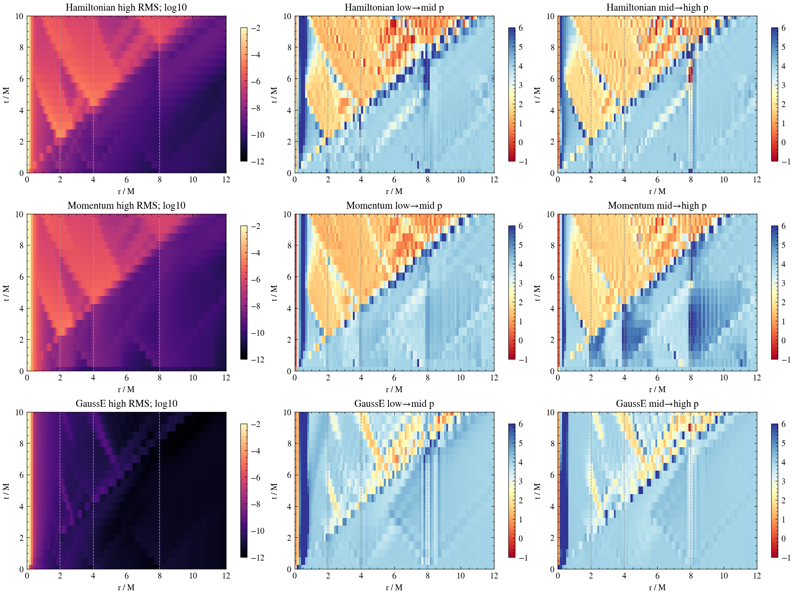

The first column shows native high-grid constraint RMS; the next columns show common-coordinate low→mid and mid→high orders. Colour limits for orders are −1 to 6; the CSV retains values outside that range. Dashed radial guides at 2,4,8 M are axis/equator face radii, not the full angular boundary. The [six-sector maps](figures/t5-angle-orders.png) retain the angle dependence. The decline in the ring and then the far shell follows moving error structures, while good orders persist ahead of them. It is not explained by a changed box census: the common-coordinate maps have a fixed census at every time.

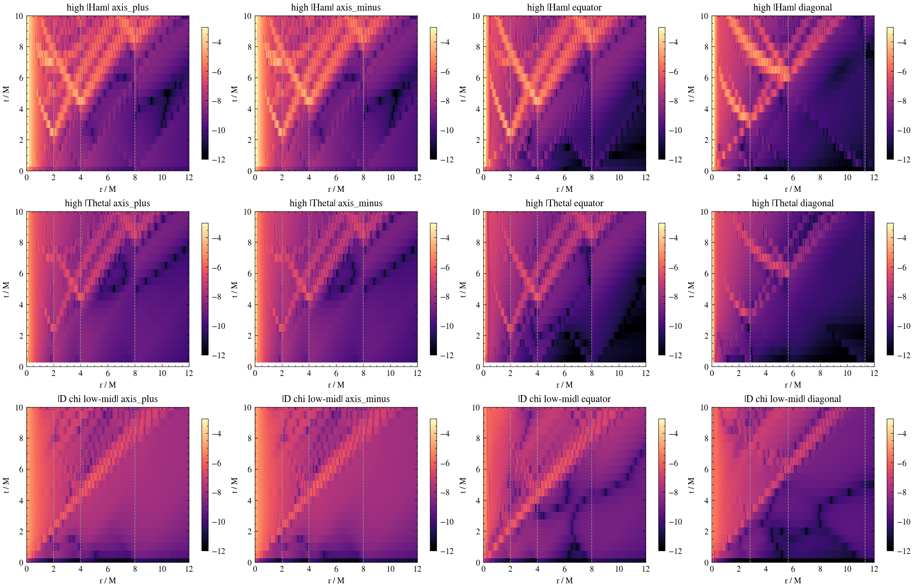

The ray maps resolve two different observations: an outward χ resolution-difference ridge and Hamiltonian/Θ packets near interfaces with subsequent inward branches. On the diagonal those packets appear later, near r=2.828 and 5.657 M, following the actual corner radii. The four-ray symmetry check, especially the delayed diagonal events, gives stronger evidence of interface association than an all-angle shell norm alone. Near a face the reconstructed lines can have a cusp when the sampler changes physical level; native RMS and the interior-mask results below are independent of that ray reconstruction.

All available-field differences, their fourth-order rescaling, signed mismatch norms and self-orders are in the [field maps](figures/t5-field-differences.png), with [ray self-order maps](figures/t5-ray-field-orders.png). The [global constraint maps](figures/t5-global-constraints.png) and [global field-difference maps](figures/t5-global-field-differences.png) cover r=0–364 M. The [temporal lapse/χ maps](figures/t5-temporal-gauge-change.png) use differences between neighbouring current outputs at Δt=0.5 M, not differences from a frozen initial profile.

## Motion and mode evidence

The tracked object is the largest-prominence lobe of |Dχ| in r=0.75–15 M at t=1.5 M. Later lobes must move outward by at most 0.75 M per 0.5 M output. This is an exploratory ridge selection, not a registered characteristic-mode test. Fits below use t=2.5–10 M. Their errors are the formal straight-line fit standard errors; they exclude lobe-selection, interpolation and cadence systematics. Axis+ and axis− agree at the reported precision.

| Ray and pair | P6 speed dr/dt | Fit standard error | Radial fit RMS/M | P8 speed |
| --- | ---: | ---: | ---: | ---: |
| Axis, low→mid | 0.968130 | 0.001543 | 0.013304 | 0.968428 |
| Axis, mid→high | 0.969164 | 0.001676 | 0.014453 | 0.968957 |
| Equator, low→mid | 0.911650 | 0.012035 | 0.103789 | 0.912086 |
| Equator, mid→high | 0.969485 | 0.001743 | 0.015034 | 0.969164 |
| Diagonal, low→mid | 0.977229 | 0.004877 | 0.042063 | 0.976930 |
| Diagonal, mid→high | 0.974678 | 0.003631 | 0.031314 | 0.974977 |

The coarse-pair equatorial ridge switches lobes late in the run and does not establish a precise isotropic speed of 0.97. The axis and finer-pair speeds are close to the unit-speed benchmark and exceed the 0.87 benchmark. The comparison does not distinguish a unit-speed shift mode from a coupled constraint signal. In particular, the requested √(1.8α)/ψ² equals √(1.8αχ) when χ=ψ⁻⁴. The submitted parameters say `lapse_coeff=2`, but the unchanged EMS `ExperimentalGauge::rhs_gauge` hardcodes 1.8 in −1.8α(K−2Θ); the parameter does not select that coefficient. The √(2αχ) column is retained only as a parameter-value comparison, not the active gauge coefficient. With no saved shift or conformal metric, neither expression is the complete local coordinate characteristic. The conformally flat, zero-shift light proxy α√χ is included for the same limited comparison.

| Axis χ crest time/M | Crest r/M | Requested √(1.8αχ) | Parameter-only √(2αχ) | α√χ proxy |
| ---: | ---: | ---: | ---: | ---: |
| 2.5 | 2.246094 | 0.769565 | 0.811192 | 0.479940 |
| 4.5 | 4.136719 | 0.971120 | 1.023650 | 0.653105 |
| 8.5 | 8.035156 | 1.127615 | 1.188610 | 0.796149 |
| 10 | 9.488281 | 1.156865 | 1.219440 | 0.823614 |

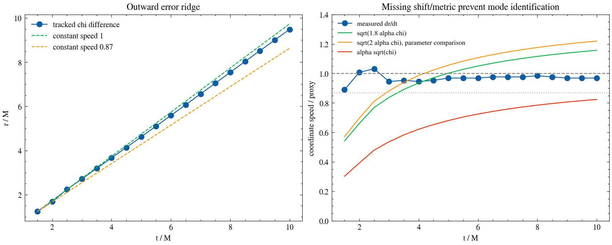

The measured ridge speed stays near 0.97 as the requested lapse proxy rises through and above it. Matching that proxy at one time is not mode identification. Current lapse and χ change throughout the inner region, and the lapse's error near the travelling ridge remains close to fourth order. It is therefore plausible that a gauge relaxation signal is exposing or amplifying a different low-order χ/Θ error. **Maximal→1+log trumpet relaxation is an interpretation, not a measured identification of this ridge:** K, shift and Γ̃ are absent, and a trumpet endpoint is not established by a 10 M run.

## Interface events and packet widths

For each crossed interface, the χ crossing time is interpolated between successive ridge positions. A Hamiltonian event is defined by the largest half-M logarithmic growth of the high-grid |H| peak within ±0.35 M of the face, searched between crossing−0.5 and crossing+1 M. The event selection and finite cadence allow the first growth to precede the ridge crest. The search is conditioned on the χ crossing, so event timing alone is not an independent causal test; the ray maps supply the surrounding evolution. The table gives these events, not exact onset times.

| Ray | Face r/M | χ crest crossing t/M | H growth event t/M | H growth factor | High abs(H) band peak |
| --- | ---: | ---: | ---: | ---: | ---: |
| Axis+ | 2 | 2.28125 | 2.5 | 54.020 | 1.64336e−4 |
| Axis+ | 4 | 4.35417 | 4.5 | 37.024 | 8.68738e−5 |
| Axis+ | 8 | 8.46429 | 8 | 45.339 | 1.12708e−6 |
| Equator | 2 | 2.22845 | 2.5 | 58.462 | 1.68955e−4 |
| Equator | 4 | 4.35656 | 4 | 45.815 | 2.38816e−6 |
| Equator | 8 | 8.83482 | 8.5 | 5.769 | 6.63905e−6 |
| Diagonal | 2.828427 | 3.17735 | 3 | 328.748 | 1.15437e−5 |
| Diagonal | 5.656854 | 6.17425 | 6 | 192.759 | 1.01783e−5 |

The axis 8 M event at t=8 M is a precursor; the larger packet develops at t≈8.5–9 M. Axis− duplicates the axis+ sequence. Inward high-grid H ridges from the 2 and 4 M events have fitted speeds −0.4641 and −0.6297 M/M over t=2.5–4 and 4.5–6.5 M. Their radial fit RMS values are 0.0059 and 0.0085 M. The 8 M and diagonal branches overlap other packets, so their fitted speeds in [t5-front-fits.csv](t5-front-fits.csv) are less reliable; the diagonal 4 M branch is explicitly marked ambiguous. These fits describe amplitude ridges, not proven characteristic speeds.

Widths are half-prominence widths of |H|, |Θ| or |Dχ| reconstructed from saved valid cells. Oversampling makes a width estimate possible but cannot resolve a two-cell lobe. The following outgoing χ **difference-lobe** widths are from the axis low/mid pair; width/h for all three grids is a spacing comparison, not three independent measurements of a physical gauge pulse.

| Time/M | χ crest r/M | Level at crest | Width/M | Width/low h | Width/mid h | Width/high h |
| ---: | ---: | ---: | ---: | ---: | ---: | ---: |
| 1.5 | 1.238281 | 6 | 0.077805 | 2.490 | 3.735 | 5.602 |
| 2.5 | 2.246094 | 5 | 0.094878 | 1.518 | 2.277 | 3.416 |
| 4.5 | 4.136719 | 4 | 0.145349 | 1.163 | 1.744 | 2.616 |
| 8.5 | 8.035156 | 3 | 0.219766 | 0.879 | 1.319 | 1.978 |
| 10 | 9.488281 | 3 | 0.322010 | 1.288 | 1.932 | 2.898 |

A cleaner independent-per-grid comparison is the Hamiltonian packet just inside the 2 M face at t=2.5 M:

| Grid | Local h/M | P6 peak abs(H) | P6 width/M | P6 width/h | P8 width/h |
| --- | ---: | ---: | ---: | ---: | ---: |
| Low | 0.03125 | 4.55818e−4 | 0.057302 | 1.834 | 1.793 |
| Mid | 0.0208333 | 2.82966e−4 | 0.040950 | 1.966 | 1.961 |
| High | 0.0138889 | 1.64336e−4 | 0.029527 | 2.126 | 2.123 |

The width shrinks in physical units with refinement and remains about two cells. Thus these grids do not resolve a fixed smooth constraint packet whose width can be held constant in a convergence argument. Many later face/corner width estimates are also sub-two-cell or straddle a diagnostic stencil switch; [t5-pulse-widths.csv](t5-pulse-widths.csv) flags those cases. Even an `INTERPOLATED_WIDTH` flag does not certify resolution of a physical wave. Agreement of P6/P8 supports the locations and the two-cell scale of the first packet, but cannot establish its continuum shape.

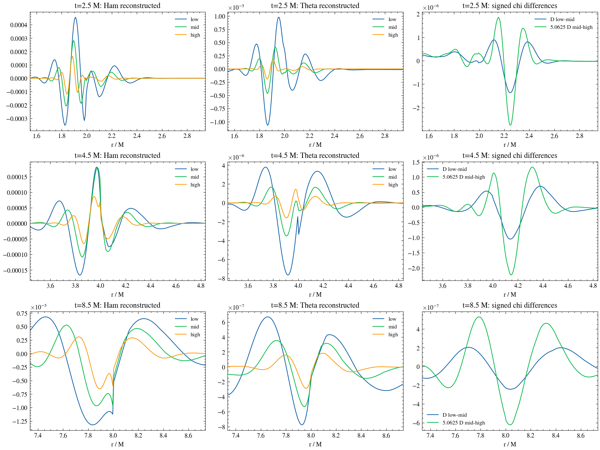

Self-orders in an identical ±0.5 M axis window centred on the low/mid χ ridge separate the saved fields' behaviours. Each entry is P6/P8 diagnostic sampling, not the two constraint-order pairs.

| Time/M | χ self-order | Lapse self-order | Scalar φ self-order | Θ self-order |
| ---: | ---: | ---: | ---: | ---: |
| 2.5 | 2.718/2.712 | 3.996/3.996 | 3.884/3.886 | 2.621/2.661 |
| 4.5 | 2.587/2.581 | 4.000/4.002 | 3.995/3.998 | 2.267/2.320 |
| 8.5 | 2.036/2.025 | 3.813/3.818 | 4.064/4.062 | 0.821/0.832 |
| 10 | 1.313/1.312 | 3.798/3.801 | 4.097/4.095 | 1.067/1.077 |

The signed differences do not collapse under fourth-order scaling in the narrow χ packet, and Θ carries a nonzero constraint signal with low self-order. The measured object is therefore a constraint-bearing numerical error structure coupled to the changing gauge/geometry. The data do not establish that the physical lapse pulse itself is under-resolved. Nor do three grids establish that the order will recover beyond the present resolutions: χ/Θ packet self-orders deteriorate outward, while mid/high constraint orders improve only modestly in the late exterior shells. A grid-dependent packet amplified or emitted at interfaces is supported; an intrinsically first/second-order AMR operator, reduced puncture regularity, or insufficient resolution of an unsaved characteristic cannot be separated here.

## The wake persists in the interior

To remove immediate interface neighbourhoods, a second, fixed physical selection excludes both sides of every rectangular refinement face by four **low-grid coarse-side cells** and excludes the axis by four low-grid local cells. This uses hierarchy geometry only, identically on all three grids; it does not follow a profile, horizon or moving field feature. These cuts leave 3526/7936/17854 native cells in each of the ring and far masks, 792/1788/4004 in r=2.5–3 M, and 598/1340/3006 in r=4.5–5.5 M. The available cells and weighting are recorded with the raw norms. These are native-cell RMS on a common physical region, rather than interpolated pointwise differences.

Each order entry below is low→mid / mid→high. H=Hamiltonian, M=joint momentum, G=GaussE.

| Time/M | Region after fixed exclusions | H orders | M orders | G orders |
| ---: | --- | ---: | ---: | ---: |
| 1 | ring 2–4 | 3.720/3.687 | 3.646/3.623 | 3.962/3.975 |
| 2.5 | ring 2–4 | 2.810/4.366 | 1.900/2.052 | 3.504/3.633 |
| 5 | ring 2–4 | 2.087/2.592 | 2.596/2.645 | 3.615/3.156 |
| 10 | ring 2–4 | 1.464/1.704 | 1.394/1.724 | 3.928/3.412 |
| 1 | far 4–8 | 3.783/3.793 | 3.622/3.616 | 3.866/3.928 |
| 2.5 | far 4–8 | 3.905/3.889 | 3.712/3.648 | 4.045/4.010 |
| 5 | far 4–8 | 1.921/2.242 | 2.086/1.663 | 2.611/2.922 |
| 10 | far 4–8 | 1.045/1.313 | 1.278/1.465 | 3.806/3.844 |
| 1 | wake 2.5–3 | 4.167/4.031 | 3.759/3.670 | 3.933/3.943 |
| 5 | wake 2.5–3 | 2.548/2.348 | 1.831/1.975 | 4.033/4.174 |
| 10 | wake 2.5–3 | 1.377/1.602 | 1.250/1.580 | 3.987/3.979 |
| 1 | wake 4.5–5.5 | 3.758/3.764 | 3.709/3.688 | 3.755/3.865 |
| 5 | wake 4.5–5.5 | 1.905/2.234 | 1.854/1.498 | 2.563/2.905 |
| 10 | wake 4.5–5.5 | 1.380/1.419 | 1.259/1.459 | 3.748/3.805 |

The axis χ crest is beyond 9 M at t=10 M, yet H/M remain low order throughout both strict exterior masks and both trailing shells. GaussE in the strict trailing shells has largely recovered toward fourth order. Removing immediate interface cells therefore does not remove the H/M failure. Repeated interface-associated packets and their inward branches are measured candidates for feeding the wake; their later overlap and constraint propagation are inferred contributors. A persistent puncture contribution is also possible. The saved data cannot quantify a source/damping balance or establish continuous injection from one unique operation.

The puncture is already a separate low-order region before the outward ridge reaches the first interface. In the native r<0.1 M core (16/38/82 cells), t=0 orders are H 3.005/2.859, M 0.558/0.427 and G 1.539/1.415. At t=10 M they are H 1.272/1.155, M 0.375/0.263 and G −0.666/0.652. These sparse core norms include progressively closer cell centres under refinement. They establish poor core convergence, but do not prove that every later interface packet originated at the puncture. In particular, the angularly delayed bursts follow fixed faces and corners after the travelling ridge has left the core.

## Outer boundary and causal conclusion

Outer-boundary constraint error is present. On the high-grid positive axis at t=10 M, reconstructed H is 1.14979e−7 at r=250.5 M and 1.75036e−7 at r=255.5 M, compared with 4.4073e−10 at r=240.5 M and −9.07e−15 at r=200.5 M. The [outer-boundary maps](figures/t5-outer-boundary.png) show this separate outer-region disturbance; their momentum row is the saved Mom1 component. The full-domain maps supply the intervening radii. A signal travelling from r=256 to r=20 by t=10 M would require an average inward speed 23.6 M/M. There is no observed inward connection of that scale, while the inner error ridge moves outward at approximately unit speed and the constraint events follow inner-interface geometry. Outer-boundary entry is consequently disfavoured as the cause of the ring/far decline during this interval; it is not claimed that the outer boundary has zero error.

**Causal statement, inferred:** an inner gauge/geometry relaxation disturbance accompanies an outward χ error ridge; its encounters with the 2,4,8 M refinement faces, and the corresponding diagonal corners, are associated with fresh narrow H/Θ packets. Those packets and their inward branches can sustain a low-order H/M wake after the outward ridge has passed. **Measured support:** the ≈0.97 axis ridge speed, angularly delayed interface events, shrinking ≈two-cell H widths, failure of fourth-order χ/Θ difference scaling, and persistent low orders after fixed interface exclusions. **Unresolved:** unique lapse/shift/constraint characteristic, the role of unsaved EMS/Γ̃/K fields, eventual asymptotic recovery, and the precise spatial/time transfer or derivative operation responsible. A controlled operator attribution cannot be made from these plots alone.

## Artifacts and reproduction

The CSVs contain every output time, including t=0. The [input audit](t5-input-audit.csv) records plot SHA-256 hashes, component inventories, finiteness, the GaussB zero-check and fixed geometry. [t5-layout.csv](t5-layout.csv) records all three hierarchies; [t5-constraint-profiles.csv](t5-constraint-profiles.csv) contains native/common/interior radial-sector RMS and orders; [t5-field-differences.csv](t5-field-differences.csv) contains P6/P8 self-orders and fourth-order comparisons. [t5-line-profiles.csv](t5-line-profiles.csv), [t5-global-profiles.csv](t5-global-profiles.csv) and [t5-outer-profiles.csv](t5-outer-profiles.csv) provide signed ray values and wider-domain coverage. The `interior` radial profile flag excludes low-grid box-edge cells; the stronger, geometry-only `bulk_*` mask rows used above are defined separately and must not be confused with it.

[t5-front-tracks.csv](t5-front-tracks.csv) and [t5-front-fits.csv](t5-front-fits.csv) supply ridge positions, speeds, spacing comparisons and current-field proxies. [t5-interface-events.csv](t5-interface-events.csv), [t5-pulse-widths.csv](t5-pulse-widths.csv) and [t5-packet-orders.csv](t5-packet-orders.csv) give event selections, width qualifications and ray-window orders. [t5-mask-norms.csv](t5-mask-norms.csv) and [t5-mask-orders.csv](t5-mask-orders.csv) contain all native mask RMS values, counts and both order pairs. Every figure has both PNG and PDF versions. [COMMIT-MANIFEST-T5.txt](COMMIT-MANIFEST-T5.txt) hashes the T5 artifacts; the T4 manifest is retained as the historical T4 snapshot, including its pre-T5 README hash.

Reproduce with the already-installed local Python environment:

```sh
PYTHONDONTWRITEBYTECODE=1 /Users/auroradysis/miniconda3/bin/python Tests/EMSNative/t5-analyze.py /Users/auroradysis/Workspace/EMS/.data/exp-0019
PYTHONDONTWRITEBYTECODE=1 /Users/auroradysis/miniconda3/bin/python Tests/EMSNative/t5-report.py
```

The first command validates the samplers and native reductions and writes the temporary map cache to `/private/tmp/ems-t5/t5-maps.npz`; the second exports the CSVs and figures. The measured execution times and peak RSS are in `t5-analysis-performance.csv` and `t5-report-performance.csv`; each pass took under one minute, with peak RSS below 2 GB, below the 12 GB local gate. All postprocessing is complete. Input data, production sources, Chombo, and the author's RHFinder remain unchanged. No commit was made.

# T6 — volume norms, frozen-checkpoint horizon qualification, interface pair

**A: COMPLETE; late H/M convergence still fails after coordinate-volume correction.** At 10 M, ring H orders are 1.446/1.660 and far H orders 0.909/1.275. **B: COMPLETE on all eight available checkpoints; the horizon charge loss survives the tightened root and angular checks.** The exact 2–10 M interval and the early candidate-area dip cannot be re-found because those full states were not saved. **C: FOLLOWS-FACE**, both detached runs finished with exit 0. The incoming narrow Gamma/shift feature matches the longitudinal shift speed; its receiving-grid curvature width is about three cells. The precise ghost/RHS/KO operation remains underdetermined by the saved post-step strips. No commit was made.

The [expert review](../../../consult-5-reply.md) was read first. The review's distinction between an interface-associated numerical constraint packet and a demonstrated physical gauge shock is retained. The reference and E inputs in the EMS repository are read-only. No static solution, difference from a static profile, or static-profile target enters any post-initial diagnostic or evolution. B restarts frozen evolved checkpoints with a deliberately nonexistent `ems_data_path`; C uses the checksum-matched table only at t=0 and retains the existing `t2_guard_initial_data_after_t0=true` guard. RHSurf/RHUnion, Chombo, point-transfer operators, evolution equations, gauge and sigma remain unchanged; sigma is 1.

## A. Correct coordinate-volume norms

[t6-norms.py](t6-norms.py) reuses T5's validated plot reader, covered-cell removal and fixed physical exclusions. The new primary norm is

\[
\|C\|_{\mathrm{vol}}=\sqrt{\frac{\sum_{\mathrm{uncovered}}2\pi y_i h_\ell^2 C_i^2}{\sum_{\mathrm{uncovered}}2\pi y_i h_\ell^2}}.
\]

This is coordinate volume, without a proper-volume metric factor. Momentum uses C²=Mom1²+Mom2². The retained `cell_weighted` norm is sqrt(sum(y C²)/sum(y)); it is labelled separately from `coordinate_volume` in every row. All calculations use current saved Float64 fields. The masks are the same registered coordinate bands as T3–T5: `horizon` [0.63593977642346233,1.2718795528469247], `near_hole` [0.1,2], `ring` [2,4], `far` [4,8] M. The horizon name denotes the registered band, not a newly fitted or evolving surface.

Both order pairs use log(RMS_coarse/RMS_fine)/log(1.5). H=Hamiltonian, M=joint momentum, G=GaussE. Each entry is low→mid / mid→high. These are residual-norm orders, not evolved-field self-difference orders.

| Time/M | Mask | Volume H | Volume M | Volume G |
| ---: | --- | ---: | ---: | ---: |
| 1 | horizon | 2.641/2.435 | 3.676/2.919 | 7.876/4.070 |
| 1 | near hole 0.1–2 | 2.702/4.867 | 1.899/2.758 | 2.029/2.436 |
| 1 | ring 2–4 | 3.753/3.708 | 3.551/3.533 | 4.033/4.021 |
| 1 | far 4–8 | 3.821/3.771 | 3.512/3.524 | 4.066/4.020 |
| 2.5 | horizon | 4.616/4.244 | 4.689/3.968 | 9.307/4.079 |
| 2.5 | near hole 0.1–2 | 2.461/4.833 | 2.095/2.729 | 1.961/2.707 |
| 2.5 | ring 2–4 | 1.686/1.834 | 1.365/1.512 | 3.045/3.305 |
| 2.5 | far 4–8 | 3.819/3.797 | 3.460/3.459 | 4.099/4.060 |
| 5 | horizon | 1.611/1.688 | 2.116/1.693 | 7.052/4.054 |
| 5 | near hole 0.1–2 | 2.890/5.040 | 1.965/2.631 | 1.985/2.533 |
| 5 | ring 2–4 | 1.327/1.592 | 1.410/1.561 | 2.844/2.433 |
| 5 | far 4–8 | 1.510/1.693 | 1.290/1.519 | 2.557/2.900 |
| 7.5 | horizon | 4.578/2.519 | 4.393/2.381 | 8.028/4.066 |
| 7.5 | near hole 0.1–2 | 2.930/4.170 | 1.772/2.721 | 2.079/2.196 |
| 7.5 | ring 2–4 | 1.302/1.597 | 1.304/1.593 | 3.980/3.887 |
| 7.5 | far 4–8 | 1.450/1.590 | 1.485/1.692 | 2.171/2.059 |
| 10 | horizon | 2.002/1.616 | 2.331/1.570 | 8.585/4.077 |
| 10 | near hole 0.1–2 | 2.868/3.859 | 1.684/2.793 | 2.112/2.007 |
| 10 | ring 2–4 | 1.446/1.660 | 1.372/1.658 | 3.346/2.688 |
| 10 | far 4–8 | 0.909/1.275 | 0.992/1.274 | 2.456/2.179 |

GaussB is exactly zero on every valid cell of all 15 selected plots; its zero norm has no logarithmic order. [t6-norms.csv](t6-norms.csv) contains raw RMS, cell counts, weight sums and minimum/maximum participating spacing for all three grids. [t6-orders.csv](t6-orders.csv) contains both weightings and both pairs. Constant-field and split-cell-volume checks pass; the retained published native counts/norms agree to relative 2e-12, and the old T5 wake/mask orders agree to relative 1e-12 (absolute order tolerance 1e-14).

For the wake comparison, the same fixed geometry cuts exclude both sides of every rectangular face by four low-grid coarse-side cells and the axis by four low-grid local cells. They do not follow a field feature. Counts remain 3526/7936/17854 in bulk ring and far, 792/1788/4004 in bulk wake 2.5–3, and 598/1340/3006 in bulk wake 4.5–5.5. Volume orders are:

| Time/M | Region after exclusions | Volume H | Volume M | Volume G |
| ---: | --- | ---: | ---: | ---: |
| 1 | ring 2–4 | 3.726/3.690 | 3.648/3.614 | 3.952/3.970 |
| 1 | far 4–8 | 3.785/3.794 | 3.674/3.668 | 3.867/3.921 |
| 1 | wake 2.5–3 | 4.167/4.031 | 3.759/3.670 | 3.933/3.943 |
| 1 | wake 4.5–5.5 | 3.760/3.767 | 3.707/3.697 | 3.755/3.859 |
| 2.5 | ring 2–4 | 2.835/4.770 | 1.914/2.207 | 3.497/3.630 |
| 2.5 | far 4–8 | 3.902/3.886 | 3.709/3.633 | 4.033/3.994 |
| 2.5 | wake 2.5–3 | 4.993/3.762 | 5.693/4.111 | 4.154/4.016 |
| 2.5 | wake 4.5–5.5 | 3.938/3.960 | 4.053/4.022 | 3.733/3.814 |
| 5 | ring 2–4 | 2.081/2.591 | 2.570/2.621 | 3.766/3.383 |
| 5 | far 4–8 | 1.913/2.247 | 2.085/1.597 | 2.589/2.916 |
| 5 | wake 2.5–3 | 2.548/2.348 | 1.831/1.975 | 4.033/4.174 |
| 5 | wake 4.5–5.5 | 1.910/2.244 | 2.009/1.535 | 2.558/2.904 |
| 7.5 | ring 2–4 | 1.384/1.811 | 1.351/1.666 | 4.040/4.005 |
| 7.5 | far 4–8 | 1.389/1.467 | 1.423/1.641 | 2.774/2.782 |
| 7.5 | wake 2.5–3 | 1.622/1.898 | 1.435/1.784 | 3.975/4.024 |
| 7.5 | wake 4.5–5.5 | 1.786/1.377 | 2.135/1.784 | 3.799/3.355 |
| 10 | ring 2–4 | 1.359/1.659 | 1.330/1.674 | 3.850/3.279 |
| 10 | far 4–8 | 1.043/1.314 | 1.277/1.465 | 3.698/3.740 |
| 10 | wake 2.5–3 | 1.377/1.602 | 1.250/1.580 | 3.987/3.979 |
| 10 | wake 4.5–5.5 | 1.334/1.415 | 1.260/1.461 | 3.718/3.788 |

For continuity, the late exterior comparison with the old weighting is:

| Time/M | Mask | Weighting | H | M | G |
| ---: | --- | --- | ---: | ---: | ---: |
| 10 | ring | cell_weighted | 1.451/1.646 | 1.371/1.651 | 3.226/2.680 |
| 10 | ring | coordinate_volume | 1.446/1.660 | 1.372/1.658 | 3.346/2.688 |
| 10 | far | cell_weighted | 0.919/1.276 | 1.104/1.325 | 2.227/2.081 |
| 10 | far | coordinate_volume | 0.909/1.275 | 0.992/1.274 | 2.456/2.179 |
| 10 | bulk_ring | cell_weighted | 1.464/1.704 | 1.394/1.724 | 3.928/3.412 |
| 10 | bulk_ring | coordinate_volume | 1.359/1.659 | 1.330/1.674 | 3.850/3.279 |
| 10 | bulk_far | cell_weighted | 1.045/1.313 | 1.278/1.465 | 3.806/3.844 |
| 10 | bulk_far | coordinate_volume | 1.043/1.314 | 1.277/1.465 | 3.698/3.740 |

**Measured conclusion:** level-volume weighting changes some orders, particularly where masks combine levels, but does not remove the late H/M wake. Both strictly excluded trailing shells retain H/M orders about 1.3–1.6 at 10 M. This corrects T5's norm definition without waiving the exterior convergence gate.

## B. What the finder residual and status mean

The unchanged [RHSurf::expansion_error](../../Source/RHFinder/RHSurf.hpp) returns sum(dA Theta+²)/sum(dA), an area-weighted **mean square**, not an RMS residual (`RHSurf.hpp:228–239`). `average_Theta_plus` returns sum(dA Theta+)/sum(dA) (`:201–212`); cancellation in this signed mean does not certify a small expansion. `print_diagnostics` writes these quantities to the `<Theta+>` and `err` columns (`:643–666`). The actual RMS expansion of a printed row is sqrt(err).

[RHUnion.hpp](../../Source/RHFinder/RHUnion.hpp) sets FOUND when err≤1e-7, CLOSE when 1e-7<err≤1e-4, and FAR when err>1e-4 (`:24–26,262–264,371–373`). Thus FOUND permits RMS up to 3.16227766e-4; CLOSE permits RMS between that value and 1e-2. The intermediate enum and `m_thresh_close=5e-4` do not select the active chase regime. The Newton block is commented out (`:325–366`), so `RH_newton_crit` does not enable a Newton polish here. Mode describes the solver regime, not an area/charge error bound.

The complete [t6-finder-history.csv](t6-finder-history.csv) converts all 230 exp-0019 rows to the actual printed expansion RMS. The terminal rows are at 10.0625 M:

| Grid | Found/close/far counts | Terminal mean Theta+ | Terminal err (mean square) | Terminal RMS Theta+ | RMS range over history |
| --- | ---: | ---: | ---: | ---: | ---: |
| E-low | 1/61/30 | 4.64158637e-04 | 3.21662869e-06 | 1.79349622e-03 | 3.16219872e-04–3.78206368e-02 |
| E-mid | 7/91/40 | -3.20398825e-04 | 1.24617172e-07 | 3.53011575e-04 | 9.33099808e-05–3.13419748e-02 |

## B. Frozen-checkpoint re-finds

[t6-horizons.py](t6-horizons.py) runs one bounded frozen find per invocation using the existing [EMSRHFinder offline harness](../EMSRHFinder/OFFLINE.md). It reads only the current checkpoint, submitted parameters and saved numerical shape. No evolution or regrid is possible in `FrozenLevel`. The saved same-time Nθ=96 shape seeds every nonzero-time find; only the seed is interpolated when Nθ changes. Since no t=0 finder row was written, the earliest saved numerical shape (low 0.109375 M, mid 0.0729166667 M) seeds a fresh root solve on the **t=0 checkpoint**. The resulting t=0 area/charge is the numerical baseline; no known/static horizon surface is supplied.

The unchanged author's chase is accepted successively at mean-square thresholds 1e-7,1e-10,1e-12. The final requirement is RMS Theta+≤1e-6, with a fresh interpolation on final points before acceptance. Each Nθ=48/96 find is capped at 115 s internally and 120 s externally. All 16 exit 0; measured per-case wall time is 4.510–75.878 s and maximum child RSS is 477,528,064 bytes (0.478 GB), using four threads. No long finder run is pending.

One opt-in harness parameter, `t6_checkpoint_diagnostics=true` (default false), selects a chase multiplier of 2 instead of the harness default 0.125, enables the fixed-sphere flux output, and permits roundoff-level checkpoint timestamp disagreement. It changes no author finder formula/header. The terminal mid checkpoint differs by one Float64 ulp (1.7763568394002505e-15 M) between levels; the opt-in reader allows at most 64 epsilon max(1,abs(t)). No field or stored time is altered, advanced or time-interpolated to correct this metadata. The default reader retains its exact-time check. The discrepancy and seeds are recorded in [t6-finder-runs.csv](t6-finder-runs.csv); [t6-finder-input-audit.csv](t6-finder-input-audit.csv) records each case’s input hashes. The first fourteen cases used the preceding harness build with exact matching level times; only the two terminal mid cases require the added timestamp allowance. No root formula differs between those builds.

Final values below are roots on each frozen numerical grid, not continuum extrapolations. Both angular resolutions achieve the tightened residual; negative mean Theta− ranges from −6.13954 to −6.02262.

| Grid | Checkpoint time/M | A48 | A96 | Q48 | Q96 | Max final RMS Theta+ |
| --- | ---: | ---: | ---: | ---: | ---: | ---: |
| E-low | 0.00000000 | 0.383746360082 | 0.383694979863 | 1.048593549799 | 1.048453144559 | 9.99886289e-07 |
| E-low | 4.59375000 | 0.383753080558 | 0.383701732722 | 1.045626194335 | 1.045487383936 | 9.99965102e-07 |
| E-low | 9.18750000 | 0.383673197167 | 0.383621888331 | 1.040939973207 | 1.040800798086 | 9.99872279e-07 |
| E-low | 10.06250000 | 0.383635034047 | 0.383583753746 | 1.040080836443 | 1.039941403653 | 9.99990856e-07 |
| E-mid | 0.00000000 | 0.383746277655 | 0.383694906805 | 1.048593447342 | 1.048453070104 | 9.99872225e-07 |
| E-mid | 4.66666667 | 0.383750331160 | 0.383698952290 | 1.048151239804 | 1.048010992137 | 9.99855009e-07 |
| E-mid | 9.33333333 | 0.383752151054 | 0.383700772146 | 1.047684113918 | 1.047543839256 | 9.99902184e-07 |
| E-mid | 10.06250000 | 0.383752667733 | 0.383701288465 | 1.047612511223 | 1.047472247240 | 9.99960459e-07 |

Angular sensitivity is the measured |Nθ=48−96| spread. Stopping sensitivity is the Nθ=96 change from the RMS≤1e-5 stage to RMS≤1e-6. These are sensitivity measurements, not rigorous absolute-error bounds. The replay RMS is a fresh current-field evaluation of the serialized native shape, before re-solving:

| Grid | Time/M | Angular delta A | Angular delta Q | Stopping delta A | Stopping delta Q | Seed replay RMS |
| --- | ---: | ---: | ---: | ---: | ---: | ---: |
| E-low | 0.00000000 | 5.13802191e-05 | 1.40405240e-04 | 4.21969051e-07 | 1.70017334e-11 | 1.23165528e-04 |
| E-low | 4.59375000 | 5.13478359e-05 | 1.38810399e-04 | 4.28230395e-07 | 7.77429627e-08 | 5.57218948e-03 |
| E-low | 9.18750000 | 5.13088354e-05 | 1.39175121e-04 | 4.28199505e-07 | 1.06385422e-07 | 2.05586257e-03 |
| E-low | 10.06250000 | 5.12803008e-05 | 1.39432791e-04 | 4.28090759e-07 | 1.08981490e-07 | 1.79352398e-03 |
| E-mid | 0.00000000 | 5.13708505e-05 | 1.40377238e-04 | 4.21971446e-07 | 5.96678262e-12 | 7.85064236e-05 |
| E-mid | 4.66666667 | 5.13788705e-05 | 1.40247666e-04 | 4.27119055e-07 | 3.45382167e-09 | 5.15338704e-03 |
| E-mid | 9.33333333 | 5.13789084e-05 | 1.40274662e-04 | 4.28232899e-07 | 7.54237117e-10 | 9.58619714e-04 |
| E-mid | 10.06250000 | 5.13792687e-05 | 1.40263984e-04 | 4.28440288e-07 | 1.19401578e-09 | 3.53122371e-04 |

[t6-finder-stages.csv](t6-finder-stages.csv) keeps every seed and threshold-stage value; [t6-finder-final.csv](t6-finder-final.csv) contains all final sensitivities and both residuals. Harness columns `phi_mean`/`phi_rms` describe the scalar field on the surface; they are not expansion statistics. Expansion RMS comes from `expansion_squared` only.

At 10.0625 M the strict numerical-baseline area changes are −2.89881605e-4 (low) and +1.66321213e-5 (mid). Changing Nθ from 96 to 48 changes these relative area drifts by 2.216e-7 and 1.971e-8 respectively; the larger absolute angular area bias mostly cancels in the baseline difference. Two angular resolutions do not establish an angular convergence order or a spatial continuum limit.

The native candidate-area minima are A=0.381900984 at 0.984375 M (low) and 0.382193992 at 0.875 M (mid), both FAR with RMS expansions 0.0378206 and 0.0313420. Neither checkpoint was saved. Their status and residuals do not qualify those candidate areas as horizons; the early area excursion remains unresolved. Likewise, no 2 M checkpoint exists. The saved nonzero times are 4.59375/9.1875/10.0625 (low) and 4.666666667/9.333333333/10.0625 (mid), so those intermediate times are not a synchronized two-grid sequence.

## B. Fixed spheres and charge drift

The harness places coordinate spheres of radii 0.02,0.05,0.1 M at the parameter centre (224,0). All lie outside every final re-found horizon. It calls the author's **RHSurf::Q_charge** directly on current interpolated fields. This includes the current EMS displacement factor exp[−2 alpha(f0+f1 phi+f2 phi²)] and the curved-space unit normal/area, with the same 1/sqrt(2 pi) normalization as the finder (`RHSurf.hpp:584–596`). No target charge is supplied. [t6-fixed-spheres.csv](t6-fixed-spheres.csv) contains Nθ=48 and 96 at every checkpoint; Nθ=96 charges are:

| Grid | Time/M | Q(r=0.02) | Q(r=0.05) | Q(r=0.1) |
| --- | ---: | ---: | ---: | ---: |
| E-low | 0.00000000 | 1.048453057371 | 1.048453049899 | 1.048453050306 |
| E-low | 4.59375000 | 1.048443940790 | 1.048452975416 | 1.048453005707 |
| E-low | 9.18750000 | 1.048546863089 | 1.048448710766 | 1.048452894244 |
| E-low | 10.06250000 | 1.048883783178 | 1.048489039628 | 1.048452652514 |
| E-mid | 0.00000000 | 1.048453056022 | 1.048453054497 | 1.048453054562 |
| E-mid | 4.66666667 | 1.048452919267 | 1.048453043012 | 1.048453047542 |
| E-mid | 9.33333333 | 1.048426479510 | 1.048453305941 | 1.048453038183 |
| E-mid | 10.06250000 | 1.048432280681 | 1.048452412408 | 1.048453038492 |

Relative charge changes to the terminal checkpoint are measured against the re-found t=0 baseline and against each grid's first saved late checkpoint. The latter baselines are 4.59375 M (low) and 4.666666667 M (mid), not 2 M:

| Grid | Surface | Delta Q/Q0, N48 | Delta Q/Q0, N96 | Delta Q/Qfirst-late, N48 | Delta Q/Qfirst-late, N96 |
| --- | --- | ---: | ---: | ---: | ---: |
| E-low | horizon | -8.11822022e-03 | -8.11837987e-03 | -5.30338463e-03 | -5.30468408e-03 |
| E-low | r=0.02 | 4.10766938e-04 | 4.10820307e-04 | 4.19466314e-04 | 4.19519223e-04 |
| E-low | r=0.05 | 3.43227017e-05 | 3.43265047e-05 | 3.43937755e-05 | 3.43975485e-05 |
| E-low | r=0.1 | -3.79445388e-07 | -3.79407867e-07 | -3.36915650e-07 | -3.36870005e-07 |
| E-mid | horizon | -9.35478017e-04 | -9.35495248e-04 | -5.13979815e-04 | -5.14064167e-04 |
| E-mid | r=0.02 | -1.98133178e-05 | -1.98152329e-05 | -1.96827865e-05 | -1.96847999e-05 |
| E-mid | r=0.05 | -6.12422892e-07 | -6.12415539e-07 | -6.01459153e-07 | -6.01461324e-07 |
| E-mid | r=0.1 | -1.53295799e-08 | -1.53280285e-08 | -8.63564166e-09 | -8.63234019e-09 |

**Measured:** horizon charge loss persists after tightening the expansion residual and changing angular resolution. The terminal Nθ=96 re-find changes the native replay Q by only −5.85603e-6 (low) and −4.86737e-8 (mid), far below the accumulated losses. The quoted unqualified 2→10 M history drifts reproduce as −8.09014e-3 / −9.02281e-4 in [t6-native-drift.csv](t6-native-drift.csv); the exact interval cannot be qualified without its missing endpoint state. The independently re-found t=0→10.0625 losses are −8.11838e-3 / −9.35495e-4, and the first-late→terminal losses are −5.30468e-3 / −5.14064e-4. Thus the existence and scale of the loss survive; a new exact 2→10 M qualified number is not claimed.

**Inferred:** the much smaller fixed-sphere flux drift, especially at 0.1 M, places the discrepancy in the inner numerical state/horizon-to-sphere flux region rather than in total exterior charge loss or native stopping error alone. The low-grid 0.02 M sphere changes by +4.10820e-4 while its horizon charge falls, so the flux behaviour is radius dependent. An intervening Gauss-defect integral and spatial extraction convergence would be needed to distinguish electromagnetic evolution, near-horizon grid interpolation and gauge-dependent surface motion quantitatively. No Gauss budget or global charge-conservation certificate is inferred from two angular samples.

## B. Correct extraction settings for future E runs

The submitted E files set `activate_mq_extraction=0` and carry `mq_extraction_center=256 0 0`, whereas their actual centre is 224. That stale key is not loaded by the base MQ parser while extraction is off. No active MQ charge history was produced. For E use the existing extraction path with the following settings (reference centre would be 256):

```text
activate_mq_extraction = 1
mq_extraction_center = 224 0 0
mq_num_extraction_radii = 3
mq_extraction_radii = 20 50 100
mq_extraction_levels = 0 0 0
mq_num_points_theta = 97
mq_num_points_phi = 64
mq_num_modes = 1
mq_modes = 0 0
RH_level = 0
```

The MQ parser uses Simpson integration and increments an even theta count; 97 makes the actual count explicit. These far extraction settings do not replace the inner fixed-sphere EMS flux test above. `RH_level` is the level on whose timestep the chase runs (`RHUnion.hpp:275–277,287–292`), **not** a restriction on interpolation resolution: the AMR interpolator chooses the finest available current fields. The submitted values are 1/1/0 for E-low/mid/high. Use level 0 on all grids for a consistent coarse synchronization policy, retain an angular count justified by the sensitivity check, and retain the original chase/finder algorithm. A common comparison ladder is 0.875 M (4/6/9 base steps); future histories need a numerical t=0 baseline and saved early transient states. No large E evolution was rerun here.

## C. Detached reference-mid interface attribution pair

The pair starts fresh at t=0 with the exp-0019 MID reference member: h0=4/3 M, max_level=6, h6=1/48 M, CFL=0.0625, dt0=1/12 M, point mode, sigma=1, fixed hierarchy, 72 base steps to 6 M. Parameters are [face2](params/t6-ref-mid-face2.txt) and [face3](params/t6-ref-mid-face3.txt). The local initial table SHA-256 `6f0820a576620f1f7230c701131af56a2312b130e31d5de2a752c32cefe6d24f` equals the exp-0019 launch manifest. RH is disabled for this attribution pair to avoid finder cost; its source is unchanged. The submitted evolution/gauge coefficients and positivity floors are retained.

Actual t=0 box unions are registered from bounded native probes in [t6-layout.csv](t6-layout.csv), with every individual box in [t6-boxes.csv](t6-boxes.csv). In coordinates relative to centre (256,0), each union is [−a,a]×[0,a]:

| Level | h/M | Face2 a/M; boxes | Face3 a/M; boxes | Internal seams |
| ---: | ---: | ---: | ---: | --- |
| 0 | 4/3 | 256; 6 | 256; 6 | x=±85.3333333333, y=128 |
| 1 | 2/3 | 64; 2 | 64; 2 | x=0 |
| 2 | 1/3 | 32; 2 | 32; 2 | x=0 |
| 3 | 1/6 | 16; 2 | 16; 2 | x=0 |
| 4 | 1/12 | 8; 2 | 8; 2 | x=0 |
| 5 | 1/24 | 4; 2 | 4; 2 | x=0 |
| 6 | 1/48 | 2; 2 | 3; 8 | Face2: x=0. Face3: x=−1.5,0,1.5 and y=1.5 |

Every original box matches exp-0019 MID exactly. Every parent box (levels 0–5) is identical between the pair. The finest face is exactly 3 M after the existing tag-buffer/block alignment, selected by `mass_extraction_radii`'s final value 2.3 instead of 1.5; the parent face remains exactly 4 M. This parameter determines geometric initialization of the fixed layout, not a static solution profile. The finest convex-corner radius changes from 2.828427125 to 4.242640687 M; the parent corner stays 5.656854249 M. **Decomposition confound:** the larger level-6 union needs eight boxes and introduces extra same-level seams. The experiment changes finest patch extent and its decomposition together; it cannot assign a response exclusively to the coarse–fine face without checking those seams.

A local-vs-cluster t=0 comparison is in [t6-cluster-t0-comparison.csv](t6-cluster-t0-comparison.csv). It uses the same input hash/boxes but different platform builds: maximum lapse/chi differences are 1.705e-14/8.549e-15, and the largest constraint difference is Mom2 4.815e-10. This is not a bitwise cross-platform control. The required same-platform default controls below are bit-identical.

All 28 evolved variables and five constraint components are saved at t=0,0.25,…,6 M, 25 plots per run. The explicit 33-variable list contains chi, the conformal metric/extrinsic curvature, K, Theta, Gamma1/2, lapse, shift1/2, driver B1/2, scalar phi/Pi, cleaning Lambda/Xi, magnetic Bx/By/Bz and electric Ex/Ey/Ez, plus Ham/Mom1/Mom2/GaussE/GaussB. Checkpoints are disabled to meet the disk budget.

One production opt-in flag, `t6_interface_diagnostics=true` (default false), writes narrow **current-field** strips at each base synchronization time after constraints are evaluated, on levels 4,5,6. It reads valid FArrayBox values only and changes no state. Each strip includes both sides available on that level within two local cells of its own/child rectangular face, plus a covered-cell label. Level-5 strips therefore include the parent side of the moved 2/3 M interface; level-6 strips include its fine side. Level-4/5 strips also capture the fixed 4 M interface. Covered values are diagnostic operation samples, to be excluded from composite norms. These are post-step samples, not RK-stage or RHS/pre-floor recordings.

The strip format is checked by [t6-check.py](t6-check.py): `T6STRIP1` (8 bytes), four little-endian Float64 values (time,dx,own face,child face), three uint32 values (level,28,36), then 36-column Float64 rows: x relative to centre, y, covered flag, the 28 evolved variables in UserVariables order, and Ham/Mom1/Mom2/GaussE/GaussB. Header length is 52 bytes. There are 72 frames per saved level, with no separate t=0 strip (the full t=0 plot is present).

### Resources and launch ledger

The wall-time plan was reported before launch: original 8–12 min, moved 13–20 min, **serial** total 21–32 min, four OpenMP threads. A completed three-step moved-layout probe took 23.026 s with peak RSS 335,347,712 bytes. Each queued job has a registered conservative 4 GB memory allowance, comfortably below the 12 GB local gate; only one evolution child runs at once. [t6-resource-plan.csv](t6-resource-plan.csv) records measured full-plot/strip sizes:

| Case | Bytes/plot | Number of plots | Strip bytes/base step | Base steps | Projected output bytes |
| --- | ---: | ---: | ---: | ---: | ---: |
| face2 | 48,696,864 | 25 | 1,098,012 | 72 | 1,296,478,464 |
| face3 | 54,779,424 | 25 | 1,319,196 | 72 | 1,464,467,712 |

Projected pair output is **2,760,946,176 bytes (2.761 GB)** plus small logs/metadata, below the 5 GB budget; free local disk was 25 GiB at registration. This is fixed-size binary/HDF5 output, avoiding the much larger per-cell text form. The production executable is frozen at `/private/tmp/ems-t6/evolution.ex`.

The existing [t4-run.py](t4-run.py) launches a detached session (`start_new_session=True`, stdin detached), redirects each child's stdout/stderr into its own `run.log`, and atomically replaces `done.exit` on return. [t6-run-plan.json](t6-run-plan.json) is the exact serial queue; [t6-runs.csv](t6-runs.csv) records commands, directories, logs, markers, measured resources and the analysis limit. Launcher log/PID are `/private/tmp/ems-t6/evolution/launcher.log` and `launcher.pid`. Launched at 2026-09-30T05:42:20.863192+00:00, detached queue PID 11659; face3 ran after face2. Both are complete.

| Case | Command | Directory | Log | Atomic marker | Status |
| --- | --- | --- | --- | --- | --- |
| face2 | `/private/tmp/ems-t6/evolution.ex <worktree>/Tests/EMSNative/params/t6-ref-mid-face2.txt` | `/private/tmp/ems-t6/evolution/face2` | `face2/run.log` | `/private/tmp/ems-t6/evolution/face2/done.exit` | COMPLETE, 0 |
| face3 | `/private/tmp/ems-t6/evolution.ex <worktree>/Tests/EMSNative/params/t6-ref-mid-face3.txt` | `/private/tmp/ems-t6/evolution/face3` | `face3/run.log` | `/private/tmp/ems-t6/evolution/face3/done.exit` | COMPLETE, 0 |

Actual wall times are 292.191831/448.098164 s, peak child RSS 270,745,600/356,368,384 bytes, and total output 1,297,279,844/1,465,269,202 bytes (2.763 GB together). The analysis cache phase took 13.32 s with 442,810,368-byte peak RSS. This analysis turn started no new evolutions. Both layouts have all 25 full plots and 216 strips, end at 5.999999999999996 M, retain their initial boxes, and contain all 33 named components with finite values. GaussB is exactly zero throughout. Sigma is 1 in both frozen parameter files; `nan_check=1` and neither log contains a NaN, nonfinite or missing-variable report. Saved valid chi/lapse minima over the pair are 1.17892116e-4/1.11424321e-2, with zero cells at the 1e-12 floors. This certifies saved valid states, not unrecorded intermediate-stage values.

The existing `min_chi.dat` is mislabeled: `EMSBH2DLevel.cpp:464,499` uses an `AMRReductions<VariableType::diagnostic>` object with `c_chi=0`, so it reduces diagnostic component 0 (`mod_F`), not evolved chi. Its negative entries are not negative chi or evidence of a floor event. This source path was not changed. [t6c-input-audit.csv](t6c-input-audit.csv) hashes every full plot; [t6c-strip-audit.csv](t6c-strip-audit.csv) hashes every strip. [t6c-mask-norms.csv](t6c-mask-norms.csv) supplies corrected coordinate-volume H/M/G norms at all 25 times, with covered cells removed.

### C. Independent face and corner attribution

[t6c-analyze.py](t6c-analyze.py) searches every saved synchronization in the full 0–6 M interval. For each geometry-defined face/ray/level/coverage collar, it retains **all** local peaks of log10 absolute H or Theta with prominence at least 0.5 decades. Neither an expected arrival time nor a gauge/chi ridge enters this search. [t6c-events.csv](t6c-events.csv) retains 129 independently selected events, including small startup maxima. [t6c-strip-profiles.csv](t6c-strip-profiles.csv) retains amplitudes, signed extrema, cell counts and native spacing for all 6,912 collar rows. The following comparison selects the largest-amplitude member of that independently found set on uncovered level 6, as recorded in [t6c-event-pairs.csv](t6c-event-pairs.csv).

| Ray; fine-side field | Face2 peak t/M | Face3 peak t/M | Delay/M | Face2 absolute peak | Face3 absolute peak |
| --- | ---: | ---: | ---: | ---: | ---: |
| positive axis; H | 2.333333 | 3.416667 | 1.083333 | 5.083053e-4 | 1.265237e-4 |
| equator; H | 2.333333 | 3.416667 | 1.083333 | 5.071013e-4 | 1.229655e-4 |
| diagonal corner; H | 3.166667 | 4.666667 | 1.500000 | 1.721843e-4 | 4.390851e-5 |
| positive axis; Theta | 2.416667 | 3.333333 | 0.916667 | 5.105758e-6 | 1.748046e-6 |
| equator; Theta | 2.416667 | 3.333333 | 0.916667 | 5.073463e-6 | 1.763791e-6 |
| diagonal corner; Theta | 3.250000 | 4.583333 | 1.333333 | 2.081251e-6 | 2.454453e-7 |

The negative axis gives the same times/amplitudes to rounding. H peak radii on the positive axis move from 1.989829 to 2.989747 M; corner radii move from 2.813696 to 4.198447 M, immediately inside the actual faces/corners. The cadence is 1/12 M; peak phases of H and Theta differ and their delays are not identical. The H delays agree closely with the **prior**, unconditioned T5 difference-ridge predictions 1.03/1.46 M. The Theta delays are positive and move to the new faces, but should not be presented as precision confirmation of that same speed or phase.

There are earlier weak face3 H maxima: positive axis t=1.916667, amplitude 2.458071e-8; equator t=1.666667 and 2.833333, 2.644545e-8 and 4.054244e-7; diagonal t=1.5, 4.072477e-9. Thus the **first large H/Theta packet** follows the face; the literal first nonzero residual or first tiny local H maximum does not define that packet. These earlier events are retained rather than hidden by an arrival-time window.

The old-radius control is independent of the strip extent. [t6c-native-bands.csv](t6c-native-bands.csv) samples uncovered native cells in fixed 1/24 M coordinate collars around both candidate faces, their corners, the parent face and the introduced seams. At the old positive-axis face at t=2.25 M, H falls from 3.647425e-4 (face2) to 4.242247e-7 (face3), a factor 860; Theta falls from 4.711120e-6 to 2.224817e-8, a factor 212. These collars contain 5/8 cells because their native levels differ; this is an amplitude-location control, not a common-cell convergence order. At the old corner at t=3.25 M, H is 1.133200e-4/6.487750e-7. Conversely, at the new axis face at t=3.5 M H is 1.004360e-6/9.280621e-5. The packet moves to the changed geometric transition instead of staying at the old physical radius.

At the extra x=1.5 M seam near the axis at t=1.75 M, H is 1.557660e-6/1.511280e-6; at the new (1.5,1.5) seam crossing at t=2.5 M it is 1.229626e-6/1.219591e-6. Theta there is 7.854117e-9/8.349396e-9. The extra seams do not produce the large new face/corner packet. Decomposition still differs and can affect later histories, but a same-level seam is not an adequate explanation of the observed dominant burst relocation.

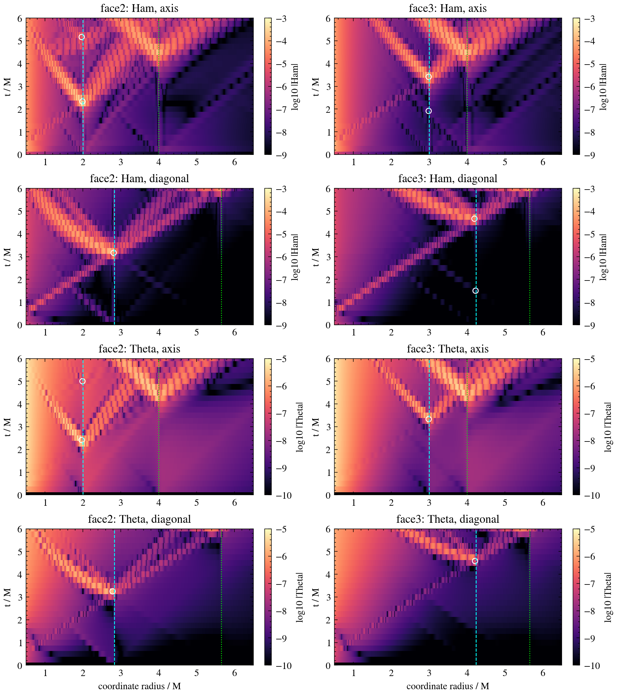

Current H/Theta maps: dashed cyan lines are the respective actual finest faces/corners; dotted green lines are the fixed parent faces/corners. White circles are all independently selected fine-side temporal peaks, including the weak early ones. Six-node point sampling with axis parity is used only for the background image; peak selection and amplitudes use native strips. [PDF](figures/t6c-interface-events.pdf).

### C. Incoming fields, characteristic speed and width

All 28 evolved fields and five constraints are sampled from current valid data on fixed common ray coordinates, with six/eight-node point interpolation and reflective parity. No stored/static profile is subtracted. [t6c-field-at-front.csv](t6c-field-at-front.csv) records every component and its finite-cadence time derivative at the tracked front; [t6c-field-curvature-tracks.csv](t6c-field-curvature-tracks.csv) independently selects the strongest positive/negative spatial-curvature prominence of each component over 0.5–7.5 M, without a speed window. [t6c-front-tracks.csv](t6c-front-tracks.csv) retains both radial Gamma lobes and the P6/P8 sampling sensitivity. The front location is the largest prominence in signed radial Gamma curvature at each time, not a solution of an imposed travel law.

The narrow incoming feature is clearest in radial Gamma and shift curvature, with associated chi/metric and electric-field response. Lapse/K carry broad relaxation as well; the lapse and Pi profiles have no interior curvature maximum selected by this rule on the positive axis at 1.5,2,2.5,3 M. The scalar curvature maximum moves inward (r=0.891→0.667 over 1.5→3 M), while the narrow negative Gamma crest moves outward (r=1.385→2.776). Driver B has a broad fixed-radius curvature maximum at r=1.865 M, not the moving narrow crest. It is distinct from magnetic Bx/By/Bz. On the diagonal before the moved face, transverse/radial ratios are at most 9.916e-6 for Gamma and 4.659e-7 for shift. This establishes a predominantly longitudinal gauge disturbance, with coupled field response; it does not prove a pure nonlinear characteristic eigenmode.

For each crest the local current fields give g=gamma-tilde inverse projected on the ray and outward coordinate benchmarks

\[
v_{\alpha}=-\beta_n+\sqrt{1.8\alpha\chi g},\quad
v_{S,T}=-\beta_n+\sqrt{0.75g},\quad
v_{S,L}=-\beta_n+\sqrt{g},\quad
v_{\mathrm{light}}=-\beta_n+\alpha\sqrt{\chi g}.
\]

The shift advection correction is included; the flat, zero-shift limits are 0.866025/1 for the shift benchmarks. The source's actual gauge is `alpha_t=beta.grad(alpha)-1.8 alpha(K-2Theta)`, `beta_t=beta.grad(beta)+0.75 Gamma-beta-B`, `B_t=-0.1 B` ([ExperimentalGauge.hpp](../../Source/CCZ4/ExperimentalGauge.hpp):84–93). It is not a conventional Gamma-dot B driver. The restricted, frozen-coefficient principal-block characteristic polynomial is exactly checked with a 60-digit independent eigenvalue cross-check in [the CAS evidence](../../scripts/cas/t6c-evidence.md). That check excludes lower-order forcing, matter and Theta perturbations and is **not** a full CCZ4 characteristic proof. Light is a comparator for ordinary light/constraint propagation, not a separate derived spectrum of every damped constraint mode.

Fits use only crests and half-prominence widths wholly inside the fine patch, at least four fine cells short of its face. Both lobes are retained; the local speed comparison drops fit endpoints to avoid centered differences straddling the exclusion.

| Face3 pre-face track, P6 | Fit interval/M | Mean fitted v | Formal fit SE | Local v mismatch RMS: longitudinal shift / transverse shift / lapse / light |
| --- | --- | ---: | ---: | ---: |
| axis negative Gamma curvature | 0.75–3.0 | 0.915530 | 0.003427 | 0.007214 / 0.139255 / 0.373301 / 0.620186 |
| axis positive Gamma curvature | 0.75–3.0 | 0.900000 | 0.003698 | 0.004243 / 0.129361 / 0.392660 / 0.631812 |
| diagonal negative Gamma curvature | 0.75–4.25 | 0.927827 | 0.003076 | 0.006426 / 0.136154 / 0.301758 / 0.549442 |
| diagonal positive Gamma curvature | 0.75–4.5 | 0.920741 | 0.003597 | 0.005519 / 0.129412 / 0.302773 / 0.545351 |

These fit errors describe the crest fit, not a continuum or identification uncertainty. P8 changes the negative-axis fitted speed to 0.916667 and the negative-diagonal speed to 0.928199; all alternatives and fit residuals are in [t6c-front-fits.csv](t6c-front-fits.csv). Local negative-axis crest speeds at t=1.5,2,2.5 M are 0.90625,0.916667,0.9375, versus longitudinal-shift benchmarks 0.897195,0.914365,0.928397. The corresponding lapse speeds are 0.485531,0.613007,0.710397 and light speeds 0.236980,0.340593,0.422976. The longitudinal shift family is the best speed match by a wide margin. T5's 0.968 ridge is a **resolution-difference** observable; it is not this current-field curvature crest, nor automatically a lapse characteristic.

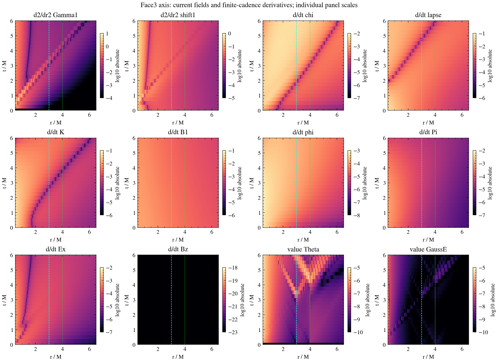

Face3 positive-axis current-field maps. Gamma/shift panels use radial curvature; chi/lapse/K/driver B/scalar/electric/magnetic panels use finite-cadence time derivatives; Theta/GaussE use current values. Each panel's explicit scale is fixed across its entire map, with five decades; scales differ between fields. Magnetic Bz is zero on this ray to the displayed precision, although magnetic fields away from the ray are not identically zero. Quarter-M derivatives and ray interpolation are diagnostics, not production RHS samples. [PDF](figures/t6c-incoming-fields.pdf).

| Incoming curvature feature, face3 positive axis | Time/M | Width/M | Width / h6 | Width / receiving h5 |
| --- | ---: | ---: | ---: | ---: |
| narrow negative Gamma, P6 | 2 | 0.111494 | 5.3517 | 2.6759 |
| narrow negative Gamma, P6 | 3 | 0.120156 | 5.7675 | 2.8837 |
| broader positive Gamma, P6 | 2 | 0.268471 | 12.8866 | 6.4433 |
| broader positive Gamma, P6 | 3 | 0.287911 | 13.8197 | 6.9099 |
| narrow shift curvature, P6 | 2 | 0.1490 | 7.15 | 3.58 |
| narrow shift curvature, P6 | 3 | 0.1427 | 6.85 | 3.42 |

Width means full width at half **prominence of spatial curvature**, not FWHM of the lapse itself or width of the emitted H error. P8 gives narrow Gamma widths 0.111659/0.120235 M at t=2/3. A native fourth-order derivative check on the first y row gives receiving-level widths 2.7838 cells at face2 t=2 and 2.9258 at face3 t=3. Those level-5 values use current covered coarse fields; they measure the representation available to the receiving grid, not independent coarse evolution. Native fine widths 4.1466/4.9670 cells have a prominence baseline touching the patch endpoint and are flagged as truncated in [t6c-native-widths.csv](t6c-native-widths.csv); they are not unbiased physical-width estimates. The P6/P8 crests used in the table do not cross the face.

The incoming narrow Gamma flank is marginally resolved on the fine level and under-resolved on the receiving coarse level (about three cells); the broader companion is better resolved. This makes a receiving-resolution explanation plausible. The pair changes layout at one fixed spacing, so it cannot establish pre-asymptotic convergence, prove the absence of a remaining nonlinear stage error, or establish a physical gauge shock.

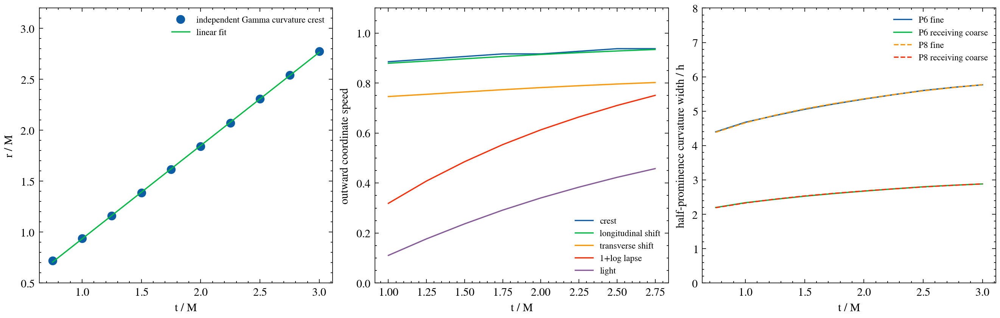

The independently selected negative Gamma crest, local coordinate speeds, and width at both receiving/fine spacings before the moved face. [PDF](figures/t6c-speed-width.pdf).

At the face3 axis crest, H/Theta are −1.586e-7/−3.315e-8 at t=2, and −1.562e-8/−4.608e-9 at t=3 before crossing. Near r=3 at t=3.25, H is −5.754e-5 and evolved Theta is +1.366e-7; native face extrema subsequently reach the larger values in the event table. The incoming feature carries a small constraint residual, but the large constraint packet is amplified locally at the transition. Since Theta is evolved, this cannot be explained solely by diagnostic H ghosts. Neither its outward speed nor the controlled relocation supports outer-boundary injection; the outer boundary is at 256 M and is unchanged.

### C. What the strips identify about the producing operation

The localization is **a fine-to-coarse crossing of a longitudinal Gamma/shift gauge feature at the actual finest rectangular face/corner**. The causal attribution is measured at the geometric-transition level. The exact numerical operation is not uniquely observable in these files:

| Candidate | Source and saved-data test | Supported conclusion |
| --- | --- | --- |
| Restriction arithmetic with a fully valid fine stencil | Replay all 28 variables in the inner second covered coarse row, three rays, 24 nonzero times, both cases: 144 replays | Maximum absolute difference 1.387779e-17; maximum epsilon-scaled difference 0.0625. These sampled current restrictions agree at roundoff. |
| Restriction at the outermost covered row | Sixth-order stencil requires current fine ghosts outside the union | These ghosts are not saved. No certificate for this row or past synchronization feedback. |
| Contemporaneous parent restriction as the first fine Theta source | `GRAMRLevel::postTimeStep` restricts a child before the **parent's** `specificPostTimeStep`; level-6 strips are written during its own post-step, before level 5 restricts level 6 | Fine Theta is already present before that parent restriction. That restriction cannot create the already recorded fine value; earlier restriction can still feed subsequent coarse-stage ghosts. |
| Spatial versus stage ghost fill | `evalRHS` exchanges, invokes `fill_stage`, then calls the specific RHS; only endpoint valid values are saved | The errors of spatial and dense-output/stage ghosts cannot be separated. |
| RHS derivatives reading ghosts | Second derivatives read two cells; upwind stencils read up to three | Near-face support crosses into unsaved ghosts. No saved per-stage RHS or independent derivative contribution. |
| KO across the face | `CCZ4Cartoon::compute` adds KO to the same RHS after the physical RHS; fourth-order derivative class uses seven nodes, radius three, sigma=1 | Only two valid strip rows are saved beside the face, without ghost values or separate KO terms. KO and the physical ghost-dependent RHS cannot be separated. |

[t6c-restriction-replay.csv](t6c-restriction-replay.csv) retains every replay and its condition. The source ordering is in [GRAMRLevel.cpp](../../Source/GRChomboCore/GRAMRLevel.cpp):169–191,940–989, [EMSBH2DLevel.cpp](../../Examples/EMS/EMSBH2DLevel.cpp):346–373, [CCZ4Cartoon.impl.hpp](../../Source/Cartoon/CCZ4Cartoon.impl.hpp):130–147 and [FourthOrderDerivatives.hpp](../../Source/BoxUtils/FourthOrderDerivatives.hpp):347–362. Positivity/trace projection is another intervening stage/step operation whose pre-values are not recorded; saved valid fields do not sit on the floors. Endpoint H uses freshly filled diagnostic ghosts, so its fine/coarse residual alone is not a stage-ghost audit.

**Measured causal statement:** moving the finest face and corner relocates and delays the first large evolved-Theta/H packet, while the old radius and introduced same-level seams do not retain that burst. An outgoing longitudinal Gamma/shift curvature feature approaches the moved transition with local speeds about 0.90–0.94 M/M and only about three receiving coarse cells across its narrow flank. **Inferred:** a gauge disturbance excites an interface error at marginal receiving resolution. **Unresolved:** which of spatial/stage ghost closure, its RHS use, KO or ghost-dependent boundary restriction/history supplies the error; the present post-step strips cannot uniquely discriminate them. A pure gauge-family assignment and asymptotic recovery are also not proved.

The pair postpones rather than eliminates the residual: coordinate-volume ring H at t=2.5 is 1.783002e-5/1.394356e-7 (face2/face3), but at t=5 it is 1.895376e-5/2.176569e-5 and far H is 5.588446e-6/6.490163e-6. These are layout controls, not spatial orders. Continued gauge forcing is directly present in current driver B: finite-cadence median `(d_t B_n)/B_n` is −0.10001042 on 1<r<2.5 M throughout the sampled interval, consistent with the unchanged `B_t=-0.1B` and its 10 M decay time. It can sustain relaxation; it does not by itself identify the face operation or quantify the wake's source budget.

## Controls, artifacts and reproduction

The local serial Chombo builds passed with `CHOMBO_HOME=/Users/auroradysis/Workspace/EMS-deps/Chombo/lib`, `make -C Examples/EMS all DIM=2 -j4` and the corresponding EMSRHFinder target. [t6-controls.csv](t6-controls.csv) and the runnable [t6-check.py](t6-check.py) document:

- E and reference legacy default controls: all t=0 plots, two-step/regrid plots and checkpoints match the pre-T6 executable, every HDF5 dataset and attribute bit-identical.
- Actual seven-level reference MID to 0.25 M (three base steps): all plot/checkpoint datasets and attributes match the pre-T6 executable, both with the new strip flag absent and with it enabled.
- Frozen E-low terminal finder, flag absent: physical CSV fields (excluding elapsed seconds) and all serialized shapes match the original pre-T6 harness bit for bit, repeated after the final timestamp-guard build. The intentionally capped one-update controls both return UPDATE_CAP, not a claimed tight horizon root.
- Nine strip frames in each completed original/moved quarter-M probe: finite Float64 data, GaussB exactly zero, unique cell coordinates, and terminal uncovered evolved values bit-identical to the full plot.

The pre-T6 production binary is `/private/tmp/ems-t4/point.ex`; the frozen pre-T6 harness is `/private/tmp/ems-t6/rh-baseline.ex`. Author finder headers match HEAD exactly. All new C++ behavior is behind one default-false flag in its respective executable. No equation, gauge, transfer, Chombo, static-reader-after-zero path or author finder source was changed.

Reproduce completed analyses/checks with the installed environment:

```sh
PYTHONDONTWRITEBYTECODE=1 /Users/auroradysis/miniconda3/bin/python Tests/EMSNative/t6-norms.py
PYTHONDONTWRITEBYTECODE=1 /Users/auroradysis/miniconda3/bin/python Tests/EMSNative/t6-horizons.py report
PYTHONDONTWRITEBYTECODE=1 /Users/auroradysis/miniconda3/bin/python Tests/EMSNative/t6-check.py
PYTHONDONTWRITEBYTECODE=1 /Users/auroradysis/miniconda3/bin/python Tests/EMSNative/t6c-analyze.py cache
PYTHONDONTWRITEBYTECODE=1 /Users/auroradysis/miniconda3/bin/python Tests/EMSNative/t6c-analyze.py strips
PYTHONDONTWRITEBYTECODE=1 /Users/auroradysis/miniconda3/bin/python Tests/EMSNative/t6c-analyze.py dynamics
PYTHONDONTWRITEBYTECODE=1 /Users/auroradysis/miniconda3/bin/python Tests/EMSNative/t6c-analyze.py native
PYTHONDONTWRITEBYTECODE=1 /Users/auroradysis/miniconda3/bin/python Tests/EMSNative/t6c-analyze.py carriers
PYTHONDONTWRITEBYTECODE=1 /Users/auroradysis/miniconda3/bin/python Tests/EMSNative/t6c-analyze.py report
PYTHONDONTWRITEBYTECODE=1 /Users/auroradysis/miniconda3/bin/python scripts/cas/t6c-characteristics.py
```

A single frozen find is `t6-horizons.py run E-mid EMS_000069.2d.hdf5 96`; the output directory must be fresh because the driver refuses to overwrite existing evidence. Native per-case parameters, numerical seed histories, progress, logs, stage shapes and input SHA-256 audits are retained under `/private/tmp/ems-t6/horizons/{E-low,E-mid}/<checkpoint-stem>/n{48,96}/`. The supplied data, submitted parameters and native histories are never written.

[COMMIT-MANIFEST-T6.txt](COMMIT-MANIFEST-T6.txt) hashes the T6 sources, data, parameters, figures, CAS evidence, queue plan and this README. The T4/T5 manifests remain historical snapshots and retain their pre-T6 README hashes. A/B/C analysis of the available evidence is complete; both C markers are 0. The producing operation remains an explicitly documented limit of the saved data. This analysis adds no C++ changes, launches no simulations and makes no commit.


## T7 — receiving resolution and the near-horizon Maxwell budget

The expert plan in `/Users/auroradysis/Workspace/EMS-deps/worktrees/consult-5b-reply.md` was read before this tranche. B below is measured from the eight saved, current E checkpoints; A is a registered detached pair to 6 M. There is no evolved-state comparison to a static profile. The frozen reader cannot initialize or advance, and its static-input path deliberately does not exist. E uses f2=-0.8, distinct from the reference's f2=-20. Sigma remains 1. The author's finder, equations, gauge and point transfers are unchanged. One new C++ switch, `t7_diagnostics`, defaults to false and selects the read-only capture in both executables.

### B — signed charge and Maxwell source

`Source/Cartoon/EMSCartoonGaussConstraints.hpp` records **GaussE = F CE**, with CE = div(E^i) - 2 fprime E^i partial_i phi, F = exp[-2 alpha0 (f0+f1 phi+f2 phi^2)] and fprime = alpha0(f1+2 f2 phi). The Maxwell RHS uses covariant electric components E_i. Its displacement is D^i = sqrt(gamma) F gamma^{ij} E_j, with gamma_ij = h_ij/chi and sqrt(gamma) = sqrt[(h11 h22-h12^2) hww]/chi^(3/2). The finder uses Q = N integral F E_i s^i dA, **N = 1/sqrt(2 pi)** (`RHSurf.hpp`, Q_charge). Thus the implemented normalization gives

Q(S_out) - Q(S_H) = N integral_shell sqrt(gamma) GaussE d^3x,

or N integral sqrt(gamma) F CE d^3x. Multiplying the recorded GaussE by another F would be incorrect. The three-dimensional coordinate volume in cartoon coordinates is 2 pi y dx dy. All signs below follow the outward normal; a positive shell integral means Q_out > Q_H.

The numerical N_theta=96 qualified T6 horizon supplies the inner surface; the outer surface is the fixed coordinate sphere r=0.02 M. An even pole continuation of the saved numerical shape is interpolated with a cubic spline. Its centre differs from 224 M by at most 1.42e-13 M; the volume quadrature uses 224 M. Six-node point interpolation with the supplied reflective parity samples the current finest-level density. Polar Gauss–Legendre quadratures use (N_theta,N_r)=(96,64) and (192,128); no initial-data evaluator participates.

| grid | checkpoint t/M | finder Q_out-Q_H | signed volume, 192 x 128 | volume minus flux |
|---|---:|---:|---:|---:|
| low | 0 | -8.718784e-8 | -5.191235e-8 | 3.527549e-8 |
| low | 4.59375 | 2.956557e-3 | 2.957185e-3 | 6.276768e-7 |
| low | 9.1875 | 7.746065e-3 | 7.746904e-3 | 8.390449e-7 |
| low | 10.0625 | 8.942380e-3 | 8.943314e-3 | 9.344689e-7 |
| mid | 0 | -1.408187e-8 | -1.023746e-8 | 3.844408e-9 |
| mid | 4.6666666667 | 4.419271e-4 | 4.417629e-4 | -1.642061e-7 |
| mid | 9.3333333333 | 8.826403e-4 | 8.824961e-4 | -1.441878e-7 |
| mid | 10.0625 | 9.600334e-4 | 9.598850e-4 | -1.484396e-7 |

At the terminal time the volume/flux discrepancy is 0.0105% (low) / 0.0155% (mid) of the gap. Raising the volume quadrature changes these integrals by 2.52e-8 / -3.4e-9. The independent surface flux interpolated from native D has terminal gaps 0.008940471 / 0.000960019. These are finite-difference/interpolation identities rather than a discrete summation-by-parts construction; the remaining mismatch is retained, not forced to zero. The accumulated qualified flux gap is accounted for by the current Gauss defect. It is not explained by insufficient surface root convergence. The earlier T6 charge drift survives this independent qualification.

The frozen C++ `T7RHS` calls the actual protected production RHS equation, separates its native cleaner gradient, and evaluates the native KO operator from the same current fields and refreshed ghosts. The Python chain rule includes the full plane metric inverse, its determinant, hww, chi and F(phi). In particular, KO on phi and all metric components contributes to D_t. Native electric, native scalar, native metric and the corresponding KO subdivisions are retained separately in [t7-maxwell-sources.csv](t7-maxwell-sources.csv). The combined native term excludes the cleaner gradient and KO.

The following signed rates are N integral div(D_t) d^3x, in Q/M. The near-H subregion is the numerical horizon < r < 0.008 M; the full shell ends at 0.02 M. These are frozen-state tendencies of the Gauss **density** sqrt(gamma) GaussE. They use fixed surfaces at the checkpoint, so they are not the time derivative of charge on a moving horizon.

| grid at 10.0625 M | region | native Maxwell + geometry | cleaning feedback | all KO | sum |
|---|---|---:|---:|---:|---:|
| low | near H | -7.724635e-3 | 7.699985e-3 | 4.053215e-4 | 3.806717e-4 |
| low | H to 0.02 | -9.174627e-3 | 1.016238e-2 | 3.684429e-4 | 1.356200e-3 |
| mid | near H | 3.376275e-4 | -2.280034e-4 | -1.214271e-4 | -1.180301e-5 |
| mid | H to 0.02 | 9.448607e-5 | 1.460230e-4 | -1.142109e-4 | 1.262982e-4 |

At the terminal low horizon, KO supplies the remaining positive signed density source after native and cleaner terms nearly cancel. Its electric/scalar/metric near-H rates are +4.183951e-4, +4.401208e-5 and -5.708563e-5. At mid they are -1.246721e-4, +5.702106e-6 and -2.457068e-6: KO removes density there, and the near-H sum is negative. The mid shell's positive total comes from the broader shell balance. The low native electric/scalar/metric near-H rates are -7.926633e-3, +2.773510e-4 and -7.535349e-5; mid gives +3.430392e-4, -5.672394e-5 and +5.131218e-5. No single signed KO source explains both grids.

As an independent discretization check, the full-shell native/cleaner/KO rates from boundary fluxes of D_t are (-0.009162875,+0.010172343,+0.000346767) on low and (+0.000093969,+0.000146817,-0.000114483) on mid. The largest relative disagreement is about 6% of the small low KO rate; the signs and near-cancellation interpretation remain unchanged. The source subdivisions do not constitute a time-integrated causal decomposition of the four-checkpoint drift: a changed term would also change the evolving state, cleaner feedback and moving horizon. **Measured:** current signed Gauss charge and competing frozen source rates. **Inferred:** a finest-level Maxwell/geometry/cleaner/KO balance feeds the continuing drift; these data do not isolate a unique historical driver.

#### Refinement and cleaner audit

All horizon-to-0.02 M cells are on level 12. The nearest physical coarse–fine half-widths are 0.022216796875 M (low) and 0.0216471354166667 M (mid); h12 = 0.000213623046875 / 0.000142415364583333 M. The complete source-quadrature dependency, including interpolation and KO/divergence, extends at most eight finest cells past 0.02 M and remains inside these unions. **There is no coarse–fine face in this shell.** This excludes direct transfer reads in the frozen shell stencil; earlier evolution can still supply disturbances to these fields. Low's finest union has two boxes with a seam at x=0. Mid has eight boxes, x seams at -0.0108235677083333, 0, +0.0108235677083333 M and a y seam at 0.0108235677083333 M. [t7-E-boxes.csv](t7-E-boxes.csv) records every box at every checkpoint and level; [t7-E-shell-layout.csv](t7-E-shell-layout.csv) gives the shell summary. These are current checkpoint box layouts, not profile-derived masks.

The implemented electric principal pair is E_i,t = -alpha partial_i Xi and Xi_t = adv(Xi) - alpha(CE_rhs + kappa_E Xi). The magnetic pair has plus signs on both the Lambda gradient and magnetic divergence: B_i,t = +alpha partial_i Lambda and Lambda_t = adv(Lambda) + alpha(GB_rhs-kappa_B Lambda). Both kappa values are hard-coded 1, distinct from CCZ4 kappa1=0.1. With frozen positive coefficients, both give z^2 + alpha kappa z + alpha^2 gamma^{nn} k^2 = 0. The sign pairs therefore produce damped cleaner waves; this check does not prove the full coupled variable-coefficient system stable. No sign flip is justified by this audit.

The coupling uses CE, not F CE, in Xi_t. The native term -2 alpha fprime Pi E_i exactly cancels the contribution F_t E_i from phi_t=-alpha Pi in D_t. Both coupling sign identities and the displacement chain rule have exact symbolic witnesses and an independent 24-state, 60-digit check, seed 7007, residual 2.92e-62: [T7 evidence card](../../scripts/cas/t7-evidence.md), [JSON](../../scripts/cas/t7-maxwell-verify.json). Scope: algebraic identity, production physics not certified.

The RHS electric divergence omits the conformal-volume determinant derivative, assuming det(h)=1; the Gauss diagnostic retains it. The observed difference is exactly CE_rhs-CE_diag = -(1/2) E^a partial_a ln[(h11 h22-h12^2)hww]. At 10.0625 M its coordinate-volume shell RMS is 1.739887e-7 / 5.974299e-9, compared with CE RMS 2.207135e-3 / 3.153541e-4. Replaying the omitted term leaves RMS 8.21e-16 / 1.24e-15. This is a measured consistency defect, about 7.9e-5 / 1.9e-5 of CE in RMS, rather than evidence for a cleaner sign error.

Cleaner damping has units kappa=1/M in proper time, but coordinate damping is alpha kappa. In this shell alpha is approximately 0.0305–0.0704 at 10.0625 M, giving coordinate e-folding times approximately 14.2–32.8 M. A strongly collapsed lapse therefore slows coordinate-time cleaning. Proposed audit follow-up: qualify consistency of the cleaner and diagnostic determinant convention on a general numerical metric, and explicitly document damping units/parameters. Changing damping, rescaling Xi or changing either coupling is an equation change and is outside this tranche; none is implemented.

All 28 exported valid state components are bit-identical to the saved checkpoints. GaussB is exactly zero on all eight finest grids. The reader uses no projections or evolution step for this frozen-state evaluation. [t7-maxwell-checks.csv](t7-maxwell-checks.csv), [input audit](t7-maxwell-input-audit.csv), [budget](t7-maxwell-budget.csv), [cleaner audit](t7-cleaner-audit.csv) retain the raw evidence. `t7-maxwell.py --dump` recreates the small frozen reader outputs, and `t7-maxwell.py` recomputes the tables. It accepts compressed derived dumps. Input EMS and finder source files remain unchanged.

### A — matched clocks and receiving resolution, registered runs

The actual unions are [-a,a] x [0,a], with a=(256,64,32,16,8,4,3) M on levels 0–6 for both legs. The original clock tags give these unions; the space leg uses geometric tagging radii `51.2 25.6 12.7 6.3 3.16 2.43` M to compensate for block alignment. Identical radii at the new resolution had produced different faces and were rejected before registration. The final unions are checked from the initial plot's box lists and their non-overlapping covered area, not inferred from requested radii. [t7-layout.csv](t7-layout.csv) and [t7-boxes.csv](t7-boxes.csv) record the complete unions and seams. Clock box counts are 6/2/2/2/2/2/8; space counts are 18/8/8/8/8/8/32. The space finest seams are x=-2.25,-1.5,-0.75,0,0.75,1.5,2.25 M and y=0.75,1.5,2.25 M; clock has x=-1.5,0,1.5 M and y=1.5 M.

| case | h0/M | h5/M | h6/M | dt0/M | CFL | planned wall | registered RAM bound | projected output |
|---|---:|---:|---:|---:|---:|---:|---:|---:|
| clock | 4/3 | 1/24 | 1/48 | 1/24 | 1/32 | 45 min | 1.5 GB | 2.3163 GB |
| space | 2/3 | 1/48 | 1/96 | 1/24 | 1/16 | 120 min | 4 GB | 2.7595 GB |

Both use point transfers, sigma=1, 144 coarse steps to 6 M, fixed hierarchy and four OpenMP threads with local serial Chombo. Matching stage times are exact by construction at each level. The final two-step probes to 1/12 M took 19.13 / 65.87 s, with evolution-child peak RSS 0.339 / 1.263 GB. The extrapolated walls are 23.0 / 79.0 min; registered plans leave time for evolved-state compression and the front. Six single-thread xz compressors have bounded dictionaries and are additional to the child RSS measurement, well within the registered memory margins. Hierarchy and capture-key allocations are fixed throughout. The queue runs the legs sequentially. [t7-resource-plan.csv](t7-resource-plan.csv) contains measured sizing conditions; total projected output is 5.07585 GB, not a measured final size.

Global HDF5 plots and checkpoints are disabled for these production legs. On levels 4–6, unsummarized native Float64 values of all 28 evolved variables and Ham, Mom1, Mom2, GaussE, GaussB are saved every 1/12 M, including t=0 and 6 M: 73 times per level. Full near-face collars have half-width 0.1875 M around the 3 and 4 M faces, with axis, equator and diagonal tubes extending through 0.5<r<6.5 M. Internal covered coarse values are retained and must be excluded with the registered box unions for composite norms. These are current numerical fields, not differences from a static solution.

Each RK stage has face and positive-corner target cells immediately on either side of the 3 and 4 M faces where that level exists. The field input saved around those targets covers the full union of the native mixed-derivative stencil [-2,2]^2 and axial upwind/KO offsets +/-3. All **actual** six-by-six coarse interpolation supports needed by those fine ghosts, including parity-filled axis ghosts, are recorded from `PointAMRTransfer`'s native stencil list. Before restriction, the complete six-by-six fine support is recorded for the parent's covered face/corner targets, including the outermost ghost-dependent row. RHS and operation deltas are evaluated on the target core; operand values cover the full dependency. This avoids recording unused rectangle corners without dropping a stencil operand.

The production kernel captures its actual physical RHS before KO, the native KO sum and the actual final RHS. It does not call a surrogate PDE. State frames surround the stage trace/chi/lapse operations, update trace projections, end-step projections/floors, actual ODE increments and fine-to-coarse restriction. Trace removal affects A components; chi and lapse floors affect separate components, so the combined before/after frame distinguishes them. The initial snapshot restores every saved evolution/ghost bit after evaluating diagnostics. Recording-enabled t=0 plots **and checkpoints**, and terminal two-step plots/checkpoints, match the preceding executable bitwise.

The binary format is `T7OP0002`, decoded by [t7-check.py](t7-check.py). Lossless UInt64 XOR against the preceding matching frame, byte-plane shuffling and installed `xz -3 -T1` preserve every Float64 bit. Files are `t7-stage-L{4,5,6}.xz` and `t7-snapshot-L{4,5,6}.xz` in each run directory. A frame has eleven Int32 values (phase, level, FAB/region source, RK stage, columns, cells, XOR flag, valid box bounds), ten Float64 values (level time, spacing, level dt, stage time, coarse old/new time, actual dense-interpolator **fine-step start** fraction, ODE update dt, own/child face), Int32 cell coordinates and eight byte planes of payload. The stage-time coarse fraction is independently `(stage_time-coarse_old)/(coarse_new-coarse_old)`; it differs from the recorded start fraction. The two half-time RK stages remain distinct.

| phase | operation/value |
|---:|---|
| 2 / 3 | actual filled input before / after stage trace removal and chi/lapse floors |
| 4 / 5 | state before / after update trace removal |
| 6 / 7 | state before / after end-step trace removal and chi/lapse floors |
| 8 / 10 | fine state before ghost refresh / complete actual fine restriction support after refresh |
| 9 / 11 | parent state before / after native point restriction |
| 12 / 13 | state before / after actual dt times RHS increment |
| 20 / 21 / 22 | physical RHS before KO / native KO / actual total RHS |
| 40 | actual dense RK coarse operands passed to point prolongation |
| 50 | full evolved and constraint snapshot |

Checks on the two final probes validated 311,808 fine stencil operands and 1,990,656 coarse-support accesses. Replaying 55,296 actual filled coarse–fine ghosts gives maximum error 1.110223e-16 in units normalized by max(1,abs(value)). Restriction replay at the first four synchronization times, including the outermost covered row and corner with ghost support, gives maxima 8.67e-19 / 5.42e-20 (clock, fine levels 5/6) and 2.71e-20 / 2.71e-20 (space). Pre-KO plus separately accumulated KO versus the actual total RHS differs by at most 4.34e-19 with max(1,abs(physical)+abs(KO)) normalization; grouping a cancelling directional KO sum can differ in roundoff. All decoded Float64 values are finite. [t7-recorder-checks.csv](t7-recorder-checks.csv) and [t7-operation-replay.csv](t7-operation-replay.csv) retain counts and raw maxima. This validates capture/replay, not nonlinear AMR convergence.

Default-off controls against the frozen pre-T7/T6 executable compare all HDF5 datasets and attributes: legacy E and reference with regridding for two steps, plus the seven-level point reference for three steps. All are bit-identical. These extend the earlier T4/T6 controls against the fork's original paths. The default frozen finder physical CSV and saved shapes also match; the deliberately one-update capped case returns UPDATE_CAP/exit 1 on both builds, rather than claiming a new qualified solve. [t7-controls.csv](t7-controls.csv) records the scope. B's reader remains independent of the finder root solve. `t7-check.py --reproduce-controls` recreates the bounded comparison data; `--recorder-only` rechecks retained compressed probes after large comparison HDF5 files have been removed. The queue's atomic-marker, successful-resume and disk-gate paths pass `t7-run.py --selfcheck`.

Only T7-owned obsolete prototypes and verified comparison HDF5 files are removed, with hashes/cleanup recorded in [t7-control-files.csv](t7-control-files.csv) and [t7-cleanup.csv](t7-cleanup.csv). Frozen B outputs are compressed losslessly and retained. The shared evolution-output ceiling is 5.7e9 bytes, checked every ten seconds by [t7-run.py](t7-run.py); reaching it terminates the current child and atomically writes exit 125. This reserves space for the retained analysis/probes below the 6 GB tranche limit. It is an operational bound, not a truncation or quantization of diagnostic values. A nonzero marker requires an incomplete-run report; it must not be analyzed as a completed 6 M leg.

The concrete command is `OMP_NUM_THREADS=4 /private/tmp/ems-t7/evolution.ex params.txt` in each directory. Detached launch: `/Users/auroradysis/miniconda3/bin/python Tests/EMSNative/t7-run.py --detach /private/tmp/ems-t7/evolution/plan.json`. Its new session sends launcher stdout/stderr to `/private/tmp/ems-t7/evolution/launcher.log`; each child sends both streams to its own `run.log`. Return status is written by rename to `done.exit`. [t7-run-plan.json](t7-run-plan.json), [t7-runs.csv](t7-runs.csv), the two registered [clock parameters](params/t7-ref-mid-clock.txt) / [space parameters](params/t7-ref-fine-space.txt), and [COMMIT-MANIFEST-T7.txt](COMMIT-MANIFEST-T7.txt) record commands, inputs and remaining work.

| leg | run directory | stdout + stderr | atomic marker | current status |
|---|---|---|---|---|
| clock | `/private/tmp/ems-t7/evolution/clock` | `run.log` | `/private/tmp/ems-t7/evolution/clock/done.exit` | RUNS-PENDING: running or starting |
| space | `/private/tmp/ems-t7/evolution/space` | `run.log` | `/private/tmp/ems-t7/evolution/space/done.exit` | RUNS-PENDING: queued after clock |

**Remaining analysis on controller resumption:** audit flags, sigma, floors and nonfinite values; select Hamiltonian/Theta events independently in each run; compare incident lapse/K/Theta/shift/Gamma/driver-B/chi/EMS profiles, amplitude, phase and physical width, and widths in fine and receiving cells with T6 face3. At ratio two, cell centres do not coincide; use fixed physical rays with qualified six/eight-node current-field sampling and report interpolation sensitivity. Box-seam classes require common physical regions, not the changed per-box sample. Resolution wins only if the clock effect is comparatively small and the spatial contrast preserves the incident profile while reducing packet/reflection and wake. A material clock effect prioritizes temporal coupling; physical width shrinking with h defeats the finite-width premise. Replay the actual stage/ghost/RHS/KO/projection/restriction frames at independently selected creation events; endpoint refreshed Hamiltonian alone cannot identify an evolved source. No result from the pending legs is assigned in this turn.

Launched detached queue PID 83312 at 2026-09-30T09:25:03.299278+00:00. Clock is running or starting; space is queued serially. Both markers are pending. The controller resumes the analysis after completion; no pending-run result is measured in this turn.

### A — completed run analysis (controller resumption)

**READY-EXCEPT — mixed decision.** Receiving resolution is the dominant improvement for the first packet peaks and the interface-excluded bulk wake. Halving the clock changes those peaks by about 1–3%, whereas halving h reduces them by factors about 2–4. Bulk collar Ham orders are about 1.6–2.4 after passage, and a fixed diagonal wake gives about fourth order. The strict resolution-only acceptance is **not** certified: some later interface collars have material clock sensitivity, the incident curvature width changes appreciably with h, and the recorder establishes the direct evolved-Theta source without uniquely separating the origin of the Hamiltonian input error into ghost space/time closure versus earlier metric evolution. Temporal coupling remains a priority for the clock-sensitive collars. The finite-width premise is neither proved nor killed by this single spatial contrast.

The registration above is preserved verbatim, including its historical pending statuses. Both controller-supplied markers now read zero. No new evolution, static-profile evaluation, gauge/equation change, production-source modification or commit occurs in this analysis. Every evolved comparison uses current saved fields or another numerical run. The standalone [T7AReplay.cpp](T7AReplay.cpp) invokes the unchanged native kernel on recorded operands; it is never called by evolution.

#### Audit and actual hierarchy

| run | exit | sigma | stage frames | wall / min | evolution RSS / GB | captured min chi / lapse | captured floor cells | GaussB nonzero |
| --- | --- | --- | --- | --- | --- | --- | --- | --- |
| clock | 0 | 1 | 3397248 | 17.0127 | 0.354107 | 0.0937198 / 0.285473 | 0 | 0 |
| space | 0 | 1 | 4002048 | 56.2121 | 1.36492 | 0.0937198 / 0.285474 | 0 | 0 |

Both runs have point transfer, sigma=1, fixed regrid intervals, the t>0 initial-data guard and global runtime NaN checks enabled. All 7,399,296 stage frames and all 438 per-level snapshot times decode to finite Float64 values. All 28 evolved variables and five constraints are present. No floor activation occurs in the captured face regions; global runtime NaN checks completed. These face recordings cannot count floor hits in unsaved puncture cells. Parameter-default messages are benign defaults or inactive features and are retained in [t7a-default-parameters.csv](t7a-default-parameters.csv), with logs/parameters hashed in [t7a-run-audit.csv](t7a-run-audit.csv).

Actual unions, unchanged from the registration, are [-a,a]×[0,a], a=(256,64,32,16,8,4,3) M. The 3 M face is level 6→5; the 4 M face is level 5→4. Clock spacings there are (1/48,1/24) and (1/24,1/12) M; space halves each at the same corresponding stage times. [t7-layout.csv](t7-layout.csv) / [t7-boxes.csv](t7-boxes.csv) retain actual boxes. The different same-level seams are compared on common physical bands below, rather than by per-box cell classes.

#### Independent events and sampling qualification

[t7a-events.csv](t7a-events.csv) searches each run, face, ray, level and Ham/Theta field over the whole interval for log-prominence ≥0.5 decades. No expected propagation time enters selection. The growth time maximizes log growth within its basin with both endpoints ≥1% of that peak; this excludes the trivial zero-Theta startup jump. Rising endpoint candidates meeting the same prominence threshold are separately marked **censored**. Thus the 4 M corner near t=6 is a creation event, not a completed peak certificate. Replay windows span independently selected Ham growth through the selected peak, including the censored endpoint.

[t7a-analyze.py](t7a-analyze.py) reuses the lossless T7 decoder and T6 readers. Six/eight-node radial point interpolation is exact to degrees 5/7 on smooth test polynomials. On the diagonal, saved native points lie on the identical physical ray x=y, making this a qualified one-dimensional comparison. Supported face collars additionally use six/eight-node tensor sampling at fixed physical (x,y), with current parity-filled axis values. Polynomial/parity checks pass. No static target is subtracted.

Outside complete collars, axis/equator tubes contain too few transverse rows for a full six/eight-node tensor stencil. Their radial native-first-row profiles have an h/2 transverse offset, explicitly labelled in [t7a-profile-contrasts.csv](t7a-profile-contrasts.csv); radial P6/P8 differences do not bound that transverse error. At the receiving side of the clock 4 M face the saved collar is also too narrow for a full tensor-eight stencil. No tensor qualification is claimed there. Native operand replay itself has complete support and is unaffected by these profile-sampling limits. Counts/missing support and interpolation sensitivity are in [t7a-sampling-sensitivity.csv](t7a-sampling-sensitivity.csv). One-sided stencils stay on the selected level; covered coarse values are excluded.

The following fixed-axis tensor comparison is at t=3 M, 2.825<r<2.98 M, with 60 common samples. Range measures variation of the current clock profile, not variation from an equilibrium target.

| field | clock range | clock−T6 RMS | space−clock RMS | space contrast / range | P6/P8 max difference |
| --- | --- | --- | --- | --- | --- |
| chi | 0.0150391 | 2.49175e-11 | 1.89881e-08 | 1.26258e-06 | 1.27655e-10 |
| K | 0.000261229 | 4.69147e-10 | 6.81763e-09 | 2.60983e-05 | 2.76238e-09 |
| Theta | 1.40683e-08 | 2.34846e-10 | 3.03826e-09 | 0.215964 | 1.38136e-09 |
| Gamma1 | 0.00377236 | 1.77957e-10 | 3.27553e-06 | 0.000868298 | 1.82839e-08 |
| lapse | 0.00936226 | 1.55108e-13 | 3.0681e-09 | 3.27709e-07 | 1.66622e-12 |
| shift1 | 0.0038958 | 1.23495e-11 | 5.18484e-08 | 1.33088e-05 | 3.67459e-10 |
| B1 | 0.00208741 | 4.82339e-14 | 1.09853e-11 | 5.26267e-09 | 6.31509e-14 |
| phi | 0.00101515 | 1.17802e-13 | 1.88793e-10 | 1.85976e-07 | 1.67987e-13 |
| Pi | 8.80446e-05 | 2.72882e-13 | 2.06823e-10 | 2.34908e-06 | 9.53762e-14 |
| Ex | 0.00066122 | 1.17719e-12 | 5.66802e-10 | 8.57207e-07 | 4.55566e-12 |
| Xi | 5.56171e-12 | 2.95135e-14 | 6.63612e-11 | 11.9318 | 8.61164e-14 |

The leading lapse, chi, K, shift, driver-B and EMS profiles are preserved closely in field value. Gamma changes by RMS 0.087% of this profile range, well above the interpolation uncertainty. Theta and Xi are small constraint/cleaning signals and change by large relative factors; they are not used to normalize the incident gauge amplitude. [t7a-profile-metrics.csv](t7a-profile-metrics.csv) retains amplitude ranges and P6/P8 sensitivity for every saved variable on all three rays, while the private ray caches preserve full profiles at every snapshot time.

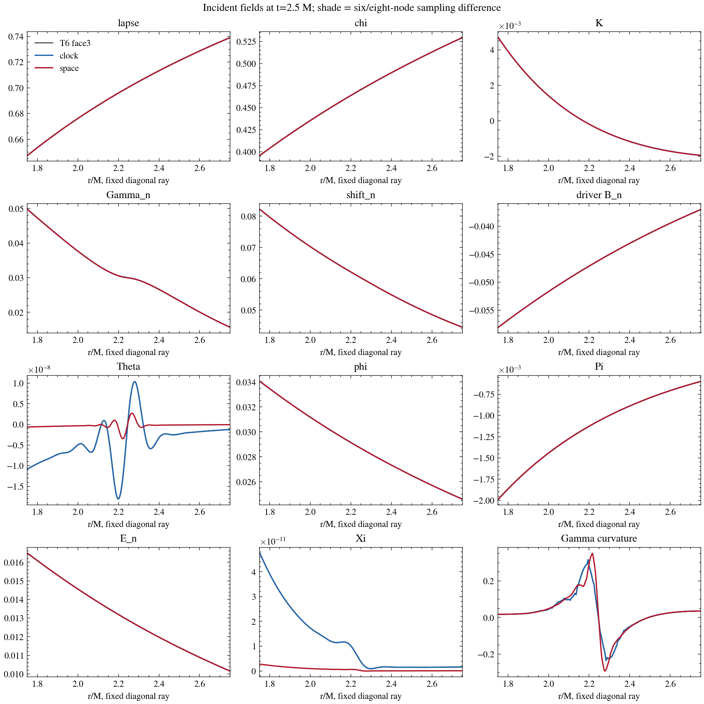

The displayed incident values nearly coincide, while the curvature flank sharpens under refinement and the small incident Theta error drops. These are distinct measurements; field-value agreement alone does not establish resolved derivatives.

The curvature-peak phase at t=2.5 M is sampled on the same radial mesh (step 1/384 M). Clock and T6 agree in peak position. Space shifts the diagonal peak by −0.007813 M with P6 and −0.018229 M with P8; the coarse peak itself has a 0.013021 M interpolation sensitivity. This prevents a stronger claim of phase equality. The axis rows retain the transverse offset limitation stated above. [t7a-phase-summary.csv](t7a-phase-summary.csv) also records both curvature amplitudes and sampled widths; policy widths below use native fourth-order derivatives rather than differentiation of an interpolated profile.

| run / ray | curvature peak r (P6)/M | peak r (P8)/M | P6/P8 phase difference/M |
| --- | --- | --- | --- |
| T6_face3 / axis_plus | 2.30208 | 2.30469 | 0.00260417 |
| T6_face3 / diagonal | 2.28385 | 2.29687 | 0.0130208 |
| clock / axis_plus | 2.30208 | 2.30469 | 0.00260417 |
| clock / diagonal | 2.28385 | 2.29687 | 0.0130208 |
| space / axis_plus | 2.28646 | 2.28385 | 0.00260417 |
| space / diagonal | 2.27604 | 2.27865 | 0.00260417 |

#### Identity, physical widths, and receiving cells

Before the first face, native Gamma-curvature tracking gives clock axial speed 0.911765±0.003389 and space 0.911458±0.002121 M/M. Their local frozen longitudinal shift speeds average 0.906587/0.907118, versus lapse 0.551341/0.558179, transverse shift 0.774007/0.774567 and light 0.291783/0.297056 on the same samples. Diagonal measured speeds are 0.908147/0.908580. The incoming feature is carried principally by Gamma and shift curvature, with lapse/K response and smooth driver-B forcing; this supports the longitudinal shift/gauge-family interpretation. It is not a full characteristic projection or a claim of a pure eigenmode. Characteristic formulas retain T6's conditional [CAS witness](../../scripts/cas/t6c-evidence.md): algebraic identity — production physics not certified.

Between faces, the first contiguous outward ridge gives axial speeds 0.910714±0.023053 / 0.954167±0.011393 and local longitudinal speeds about 0.95256/0.95246. The later strongest peak can instead be a stationary wake; it is excluded from that propagation fit. [t7a-speed-fits.csv](t7a-speed-fits.csv) records fit intervals and uncertainties.

Widths below use native fourth-order radial second derivatives, with linear crossing locations. Half-prominence is the T6 definition. When its baseline is limited by the saved level end, a separate **closed half-height crossing relative to zero curvature** is retained as a sensitivity diagnostic; it does not silently replace the T6 definition. Counts divide radial width by isotropic local h. Along the diagonal, counts per native diagonal step/normal face direction are smaller by sqrt(2).

| run | face / ray | t/M | half-prominence width/M | fine / receiving cells | end-limited prominence? | closed half-height width/M | receiving cells (half-height) |
| --- | --- | --- | --- | --- | --- | --- | --- |
| clock | 4.0 / axis_plus | 3.75 | 0.145945 | 3.50269 / 1.75134 | True | 0.115297 | 1.38356 |
| clock | 4.0 / diagonal | 5.5 | 0.130171 | 3.12409 / 1.56205 | True | 0.0898993 | 1.07879 |
| clock | 3.0 / axis_plus | 2.5 | 0.117263 | 5.62863 / 2.81431 | False | 0.102749 | 2.46596 |
| clock | 3.0 / diagonal | 2.5 | 0.106891 | 5.13078 / 2.56539 | False | 0.0942708 | 2.2625 |
| space | 4.0 / axis_plus | 3.75 | 0.0966952 | 4.64137 / 2.32068 | True | 0.0804852 | 1.93165 |
| space | 4.0 / diagonal | 5.5 | 0.0941961 | 4.52141 / 2.26071 | True | 0.0638319 | 1.53197 |
| space | 3.0 / axis_plus | 2.5 | 0.0857541 | 8.2324 / 4.1162 | False | 0.0745129 | 3.57662 |
| space | 3.0 / diagonal | 2.5 | 0.0804253 | 7.72083 / 3.86041 | False | 0.0683648 | 3.28151 |

At t=2.5 M, T6's axial half-prominence width was 0.11726318 M; clock is 0.11726311 M. Space is 0.08575413 M, ratio 0.73130, with receiving count increasing 2.814→4.116. Diagonal widths are 0.10689131→0.08042531 M, ratio 0.75240, counts 2.565→3.860. Thus width does **not** simply halve with h and keep a constant cell count, but it also has not settled to a resolution-independent value. The curvature peak steepens by about 34–36%. Further refinement is required to establish a finite-width asymptote.

At the 4 M axial face, the closed half-height width at t=3.75 M gives only 1.384/1.932 receiving cells, and the diagonal at t=5.5 gives 1.079/1.532. The associated half-prominence estimates are end-limited. Even this refined run has a poorly sampled receiving side at the next face. The data do not provide any qualified resolution at the 8 M face, which the principal front has not crossed by 6 M.

#### Packet amplitudes and wake ratios

The next table uses identical physical windows and the matching 1/12 M pre-parent-restriction native sampling cadence: half-width 1/24 M around the 3 M face, 1/12 M around 4 M, including the corresponding axial or corner tube. Peaks are selected independently over the full available interval. These fixed windows can clip a packet that shifts with h; broader-window and tensor sampling sensitivities remain in the other tables. The 4 M corner values at 6 M are censored endpoint maxima. p_h=log2(clock/space) is an **apparent two-run constraint amplitude order**, not a three-grid field self-convergence proof.

| face / ray | field | T6 peak | clock peak | space peak | clock/T6 | space/clock | p_h |
| --- | --- | --- | --- | --- | --- | --- | --- |
| 3.0 / axis_plus | Ham | 0.000126524 | 0.000124855 | 3.94674e-05 | 0.986808 | 0.316107 | 1.66152 |
| 3.0 / axis_plus | Theta | 1.74805e-06 | 1.72519e-06 | 4.1189e-07 | 0.986925 | 0.238751 | 2.06642 |
| 3.0 / diagonal | Ham | 4.39085e-05 | 4.31965e-05 | 1.19372e-05 | 0.983784 | 0.276346 | 1.85545 |
| 3.0 / diagonal | Theta | 2.45445e-07 | 2.39536e-07 | 1.25998e-07 | 0.975926 | 0.526006 | 0.926848 |
| 4.0 / axis_plus | Ham | 0.000237775 | 0.000234702 | 0.00010558 | 0.987078 | 0.449847 | 1.15249 |
| 4.0 / axis_plus | Theta | 4.59349e-06 | 4.55189e-06 | 1.06991e-06 | 0.990943 | 0.235048 | 2.08898 |
| 4.0 / diagonal | Ham | 4.23166e-05 | 4.08532e-05 | 1.16904e-05 | 0.965419 | 0.286156 | 1.80513 |
| 4.0 / diagonal | Theta | 2.95489e-07 | 2.98743e-07 | 9.66866e-08 | 1.01101 | 0.323645 | 1.62752 |

For the bulk wake, define e=max(|x|,y). Inner and outer collars are a−0.1875<e<a−1/12 and a+1/12<e<a+0.1875 M respectively. The exclusion is a fixed physical distance from the interface on every grid. Every uncovered cell in the saved full collar is used, with the physical coordinate-volume weight 2πy h_level². The box decomposition therefore changes quadrature resolution, not the selected physical region. These are local wake norms, not the full exp-0019 far-mask norms.

| face | t/M | collar | T6 RMS | clock RMS | space RMS | clock/T6 | space/clock | p_h |
| --- | --- | --- | --- | --- | --- | --- | --- | --- |
| 3.0 | 4.0 | wake_inner | 1.47557e-05 | 1.45689e-05 | 4.03946e-06 | 0.987344 | 0.277265 | 1.85066 |
| 3.0 | 6.0 | wake_inner | 1.87571e-05 | 1.84675e-05 | 4.52368e-06 | 0.984564 | 0.244953 | 2.02942 |
| 3.0 | 4.0 | wake_outer | 3.32859e-06 | 3.37274e-06 | 8.40722e-07 | 1.01326 | 0.24927 | 2.00422 |
| 3.0 | 6.0 | wake_outer | 2.14411e-05 | 2.11378e-05 | 6.59888e-06 | 0.985851 | 0.312184 | 1.67953 |
| 4.0 | 4.0 | wake_inner | 1.78483e-07 | 1.7412e-07 | 5.30408e-09 | 0.975552 | 0.0304623 | 5.03683 |
| 4.0 | 6.0 | wake_inner | 7.99201e-06 | 7.90262e-06 | 2.54022e-06 | 0.988814 | 0.321441 | 1.63737 |
| 4.0 | 4.0 | wake_outer | 2.98914e-07 | 3.06879e-07 | 2.28266e-08 | 1.02665 | 0.0743833 | 3.74888 |
| 4.0 | 6.0 | wake_outer | 2.80671e-06 | 2.8498e-06 | 5.29206e-07 | 1.01535 | 0.185699 | 2.42896 |

The 4 M rows at t=4 precede the main crossing and their high apparent orders do not qualify a post-passage wake. At t=6, receiving-side outer collar orders are 1.680 at 3 M and 2.429 at 4 M, while clock changes are about 1.4–1.5%. Inner-side errors are reduced with orders 2.029/1.637. This is evidence that the returned/upstream error is reduced too, but that norm does not isolate a reflected characteristic mode. A pure reflection coefficient is not claimed.

A separate exact-diagonal ray wake, 3.125<r<3.5 M at t=4 and 3.125<r<5 M at t=6, has clock/T6 Ham ratios 1.000242 / 0.991497 and space/clock 0.070742 / 0.056702, apparent orders 3.8213 / 4.1405. [t7a-ray-wake-ratios.csv](t7a-ray-wake-ratios.csv) also retains P8 and other fields. Angular and interface sampling therefore matter: neither a universal low-order wake nor universal fourth-order recovery follows from one norm.

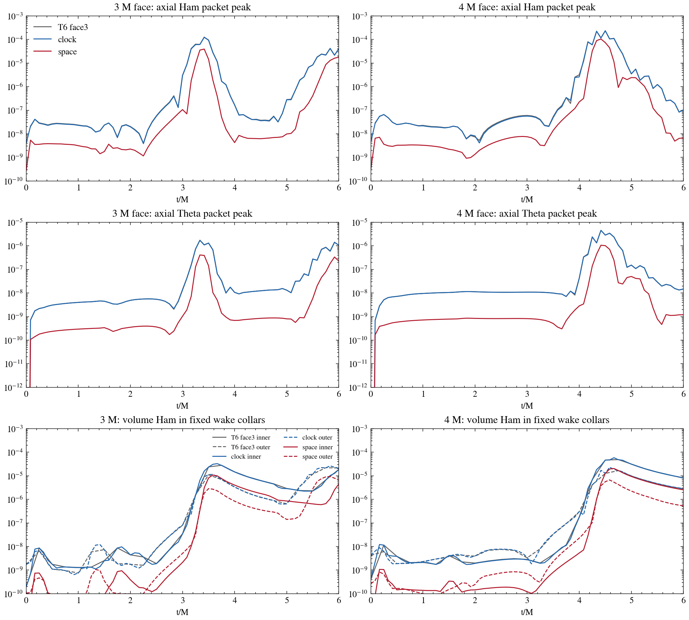

Clock and T6 nearly overlap at the first peaks and in the bulk collars. Space suppresses the packets and wake but does not remove continued error production near the faces.

There is a material clock effect in later **interface-including** collars, even though the dominant peaks and bulk norms hardly change. All three columns below have the same broad physical collar |e−a|<1/12; T6 has 1/4 M full plots, but t=4 and 6 are exact matches, while the new snapshots are level post-step recordings. Diagnostic ghost-refresh ordering can affect Ham, so Theta is reported alongside it.

| face | t/M | field | T6 collar RMS | clock collar RMS | space collar RMS | clock/T6 | space/clock |
| --- | --- | --- | --- | --- | --- | --- | --- |
| 3.0 | 4.0 | Ham | 9.43603e-06 | 5.40281e-06 | 1.31872e-06 | 0.572573 | 0.244081 |
| 3.0 | 4.0 | Theta | 1.27985e-07 | 7.85051e-08 | 1.14111e-08 | 0.613392 | 0.145354 |
| 4.0 | 6.0 | Ham | 6.45754e-06 | 3.52577e-06 | 1.0416e-06 | 0.545992 | 0.295426 |
| 4.0 | 6.0 | Theta | 1.23199e-07 | 7.44002e-08 | 1.3384e-08 | 0.6039 | 0.179892 |

These rows prevent a blanket declaration of the registered resolution-only win. Absolute clock/spatial RMS-change ratios are 0.988/0.737 at the 3 M face at t=4 (Ham/Theta), and 1.180/0.800 at the 4 M face at t=6. They prioritize temporal coupling/order for the remaining interface-local effect, without demonstrating a particular dense-output bug. Their absolute signal is smaller than the main packet, but the clock effect is comparable to the spatial effect there. No threshold was changed to call this a clean pass.

#### Common physical seam regions

The shared 1.5 M planes and space-only 2.25 M planes are compared in **the same** physical ray bands of half-width 1/12 M in every run. No per-box sample is compared with a differently placed box. The following prefix is before the independently selected first-face large source; all-time histories, including later returned errors, are retained separately.

| run | ray | common plane/M | max Ham through t=3 M |
| --- | --- | --- | --- |
| T6_face3 | axis_plus | 1.5 | 1.51913e-06 |
| clock | axis_plus | 1.5 | 1.74608e-06 |
| space | axis_plus | 1.5 | 3.50639e-07 |
| T6_face3 | axis_plus | 2.25 | 2.42827e-07 |
| clock | axis_plus | 2.25 | 2.81556e-07 |
| space | axis_plus | 2.25 | 5.71037e-08 |
| T6_face3 | diagonal | 1.5 | 2.03008e-06 |
| clock | diagonal | 1.5 | 2.03008e-06 |
| space | diagonal | 1.5 | 7.86932e-07 |
| T6_face3 | diagonal | 2.25 | 1.04322e-08 |
| clock | diagonal | 2.25 | 1.12023e-08 |
| space | diagonal | 2.25 | 1.19613e-09 |

The changed internal seams do not retain a first burst comparable to the 1e-4 face packet. Later errors can travel back through them; their later presence is not proof of creation at a same-level seam. [t7a-common-seams.csv](t7a-common-seams.csv) records common-region histories.

#### Actual operation replay and causal limit

All captured actual pre-KO/KO RHS values in the independent event windows replay **bit-identically** with the standalone native production kernel. Spatial point prolongation from the saved actual dense parent operands agrees within 1.77e-15 in max(1,|value|) units, including parity-filled supports; stage times agree within 2.97e-16 M. Start fractions are 0 or 0.5; stage-time fractions are 0,0.25,0.5,0.75,1, with the two half-time stages retained separately. This verifies capture and arithmetic, not truncation accuracy on a poorly sampled incident feature.

The first **direct evolved-Theta creation** is the physical RHS reading the ghost-filled stencil, followed by the RK update. The already-filled stage input has a large Hamiltonian residual before trace projection. Near the positive source lobe, the physical Theta RHS closely equals 0.5 alpha Ham; KO opposes it by about 13–16%. The table reports physical/KO/total at the same source-peak cell and time, plus the largest net actual RK4-step increment. The two peak selections need not coincide; their times are retained in [t7a-source-summary.csv](t7a-source-summary.csv). Rows for the 4 M corner are censored by the 6 M stop.

| run / face / ray | first 1% source t/M | peak source t/M | pre-KO Theta RHS | KO Theta RHS | total Theta RHS | 0.5 alpha Ham | RK physical ΔTheta | RK KO ΔTheta | RK total ΔTheta |
| --- | --- | --- | --- | --- | --- | --- | --- | --- | --- |
| clock / 4.0 / axis_plus | 3.92187 | 4.48177 | 9.60234e-05 | -1.40564e-05 | 8.1967e-05 | 9.58751e-05 | 1.25136e-07 | -1.88125e-08 | 1.06323e-07 |
| clock / 4.0 / diagonal | 5.66667 | 6 | -1.75001e-05 | 1.3491e-06 | -1.6151e-05 | -1.75167e-05 | -2.22485e-08 | 1.66923e-09 | -2.05793e-08 |
| clock / 3.0 / axis_plus | 2.98047 | 3.38932 | 5.66239e-05 | -8.65503e-06 | 4.79689e-05 | 5.68926e-05 | 3.66296e-08 | -5.58239e-09 | 3.10473e-08 |
| clock / 3.0 / diagonal | 4.32812 | 4.65625 | 1.68709e-05 | -2.25006e-06 | 1.46208e-05 | 1.70707e-05 | 1.09724e-08 | -1.51667e-09 | 9.4557e-09 |
| space / 4.0 / axis_plus | 4.10872 | 4.42448 | 4.59285e-05 | -6.89051e-06 | 3.9038e-05 | 4.60228e-05 | 5.91515e-08 | -8.78491e-09 | 5.03666e-08 |
| space / 4.0 / diagonal | 5.80208 | 5.97917 | 3.64979e-06 | -5.67698e-07 | 3.08209e-06 | 3.70175e-06 | 4.76056e-09 | -7.87673e-10 | 3.97288e-09 |
| space / 3.0 / axis_plus | 3.1237 | 3.34896 | 2.35819e-05 | -3.61798e-06 | 1.9964e-05 | 2.37817e-05 | 1.51364e-08 | -2.30908e-09 | 1.28273e-08 |
| space / 3.0 / diagonal | 4.45182 | 4.63411 | 6.26602e-06 | -8.58923e-07 | 5.4071e-06 | 6.35367e-06 | 4.00819e-09 | -5.38316e-10 | 3.46987e-09 |

The actual four-stage Theta increment equals dt/6 times the native (1,2,2,1)-weighted physical and KO rates, with maximum error 1.50e-21. This is an evolved increment, not an endpoint diagnostic-ghost change. Stage/update/end projections change Theta by exactly zero; stage trace removal changes Ham by at most 1.74e-18. Captured chi/lapse floors never activate. Restriction changes covered coarse cells only, and replays even the outermost ghost-dependent row/corner within 1.55e-15; the fine Theta packet already exists in current fine support before copying it. It cannot be the contemporaneous first creator of that fine packet, although earlier restriction can feed later coarse ghost history. Actual covered-cell jumps are below; these are changes per copy operation, not uncovered-cell evolution increments. [t7a-restriction-summary.csv](t7a-restriction-summary.csv) retains all rays, before/after values and replay errors.

| run / face / ray | peak jump t/M | covered-coarse ΔTheta | fine Theta support max before copy |
| --- | --- | --- | --- |
| clock / 4.0 / axis_plus | 4.53646 | 8.42237e-08 | 4.08224e-06 |
| clock / 4.0 / diagonal | 5.94792 | 7.8213e-09 | 4.74241e-07 |
| clock / 3.0 / axis_plus | 3.42187 | 2.69793e-08 | 1.73769e-06 |
| clock / 3.0 / diagonal | 4.67578 | 8.91392e-09 | 2.93022e-07 |
| space / 4.0 / axis_plus | 4.45312 | 3.93325e-08 | 1.01929e-06 |
| space / 4.0 / diagonal | 5.99479 | 2.48043e-09 | 8.63187e-08 |
| space / 3.0 / axis_plus | 3.36458 | 1.15005e-08 | 4.02311e-07 |
| space / 3.0 / diagonal | 4.64323 | 3.46954e-09 | 5.83591e-08 |

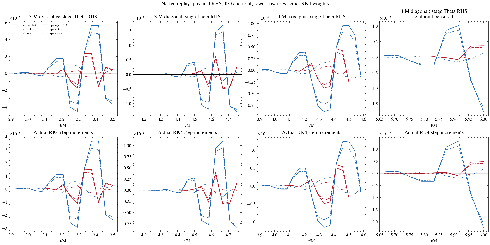

**Measured:** pre-KO physical RHS supplies the dominant direct Theta emission; direct Theta KO is dissipative at its positive source peak, and projections/floors do not create Theta. **Still unresolved:** the original cause of the Ham error already present in that stage input. The recorder starts after ghost fill and stores dense parent operands, not a pre-fill ghost state or the raw parent RK stage vectors. It also stores RHS on the target core, not RHS on every neighboring cell needed for a Hamiltonian derivative of the update. Therefore an exact before/after ghost-fill Ham budget, a unique spatial-versus-temporal ghost-error split, and KO-on-metric versus physical-metric contributions to creating Ham cannot be recovered. The data rule out those overclaims; agreement with the interpolation formula is not a proof that its boundary closure is accurate on this wave.

#### Implication for exp-0019 and the 100 M E layout

The measured reference mechanism explains why adding puncture-only levels or moving one face is insufficient: a sharp outgoing gauge feature loses receiving cells at each outward factor-two transition and excites constraints there. It supports receiving resolution as a remedy candidate for the reference far-mask order 1–1.7, while the remaining stage-local sensitivity needs its own qualification. It does not establish a universal roundoff floor or a proven asymptotic fix.

E's exp-0019 far Ham/Mom are real current-field residuals, but low/mid/high have different physical faces. In particular level-4 faces are 5.6875 / 5.541667 / 5.444444 M, with different corners inside the far shell; its order near zero is confounded by geometry/phase and cannot be assigned solely to this reference mechanism. Exp-0020's common faces remove that confound; no running exp-0020 data are accessed here. E-specific incident widths and charge budgets remain necessary.

For a prospective 100 M chain, use **E's measured evolved** width at each significant face, h_receiving≤w_E/N_qualified, and common physical face unions across rungs. This tranche qualifies no universal N: the tested first-face half-prominence counts are only about 2.6–2.8→3.9–4.1, and the next receiver has fewer cells still. Ten/twelve cells is a test target, not an admission certificate. Audit both faces and diagonal corners at every rung the disturbance crosses; for exp-0019 this includes the inner rungs and exterior faces near 2.7–2.84, 5.44–5.69, 10.89–11.38, 21.78–22.75 and 43.56–45.5 M. Their receiving levels are 4,3,2,1,0 respectively. The common exp-0020 layout must use its own actual unions. Retain the near-hole hierarchy but qualify a transport region and its ancestors, rather than using the reference width as an E constant. No 100 M production admission follows from the present pair.

**Cheapest next disambiguating test, proposed only:** one more clock leg at h0=4/3 M, dt0=1/48 M (CFL=1/64), the same fixed faces and sigma=1, to 6 M. Approximate local wall is 34 min from the measured clock wall; RAM remains roughly the current clock bound. Save pre-fill and post-fill ghosts, raw parent RK stage vectors, and RHS on the full Hamiltonian dependency halo, while preserving the opt-in bit controls. Freeze event selection, physical masks and profile sampling before launch. Pass the clock-negligible condition only if every relevant packet/wake/interface-collar norm changes by ≤5% versus the present clock and by <20% of the clock→space contrast, with incident profiles and phase within their sampling uncertainty. Kill a **resolution-only** interpretation if a remaining clock change is ≥50% of the clock→space contrast in any registered region; 5% alone is not a production accuracy budget. Intermediate results remain unqualified. This cheap test addresses the material temporal exception; it cannot by itself prove a finite-width continuum limit or admit E production.

If that clock condition passes, the next necessary spatial qualification is the fixed-face h0=1/3 M, dt0=1/48 M rung. Require stable incident width (ratio ≥0.85), rising receiving count, and packet plus interface-excluded wake apparent order ≥3 on the new pair, with P6/P8 uncertainty <10% of each measured contrast. Kill the finite-width layout premise if width again approaches halving with h (ratio ≤0.6) and cell count stays nearly constant; kill resolution alone as sufficient if a demonstrably resolved incident feature still gives order <2. The extrapolated full 6 M local wall is about 7.5 h, so the clock test is cheaper. No test is launched. E's common-face admission analysis and qualified horizon budgets must pass independently before applying either result to a 100 M chain.

#### Retention, load, controls, and reproduction

The initial registration and all original completed outputs are retained. All 13 checked production/recorder/harness/author-finder source hashes match the preceding controls, recorded in [t7a-source-controls.csv](t7a-source-controls.csv). Existing default-off and recording-on bit controls remain the applicable evolution controls; this analysis adds no evolution path. The analysis uses one thread per stream, at most two streams/native replays concurrently (≤4 threads total), with measured per-process peak RSS ≤1.37 GB; even a conservative sum remains below 8 GB. Each largest stream analysis completed in under 90 s. No simulation or long detached job was started.

Small consolidated CSVs are in this directory. Detailed per-level tables, composite six/eight-node ray caches and losslessly compressed selected operation frames remain under `/private/tmp/ems-t7a/`; their hashes are recorded in [t7a-archived-tables.csv](t7a-archived-tables.csv) and the manifest. Composite caches were losslessly compressed with every array verified identical, including NaNs; redundant derived per-level ray caches were removed after hashing. [t7a-cleanup.csv](t7a-cleanup.csv) records the original and retained hashes. Native-stencil/replay scratch was also removed after hashing. All original streams, every cited composite profile and selected operation frame, and all detailed CSVs remain available. The analysis directory is now about 1.0 GB, alongside about 4.7 GB of original completed run output.

One bounded operation per command, with installed local Python and single-thread BLAS:

```sh
OPENBLAS_NUM_THREADS=1 OMP_NUM_THREADS=1 /Users/auroradysis/miniconda3/bin/python Tests/EMSNative/t7a-analyze.py snapshots clock 6
# Repeat snapshots per case/level, then baseline, combined, profiles, common_packet_peaks.
OPENBLAS_NUM_THREADS=1 OMP_NUM_THREADS=1 /Users/auroradysis/miniconda3/bin/python Tests/EMSNative/t7a-analyze.py operations clock 6
# Repeat operations per case/level; rk_budget per case/level; restriction for coarse levels 4 and 5.
OPENBLAS_NUM_THREADS=1 OMP_NUM_THREADS=1 /Users/auroradysis/miniconda3/bin/python Tests/EMSNative/t7a-analyze.py summaries
OPENBLAS_NUM_THREADS=1 OMP_NUM_THREADS=1 MPLCONFIGDIR=/private/tmp/ems-t7a/mpl /Users/auroradysis/miniconda3/bin/python Tests/EMSNative/t7a-analyze.py figures
OPENBLAS_NUM_THREADS=1 OMP_NUM_THREADS=1 /Users/auroradysis/miniconda3/bin/python Tests/EMSNative/t7a-check.py
```

Native widths and ray_wakes are separate bounded operations. The native replay build uses the already installed local serial Chombo and T7E's one-compiler build helper; no library or production source is modified. [COMMIT-MANIFEST-T7-A.txt](COMMIT-MANIFEST-T7-A.txt) records this analysis, and the shared T7 manifest is refreshed. No commit.

### A — clock-2 registration (not launched)

**BLOCKED:** the controller requires the identical clock executable with only timestep/step-count/cadence changes, and full pre/post-fill plus neighboring RHS capture. The identical executable does not implement the requested additional capture. Its SHA-256 is `15e9e81bb100c3bfb508637cadd2f82c0df79814f8f8f73c22b607b5199aebdf`, verified against the original T7 build manifest. No replacement executable, C++ edit, evolution, or commit is made.

Controller notebook registration, verbatim:

> the clock leg again with h0 = 4/3 M, Δt0 = 1/48 M, to 6 M (≈ 34 min), full pre/post-fill and neighbouring RHS capture. PASS (temporal exception ruled out) if every relevant collar/packet/wake norm changes by ≤ 5 % and by < 20 % of the spatial contrast; KILL 'resolution alone' if any change is ≥ 50 % of the spatial contrast; in between, temporal coupling stays a priority.

[params/t7-ref-mid-clock2.txt](params/t7-ref-mid-clock2.txt) is prepared. Its parameter dictionary differs from the completed clock leg in exactly `dt_multiplier: 0.03125 → 0.015625` and `max_steps: 144 → 288`. All other parameters are identical, including point transfers, sigma=1, fixed hierarchy, disabled global plots/checkpoints, Float64 current-field recording and the t>0 initial-data guard. h0=4/3 M and dt0=1/48 M give CFL=1/64; 288 steps end at 6 M. The existing hard-coded 1/12 M capture ladder now occurs every four coarse steps, retaining 73 snapshot times per recorded level. No cadence parameter needs changing. Unions/faces and seams are inherited identically from the verified clock initial layout; no runtime placement derives from the static data.

| item | prepared value / condition |
| --- | --- |
| executable command | `/private/tmp/ems-t7/evolution.ex params.txt` |
| run directory | `/private/tmp/ems-t7-clock2/evolution/clock-2` |
| run log | `/private/tmp/ems-t7-clock2/evolution/clock-2/run.log` (not created) |
| marker | `/private/tmp/ems-t7-clock2/evolution/clock-2/done.exit` (not created) |
| launch plan | `/private/tmp/ems-t7-clock2/evolution/plan.json`, copied in [t7-clock2-run-plan.json](t7-clock2-run-plan.json) |
| planned wall | approximately 34 min, twice the measured 17.0127 min clock wall |
| planned evolution resources | four OpenMP threads; 1.5 GB bound, native clock RSS measured 0.3541 GB, bounded existing xz dictionaries additional |
| planned output | 4,384,163,408 bytes = 2 × 2,123,637,408 original stage bytes + 136,888,592 unchanged snapshot bytes; estimate for the **existing** capture only |
| disk gate | existing t7-run.py gate 5,700,000,000 bytes on the fresh evolution root, below 6 GB; old completed legs are outside it |
| status | BLOCKED_NOT_LAUNCHED; no PID, first steps or done marker |

The prepared detach command is:

```sh
/Users/auroradysis/miniconda3/bin/python Tests/EMSNative/t7-run.py --detach /private/tmp/ems-t7-clock2/evolution/plan.json
```

The source evidence is direct: [GRAMRLevel.cpp](../../Source/GRChomboCore/GRAMRLevel.cpp) calls `fill_stage` at line 1046 and only then records dense parent support at 1047; the first fine stage recording is in `specificEvalRHS` at [EMSBH2DLevel.cpp](../../Examples/EMS/EMSBH2DLevel.cpp) line 311, after fill and boundary completion. RHS phases 20/21 write `window ∩ valid` only (lines 368–372), and phase 22 uses growth zero (376). [T7OperationRecorder.hpp](../../Source/GRChomboCore/T7OperationRecorder.hpp) exposes only the existing `t7_diagnostics` switch and fixed target windows; no parameter enables pre-fill or neighboring RHS recording. Complete saved **state operands** for core RHS replay do not supply missing neighboring RHS or pre-fill states. This is the limitation already measured in the completed analysis above. Running the prepared identical executable would support the norm comparison but would knowingly omit part of the controller's registered capture, so it is not launched.

**Analysis on controller resumption after a compliant run:** audit exit, sigma, required variables, floors/nonfinite values and actual box unions; evaluate common physical interface collars, independently selected axial/corner packet peaks, and inner/outer interface-excluded volume-weighted wake RMS at 4 and 6 M, retaining full time histories on the 1/12 M ladder. For every relevant norm N, tabulate N_clock, N_clock2, N_space, |N_clock2−N_clock|/|N_clock|, and |N_clock2−N_clock|/|N_space−N_clock|. Zero contrasts are reported explicitly rather than divided by zero. PASS requires every registered row to satisfy ≤0.05 and <0.20; any row with contrast fraction ≥0.50 gives KILL resolution alone; otherwise temporal coupling stays a priority. Incoming current-field profile/phase sampling sensitivities and capture-order limitations remain explicit. Full pre/post-fill and neighboring RHS replay is contingent on resolving the executable/capture incompatibility; no verdict is assigned before measurements.

Controller amendment before launch: clock-2 uses the SAME executable and SAME capture as clock; full pre/post-fill and neighboring RHS capture is dropped, with the registered collar/packet/wake norm PASS/KILL/in-between criteria unchanged.

Launched detached with t7-run.py, queue PID 15826; first level-0 advances at 0.0208333 and 0.0416667 M are logged (dt0=1/48 M). Status RUNS-PENDING; run directory `/private/tmp/ems-t7-clock2/evolution/clock-2`, log `run.log`, atomic marker `/private/tmp/ems-t7-clock2/evolution/clock-2/done.exit` pending; planned wall approximately 34 min. On resumption compute the registered norm-change/space-contrast table and unchanged PASS/KILL/in-between verdict using the original capture. [First-step evidence](t7-clock2-first-steps.txt). No completion wait or commit.


#### clock-2 completed results and T7 A norm erratum

**READY; PASS under the unchanged registered norm criterion.** The completed marker is `/private/tmp/ems-t7-clock2/evolution/clock-2/done.exit = 0`. All 20 rows in the registered packet/wake/late-collar table satisfy both limits after combining all uncovered level contributions at the same physical time: the largest absolute clock-2/clock change is 1.80338%, and the largest absolute fraction of the spatial contrast is 0.02615849. The limits remain 5% and strictly less than 0.20. No row reaches the 0.50 KILL limit. This is the registered temporal-exception verdict through 6 M, not an RK4 temporal-order measurement or a 100 M admission.

**Correction to the preceding T7 A late-collar claim.** `t7a-analyze.py:combined` used exact Float64 times as composite grouping keys. At t=4 M, clock level-5 and level-6 contributions have times 3.9999999999999947 and 3.9999999999999942 M; at t=6 M, levels 4 and 5 have 6.000000000000008 and 6.000000000000007 M. Those differences are below 2e-15 M, but the reduction emitted separate level rows. The preceding late-collar table selected the receiving-level row; T6's plot-based composite included both levels. The claimed material clock effect compared different cell sets. The physical masks and volume norm themselves were unchanged.

Here every contribution is assigned to the registered 1/12 M time ladder only after checking its discrepancy is below 1e-9 M, then square sums and volume weights are combined over all uncovered levels. The shared grouping helper is fixed for future reductions; the previous CSVs and tables are retained unchanged as historical evidence. [t7-clock2-time-grouping-correction.csv](t7-clock2-time-grouping-correction.csv) retains every published value, corrected value, raw level time, level list and cell count for all 48 broad collar/wake rows. The four affected primary rows are:

| face / t / field | T6 RMS | published clock RMS | corrected clock RMS | clock-2 RMS | corrected space RMS | published → corrected clock cells |
| --- | --- | --- | --- | --- | --- | --- |
| 3 / 4 / Ham | 9.43602551e-06 | 5.40281263e-06 | 9.39682978e-06 | 9.33585601e-06 | 2.56537776e-06 | 584 → 2856 |
| 3 / 4 / Theta | 1.27985250e-07 | 7.85050764e-08 | 1.26902789e-07 | 1.26357364e-07 | 1.96415296e-08 | 584 → 2856 |
| 4 / 6 / Ham | 6.45753995e-06 | 3.52576698e-06 | 6.46456899e-06 | 6.40927108e-06 | 2.00706098e-06 | 194 → 954 |
| 4 / 6 / Theta | 1.23199476e-07 | 7.44001927e-08 | 1.22515071e-07 | 1.22165484e-07 | 2.19755904e-08 | 194 → 954 |

The corrected clock and clock-2 use exactly the same cell sets and volume weights. Space uses four times as many cells in the same physical regions. The original packet peak table and the eight bulk Hamiltonian wake rows are unaffected. **The preceding conclusion that late interface collars require prioritizing temporal coupling is withdrawn:** it depended on this reduction error. The source of that error is the analysis grouping, not a measured evolution operation.

For the comparison below, first change is clock−T6 (dt0: 1/12→1/24 M), second change is clock-2−clock (1/24→1/48 M), and spatial contrast is space−clock (h0: 4/3→2/3 M at dt0=1/24 M). The contrast ratio is |second change|/|spatial contrast|; signed ratios are also retained in the CSV. Packet peaks are selected independently over the entire 1/12 M ladder in the frozen physical windows. The 4 M corner peaks are increasing endpoint maxima, not completed passage peaks. Wake masks retain the fixed 1/12 M interface exclusion and 0.1875 M outer extent, with the physical coordinate-volume weight 2π y h_level² over uncovered cells. Late collars retain |max(|x|,y)−face|<1/12 M. No event, region, timestep criterion or constraint normalization is changed.

| region / field | t/M | clock-2/clock − 1 (%) | space/clock − 1 (%) | absolute contrast ratio | clock/T6 − 1 (%) | clock-2/T6 − 1 (%) | second/first signed change |
| --- | --- | --- | --- | --- | --- | --- | --- |
| 3 M axis peak / Theta | 3.33333 | -0.6749 | -76.1249 | 0.008866 | -1.3075 | -1.9736 | +0.50945 |
| 3 M axis peak / Ham | 3.41667 | -0.6684 | -68.3893 | 0.009773 | -1.3192 | -1.9788 | +0.49997 |
| 3 M corner peak / Theta | 4.58333 | -1.2399 | -47.3994 | 0.026158 | -2.4074 | -3.6175 | +0.50263 |
| 3 M corner peak / Ham | 4.66667 | -0.8304 | -72.3654 | 0.011475 | -1.6216 | -2.4386 | +0.50378 |
| 4 M axis peak / Theta | 4.41667 | -0.4757 | -76.4952 | 0.006219 | -0.9057 | -1.3771 | +0.52052 |
| 4 M axis peak / Ham | 4.50000 | -0.6628 | -55.0153 | 0.012048 | -1.2922 | -1.9465 | +0.50631 |
| 4 M corner peak (endpoint) / Ham | 6.00000 | -1.8034 | -71.3844 | 0.025263 | -3.4581 | -5.1991 | +0.50346 |
| 4 M corner peak (endpoint) / Theta | 6.00000 | +0.5286 | -67.6355 | 0.007815 | +1.1013 | +1.6357 | +0.48522 |
| 3 M inner / Ham | 4.00000 | -0.6486 | -72.2735 | 0.008974 | -1.2656 | -1.9059 | +0.50599 |
| 3 M inner / Ham | 6.00000 | -0.7896 | -75.5047 | 0.010457 | -1.5436 | -2.3210 | +0.50362 |
| 4 M inner (pre-front) / Ham | 4.00000 | -1.0649 | -96.9538 | 0.010984 | -2.4448 | -3.4837 | +0.42493 |
| 4 M inner / Ham | 6.00000 | -0.5748 | -67.8559 | 0.008471 | -1.1186 | -1.6870 | +0.50811 |
| 3 M outer / Ham | 4.00000 | +0.6543 | -75.0730 | 0.008715 | +1.3262 | +1.9891 | +0.49989 |
| 3 M outer / Ham | 6.00000 | -0.7264 | -68.7816 | 0.010561 | -1.4149 | -2.1310 | +0.50615 |
| 4 M outer (pre-front) / Ham | 4.00000 | +1.3331 | -92.5617 | 0.014402 | +2.6646 | +4.0331 | +0.51363 |
| 4 M outer / Ham | 6.00000 | +0.7529 | -81.4301 | 0.009246 | +1.5353 | +2.2997 | +0.49793 |
| 3 M collar / Ham | 4.00000 | -0.6489 | -72.6995 | 0.008925 | -0.4154 | -1.0616 | +1.55562 |
| 3 M collar / Theta | 4.00000 | -0.4298 | -84.5224 | 0.005085 | -0.8458 | -1.2719 | +0.50388 |
| 4 M collar / Ham | 6.00000 | -0.8554 | -68.9529 | 0.012406 | +0.1089 | -0.7475 | -7.86707 |
| 4 M collar / Theta | 6.00000 | -0.2853 | -82.0629 | 0.003477 | -0.5555 | -0.8393 | +0.51079 |

Every row is PASS. The deciding largest contrast fraction is the 3 M corner Theta peak (0.02615849); the largest percentage change is the censored 4 M corner Hamiltonian peak (−1.80338%). The largest late-collar fraction is the 4 M Hamiltonian collar at t=6 (0.01240557). [t7-clock2-norm-comparison.csv](t7-clock2-norm-comparison.csv) supplies all four raw norms, peak times, counts, signed differences, ratios and conditions. [t7-clock2-composite-metrics.csv](t7-clock2-composite-metrics.csv) and [t7-clock2-packet-history.csv](t7-clock2-packet-history.csv) retain the complete 73-time histories. The 48 broad volume-norm comparisons for Ham, Theta, Mom and GaussE all pass; their maximum percentage change is 3.82730% (4.0 M wake_inner, Theta, t=4.0) and maximum contrast fraction 0.05279917. All 36 P6/P8 ray-wake comparisons also pass (maximum change 0.90708%, maximum contrast fraction 0.00936745). These additional norms are retained in [t7-clock2-supplemental-norms.csv](t7-clock2-supplemental-norms.csv) and [t7-clock2-ray-wake-comparison.csv](t7-clock2-ray-wake-comparison.csv).

**Temporal scaling does not show RK4's 1/16 pattern.** The independently selected packet norms have second/first absolute-change ratios 0.48522–0.52052, and the eight bulk Hamiltonian wakes 0.42493–0.51363. If interpreted as a leading smooth timestep power in these particular norms, the packet ratios correspond to approximately first order (0.942–1.043), not fourth order. The two late Theta collars give 0.50388/0.51079. Late Ham gives +1.55562 at 3 M, and −7.86707 at 4 M: the latter reverses sign after a first change of only +0.10885%. These diagnostic norms do not establish the global temporal order of the evolved fields. T6 plot ghost-refresh ordering differs from the new level post-step capture and can affect Hamiltonian derivatives; independent peaks are nonlinear observables. Nonetheless the failure of 1/16 scaling is measured, and is not relabelled as fourth-order temporal convergence. Its magnitude passes the pre-registered comparison with the spatial effect.

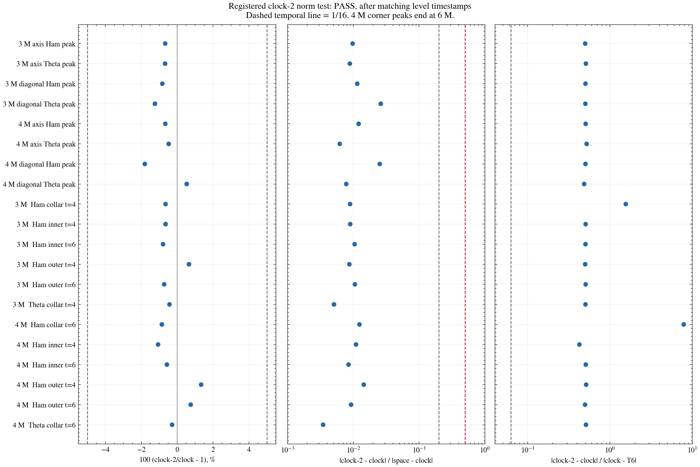

The figure shows the signed percentage change, the absolute fraction of the spatial contrast, and the absolute second/first clock-change ratio. Dashed lines mark the frozen 5%, 0.20/0.50 and 1/16 reference values. The corrected 4 M Ham collar has a negative signed temporal ratio; its absolute magnitude is plotted. The PNG and PDF retain the same 20 table entries and the endpoint qualification.

**Audit and controls.** The same executable hash is `15e9e81bb100c3bfb508637cadd2f82c0df79814f8f8f73c22b607b5199aebdf`; the only parameter differences from clock remain dt_multiplier and max_steps. Point transfers, sigma=1, fixed hierarchy, nan_check=1, and the t>0 initial-data guard are enabled. All 28 evolved components and five snapshot constraints are present. All 6,794,496 stage frames and 876 snapshot frames decode as finite Float64; each stage phase count is exactly twice clock's. The 24 default-parameter messages match clock exactly. Captured snapshot minima are chi=0.0937198388075 and lapse=0.285472910607; captured stage/snapshot floor hits and projection changes to chi/lapse are zero. GaussB is exactly zero in the captured snapshots. The maximum stage-time discrepancy is 2.96096e-16 M, and physical+KO versus total RHS discrepancy is 3.46945e-18 in max(1,|terms|) units. This is an audit of recorded operands, not the dropped additional pre-fill/neighbouring-RHS replay.

The negative `min_chi.dat` column is not an evolved-chi minimum: the frozen EMS post-step code constructs `AMRReductions<VariableType::diagnostic>` and then calls `min(c_chi)`. `c_chi=0` indexes diagnostic `mod_F`, whose producer writes FF=2 BB−2 EE. The diagnostic label is therefore wrong. The captured evolved-chi values are positive; these recordings do not certify floor activity in the unsaved puncture region. This source finding is recorded read-only; no C++ change is made.

Actual recorded L4–L6 box unions and seams match clock, and the L0–L6 fixed-hierarchy parameters and executable are identical. All 13 production/recorder/finder source controls remain unchanged. Measured wall is 1721.307661 s (28.68846 min); native peak RSS is 0.353403 GB and run output is 4,214,628,177 bytes. Analysis streams use one thread and at most three simultaneous stage decoders; peak measured per-stream RSS is 0.153158 GB and the longest stream call is 92.09 s. No new evolution run or commit is made. [t7-clock2-run-audit.csv](t7-clock2-run-audit.csv), [t7-clock2-input-audit.csv](t7-clock2-input-audit.csv), [t7-clock2-stage-audit.csv](t7-clock2-stage-audit.csv), [t7-clock2-snapshot-audit.csv](t7-clock2-snapshot-audit.csv) and [t7-clock2-source-controls.csv](t7-clock2-source-controls.csv) retain the measurements and hashes.

**Implication for the 100 M layout policy.** The clock-negligible condition now passes for these reference norms through 6 M, so the receiving-resolution qualification can proceed without the former late-collar temporal exception. The measured spatial suppression of packets and interface-excluded wakes remains the larger effect. This does not certify a finite incident-width limit, fourth-order packet/wake convergence or a 100 M E chain: the first-face width ratios were 0.731/0.752, and even space had only 1.93/1.53 receiving cells across the closed half-height feature at the next 4 M axial/corner face. There is no qualified 8 M crossing in these 6 M runs. The previously registered fixed-face h0=1/3 M, dt0=1/48 M spatial rung remains necessary to check width stability (ratio ≥0.85), rising receiving-cell count and packet/wake order ≥3 with sampling uncertainty <10% of the contrast; it is not launched here.

For E, use its evolved transient widths and common physical face unions across resolution rungs, including receiving levels 4,3,2,1,0 and their diagonal corners. The exp-0019 mid/high level-4 faces differed (5.541667/5.444444 M); this reference clock test cannot remove that confounding of the E far mask or independently qualify E's horizon budgets. The common-face exp-0020 data must supply its own evidence. Keep transport regions and parent levels sufficiently resolved at every face crossed; the present norms certify no universal cells-per-width target or 100 M error budget. No static profile enters this analysis.

Reproduction uses the existing installed Python, lossless decoder, native ROI helpers and current-field P6/P8 sampling:

```sh
OPENBLAS_NUM_THREADS=1 OMP_NUM_THREADS=1 /Users/auroradysis/miniconda3/bin/python Tests/EMSNative/t7-clock2-analyze.py snapshots 6
# Repeat snapshots and stages separately for levels 4, 5 and 6 (bounded calls).
OPENBLAS_NUM_THREADS=1 OMP_NUM_THREADS=1 /Users/auroradysis/miniconda3/bin/python Tests/EMSNative/t7-clock2-analyze.py finish
OPENBLAS_NUM_THREADS=1 OMP_NUM_THREADS=1 /Users/auroradysis/miniconda3/bin/python Tests/EMSNative/t7-clock2-analyze.py ray_wakes
OPENBLAS_NUM_THREADS=1 OMP_NUM_THREADS=1 /Users/auroradysis/miniconda3/bin/python Tests/EMSNative/t7-clock2-analyze.py audit
OPENBLAS_NUM_THREADS=1 OMP_NUM_THREADS=1 MPLCONFIGDIR=/private/tmp/ems-t7-clock2-analysis/mpl /Users/auroradysis/miniconda3/bin/python Tests/EMSNative/t7-clock2-analyze.py figures
OPENBLAS_NUM_THREADS=1 OMP_NUM_THREADS=1 /Users/auroradysis/miniconda3/bin/python Tests/EMSNative/t7-clock2-analyze.py check
```

The runnable check covers strict gate thresholds, zero contrasts, common-time grouping and exact reproduction of the preceding clock packet amplitudes and peak times. Original run streams and preceding T7 A large CSVs are retained. Small per-level derived tables remain in `/private/tmp/ems-t7-clock2-analysis/`, with hashes in [COMMIT-MANIFEST-T7-CLOCK2.txt](COMMIT-MANIFEST-T7-CLOCK2.txt); the shared T7 manifest is refreshed. The registration and controller amendment above are preserved verbatim.

## T7-E — exp-0019 E, three-grid qualification and constraint diagnosis

**READY-EXCEPT:** every supplied E checkpoint has a qualified 48/96-point numerical horizon. High passes both budgets on those checkpoints; the early interval between t=0 and the first late checkpoint is not independently qualified. The t=0 Hamiltonian loss of order is dominated on the finer grids by absolute-coordinate rounding in the initial setter, amplified by second derivatives. The evolved far-mask signal is a time-dependent discretization packet/wake above the instantaneous Float64 floor; its exact source operation is not established by the saved E states alone.

All EMS and cluster inputs are read-only. This tranche adds standalone diagnostics and Python analysis; it changes no production evolution or finder C++ source, equations, gauge, floors, transfer operator, parameters, or checkpoint. No commit is made. Static-file evaluation is guarded by checkpoint time exactly zero. Evolved diagnostics use the saved current fields and other resolutions only. T7 A's space process, directory, parameters, and marker were not accessed. No new long simulation was started.

### Qualified horizons and numerical baselines

The four checkpoints supplied for each grid are used. Low/mid reuse the eight qualified T6 checkpoint rows; high adds eight independent frozen solves, one at each N_theta=48 and 96 for each checkpoint. T6's frozen-state setup, native Lagrange-4 field sampling, parity treatment, chase multiplier 2, 3000-update ceiling, and mean-square expansion thresholds 1e-7, 1e-10, 1e-12 are unchanged. The final condition is FOUND at stage 2 and sqrt(err)<=1e-6, independently at both angular resolutions. A finder label such as close or found from the in-run history is not substituted for this qualification. `err` is the surface-area-weighted mean square of outgoing expansion, whereas `<Theta+>` is its area-weighted mean. Numbers below are N_theta=96; the CSV also retains N_theta=48, angular and stopping sensitivities, and the native expansion RMS.

The current executable includes disabled T7 diagnostic branches; its executable hash differs from the earlier T6 builds. Both author's finder headers have identical hashes. A bounded control replays E-low t=0 at N_theta=48: all four surface rows and all 15 non-wall-clock columns exactly match the cached T6 result, including intermediate stages, area, charge, residual, updates and status. See [t7e-controls.csv](t7e-controls.csv). Thus the qualification is the same numerical frozen harness; executable byte identity is not claimed. [t7e-finder-runs.csv](t7e-finder-runs.csv) and [t7e-finder-input-audit.csv](t7e-finder-input-audit.csv) retain the eight high solves and hashes.

There is no in-run t=0 finder row. Each t=0 qualification uses the earliest saved numerical shape as a seed but solves on t=0 checkpoint fields, supplying the numerical baseline. High's 9.43055556 M checkpoint has no same-time saved shape; it uses the preceding 9.33333333 M shape. The independent root solve still satisfies the same criterion. The native values beside this row are linearly interpolated between the native 9.33333333 and 9.52777778 M rows. All other late native values are exact printed-time rows.

| grid | t/M | qualified A/M² | qualified Q/M | expansion RMS × M | in-run A/M² | in-run Q/M |
| --- | --- | --- | --- | --- | --- | --- |
| low | 0.00000000 | 0.383694979863 | 1.048453144559 | 9.998863e-07 | — | — |
| low | 4.59375000 | 0.383701732722 | 1.045487383936 | 9.999651e-07 | 0.383966369 | 1.045535350 |
| low | 9.18750000 | 0.383621888331 | 1.040800798086 | 9.998723e-07 | 0.383699356 | 1.040820130 |
| low | 10.06250000 | 0.383583753746 | 1.039941403653 | 9.999645e-07 | 0.383605786 | 1.039947260 |
| mid | 0.00000000 | 0.383694906805 | 1.048453070104 | 9.998598e-07 | — | — |
| mid | 4.66666667 | 0.383698952290 | 1.048010992137 | 9.998550e-07 | 0.383943702 | 1.048013020 |
| mid | 9.33333333 | 0.383700772146 | 1.047543839256 | 9.999022e-07 | 0.383746292 | 1.047543760 |
| mid | 10.06250000 | 0.383701288465 | 1.047472247240 | 9.999605e-07 | 0.383686083 | 1.047472300 |
| high | 0.00000000 | 0.383694894108 | 1.048453059858 | 9.999442e-07 | — | — |
| high | 4.95833333 | 0.383694946800 | 1.048474273304 | 9.999144e-07 | 0.383889493 | 1.048474110 |
| high | 9.43055556 | 0.383695045902 | 1.048498770789 | 9.999511e-07 | 0.383739320 | 1.048498755 |
| high | 10.01388889 | 0.383695071936 | 1.048502090206 | 9.999540e-07 | 0.383724108 | 1.048502080 |

Full values and sensitivities: [t7e-qualified-horizons.csv](t7e-qualified-horizons.csv). Relative curves use each grid's own qualified numerical t=0 value, with no static-profile target.


| grid | last t/M | ΔA/A(0) | ΔQ/Q(0) | \|ΔA/A\|≤1e-3 on checkpoints | \|ΔQ/Q\|≤2e-4 on checkpoints |
| --- | --- | --- | --- | --- | --- |
| low | 10.06250000 | -2.898816e-04 | -8.118380e-03 | True | False |
| mid | 10.06250000 | 1.663212e-05 | -9.354952e-04 | True | False |
| high | 10.01388889 | 4.634627e-07 | 4.676447e-05 | True | True |

Absolute area and charge drifts both decrease with resolution. High's maximum qualified-sample drifts are 4.634627e-7 and 4.676447e-5. The 48/96 difference in **relative drift** is retained separately from absolute angular quadrature bias; root and angular sensitivities do not threaten these checkpoint budget decisions. High's area drift is smaller than the absolute stopping sensitivity, so its tiny sign should not be assigned physical significance. Low/mid charge drifts survive independent qualification and exceed the charge budget. The high charge drift changes sign.

The dense native high history has maximum |ΔA/A(0)|=4.478462e-3 and |ΔQ/Q(0)|=4.675473e-5. Its area excursion exceeds the area budget but occurs on unqualified surfaces. These rows neither prove a true horizon budget violation nor certify the entire interval. The available checkpoints leave 0<t<4.958333 M unqualified for high; connecting qualified points in the figure is not a proof between them.

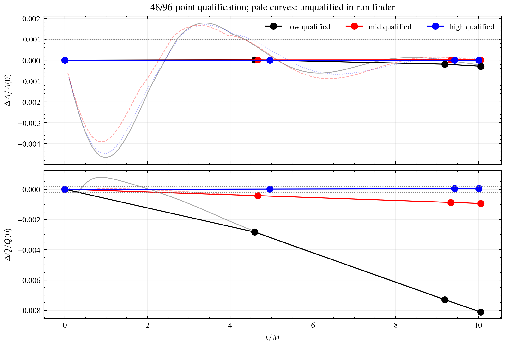

For unequal checkpoint times, [t7e-horizon-richardson.csv](t7e-horizon-richardson.csv) gives conditional linear interpolation of qualified A and Q to common 0, 4.5, 9 and 10 M. An alternative adds the nearby native-history trend to the qualified checkpoint value and records its discrepancy. Native shape lag makes area time correction particularly unreliable. Richardson uses p=log(|low-mid|/|mid-high|)/log(1.5) and extrapolates only for monotone triples with p>0. These are observable-difference fits, not constraint-RMS orders or a registered asymptotic proof.

| common t/M | observable | apparent p | extrapolated absolute value | relative-drift p | extrapolated relative drift | max absolute time-matching sensitivity |
| --- | --- | --- | --- | --- | --- | --- |
| 0.0 | A | 4.315823 | 3.836949e-01 | — | — | 0.000000e+00 |
| 0.0 | Q | 4.891288 | 1.048453e+00 | — | — | 0.000000e+00 |
| 4.5 | A | -0.806943 | p≤0 | -0.864343 | — | 1.882140e-04 |
| 4.5 | Q | 4.232892 | 1.048570e+00 | 4.232909 | 1.114746e-04 | 4.745713e-05 |
| 9.0 | A | 6.413040 | non-monotone | 6.421017 | — | 1.452447e-05 |
| 9.0 | Q | 4.856296 | 1.048646e+00 | 4.856296 | 1.835853e-04 | 6.647947e-07 |
| 10.0 | A | 7.208346 | non-monotone | 7.214993 | — | 6.008256e-06 |
| 10.0 | Q | 4.903729 | 1.048664e+00 | 4.903729 | 2.015876e-04 | 1.536017e-07 |

At 10 M, the conditional charge fit gives p=4.903729 and ΔQ/Q(0)=2.015876e-4 in the extrapolation, marginally above the charge budget; high's own measured drift is below it. This extrapolation should not be treated as a certified continuum limit. Late area triples are non-monotone and have no Richardson extrapolation.

### t=0 Hamiltonian floor: operation localization


[t7e-coordinate-errors.csv](t7e-coordinate-errors.csv) enumerates **all** uncovered cells of the four masks and compares the ordinary global-coordinate expression `(i+0.5)*h-224` with correctly rounded fused evaluation. Low's dyadic spacings give exactly zero difference. Mid/high give coordinate RMS around 9.1e-15/8.2e-15 M and maxima 1.421085e-14/1.304512e-14 M. The error is in initial point coordinates; it is not a stored continuum Hamiltonian residual, an evolution damping target, a coordinate stretch, or a change to the evolution mesh.

The analytic diagnostic loads the checksum-identical exp-0019 E.trumpet through the actual C++ EMSTRUMPET reader, using its inversion, Clenshaw evaluation, and derivative-coefficient construction. It differentiates the reconstructed radial metric analytically and evaluates R-6k²-16πrho with the code's EMS normalization. It does not finite-difference a radial table, use the ODE to force the residual to zero, or substitute stored static targets for evolved data. The curvature identity is verified independently in [CAS evidence](../../scripts/cas/t7e-evidence.md); algebraic identity — production physics not certified. The profile SHA-256 is `2a8de074ae17c0b11d323d4b0933a6bdb7430a5305473c8cc7d4ce37f39fa793`, equal to the cluster input manifest.

The first three RMS columns below are the exact published cylindrical reductions. Continuum and Float64 columns are a deterministic checkpoint stencil census: stride 4 in each direction in bulk, every axis/interface/near-finer strip cell retained, with multiplicity weighting. They are sampled estimates, not replacements for the raw reductions. The entire far mask is evaluated without subsampling. Matching current same-level/parity ghosts and six-point coarse interpolation are reconstructed; covered coarse cells are removed. T4b's native arithmetic sensitivity audit is reused alongside a separate call to the actual constraint kernels. The continuum residual lies at its own Float64 term-cancellation scale, around 1e-15, many orders below the finite-difference residual.

| mask | raw Ham low / mid / high | p low→mid / mid→high | analytic Ham RMS low / mid / high | ε\|chi\|/h² low / mid / high | coordinate-sensitive Ham scale low / mid / high |
| --- | --- | --- | --- | --- | --- |
| inside_inner_ring | 1.188711e-06 / 5.042748e-07 / 5.753333e-07 | 2.115/-0.325 | 1.336420e-14 / 1.416664e-14 / 1.436183e-14 | 2.484438e-11 / 5.474880e-11 / 1.213506e-10 | 1.795600e-06 / 4.036771e-06 / 9.073465e-06 |
| cavity | 1.707379e-07 / 8.409682e-08 / 1.254153e-07 | 1.747/-0.986 | 3.368797e-15 / 3.451682e-15 / 3.401667e-15 | 9.620971e-12 / 2.032648e-11 / 4.392123e-11 | 3.394514e-07 / 6.967000e-07 / 1.477174e-06 |
| between_rings | 6.388805e-08 / 3.012457e-08 / 4.428398e-08 | 1.854/-0.950 | 1.293689e-15 / 1.321488e-15 / 1.304847e-15 | 3.770730e-12 / 7.958160e-12 / 1.719034e-11 | 1.207082e-07 / 2.469340e-07 / 5.226810e-07 |
| cavity_core | 1.160235e-07 / 4.455404e-08 / 7.810757e-08 | 2.360/-1.385 | 2.550072e-15 / 2.637159e-15 / 2.565984e-15 | 7.365660e-12 / 1.475835e-11 / 3.055180e-11 | 1.763948e-07 / 3.430264e-07 / 6.877361e-07 |

The last column is the conservative first-order scale (32/3) ε·224·|chi_r x/r|/h², using actual analytic jets and local spacing; 32/3 is twice the absolute fourth-order second-derivative stencil weight sum. It is a sensitivity scale, not an interval bound. The ε|chi|/h² column alone misses the loss of absolute precision from global centring. [t7e-checkpoint-localization.csv](t7e-checkpoint-localization.csv) retains spacings, level membership, counts, native-operation budget, setter replay differences and metric/Gamma terms. Setter-versus-checkpoint chi differences on ordinary coordinates are at Float64 precision. Metric Ricci at t=0 is far too small to account for the 1e-7 residual.

The decisive paired control evaluates **only chi** with fused initial coordinates, keeping all other t=0 checkpoint fields and the native constraint stencil unchanged. No current evolution field is modified. On the same bulk cells within each grid:

| mask | paired bulk cells low / mid / high | original Ham RMS | fused-coordinate chi Ham RMS |
| --- | --- | --- | --- |
| inside_inner_ring | 16 / 28 / 64 | 8.746958e-07 / 4.942882e-07 / 6.592316e-07 | 8.746816e-07 / 2.035766e-07 / 6.043965e-08 |
| cavity | 39 / 57 / 118 | 1.399267e-07 / 6.010307e-08 / 1.156811e-07 | 1.399237e-07 / 3.605663e-08 / 7.458041e-09 |
| between_rings | 86 / 128 / 274 | 5.329766e-08 / 2.134798e-08 / 3.996100e-08 | 5.329648e-08 / 1.293811e-08 / 2.724444e-09 |
| cavity_core | 7 / 10 / 24 | 1.173812e-07 / 3.210587e-08 / 5.827971e-08 | 1.173812e-07 / 3.109522e-08 / 3.739276e-09 |

High's reductions are factors 10.91, 15.51, 14.67 and 15.59 respectively. Low scarcely changes and remains dominated by genuine fourth-order truncation. This directly localizes the dominant finer-grid floor to coordinate evaluation feeding the initial chi values and then second-derivative stencils. Residual field-value/reader rounding and finite-resolution truncation remain; the sparse paired control is not a new all-mask convergence gate. The effect occurs in bulk, so it is not tied to a single patch or seam. The largest remaining analytic-data residual is negligible on these masks. The raw CSV additionally flags t=0 outer_ring Ham at 3.75/2.65; the blanket statement that every other mask passes is therefore not used.

### Evolved norms, matched times, and far-mask attribution

The published reduction is **legacy cylindrical RMS**: sqrt(sum y C²/sum y) on uncovered cells, with no h_level² factor. It is not T6's physical AMR-volume norm. The aggregate CSV has no level breakdown, so its full time history cannot be converted to a volume norm. The checkpoint replay supplies both legacy and correct volume norms separately; its far-mask evaluation includes every cell. Claims about the full time history below are explicitly conditional on the published legacy norm.

[t7e-constraint-rms.csv](t7e-constraint-rms.csv) retains all native-time RMS and maxima. [t7e-constraint-orders.csv](t7e-constraint-orders.csv) gives **all ten E masks**, all three constraints, and 24 requested times: every low/mid output through 9.625 M plus 10 M. Low/mid coincide to roundoff at their 0.4375 M cadence; high has a 0.486111 M cadence plus its special checkpoint output. All three coincide exactly at 0, 4.375 and 8.75 M. Other rows linearly interpolate RMS within each grid; bounds, fractions and endpoint counts are recorded. No extrapolation past a run endpoint is made. Alternative nearest-time and squared-RMS interpolation orders are also retained: transient rows sensitive to time pairing are not order qualifications. Orders are log(RMS_coarse/RMS_fine)/log(1.5), not self-convergence of evolved fields. High near-horizon apparent orders up to 14 indicate strong pre-asymptotic differences and should not be called established fourteenth-order convergence.

In the tables, `!` means at least one pair is below 3, and `N` means at least one pair is negative. The CSV retains flags at every output time. Times 0, 4.375 and 8.75 below are exact; 10 M is interpolated.

**Orders at t=0 M**


| mask | Ham low→mid / mid→high | Mom low→mid / mid→high | GaussE low→mid / mid→high |
| --- | --- | --- | --- |
| horizon | 3.995/3.589 | 4.005/4.006 | 4.017/4.008 |
| inside_inner_ring | 2.115/-0.325 N | 3.952/3.958 | 3.870/3.886 |
| cavity | 1.747/-0.986 N | 3.898/3.932 | 3.791/3.846 |
| cavity_core | 2.360/-1.385 N | 3.941/3.965 | 3.962/3.978 |
| between_rings | 1.854/-0.950 N | 3.909/3.940 | 3.788/3.847 |
| outer_ring | 3.749/2.655 ! | 3.568/3.701 | 3.556/3.696 |
| outer_ring_core | 3.897/3.329 | 3.829/3.914 | 3.866/3.932 |
| far | 3.745/3.502 | 3.716/3.799 | 3.719/3.801 |
| far_core | 3.874/3.547 | 3.882/3.910 | 3.896/3.914 |
| outer_boundary_shell | -1.923/-2.044 N | 3.971/3.370 | 3.964/3.152 |


**Orders at t=4.375 M**


| mask | Ham low→mid / mid→high | Mom low→mid / mid→high | GaussE low→mid / mid→high |
| --- | --- | --- | --- |
| horizon | 5.692/7.664 | 5.116/7.752 | 4.760/7.461 |
| inside_inner_ring | 8.153/8.942 | 7.920/11.743 | 7.780/11.997 |
| cavity | 7.979/4.451 | 10.097/4.373 | 13.066/7.239 |
| cavity_core | 3.967/4.160 | 4.354/4.330 | 4.652/4.908 |
| between_rings | 7.975/4.457 | 10.105/4.381 | 13.076/7.228 |
| outer_ring | 3.985/3.017 | 4.030/3.900 | 3.430/3.640 |
| outer_ring_core | 3.923/3.051 | 3.993/3.762 | 3.194/3.368 |
| far | 1.346/-1.278 N | 0.725/-1.228 N | 3.757/3.832 |
| far_core | 3.853/3.896 | 3.849/3.882 | 3.674/3.754 |
| outer_boundary_shell | -1.261/0.201 N | 2.313/0.671 ! | 0.318/-0.014 N |


**Orders at t=8.75 M**


| mask | Ham low→mid / mid→high | Mom low→mid / mid→high | GaussE low→mid / mid→high |
| --- | --- | --- | --- |
| horizon | 5.092/7.582 | 5.039/7.888 | 4.742/7.615 |
| inside_inner_ring | 6.503/9.258 | 5.965/9.698 | 5.455/9.684 |
| cavity | 7.779/10.828 | 7.836/11.290 | 7.679/11.282 |
| cavity_core | 10.768/7.975 | 10.945/9.576 | 10.899/14.380 |
| between_rings | 7.790/10.835 | 7.847/11.298 | 7.690/11.290 |
| outer_ring | 4.227/4.192 | 4.184/3.326 | 4.647/4.190 |
| outer_ring_core | 4.046/5.520 | 4.379/3.251 | 6.331/3.787 |
| far | 1.633/-0.213 N | 1.632/-0.276 N | 3.791/3.865 |
| far_core | 0.921/-0.467 N | 0.563/-0.451 N | 3.693/3.789 |
| outer_boundary_shell | 0.136/-0.008 N | -1.673/-0.112 N | 0.308/-0.026 N |


**Orders at t=10 M**


| mask | Ham low→mid / mid→high | Mom low→mid / mid→high | GaussE low→mid / mid→high |
| --- | --- | --- | --- |
| horizon | 4.666/7.487 | 4.986/7.883 | 4.739/7.547 |
| inside_inner_ring | 5.876/9.600 | 5.912/8.551 | 5.470/8.201 |
| cavity | 7.523/11.029 | 6.794/10.457 | 6.462/10.470 |
| cavity_core | 9.096/11.014 | 9.424/12.065 | 9.298/13.729 |
| between_rings | 7.534/11.036 | 6.805/10.465 | 6.473/10.478 |
| outer_ring | 4.704/4.932 | 4.106/3.692 | 4.936/4.385 |
| outer_ring_core | 5.218/5.567 | 4.353/3.730 | 5.407/6.149 |
| far | 4.340/3.429 | 4.209/1.855 ! | 3.830/3.886 |
| far_core | 2.939/3.370 ! | 2.991/3.039 ! | 3.691/3.788 |
| outer_boundary_shell | 0.008/0.003 ! | -0.305/-0.299 N | 0.273/-0.026 N |


Exact common-time RMS triples are retained below for the questioned far rows.


| t/M | constraint | low RMS | mid RMS | high RMS |
| --- | --- | --- | --- | --- |
| 4.375 | Ham | 7.816224e-10 | 4.527980e-10 | 7.600904e-10 |
| 4.375 | Mom | 5.161061e-10 | 3.846149e-10 | 6.329223e-10 |
| 4.375 | GaussE | 8.992573e-11 | 1.960207e-11 | 4.144853e-12 |
| 8.75 | Ham | 9.086641e-10 | 4.687382e-10 | 5.110895e-10 |
| 8.75 | Mom | 7.283631e-10 | 3.757852e-10 | 4.203061e-10 |
| 8.75 | GaussE | 6.836151e-11 | 1.469866e-11 | 3.066508e-12 |

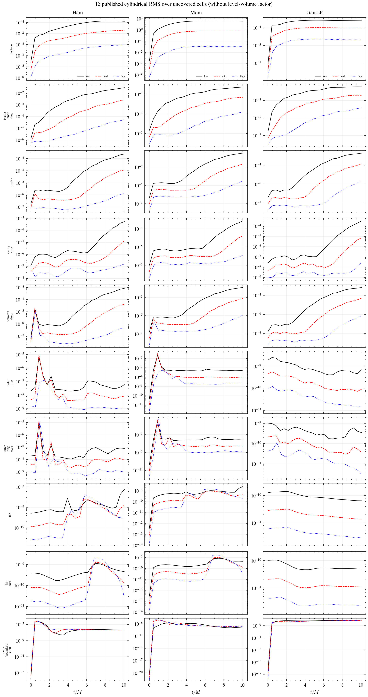

**Measured:** far Ham stays small and convergent through roughly 3.4 M, then changes sharply at 3.888889/3.9375 M on high/mid. High grows from 3.808841e-11 at 1.944444 M to 4.146612e-9 at 5.833333 M and falls to 3.053811e-10 at 10.013889 M. Mid's large pulse reaches 2.522357e-9 at 5.6875 M. A constant continuum-data or instantaneous derivative-roundoff floor does not describe that history. Far GaussE continues to converge near fourth order.

Far cells lie on uncovered levels 3 and 4. The actual level-4 square faces are ±5.541666667 M and y=5.541666667 M on mid, ±5.444444444 M and y=5.444444444 M on high. Their corners are at 7.837100158 and 7.699607 M. The inward parent/child interface (level-5 face) is at 2.770833333 M on mid and 2.722222222 M on high, with corners near 3.918550079/3.849803 M immediately inside the far mask. [t7e-layout.csv](t7e-layout.csv) records every actual union and same-level seam. These are square faces, not spherical radii; a radial shell can contain both levels. The geometry changes by block alignment between grids, so sharp transient norms also compare different physical face positions.

The full-cell checkpoint replay gives the following far subdivisions. An interface is the outer two-cell layer of the fine union; near-finer is the two coarse-cell layer outside the covered region; bulk excludes both and the two-cell cartoon-axis strip. No covered coarse cell enters the norm. Native-versus-sensitivity replay differences are much smaller than the observed far residual.

| grid | t/M | all Ham | bulk Ham | fine-face Ham | receiving-coarse Ham | instant Float64 Ham scale | volume Ham |
| --- | --- | --- | --- | --- | --- | --- | --- |
| mid | 4.66666667 | 3.334742e-10 | 3.422631e-10 | 1.139363e-10 | 1.537018e-10 | 1.771970e-11 | 2.571982e-10 |
| mid | 9.33333333 | 4.647515e-10 | 4.712104e-10 | 4.099646e-10 | 1.640521e-10 | 1.772026e-11 | 3.612787e-10 |
| mid | 10.06250000 | 1.284439e-09 | 1.302237e-09 | 4.718023e-10 | 1.498480e-09 | 1.772047e-11 | 1.018332e-09 |
| high | 4.95833333 | 3.582810e-10 | 3.655658e-10 | 2.621380e-11 | 2.353938e-11 | 3.910079e-11 | 2.655232e-10 |
| high | 9.43055556 | 3.248210e-10 | 3.247062e-10 | 3.855240e-10 | 1.648223e-10 | 3.910206e-11 | 2.428722e-10 |
| high | 10.01388889 | 3.053867e-10 | 3.028844e-10 | 2.783473e-10 | 4.824177e-10 | 3.910245e-11 | 2.400788e-10 |

At high 4.958333 M, bulk Ham is about 14 times the fine-face value. At 9.430556 M, the level-4 radial band around 6.44–6.56 M has Ham about 6.6e-10 and Mom about 5.7–6.2e-10, while a separate inner band near 4.06 M has Ham about 6.5e-10. Near 10 M that inner band persists at about 8.1e-10. These features are present in bulk cells, not solely in first ghost-reading cells. This is a real error in the current evolved state at these spacings, rather than just roundoff in printing the diagnostic. The instantaneous conservative Ham sensitivity is about 1.8e-11 on mid and 3.9e-11 on high; direct ε|chi|/h² is smaller still. Accumulated evolution roundoff is not bounded by this instantaneous estimate, so it is not excluded solely by the ratio.

A separate frozen nine-point-support control recomputes Gamma from the **current** metric before evaluating the same Ham kernel. It does not uniformly remove the residual and can increase it: at high 4.958333 M on sampled level-4 cells Ham changes from 5.114030e-10 to 3.290200e-9. At high 9.430556 M it changes from 3.401089e-10 to 2.855359e-10. This rules out assigning all of the observed signal to a removable stored-Gamma/instantaneous-evaluation floor. The control is recorded in [t7e-gamma-controls.csv](t7e-gamma-controls.csv); it is an algebraic frozen-state comparison and is never an evolution projection.

**Inferred:** the delayed onset, pulse-shaped growth/decay, and bulk bands are consistent with an outgoing constraint error and wake of the kind measured in T5/T6. The E data do not independently establish which E interface or which transfer/RHS operation emitted it. In particular, an error now in level-4 bulk may have been emitted at the inner level-5 face; its location at a later time does not identify its source. The four saved E times cannot isolate stage-time filling, restriction or KO. A claim that the E floor is proven to be the T6 face source is therefore withheld. The outer domain boundary is about 224 M from the puncture, far outside the 4–8 M mask; an outer-boundary packet cannot traverse that separation by 10 M at the light/gauge speeds in this run. The separately nonconvergent outer_boundary_shell is reported and flagged, not confused with the far wake.

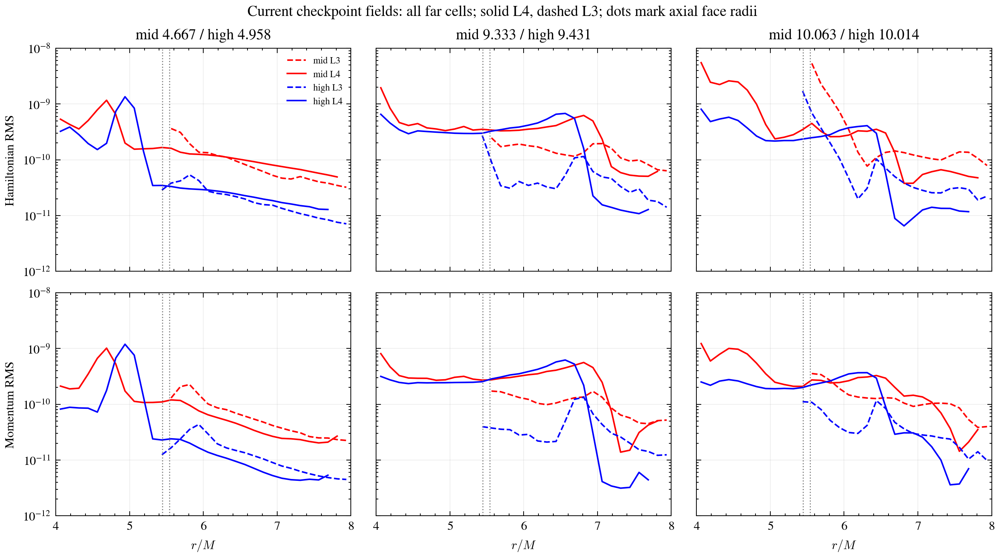

### Artifacts, checks, and load

[t7e-analysis-performance.csv](t7e-analysis-performance.csv) records the checkpoint replay. Peak parent RSS was 1,207,238,656 bytes, with one analysis thread; the largest high finder peak was 974,831,616 bytes per process. At most two two-thread finds ran concurrently. Builds used one compiler process; Python/BLAS and replay used one thread. The analysis stayed below four threads and 6 GB RAM. Each frozen find was capped at 115 solver seconds/120 process seconds; the slowest completed in 108.220 s. Large stencil scratch files were deleted immediately after use; final CSVs and figures are small. No simulation was evolved or monitored, and T7 A remains under the controller's existing run ledger.

Reproduction (installed local environment; every command is bounded analysis):

```sh
OPENBLAS_NUM_THREADS=1 OMP_NUM_THREADS=1 /Users/auroradysis/miniconda3/bin/python Tests/EMSNative/t7e-localize.py build
OPENBLAS_NUM_THREADS=1 OMP_NUM_THREADS=1 /Users/auroradysis/miniconda3/bin/python Tests/EMSNative/t7e-localize.py layout
# For each supplied checkpoint: current-state replay; static evaluation occurs only if its time is exactly zero.
OPENBLAS_NUM_THREADS=1 OMP_NUM_THREADS=1 /Users/auroradysis/miniconda3/bin/python Tests/EMSNative/t7e-localize.py high EMS_000103.2d.hdf5
# Each high checkpoint has separate 48/96 directories. Use a fresh OUT root for a deliberate repeat:
OPENBLAS_NUM_THREADS=1 OMP_NUM_THREADS=2 /Users/auroradysis/miniconda3/bin/python Tests/EMSNative/t7e-horizons.py EMS_000103.2d.hdf5 96
OPENBLAS_NUM_THREADS=1 OMP_NUM_THREADS=1 MPLCONFIGDIR=/private/tmp/ems-t7e/mpl /Users/auroradysis/miniconda3/bin/python Tests/EMSNative/t7e-analyze.py
OPENBLAS_NUM_THREADS=1 /Users/auroradysis/miniconda3/bin/python scripts/cas/t7e-initial-verify.py
OPENBLAS_NUM_THREADS=1 /Users/auroradysis/miniconda3/bin/python Tests/EMSNative/t7e-report.py
OPENBLAS_NUM_THREADS=1 OMP_NUM_THREADS=1 /Users/auroradysis/miniconda3/bin/python Tests/EMSNative/t7e-check.py
```

The qualification runner refuses an existing output directory; preserve cached results or set its OUT constant to a fresh output root before a deliberate repeat. Per-checkpoint scratch tables live in /private/tmp/ems-t7e/tables; consolidated deliverables are in this directory. [COMMIT-MANIFEST-T7-E.txt](COMMIT-MANIFEST-T7-E.txt) freezes this tranche, and [COMMIT-MANIFEST-T7.txt](COMMIT-MANIFEST-T7.txt) refreshes shared artifact hashes while retaining the old detached-run records without opening the running space directory.


## T8 — exp-0020 admission

**READY-EXCEPT: analysis complete; scientific admission FAIL.** This is an analysis of completed exp-0020, at worktree HEAD `da038609c41cef8193cd671f5f4af07b24d17079`. No simulation, remote transfer, evolution/C++ change or commit was made. The proposed continuation and alternative layout below were not launched. The acceptance criteria are those of the sealed [submit-contract.md §8](/Users/auroradysis/Workspace/EMS/state/threads/ems-spectral-solver/runs/exp-0020/submissions/exp-0020/submit-contract.md), including every fixed mask/time and the entire horizon interval. The contract does not specify a universal order≥3 threshold; `<3` flags below report measured low orders, while finite negative orders establish failure to decrease over the measured pair. Zero and roundoff cases retain undefined orders.

The read-only input root is `/Users/auroradysis/Workspace/EMS/.data/exp-0020`. All three physical chains end at 10.5 M, synchronized on all 13 levels: 48/72/108 coarse steps. `run.exit`, `evolution.exit`, `reduction.exit` are 0, and physical-chain, qualification and common-reduction markers are present. Each leg has 13 plots at 0, 0.875, …, 10.5 M, all 34 registered Float64 components. Every plot header, union and valid value was checked. The controller reports zero differences from `rclone check`, for 2.67/6.12/14.07 GB; that checksum result is recorded as controller provenance, not claimed as a second local rclone invocation. MPI32/OMP4 are read back in each run.log; sigma=1, point transfers, fixed hierarchy and post-t0 reader guard are in the sealed parameter files. Full pout streams contain no missing-variable/startup/NanCheck/MayDay failure, and no profile-reader message after the first logged coarse step (91 startup messages per leg). The positive-time guard remains enabled. Across all saved valid states, zero chi/lapse floor cells were found; minimum chi is 1.233120e-6 / 5.491514e-7 / 2.136207e-7 and minimum lapse 1.110459e-3 / 3.413461e-4 / 7.714410e-5. An absence of sampled floor cells does not measure unsaved stage projections.

All evolution diagnostics use current saved fields. Field time increments use consecutive **positive-time** snapshots; no static reader, t=0 field target or static-profile subtraction enters positive-time analysis. The horizon baseline is the independently re-found numerical t=0 horizon. The only initial-tail calculation below evaluates a boundary formula on the current t=0 plot, as an initial-data diagnostic.

### Acceptance and reduction check

| item | verdict | measured condition |
| --- | --- | --- |
| physical_completion_and_health | PASS | 3 legs at 10.5 M; exit 0; 39 complete plots; all current valid values finite; zero sampled floor cells |
| all_evolved_fields_self_convergence | FAIL | 220 negative post-t0 field/mask/time rows among 3696; genuine near-hole and transported errors; interpolation-limited rows reported separately |
| all_carried_constraints_tend_to_zero | FAIL | 220 post-t0 constraint/mask/time rows have a negative pair; outer boundary orders near zero; GaussB and Lambda exactly zero |
| finest_qualified_area_drift_common_ladder | PASS | max 5.249097e-7; angular drift sensitivity 7.231890e-9; stopping sensitivity estimate 2.233888e-6; budget 1e-3 |
| finest_qualified_charge_drift_common_ladder | PASS | max 4.931294e-5; angular drift sensitivity 9.941381e-9; stopping sensitivity estimate 5.444041e-10; budget 2e-4 |
| full_interval_horizon_and_inter_rung_uncertainty | PARTIAL | native area excursion -4.478462e-3 at 0.972222222 M, residual RMS 0.0358493, mode far; no saved state at this time; early area inter-rung differences below stopping sensitivity |
| MQ_required_reporting | PASS | 228 native time rows, 3 radii each; all finite; 12 positive common times per rung; no t0 MQ row |
| admission_and_100M_extension | FAIL | field/constraint gates fail; horizon entire-interval qualification incomplete; no extension launched |

The complete 37-field × 11-mask × 13-time table is [t8-field-orders.csv](t8-field-orders.csv): both raw self-differences, measured order, original floor/zero status and four-versus-six-node sampling spread are retained. This includes all 28 evolved fields and reconstructed/current constraints, not a chosen subset. [t8-field-order-summary.csv](t8-field-order-summary.csv) gives every field/mask range and undefined count. All 1716 direct constraint rows, including Theta, Lambda, Xi and Z1/Z2/Z, are retained in [t8-constraint-orders.csv](t8-constraint-orders.csv); [t8-constraint-summary.csv](t8-constraint-summary.csv) summarizes each of the 12 constraints. GaussB and Lambda RMS are exactly zero on every grid, mask and time. Other zero/roundoff rows have no claimed convergence order.

The coordinate-volume composite norm is sqrt(sum(2π y h_l² C²)/sum(2π y h_l²)) over uncovered cells. Constraint norms use each rung's fixed physical masks; field self-differences use identical low-rung uncovered physical centres and low-rung weights for both pairs. No temporal interpolation is used: all 13 times match exactly to 1e-10. The reduction's 1e-13 constraint floor rule is preserved. Every raw constraint value and both printed orders were checked against the per-leg files, not only the following two spot checks:

| time | mask / constraint | low / mid / high RMS | low→mid / mid→high | cells low / mid / high |
| --- | --- | --- | --- | --- |
| 10.5 | far / Ham | 5.553305e-08 / 3.555638e-09 / 4.015941e-10 | 6.778/5.379 | 24576 / 55296 / 124416 |
| 10.5 | outer_boundary_shell / Theta | 1.769651e-08 / 1.764686e-08 / 1.763104e-08 | 0.007/0.002 | 1532 / 4592 / 10332 |

These are counts of **post-t0** rows with at least one negative order, followed by low positive `<3` and undefined counts. There are 336 field rows and 144 constraint rows per mask (12 times). `≥3` is a descriptive bucket, not an extra acceptance requirement.

| mask | 28 fields: negative / low / undefined | 12 constraints: negative / low / undefined |
| --- | --- | --- |
| horizon | 20 / 37 / 48 | 0 / 0 / 24 |
| inside_inner_ring | 25 / 55 / 48 | 0 / 0 / 24 |
| cavity | 10 / 92 / 48 | 0 / 0 / 24 |
| between_rings | 3 / 125 / 49 | 0 / 11 / 24 |
| outer_ring | 24 / 67 / 72 | 12 / 38 / 24 |
| far | 9 / 17 / 72 | 29 / 20 / 24 |
| cavity_core | 32 / 76 / 48 | 0 / 1 / 24 |
| outer_ring_core | 22 / 71 / 51 | 13 / 35 / 24 |
| far_core | 4 / 7 / 72 | 20 / 12 / 24 |
| exterior_wake | 20 / 89 / 72 | 44 / 22 / 24 |
| outer_boundary_shell | 51 / 155 / 48 | 102 / 18 / 24 |

Some negative field orders are well above sampling uncertainty: horizon lapse at 5.25 M has D_LM=4.375636e-5, D_MH=9.446018e-5, p=-1.897922 and interpolation spread/D_small=1.598031e-6. Cavity-core Gamma1 at 8.75 M has 3.291094e-7 / 1.856178e-6, p=-4.266420 and spread fraction 4.866649e-7. These cannot be dismissed as interpolation floors. Other orders are not numerically qualified: far-core phi at 0.875 M has p=4.968989 but the registered sampling spread is 88.08 times the smaller self-difference. The complete tables keep these conditions alongside the apparent orders. Outer-boundary K at 1.75 M has p=-4.238190 and spread fraction 0.855, so its precise self-order is sampling-sensitive, while the independently reduced nonzero shell constraint floor is not.

Endpoint direct orders for every mask are below. Each entry is low→mid / mid→high; all earlier low/negative/undefined values remain in the linked table and the minima in t8-constraint-summary.csv. Large endpoint orders do not establish an asymptotic single-power error law.

| mask | Ham | Mom | GaussE | Theta |
| --- | --- | --- | --- | --- |
| horizon | 4.496/7.478 | 4.974/7.868 | 4.766/7.505 | 6.139/8.279 |
| inside_inner_ring | 5.773/9.333 | 5.994/8.342 | 5.518/7.909 | 6.810/9.899 |
| cavity | 7.180/10.286 | 6.788/10.560 | 6.617/10.510 | 8.566/9.417 |
| between_rings | 7.179/10.286 | 6.787/10.561 | 6.617/10.510 | 8.566/9.414 |
| outer_ring | 4.749/4.326 | 4.266/1.454 | 5.542/5.558 | 5.233/4.811 |
| far | 6.778/5.379 | 7.014/5.169 | 4.117/4.061 | 5.219/4.075 |
| cavity_core | 8.934/10.992 | 8.378/12.589 | 8.190/12.956 | 9.142/7.699 |
| outer_ring_core | 4.968/5.843 | 4.616/2.343 | 5.231/4.306 | 5.046/4.117 |
| far_core | 1.287/-0.409 | 1.340/-0.460 | 4.082/4.056 | 3.942/3.770 |
| exterior_wake | 5.359/6.907 | 5.877/6.809 | 4.203/4.071 | 5.834/5.936 |
| outer_boundary_shell | -0.027/0.005 | 0.043/-0.319 | 0.260/-0.026 | 0.007/0.002 |

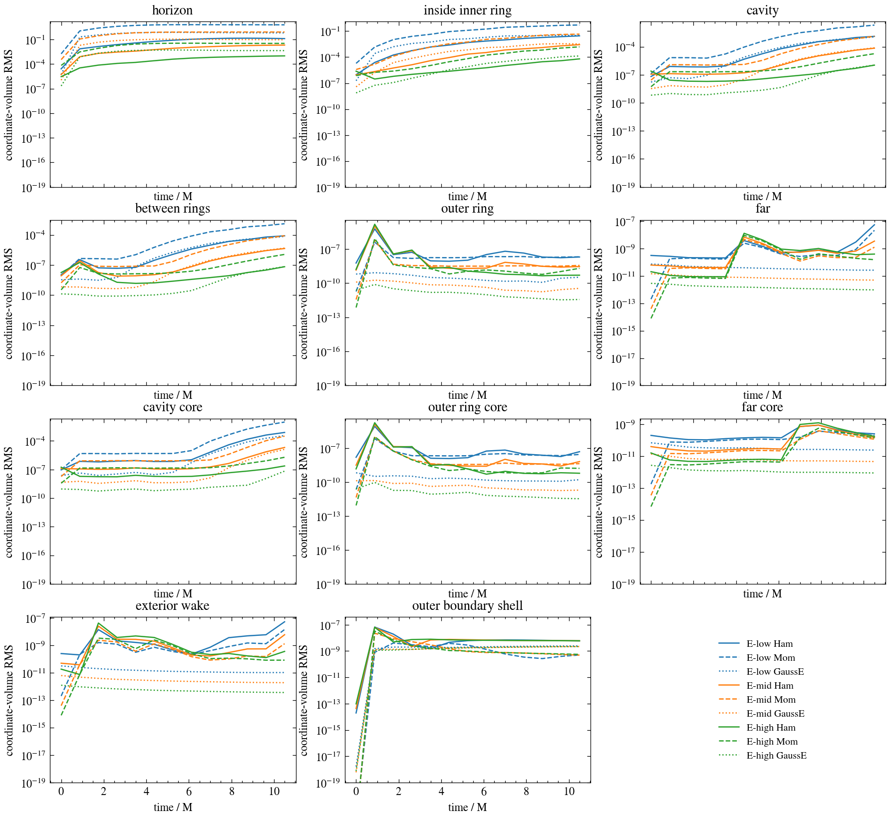

### Independent horizon qualification and MQ charge

All 78 common-ladder re-finds (13 times × 48/96 angles × 3 rungs) are FOUND at the frozen stage-2 threshold, with negative inward expansion. The reported finder `err` is mean squared expansion, so the actual RMS is sqrt(err)≤1e-6. Qualification preserves current evolved bits, seeds from the saved numerical shape and changes neither the author's finder nor evolution. [t8-qualified-horizons.csv](t8-qualified-horizons.csv) records all 39 N96 areas/charges/residuals and angular/stopping sensitivities; original N48/96 results remain read-only in exp-0020.

| rung | numerical A0 / Q0 | A(10.5) / Q(10.5) | max abs(ΔA/A0) | max abs(ΔQ/Q0) |
| --- | --- | --- | --- | --- |
| E-low | 0.383694979862 / 1.048453144558 | 0.383560256797 / 1.039519766407 | 3.511202e-04 | 8.520532e-03 |
| E-mid | 0.383694906807 / 1.048453070105 | 0.383701798998 / 1.047430782800 | 1.796269e-05 | 9.750435e-04 |
| E-high | 0.383694894111 / 1.048453059857 | 0.383695095516 / 1.048504762164 | 5.249097e-07 | 4.931294e-05 |

| rung | max angular drift sensitivity A / Q | max stopping drift estimate A / Q | native largest area candidate: time / relative drift |
| --- | --- | --- | --- |
| E-low | 2.187318e-07 / 1.524922e-06 | 2.235455e-06 / 1.051674e-07 | 1.09375 / -5.814081e-03 |
| E-mid | 2.416222e-08 / 1.812187e-07 | 2.233628e-06 / 6.705520e-09 | 1.02083333 / -5.186362e-03 |
| E-high | 7.231890e-09 / 9.941381e-09 | 2.233888e-06 / 5.444041e-10 | 0.972222222 / -4.478462e-03 |

Angular drift sensitivity is the difference between N48 and N96 **relative to each angular resolution's numerical t=0 value**. The stopping estimate sums the measured stage-1→stage-2 sensitivity at t and its baseline contribution; it is a conservative sensitivity estimator, not a rigorous residual-to-observable bound. Absolute N48−N96 high t=0 differences are 5.137015e-5 in area and 1.403682e-4 in charge, approximately 1.339e-4 relative; they largely cancel in drifts. Thus sampled drift-budget PASS does not certify absolute area/charge at the finest inter-rung separation. Early area drift differences are also smaller than the stopping sensitivity. No reliable absolute Richardson extrapolation is claimed under that uncertainty.

At E-high's largest native area excursion, t=0.972222222 M, A/A0−1=-4.478462e-3, mode=far and RMS expansion=0.03584930, over 35000 times the independent stopping threshold. Low/mid corresponding excursions have RMS 0.04693786 / 0.04154381. Qualified high area at adjacent saved times 0.875 / 1.75 M is -1.680757e-7 / -7.926128e-8. This supports a native tracking error, but the current fields at the intervening candidate times are unavailable locally; it does not independently qualify those times. Under the explicit §8 coverage rule, whole-interval area acceptance stays PARTIAL. The highest charge drift is well above extraction/stopping sensitivity and stays below its budget on the qualified ladder. Low/mid charge drift exceeds 2e-4; only the finest budget is a contract requirement.

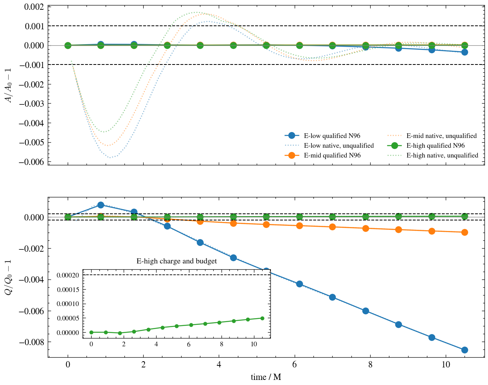

The sealed parameters enable MQ at centre (336,0,0), radii 20/50/100 M, 97 theta points and 64 phi points, with extraction level setting 0 on every rung; native RH tracking uses 96 points and RH_level=0 on every rung. The author's MQ histories have 48/72/108 positive-time rows, covering every coarse step and all 12 positive common-ladder times. There is no written MQ t=0 row, so first→last changes below use the first positive numerical row, not an invented t=0 value. Every value/time/rung is retained in [t8-mq-charge.csv](t8-mq-charge.csv). These are the native extraction values; no extra angular convergence of MQ is certified.

| rung | radius M | first / last Q | minimum / maximum Q | first→last relative change |
| --- | --- | --- | --- | --- |
| E-low | 20 | 1.0484062792 / 1.0484062706 | 1.0484062706 / 1.0484062792 | -8.202927e-09 |
| E-low | 50 | 1.0484062792 / 1.0484062791 | 1.0484062790 / 1.0484062792 | -9.538292e-11 |
| E-low | 100 | 1.0484062792 / 1.0484062792 | 1.0484062792 / 1.0484062792 | 0.000000e+00 |
| E-mid | 20 | 1.0484062792 / 1.0484062774 | 1.0484062774 / 1.0484062792 | -1.716892e-09 |
| E-mid | 50 | 1.0484062792 / 1.0484062792 | 1.0484062792 / 1.0484062792 | 0.000000e+00 |
| E-mid | 100 | 1.0484062792 / 1.0484062792 | 1.0484062792 / 1.0484062792 | 0.000000e+00 |
| E-high | 20 | 1.0484062792 / 1.0484062789 | 1.0484062789 / 1.0484062792 | -2.861487e-10 |
| E-high | 50 | 1.0484062792 / 1.0484062792 | 1.0484062792 / 1.0484062792 | 0.000000e+00 |
| E-high | 100 | 1.0484062792 / 1.0484062792 | 1.0484062792 / 1.0484062792 | 0.000000e+00 |

MQ charge near 1.0484062792 differs from N96 horizon charge at t=0 by about 4.69e-5, predominantly the finder's angular quadrature. This constant absolute extraction offset is not an electromagnetic evolution drift; comparison of each numerical baseline and the common-quadrature Gauss budget below separates it.

### Faces, incident identity and resolution

Every plot has the registered common rectangular unions [-R_l,R_l] × [0,R_l], R_l=112/2^l for l=1,…,12: 56, 28, 14, 7, 3.5, 1.75, 0.875, 0.4375, 0.21875, 0.109375, 0.0546875, 0.02734375 M. This removes exp-0019's unequal E rung faces. The actual box census remains in the sealed submission; unions were independently checked in all 39 plots. Tensor six/eight-node sampling uses valid current fields and parity at the exact axis; no boundary ghost values, coordinate stretch or reference state are substituted. Sampling is checked on smooth degree-four polynomials and odd-axis parity. All native fourth-order curvature candidates are preserved separately, including rejected/clipped ones.

The early outgoing ridge is identified in Gamma_n radial curvature and the shift. Independent peaks in fixed physical windows selected from the observed maps give axis speeds 0.9883 / 1.0027 / 0.9983, and corner speeds 1.00324 / 1.00328 / 1.00305 (low/mid/high). Axis fits have two pre-face samples; corner fits have three and phase RMS 0.006–0.011 M. These are phase fits, not exact crossing captures. Current-field longitudinal shift speeds are approximately 0.99995 at r≈2.64 and 0.99998 at r≈6.14. Local lapse speeds there are 0.836 and 1.072, and light/constraint speeds 0.532 and 0.741. **Inferred identity:** the early disturbance follows the longitudinal shift/Gamma family; its phase is inconsistent with a light-speed constraint mode over this path. It carries constraint error as well. Driver B has only rhs_B=-0.1 B in the actual ExperimentalGauge, and is distinct from magnetic Bx/By/Bz; its smooth local profile is not an independent outgoing B wave. K/lapse also show the later broader relaxation disturbance. A unique E packet-creation operation cannot be replayed from plots alone; the T7 stage experiment is prior evidence, not an E stage capture.

Measured early phase arrivals are approximately 1.7–1.75 / 2.48 M at the 1.75 M axial/corner face, 3.50 / 4.95 M at 3.5 M and 7.0 / 9.90 M at 7 M. Common snapshots bracket these, with at least ±0.4375 M temporal sampling uncertainty. All faces ≤7 M have been crossed by the early ridge at 10.5 M; faces ≥14 M have not. The later broad disturbance has crossed the 1.75 M face and the axial 3.5 M face by 10.5 M, but its corner crest at r≈4.48 M remains inside the 3.5 M diagonal intersection (4.94975 M); it has not reached the 7 M face. This later crossing contributes to the late far-mask error mixture. Arrivals and widths at faces ≤0.875 M occur before the first post-t0 plot and cannot be qualified from this cadence. The 1.75 M axial incoming sample sits on the upstream 0.875 M interface: its six/eight-node widths differ by 97–435%, so it is explicitly rejected. No spurious subcell width is used in the layout decision. [t8-face-arrivals.csv](t8-face-arrivals.csv) labels early unresolved extrapolations and un-crossed faces.

The following widths are half-prominence widths of the current Gamma_n curvature lobe, taken **before** the listed face. The full table includes peak radius, signed amplitude, P6/P8 phase and width spread, native off-axis/diagonal checks, fine/coarse spacing, characteristic speeds and current fields. Fine-cell count is twice the receiving-cell count. Curvature prominence is a shape measurement, not a field amplitude or a continuum jump. The corner row at 1.75 M uses the positive leading lobe; the later early-ridge rows use the negative lobe consistently across rungs.

| face / ray / branch | sample time | width M: low / mid / high | receiving cells: low / mid / high | P6/P8 width spread |
| --- | --- | --- | --- | --- |
| 1.75 / corner / EARLY_GAMMA_SHIFT | 1.75 | 0.02983 / 0.02198 / 0.01649 | 1.09 / 1.21 / 1.36 | 2.63% / 2.17% / 0.00% |
| 3.5 / axis / EARLY_GAMMA_SHIFT | 2.625 | 0.07562 / 0.05343 / 0.03826 | 1.38 / 1.47 / 1.57 | 3.24% / 1.31% / 0.44% |
| 3.5 / corner / EARLY_GAMMA_SHIFT | 4.375 | 0.07263 / 0.05043 / 0.03516 | 1.33 / 1.38 / 1.45 | 0.88% / 0.60% / 0.31% |
| 7 / axis / EARLY_GAMMA_SHIFT | 6.125 | 0.15075 / 0.12935 / 0.08871 | 1.38 / 1.77 / 1.82 | 3.46% / 0.93% / 1.02% |
| 7 / corner / EARLY_GAMMA_SHIFT | 8.75 | 0.11854 / 0.10340 / 0.07458 | 1.08 / 1.42 / 1.53 | 1.00% / 0.09% / 0.23% |
| 3.5 / axis / LATE_BROAD | 8.75 | 0.51126 / 0.50825 / 0.52720 | 9.35 / 13.94 / 21.69 | 0.03% / 0.01% / 0.00% |
| 3.5 / corner / LATE_BROAD | 10.5 | 0.49315 / 0.44458 / 0.45275 | 9.02 / 12.19 / 18.63 | 0.00% / 0.00% / 0.00% |

At 3.5 M axial and corner, width ratios mid/low and high/mid are 0.707/0.716 and 0.694/0.697; at 7 M axial they are 0.858/0.686. Native widths corroborate the same thin lobes (e.g. 3.5 M axial 0.08027 / 0.05587 / 0.03841 M versus P6 0.07562 / 0.05343 / 0.03826). All qualified early rows have fewer than 2 receiving cells, versus the proposed ~4-cell minimum. Refinement sharpens this ridge; a resolved, fixed physical incident width is **not established**. The late broad wave's physical width is approximately constant, with 9–22 receiving cells on the 3.5 M axial face. Its prominence basin is partly truncated by the local window/face, so these are local-lobe widths, not a complete global pulse support. The distinction prevents applying T7 reference's spatial lever to every E transient without a new contrast.

At t=2.625 M before 3.5 M on the axis, detrended current Gamma_n amplitudes are 1.320568e-7 / 2.859095e-7 / 6.261624e-7 (P6/P8 spread 3.23e-10 / 4.72e-10 / 6.05e-10); Theta amplitudes are 8.673986e-12 / 1.316192e-11 / 1.570896e-11, and Ham 1.623432e-9 / 2.586473e-9 / 2.320506e-9. In the same lobe, smooth lapse and K spatial background dominates their raw ranges. The local affine-background amplitudes, raw ranges and interpolation uncertainty for lapse/K/Theta/shift/Gamma/driver-B/chi/EMS fields are all in [t8-pulse-field-amplitudes.csv](t8-pulse-field-amplitudes.csv); this background uses the same snapshot's endpoints, never a static target.

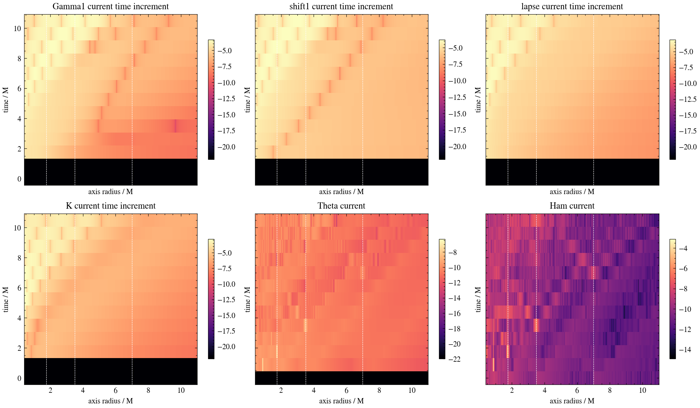

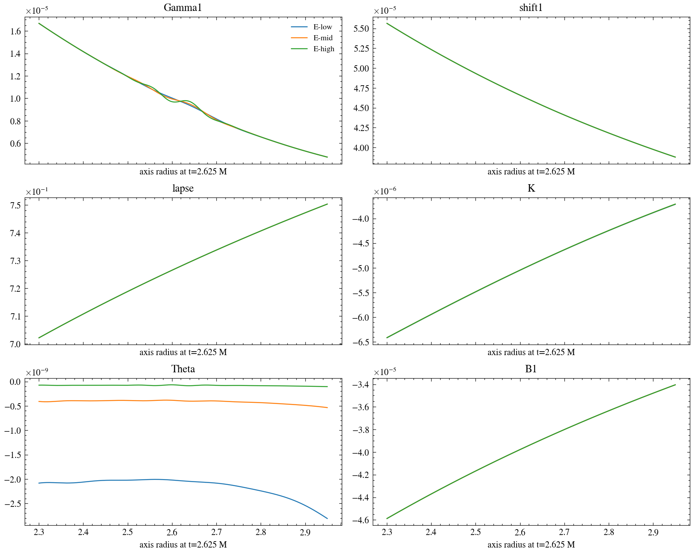

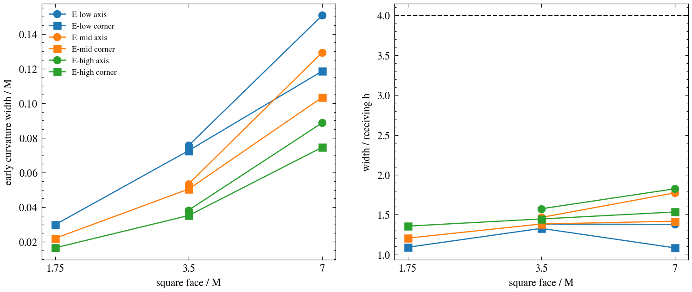

The negative Ham/Mom orders coincide with pulse/interface passage: exterior_wake at 1.75 M has -1.452/-1.266 and -0.979/-0.846; far at 4.375 M has -1.480/-1.557 and -1.578/-1.672; far_core at 7 M has -0.033/-0.721 and 0.813/-0.514. At 10.5 M, far Ham/Mom become 6.778/5.379 and 7.014/5.169, but far_core remains 1.287/-0.409 and 1.340/-0.460. These positive bulk far orders do not establish that every exterior error has disappeared.

The current native-cell localization is in [t8-interface-localization.csv](t8-interface-localization.csv). At 4.375 M E-high's far Ham maximum is 8.073454e-7 on level 5 at (-2.55816,3.49392), beside the 3.5 M face; at 7 M it is 1.473430e-8 on level 4 at (0.01215,6.98785), beside the 7 M face. At 10.5 M low/mid far error is dominated by levels 4/5 and the later 3.5 M disturbance; the common physical 3.5 M collar contains 47.0% / 38.9% / 3.31% of far Ham squared error. Thus even the late large far orders reflect a changing mixture of errors, not a clean uniform wake exponent.

At the same endpoint, E-high far_core has 99.9% of Ham squared error on level 4 and only 0.09% in the 7 M collar; its peak is 2.303622e-9 at (-5.578125,5.578125), r≈7.889 M, in the diagonal interior. Mid peaks at (5.596354,5.596354). This is a spatial packet, not the level-7 face/roundoff floor: even a conservative Float64 second-derivative scale 16 ε/h4²≈6.0e-12 on high is hundreds of times smaller. Late interface scattering/reflection is consistent with prior T7 evidence, but its precise E emission point/operation is **unresolved** by the 0.875 M snapshots. No speed or source attribution is forced onto that diagonal packet.

### Outer-boundary shell

The three outer faces x=±336 M and y=336 M are Sommerfeld (type 1); y=0 is reflective (type 2), with the supplied parity. Asymptotic values are one for chi,h11,h22,hww,lapse and zero for every other evolved variable. [BoundaryConditions.cpp](../../Source/GRChomboCore/BoundaryConditions.cpp) `fill_sommerfeld_cell` imposes -x^i/r ∂_i u+(u_infinity-u)/r for every component, with unit coordinate speed and second-order derivative stencils. It has no separate constraint/gauge characteristic treatment and assumes a 1/r radiative tail for every variable. The actual gauge's lapse characteristic approaches sqrt(1.8), not one.

**Measured:** initial outer-shell Ham RMS is 1.9540e-14 / 4.2422e-14 / 9.5803e-14, Mom around 1e-22, GaussE around 1e-18 and Theta exactly zero. At 10.5 M high Ham/Mom/GaussE/Theta are 6.010383e-9 / 5.609613e-10 / 2.223589e-9 / 1.763104e-8, with endpoint orders -0.0265/0.0050, 0.0430/-0.3193, 0.2604/-0.0264 and 0.00693/0.00221. This is a continuum-size boundary-fed error relative to the measured spatial sequence; it does not tend to zero. It rises rapidly from t=0 and remains nonzero, though the travelling crest decreases after its initial peak rather than growing exponentially.

Current t=0 valid interior tails already give a nonzero Sommerfeld RHS: high RMS 5.803786e-8 for chi, 1.969152e-8 for lapse, and approximately 1e-11 for shift. This is a consistency indicator in a 4–5-cell interior band, not a replay of the first boundary-ghost RHS or a comparison with a static solution at positive time. The source reader compactifies all positive radii to 0<s<1 and has no finite-radius cutoff at 336 M; initial constraint residuals at the boundary are also tiny. Thus literal data-file truncation at 336 M does not explain the observed growing constraint shell.

On six common face-normal rays, the independently selected high Ham crests travel inward at 0.986–1.000 M/M, with phase-fit RMS≤0.046 M. On x=336,y=84 the Ham crest reaches depth 10.375 M at t=10.5, peak 2.920468e-8; Theta's 10%-amplitude extent reaches 10.75 M and its boundary-region amplitude remains about 2.19e-8. High consecutive-positive-time lapse increments have a 10% leading-extent speed 1.352 M/M, compatible with the faster lapse family plus threshold/dispersion uncertainty; their switching peak is not used as a characteristic-speed measurement. All threshold, six/eight-node and ray sensitivities remain in [t8-boundary-features.csv](t8-boundary-features.csv) and [t8-boundary-speeds.csv](t8-boundary-speeds.csv).

**Inferred cause:** the non-characteristic Sommerfeld/tail prescription continuously excites an incoming constraint/gauge response. The early onset at the outer faces, nearly resolution-independent shell, nonzero initial tail forcing and inward crests support this. It cannot be a return of the hole's outgoing transient at 10.5 M: that front is still within approximately 11 M, hundreds of M away. A unique separation of BC-tail mismatch from BC derivative order would require a boundary-specific control, which this read-only analysis does not provide.

For a 100 M run, a conditional fastest far-field gauge speed sqrt(1.8) gives travel times at least ≈250 M to the hole and ≈236 / 213 / 176 M to the nearest points of MQ spheres 20/50/100 M. Measured extents at 10.5 M are consistent with that separation. Direct causal contamination of hole/MQ by this outer signal before 100 M is therefore not expected under the current measured characteristic families. Nonetheless the outer mask already fails the **domain-wide** acceptance contract; causal distance is not permission to omit that mask or call the whole run convergent.

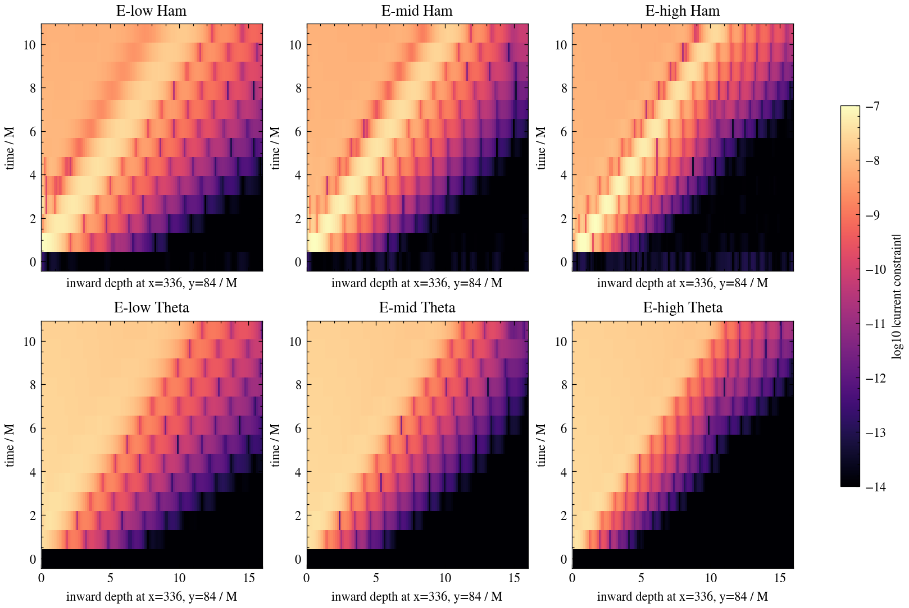

### Charge rate, Gauss budget and the 100 M policy

The endpoint-average relative charge rates are -8.114792e-4 / -9.286128e-5 / +4.696471e-6 per M. Linear fits over all 13 times give -9.249606e-4 / -1.036468e-4 / +5.233154e-6; fits over 1.75–10.5 M give -1.006890e-3 / -1.086599e-4 / +5.828814e-6, with fit RMS 9.04e-5 / 3.30e-5 / 1.30e-6 in relative charge. High is monotone over the late interval; its small early variation is retained. The rate reversal mid→high is real relative to extraction uncertainty, but three rungs cannot distinguish a converging multi-term error from a positive resolution-independent limit. A single-power three-rate fit has apparent p≈5.080 and nonzero intercept +2.255329e-5/M; this is a fitted model, not evidence that the continuum drift has that value. Taking log of the signed drift ratios is undefined and is not used.

The T7 B current-field Maxwell identity is reused with unchanged normalization: D^i=sqrt(gamma) F gamma^ij E_j, GaussE=F C_E, and Q_out−Q_H=(1/sqrt(2π)) integral sqrt(gamma) GaussE d³x. F is not multiplied a second time. Local plots already contain the full current state and GaussE, so the E-high remote checkpoint was **not pulled or needed for this signed shell check**. The re-found numerical horizon and r=0.02 M sphere both lie within level 12's 0.02734375 M common face, with no refinement interface in the shell. Six/eight-node sampling and 96×64 / 192×128 Gauss quadrature provide sensitivity checks. Both fluxes use the same converged quadrature, removing the finder's N96 constant angular offset.

| rung | Q(0.02)−Q(H) | signed Gauss volume | volume−flux gap | local finest h M |
| --- | --- | --- | --- | --- |
| E-low | 9.517485e-03 | 9.520352e-03 | 2.866979e-06 | 2.136230e-04 |
| E-mid | 1.020522e-03 | 1.020389e-03 | -1.323681e-07 | 1.424154e-04 |
| E-high | -5.108032e-05 | -5.108176e-05 | -1.440812e-09 | 9.494358e-05 |

High's volume matches its negative flux gap to 1.44e-9, or 0.0028%; the positive horizon drift is accompanied by a negative near-horizon Gauss budget, not a finder-angular/stopping floor. Low/mid signs and gap sizes remain consistent with T7 B's constraint/flux deficits. This is a frozen-state signed inventory, not an integral of the moving-horizon charge rate and not a native/cleaner/KO tendency decomposition for exp-0020. T7 B showed competing native, cleaning and KO sources rather than a common single KO source. The local high plot suffices for this inventory; a checkpoint/current-RHS replay would be needed to extend that source split. A fourth rung (h0=7/27 M with the same physical faces) is still needed to decide resolution-independent versus sign-changing converging rate; the existing three-grid data cannot decide that asymptotic question.

If the measured late slope simply persists, high charge drift at 25.375 / 49.875 / 100.625 M would be +1.360166e-4 / +2.788225e-4 / +5.746348e-4, anchored at its measured 10.5 M drift. [t8-charge-rate-projections.csv](t8-charge-rate-projections.csv) retains both projection conventions at all endpoints; [t8-charge-rate-model.csv](t8-charge-rate-model.csv) records the conditional three-rate fit. This conditional linear projection breaches 2e-4 around 36.4 M; endpoint-average extrapolation instead gives ≈4.7e-4 at 100 M and a crossing around 42.6 M. Neither is a prediction. Improving outer receiving resolution does not itself establish a fix for the near-horizon Gauss imbalance, whose shell contains no AMR face.

**Policy proposal, not admission:** retain the common faces and unchanged chain only for a separately authorized diagnostic continuation; the present contract fails and no 100 M production continuation is admitted. The original chain would cost the following additional wall hours from its completed 10.5 M state at the measured production median rate. Native rates are 256 (254–258) / 162 (161–164) / 104 (103–105) s per coarse step, rather than using the approximate smoke rates. Numbers exclude queue, new I/O and future-rate changes.

| endpoint M | additional steps: low / mid / high | additional median wall h: low / mid / high |
| --- | --- | --- |
| 25.375 | 68 / 102 / 153 | 4.84 / 4.59 / 4.42 |
| 49.875 | 180 / 270 / 405 | 12.80 / 12.15 / 11.70 |
| 100.625 | 412 / 618 / 927 | 29.30 / 27.81 / 26.78 |

For a **newly qualified spatial policy**, target four times the present receiving resolution at the demonstrated 1.75, 3.5 and 7 M transport faces; 2× would still leave the measured 3.5/7 M thin lobes below four receiving cells on most rays. One concrete common, block-aligned candidate retains h0 and levels 8–12, and enlarges unions of levels 1–7 by four in half-width: new R1…R7=224,112,56,28,14,7,3.5 M. The old 1.75/0.875 M transport interfaces disappear inside the enlarged level-7 union; the 3.5/7/14/28/56 M receiving spacings become 4× finer, with additional parent faces at 112/224 M. Fine innermost spacing and data/gauge/equations/transfer/sigma remain unchanged. All proposed faces lie on common block-aligned unions for the three rungs; this is a geometry/work census only, not executed code or an authorized regrid of the frozen chain. [t8-layout-proposal.csv](t8-layout-proposal.csv) specifies every level/rung.

Holding the **incident physical profile** fixed, receiving counts at 3.5 M would rise from 1.33–1.57 to 5.31–6.30, and at 7 M from 1.08–1.82 to 4.34–7.30. That premise is deliberately conditional: the early E width shrinks with h in the present global three-grid contrast. The new policy keeps the inner source resolution fixed and must show that it does not merely sharpen a new subcell pulse. Widths at future 14/28/56 M crossings have not been measured by 10.5 M and must be audited at subsequent endpoint collections.

The proposed union area increases 16× on levels 1–7. Its exact sum(cells_l 2^l) work ratio is 1.464691, an increase of 46.47% over exp-0020, with about 6× as many valid cells. This **work model is not a measured wall/memory rate**; MPI box utilization is demonstrably non-linear (the high rung's step is faster than low). A same-node step benchmark would price it. Scaling the observed E-mid 10.5 M evolution by this model gives about 4.76 h for a one-leg qualification contrast, only a planning estimate. Full 100 M pricing for the altered hierarchy cannot honestly be called measured without that benchmark. It belongs on the cluster, not this memory-limited local machine.

The cheapest policy test is one altered E-mid run to 10.5 M against the completed E-mid baseline, with the inner hierarchy unchanged, the above fixed common unions, point transfers and sigma=1; **not launched**. Capture exact incoming profiles and interface constraint packets frequently enough to resolve the 1.75/3.5/7 M crossings, including corners. Pass the spatial hypothesis only if the incoming physical width/amplitude remain within the registered interpolation/time-sampling uncertainty, receiving count is ≥4, and emitted/reflected packet and fixed-mask wake norms fall materially (a preregistered ≥4× reduction is a useful minimum for this 4× receiving contrast). Kill this policy if the incident width shrinks proportionally to the receiving h, the count stays below four, or the packet/wake reduction is absent. A positive one-leg contrast would select a policy; it would **not** replace three-grid admission. The horizon interval coverage, high charge's sign-changing rate, remaining inner/outer-ring negative field/constraint orders, far-core diagonal packet, unmeasured future faces and outer-shell boundary floor would still block the full convergence gate. T7/clock-2 establishes a ≤2% first-order temporal contribution in its reference contrast; that favors spending the next test on space, without treating temporal or finite-width qualification as already proved for E.

### Reproduction and evidence scope

[t8-analyze.py](t8-analyze.py) reuses the sealed read-only audit loader and existing compensated tensor sampler/Maxwell geometry; no dependency or generated evolution artifact was added. Run `tables`, `profiles E-low`, `profiles E-mid`, `profiles E-high`, `features`, `shell`, `localize`, `finish`, `check` with `/Users/auroradysis/miniconda3/bin/python`, `OPENBLAS_NUM_THREADS=1 OMP_NUM_THREADS=1 VECLIB_MAXIMUM_THREADS=1`, and `MPLCONFIGDIR=/private/tmp/ems-t8/mpl`. Cached current-ray arrays and outer rays are under `/private/tmp/ems-t8`; their hashes are retained in [COMMIT-MANIFEST-T8.txt](COMMIT-MANIFEST-T8.txt). Profiles took 29.77/29.26/33.42 s and peak process RSS 1.02/1.24/2.22 GB, one thread each; at most two such processes overlapped. No operation approached the detached-run threshold. Nothing belonging to other tranches was deleted.

The runnable check verifies row counts, all saved finite/floor census, exact GaussB/Lambda zeros, and six/eight-node polynomial/parity sampling. The direct reduction checks cover all constraint rows. Figures were visually inspected. No C++ files differ from HEAD, so no new default-path bit-identity control is needed for this analysis-only tranche. `git diff --check` passes; no commit was made.

**Measured:** failed admission rows, numerical-horizon drifts/sensitivity, thin and broad profile widths, common unions, negative high Gauss shell inventory and near-unit inward boundary propagation. **Inferred:** early longitudinal shift/Gamma identity and BC-driven outer contamination; interface association is supported by locations and T7 prior controls. **Unresolved:** continuum width/source of the earliest thin E disturbance, the unique operation emitting the late diagonal packet, between-plot qualified area excursions, and whether the high charge-rate sign change approaches a nonzero limit. These limits prevent a scientific admission PASS and a validated 100 M layout claim.


## T9 — Continuum character of the early shift/Gamma front

**Read-only result: continuum regularity remains unresolved. The growing narrow feature is predominantly metric-consistent Gamma, not the conformal Gamma constraint. These three rungs do not certify a bounded limiting characteristic profile with a stable nonzero first-derivative jump.** No reduced exterior convergence order is justified by this analysis. The axial/equatorial t=1.75 M profiles overlap a refinement face; they cannot supply the requested clean single-level test. The clean t=2.625 M axial/equatorial and t=4.375 M profiles, together with the t=1.75 M diagonal, still establish the conclusions below.

The complete [consult-6-reply.md](../../../consult-6-reply.md) ruling was read before analysis. Only the existing exp-0020 current plot states at t=0, 0.875, 1.75, 2.625 and 4.375 M were read: five files per rung, from the controller's checksum-verified set of thirteen per rung. EMS remains read-only. No static data reader is used even at t=0; initial diagnostics use the saved numerical state. No evolution, gauge, Chombo operator, finder or C++ file changed, no simulation launched, and no commit was made.

### Profiles, characteristic projection and reconstruction qualification

Use the original coordinates x=X-336 M, y>=0, r in M. The axis, equator and diagonal have fixed normals (1,0), (0,1), (1,1)/sqrt(2); beta_n=n_i beta^i and Gamma_n=n_i Gamma^i are coordinate longitudinal components. All positive-time profiles share the resolution-independent interval [t-0.65,t+0.65] M and the same 0.0005 M sampling ladder. The initial interval is [0.0001,0.04] M. Compensated six/eight-node tensor Lagrange sampling uses current valid fields and parity at y=0. Complete dense signed states and derivatives are retained in /private/tmp/ems-t9, with hashes in the manifest (W derivatives above second order and derivatives of the frozen g coefficient are explicitly undefined); the small [signed-profile CSV](t9-signed-profiles.csv) retains dense samples near the front and coarser samples outside it. The [raw profile figures at 1.75](figures/t9-signed-profiles-1p75.png), [2.625](figures/t9-signed-profiles-2p625.png) and [4.375 M](figures/t9-signed-profiles-4p375.png) show signed current beta, Gamma and the outgoing projection, with P6/P8 shading.

For a conditional longitudinal gauge projection set p=partial_r beta_n, mu=0.75, b=beta_n, g=n_i h^ij n_j and c=sqrt(4 mu g/3). Freeze b and g at each independently selected current front. ExperimentalGauge gives beta_t=beta advection+mu Gamma-eta beta-B_drv and B_drv,t=-0.1 B_drv, with **no B_drv advection**. The normal highest-derivative terms of the author's Gamma equation are (4/3)g beta_n,rr. The reduced principal matrix and its projections are

```text
U=(p,Gamma_n,B_drv,n),   U_t=P U_r+forcing,
P=[[b,mu,-1],[4g/3,b,0],[0,0,0]].
W_out=Gamma_n-(c/mu) partial_r beta_n-c/[mu(c-b)] B_drv,n,
W_in =Gamma_n+(c/mu) partial_r beta_n-c/[mu(c+b)] B_drv,n.
v_out=c-b, v_in=-c-b; B_drv has zero principal speed.
```

This freezes metric/lapse/K/Theta principal perturbations and omits transverse/radial cartoon principal interactions from the planar block. In particular, the implemented -4 alpha h^ij K_,j/3+2 alpha h^ij Theta_,j and other geometry terms remain forcing; they are present in the evolution. These are **conditional projections, not full CCZ4 characteristic variables or a mode-purity proof**, and the planar approximation is not asserted near the puncture. Frozen coefficients come only from current fields, not a static target. P6/P8 use the same frozen coefficients. The conditional left-eigenvector identity is exactly proved in QQ[b,c,mu], with c,mu>0 and b!=+/-c, and independently checked at 32 points/60 digits to residual 3.111508e-61. [CAS evidence and assumptions](../../scripts/cas/t9-evidence.md) and [JSON witness](../../scripts/cas/t9-characteristic-verify.json) are retained.

At 2.625 M the outgoing fixed-window feature amplitudes are 5.689039e-7 / 7.981032e-7 / 1.256318e-6 on the axis, versus 2.336609e-8 / 2.388804e-8 / 2.500906e-8 for W_in. This favors outgoing longitudinal-shift content, within the conditional approximation. Current v_out=0.999946 / 0.999946 / 0.999946 M/M, consistent with the independently measured T8 propagation speed near one. Speed matching alone does not identify a shock.

Windows follow the already measured T8 early ridge; no characteristic-speed prediction selects a peak. One convention selects the largest absolute Gamma_n second-derivative feature in the fixed physical search interval [t-0.3,t+0.3], after a cubic fit to the **same current profile** on fixed sidebands 0.4<=|r-t|<=0.6 M. Its location is r_f and its width is the half-prominence width of that derivative lobe; this is not the entire multilobed packet width. All field amplitudes are measured in the same fixed |r-r_f|<=0.1 M interval, with the same sideband construction; each field's derivative-lobe width is recorded by the same rule. Raw signed profiles and raw J are never background-subtracted. Fits of degree 3/5/7 are retained in [background sensitivity](t9-background-sensitivity.csv). No fitted background enters the evolution. A dominant curvature lobe can switch within the multilobed packet, particularly on the diagonal, so its phase is not treated as a unique wave crest.

| t/M | ray | r_f low / mid / high | width/M low / mid / high | fine cells low / mid / high | max P6/P8 width spread |
| --- | --- | --- | --- | --- | --- |
| 1.75 | corner | 1.7280 / 1.7340 / 1.7385 | 0.022940 / 0.016758 / 0.012291 | 1.678 / 1.839 / 2.023 | 0.2592% |
| 2.625 | axis | 2.6390 / 2.6420 / 2.6395 | 0.059561 / 0.041472 / 0.029487 | 2.178 / 2.275 / 2.426 | 0.3798% |
| 2.625 | equator | 2.6395 / 2.6420 / 2.6395 | 0.059498 / 0.041432 / 0.029468 | 2.176 / 2.273 / 2.425 | 0.3772% |
| 2.625 | corner | 2.6430 / 2.6025 / 2.6085 | 0.035529 / 0.024079 / 0.017572 | 1.299 / 1.321 / 1.446 | 1.2024% |
| 4.375 | axis | 4.3695 / 4.3910 / 4.3900 | 0.119097 / 0.080124 / 0.054133 | 2.178 / 2.198 / 2.227 | 1.0612% |
| 4.375 | equator | 4.3695 / 4.3910 / 4.3900 | 0.119281 / 0.080004 / 0.054108 | 2.181 / 2.194 / 2.226 | 1.0422% |
| 4.375 | corner | 4.3890 / 4.3895 / 4.3480 | 0.055718 / 0.038734 / 0.025932 | 2.038 / 2.125 / 2.134 | 0.2687% |

The listed receiving counts are half the fine counts. At 2.625 M the dominant axial curvature lobe occupies only 1.089 / 1.138 / 1.213 receiving cells; the diagonal occupies 0.650 / 0.660 / 0.723. Its width has not saturated physically. The positive-time width increases as the feature propagates through coarser levels; on the diagonal it is 0.011973 / 0.008781 / 0.006487 M at 0.875 M, 0.022940 / 0.016758 / 0.012291 M at 1.75 M, and 0.055718 / 0.038734 / 0.025932 M at 4.375 M. This is not a measured narrowing in time at fixed resolution.

**Geometry exception:** axial/equatorial t=1.75 M fronts lie at the fixed level-6 face 1.75 M. P6/P8 change the apparent curvature-lobe width by as much as 674% / 679%, and the selected location by 0.029 M. Those widths are unqualified. The earliest 0.875 M axial/equatorial front likewise overlaps the level-7 face 0.875 M. Current same-parent profiles (level 5 at 1.75 M, level 6 at 0.875 M) are retained as sensitivity controls; these include covered/restricted current coarse cells, not a clean substitute for the finest uncovered state. The 1.75 M diagonal is clean over delta<=0.4. At 2.625 M the diagonal delta=0.2/0.4 integrals cross the child level-6 diagonal face sqrt(2)*1.75=2.474874 M; delta=0.1 does not. At 4.375 M axial rays lie on level 4 and the diagonal on level 5, clean over delta<=0.4. The full per-rung [sampling/geometry qualification](t9-sampling-qualification.csv), parent comparisons and every crossed level are retained.

The polynomial sampler and derivatives through third order reproduce design-degree polynomials with worst scaled Float64 residual 6.063298e-13. Native metric Gamma agrees with the sealed reducer's independent Z calculation to scaled 3.469447e-18. These check implementation; P6/P8 spread and the geometry exceptions qualify sampling, not continuum smoothness or accuracy of a two-cell wave.

### Signed derivative-jump test

For beta_n, Gamma_n and W_out, evaluate J_h over [r_f-delta,r_f+delta], with delta=0.1,0.2,0.4 M fixed across resolutions. Join the dense P6/P8 values with a C2 cubic reconstruction; its piecewise linear second derivative is integrated with each zero split, recording positive and negative lobe totals separately. Their sum equals the endpoint first-derivative difference. Local-polynomial endpoint derivatives and half-density C2 reconstruction are independent sensitivity columns. The C2 joining prevents stencil-switch discontinuities in a local Lagrange derivative from being silently omitted from the signed integral. It can also expose interpolation ringing in higher derivatives; such lobe totals are not asserted to be continuum distributions.

| ray | delta/M | field | low J | mid J | high J | max |P8-P6| | levels |
| --- | --- | --- | --- | --- | --- | --- | --- |
| axis | 0.1 | beta | 4.803762e-06 | 4.831502e-06 | 4.861109e-06 | 3.250976e-10 | 5 |
| axis | 0.1 | Gamma | 4.077016e-06 | 9.513846e-06 | -4.661527e-06 | 3.677166e-08 | 5 |
| axis | 0.1 | Wout | 1.282769e-05 | 2.342248e-05 | -3.953508e-06 | 5.266652e-07 | 5 |
| axis | 0.2 | beta | 9.515202e-06 | 9.491331e-06 | 9.510911e-06 | 8.523397e-11 | 5 |
| axis | 0.2 | Gamma | 9.108472e-06 | 1.046361e-05 | 1.002609e-05 | 1.061202e-08 | 5 |
| axis | 0.2 | Wout | 2.784328e-05 | 3.050164e-05 | 2.962967e-05 | 3.988060e-08 | 5 |
| axis | 0.4 | beta | 1.910447e-05 | 1.904490e-05 | 1.909500e-05 | 6.705102e-13 | 5 |
| axis | 0.4 | Gamma | 2.012792e-05 | 2.006875e-05 | 2.010743e-05 | 3.724453e-10 | 5 |
| axis | 0.4 | Wout | 5.982074e-05 | 5.965799e-05 | 5.977201e-05 | 4.593622e-10 | 5 |
| equator | 0.1 | beta | 4.802013e-06 | 4.831835e-06 | 4.860528e-06 | 3.205606e-10 | 5 |
| equator | 0.1 | Gamma | 4.091537e-06 | 9.505728e-06 | -4.683449e-06 | 3.653220e-08 | 5 |
| equator | 0.1 | Wout | 1.285053e-05 | 2.341421e-05 | -3.994926e-06 | 5.276262e-07 | 5 |
| equator | 0.2 | beta | 9.510369e-06 | 9.491441e-06 | 9.510966e-06 | 8.485915e-11 | 5 |
| equator | 0.2 | Gamma | 9.098503e-06 | 1.045665e-05 | 1.002654e-05 | 1.115576e-08 | 5 |
| equator | 0.2 | Wout | 2.781876e-05 | 3.048843e-05 | 2.963037e-05 | 4.041474e-08 | 5 |
| equator | 0.4 | beta | 1.909511e-05 | 1.904503e-05 | 1.909503e-05 | 3.120057e-13 | 5 |
| equator | 0.4 | Gamma | 2.011924e-05 | 2.006857e-05 | 2.010730e-05 | 3.121293e-10 | 5 |
| equator | 0.4 | Wout | 5.979494e-05 | 5.965736e-05 | 5.977174e-05 | 4.448877e-10 | 5 |
| corner | 0.1 | beta | 4.856731e-06 | 4.997842e-06 | 4.935809e-06 | 3.691597e-10 | 5 |
| corner | 0.1 | Gamma | 5.574357e-06 | 8.981320e-06 | 1.646187e-06 | 2.458095e-07 | 5 |
| corner | 0.1 | Wout | 1.601928e-05 | 2.288583e-05 | 8.195245e-06 | 6.106200e-07 | 5 |
| corner | 0.2 | beta | 9.476128e-06 | 9.864022e-06 | 9.809470e-06 | 1.510198e-09 | 5,6 |
| corner | 0.2 | Gamma | 1.158289e-05 | 1.170971e-05 | 9.591209e-06 | 1.307091e-08 | 5,6 |
| corner | 0.2 | Wout | 3.082373e-05 | 2.940704e-05 | 2.932249e-05 | 3.900927e-07 | 5,6 |
| corner | 0.4 | beta | 1.902641e-05 | 1.984131e-05 | 1.972031e-05 | 1.119768e-10 | 5,6 |
| corner | 0.4 | Gamma | 1.938514e-05 | 2.156067e-05 | 2.041935e-05 | 4.838559e-09 | 5,6 |
| corner | 0.4 | Wout | 5.901621e-05 | 6.219421e-05 | 6.108986e-05 | 7.486736e-08 | 5,6 |

Units: J_beta is M^-1; J_Gamma and J_W are M^-2. [All times, all rays, individual lobes, one-sided values/slopes and parent sensitivity](t9-jump-integrals.csv) and the [three-rung summary](t9-jump-summary.csv) contain the complete measurements. The integration/endpoint discrepancy is at roundoff: maximum on the 2.625 M axis is below 1.5e-17. At axial delta=0.1 the largest P6/P8 spread is 3.68e-8 for Gamma and 5.27e-7 for W_out; half-density changes W_out by as much as 1.08e-6, about 27% of the high value. Its small-window value is therefore reconstruction-sensitive, though the sign and three-rung instability persist. At delta=0.4 these W sensitivities fall to 4.59e-10 and 4.42e-12. No precision certificate is inferred from a small net difference of much larger signed lobes.

The shift J roughly doubles when delta doubles: on high, 4.861109e-6, 9.510911e-6, 1.909500e-5. These nonzero values are chiefly smooth curvature spread through the integration interval, not a delta-independent localized jump. At fixed delta=0.4 the three axial beta/Gamma/W integrals agree within about 0.32% and are finite and nonzero; this supports stable finite-window integrals, not a localized derivative jump. On axis, Gamma and W_out at delta=0.1 vary nonmonotonically and change sign on high. At delta=0.4 their net values look stable, but they are about twice the delta=0.2 values and are sensitive to the smooth interval contribution. For Gamma, positive/negative delta=0.4 integrals are +2.583688e-5/-5.708964e-6 (low), +4.362481e-5/-2.355606e-5 (mid), and +9.913193e-5/-7.902450e-5 (high), leaving net approximately 2.01e-5. A growing oscillatory lobe is not a stable derivative-jump certificate.

| rung | field | u_left | u_right | u_r,left | u_r,right | extrapolated [u_r] |
| --- | --- | --- | --- | --- | --- | --- |
| low | beta | 5.781163e-05 | 3.717010e-05 | -3.665693e-05 | -1.755246e-05 | 2.405240e-07 |
| mid | beta | 5.770156e-05 | 3.711729e-05 | -3.655338e-05 | -1.750849e-05 | 3.459914e-07 |
| high | beta | 5.779300e-05 | 3.716106e-05 | -3.663950e-05 | -1.754450e-05 | 3.182728e-07 |
| low | Gamma | 1.836858e-05 | 3.935751e-06 | -2.865840e-05 | -8.530481e-06 | -3.768647e-06 |
| mid | Gamma | 1.828221e-05 | 3.909488e-06 | -2.854600e-05 | -8.477250e-06 | -2.595213e-06 |
| high | Gamma | 1.835353e-05 | 3.930576e-06 | -2.862918e-05 | -8.521749e-06 | -1.044002e-06 |
| low | Wout | 1.302979e-04 | 7.104549e-05 | -1.061000e-04 | -4.627931e-05 | -7.302804e-06 |
| mid | Wout | 1.299794e-04 | 7.090536e-05 | -1.057777e-04 | -4.611973e-05 | -5.104199e-06 |
| high | Wout | 1.302439e-04 | 7.102050e-05 | -1.060257e-04 | -4.625368e-05 | -1.958990e-06 |

The endpoint values/slopes above are at r_f+/-0.4 M. The last column is the difference of first derivatives extrapolated to r_f with separate current-profile cubic fits on [r_f-delta,r_f-delta/2] and [r_f+delta/2,r_f+delta]. The corresponding extrapolated value jumps and every delta are in the CSV. On axis, beta's extrapolated derivative jump ranges from -2.72e-8 to +2.41e-7 on low, -1.32e-7 to +5.43e-7 on mid, and -1.51e-6 to +3.18e-7 on high as delta changes. Gamma and W extrapolations also change sign/size strongly with delta and rung. A stable nonzero continuum jump is **not established**; nor do these finite-resolution tests prove that every jump is zero.

The clean additional-time tests show the same distinction. At 1.75 M diagonal, delta=0.2 J_beta=1.935115e-5 / 1.924054e-5 / 1.915832e-5, J_Gamma=1.458561e-5 / 1.463713e-5 / 1.465190e-5, J_W=5.470169e-5 / 5.468521e-5 / 5.462814e-5; at delta=0.4 they approximately double. At 4.375 M axis, delta=0.2 J_Gamma=3.722269e-6 / 3.796578e-6 / 3.563717e-6 and J_W=9.072383e-6 / 9.221477e-6 / 8.746373e-6, again roughly doubling at delta=0.4. Small delta=0.1 values retain dispersion/rung dependence. The diagonal 4.375 M rows are also retained. None supplies a delta-insensitive weak-front certificate.

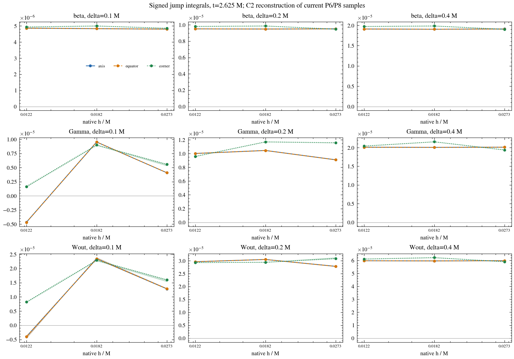

The [1.75 M](figures/t9-jumps-1p75.png) and [4.375 M](figures/t9-jumps-4p375.png) figures show the same test, including the explicitly unqualified axial early-face rows.

### Native conformal Gamma constraint and field bounds

Compute metric Gamma from the **current h_ij** with the native fourth-order cartoon derivatives, using the stored parity/patch ghosts, and the exact 2D-plus-ww contraction

```text
Gamma_metric^i = sum_jk h^jk Gamma^i_jk
              + [ (delta^i_y-h^iy hww)/y - (1/2) sum_j h^ij partial_j hww ] / hww,
C_Gamma^i = Gamma_evolved^i - Gamma_metric^i = 2 Z^i / chi.
```

The ww term and hww denominator are included, not approximated by -partial_j h^ij or omitted at the axis. The calculation uses the same numerical fields/ghosts as the reducer; exact-axis samples use parity, while the derivatives themselves are computed at native y=(j+1/2)h. Separate 2D and ww profiles are retained in the signed-profile CSV and dense cache. This is a numerical fourth-order metric derivative at a poorly resolved front; its agreement with evolved Gamma is evidence about content, not a continuum derivative theorem.

| ray | Gamma amplitude low / mid / high | C_Gamma amplitude low / mid / high | C_Gamma/Gamma feature RMS | minimum metric correlation |
| --- | --- | --- | --- | --- |
| axis | 2.589320e-07 / 3.727264e-07 / 6.016942e-07 | 4.266260e-09 / 6.434409e-09 / 1.019572e-08 | 1.820% / 2.003% / 2.042% | 0.999821 |
| equator | 2.602460e-07 / 3.734413e-07 / 6.025523e-07 | 4.256037e-09 / 6.373587e-09 / 1.020542e-08 | 1.752% / 2.002% / 2.046% | 0.999820 |
| corner | 5.011700e-07 / 6.831927e-07 / 1.315923e-06 | 1.792562e-08 / 3.029803e-08 / 4.051862e-08 | 4.266% / 5.152% / 3.675% | 0.998782 |

Amplitudes above use the same current-profile fixed-sideband cubic detrend and fixed delta=0.1 window. At the clean axial event, the evolved and metric Gamma feature correlations exceed 0.99982 and metric Gamma has approximately 98% of the evolved feature RMS. On the diagonal correlation exceeds 0.99878. The C_Gamma spike itself increases under refinement and must remain in the convergence battery, but it accounts for only about 2% axial and 4–5% diagonal feature RMS. It is **not the main growing feature**. A numerical AMR disturbance can be mostly metric-consistent, so this does not rule out numerical generation upstream.

Fixed-window amplitudes replace T8's moving, locally linear window: axial Gamma peaks are 2.589320e-7 / 3.727264e-7 / 6.016942e-7, with amplitude orders -0.898 / -1.181, and width orders 0.893 / 0.841. A_gamma*width is 1.542e-8 / 1.546e-8 / 1.774e-8, much closer to constant than T8's moving-window estimate, but this product is neither a signed derivative integral nor proof of a bounded field limit. Degree 5/7 sidebands change Gamma amplitudes by only a few percent. Shift detrended amplitude is much more sensitive to background degree: on high it is 3.48e-8 (degree 3), 2.01e-8 (5), 1.47e-8 (7). No shift-jump inference is made from that fitted amplitude.

| t/M | ray | beta p | Gamma p | W_out p | metric Gamma p | C_Gamma p |
| --- | --- | --- | --- | --- | --- | --- |
| 1.75 | corner | -0.244 | -1.039 | -1.038 | -1.047 | -0.333 |
| 2.625 | axis | -0.489 | -1.436 | -1.435 | -1.443 | -0.077 |
| 2.625 | equator | -0.543 | -1.435 | -1.435 | -1.443 | -0.229 |
| 2.625 | corner | -0.479 | -1.311 | -1.304 | -1.327 | -0.147 |
| 4.375 | axis | 0.320 | -1.017 | -1.018 | -0.915 | 1.111 |
| 4.375 | corner | -0.574 | -1.423 | -1.422 | -1.427 | 0.716 |

These self-orders use raw P6 fields on the **same unaligned physical interval [t-0.2,t+0.2]** on every rung; p=log(RMS_low_mid/RMS_mid_high)/log(1.5). [Differences and interpolation sensitivity](t9-profile-differences.csv) retain all three rays/times. On the 2.625 M axis, Gamma differences are 5.530179e-8 then 9.898252e-8; interpolation RMS is <=0.344% of the smaller difference. The negative order is not a P6/P8 ambiguity. The diagonal window at this time overlaps the child face; its C_Gamma self-order is interpolation-sensitive and is not a clean isolated-front order. The fixed delta=0.1 feature RMS comparison above avoids that face.

Every current sampled field is finite on every rung; large raw background values can keep the three maxima bounded even while a small spike grows. The full raw profiles are retained, and metric Gamma shares the growing spike. **Three finite maxima are not a bounded continuum-profile certificate.** Gamma/W and even some small shift differences grow between successive pairs, so this sequence has not demonstrated a Cauchy profile in the tested front norm. Growing peak amplitude with narrowing width could be pre-asymptotic transport error or a stronger singular limit; neither is proved with three rungs.

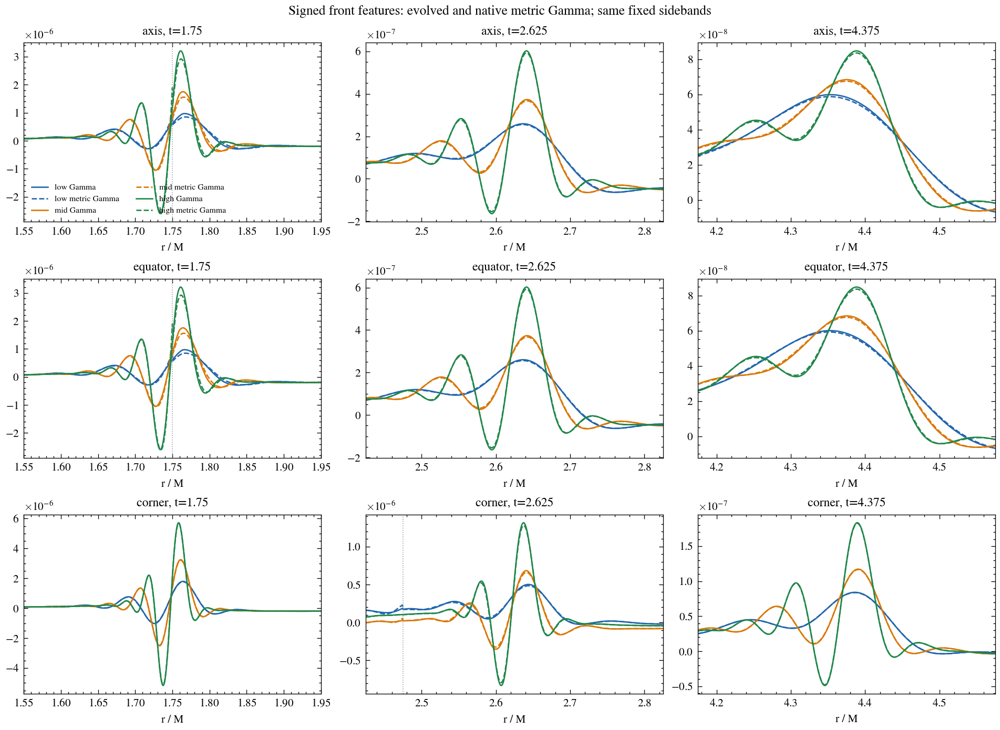

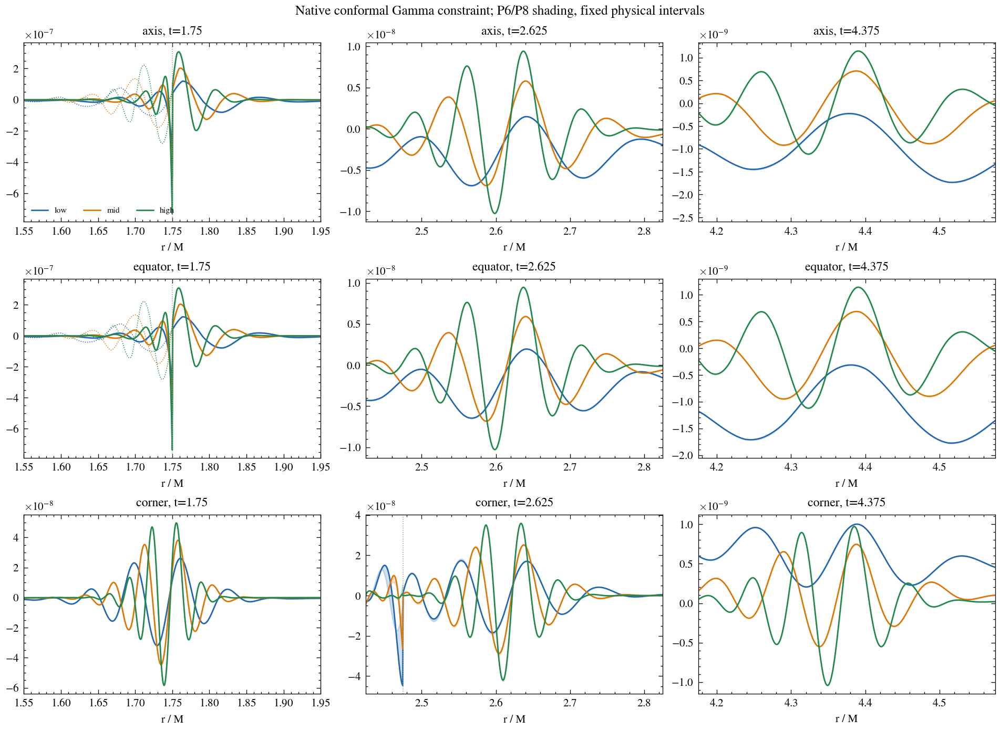

### Launch and four mechanisms

The saved initial state has Gamma amplitudes <=2.09e-12 on the axis and <=1.90e-12 on the diagonal over r=0.0001–0.04 M; C_Gamma is also at Float64 derivative roundoff. No outgoing Gamma jump is resolved there at t=0. Initial beta on the high axis at r=0.0001 / 0.0003 / 0.001 / 0.003 M is 3.633232e-5 / 1.075174e-4 / 3.343027e-4 / 7.737628e-4; beta_r is 0.361414 / 0.349859 / 0.296345 / 0.151519. All three rungs agree closely at fixed r and show a smooth throat-scale variation over the sampled interval. Initial B_drv=0.75 Gamma-beta is represented by the saved evolved driver, not reintroduced as a positive-time target. [Initial fixed-radius probes](t9-initial-probes.csv) and the complete [launch metrics](t9-launch.csv) retain P6/P8 sensitivity. The r=0 puncture is not a native cell centre; interpolation at r close to one finest cell cannot determine continuum differentiability at r=0.

By t=0.875 M the diagonal Gamma feature is clear in a single valid level, with current peak around 3.47e-5 / 4.69e-5 / 6.32e-5 and width 0.011973 / 0.008781 / 0.006487 M. Its C_Gamma feature is only about 3.2–3.8e-7. Thus the phenomenon exists by the first evolved output and is not merely a 3.5 M-face creation. It has already passed several inner refinement boundaries. The cadence **cannot determine** the launch time inside 0<t<0.875, whether a subcell puncture irregularity seeds it, whether it steepens before 0.875, or which inner interface/operation first contributes. The axial earliest rows additionally coincide with a face.

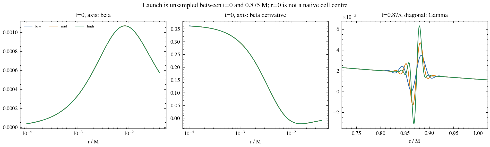

| Mechanism | Evidence for | Evidence against / unresolved requirement | Classification |
| --- | --- | --- | --- |
| Initial weak discontinuity | Early outgoing longitudinal content; width shrinks under refinement. | No stable localized J, no demonstrated Cauchy characteristic profile; t=0 sampled beta is smooth and Gamma at roundoff. Puncture r=0 and 0<t<0.875 are unresolved. | Not established; an unresolved initial singularity is not excluded. |
| Nonlinear steepening | Full gauge/geometry evolution is nonlinear; an event before the first snapshot is possible. | No resolved initially smooth pulse followed into a finite steepening time; measured physical width broadens after 0.875 as it travels through coarser levels. Speed near one is not a shock test. | Not established. |
| Smooth throat-scale pulse | Initial shift/derivative have a smooth measured physical scale; three-cell transport can be strongly pre-asymptotic. | Incident derivative-lobe width remains about 1–2.4 fine cells and does not saturate in physical units; Gamma/W field differences have genuine negative orders. | Plausible but no resolved limiting width. |
| Numerical Gamma/AMR artifact | Grid-width feature, multiple prior inner-face passages, oscillatory profiles, negative field self-orders and explicit face sensitivity at 0.875/1.75. | The clean growing front is mostly metric-consistent, so a **primarily C_Gamma reduction-constraint artifact is disfavored**. No source-fixed transport contrast or operator replay is in these data. | Numerical transport/source contamination remains plausible; location/operation unproved. |

**Causal statement:** measured: a predominantly metric-consistent outgoing shift/Gamma feature with grid-scale derivative lobes and nonconvergent front field differences. Inferred: severe transport under-resolution is a plausible contributor. Unresolved: the continuum regularity of the incident source and the initial/upstream operation creating it. There is no basis here to label it a demonstrated Gamma-driver shock, choose a universal p=1 or p=1.5 exterior regime, or authorize exp-0020 as a convergence-certified 100 M chain.

### Next experiment and artifacts

Proceed with the expert's **rank 2 source-fixed transport-resolution contrast**, before rank 3 initialization. Keep the inner source hierarchy/spacing and initial gauge data identical, and use one bounded short pair through approximately 4.5 M with improved receiving resolution or delayed receiving transitions before the 0.875/1.75/3.5 M faces. Register actual aligned unions; start with one doubling of transport resolution, not indefinite enlargement. Sample current native characteristic rays near the source on a <=0.001 M ladder through the first 0.1 M, then retain the same fixed-interval/J diagnostics before and after crossings. The small early ray output is needed because full coarse-step plots cannot resolve a throat-scale launch. No static-profile targets, reference-restoring evolution operations or gauge-law change is allowed; diagnostics compare current fields and resolutions.

Support transport resolution as an interface-error lever if the inner incident source profile is unchanged within interpolation uncertainty and the emitted constraint packet decreases. That alone does not establish continuum regularity: record raw Gamma/W profile changes, and require a stable physical width or a delta-insensitive finite jump with bounded limiting field profiles before a regularity-based admission. If width continues to track receiving h while Gamma grows and the field differences remain negative, kill the claim that wider transport regions alone certify continuum regularity; do not keep enlarging them without a source-regularity diagnosis. A pair by itself is not a new three-grid admission. If the fixed-source transport control does not resolve the issue, rank 3 tests **B_drv(t=0)=0 alone**, with every other initial datum and evolution unchanged, on a separate chain. Retain that initialization only if it reduces the measured outgoing disturbance without worsening near-hole constraints/horizon retention. Neither experiment was launched in T9.

[t9-analyze.py](t9-analyze.py) reuses the T8 sampler/audit imports and the sealed native derivative helper; the handwritten derivative weights have the exact/runtime checks above. Reproduce `profiles E-low`, `profiles E-mid`, `profiles E-high`, `measure`, `check`, `figures` with `/Users/auroradysis/miniconda3/bin/python`, `OPENBLAS_NUM_THREADS=1 OMP_NUM_THREADS=1 VECLIB_MAXIMUM_THREADS=1`, and `MPLCONFIGDIR=/private/tmp/ems-t9/mpl`. Every command took seconds (selected profiles approximately 3.4 / 4.7 / 7.3 s), peak process RSS <=0.78 GB; at most three one-thread profile processes overlapped. No detached analysis or simulation was needed. Public CSVs are small (largest signed-profile table approximately 8 MB); dense caches are approximately 135 MB and retained with hashes. No output from another tranche was deleted. [COMMIT-MANIFEST-T9.txt](COMMIT-MANIFEST-T9.txt) records public artifacts, the fixed input/source provenance and dense-cache hashes.


## T10 — exp-0022 source-fixed transport and launch contrast

**READY-EXCEPT: the requested read-only A1–A3/constraint analysis is complete. A2 passes on the clean diagonal. A3 is registered outcome (3) on all three rays at both times: width keeps decreasing with transport spacing, Gamma/characteristic amplitudes grow, and successive signed-profile differences increase. The registered receiving-shell errors increase. The earliest native launch has six axial and three diagonal centres, so a literal two-cell-from-birth claim is unsupported.** The separate T4/T8 horizon qualification remains incomplete after its N=96 timeout at 0.875 M; these results do not certify that qualification or complete collection of every planned plot's rays.

The full [consult-6b ruling](../../../consult-6b-reply.md) and exp-0022 contract sections 1, 4 and 8 were read. Inputs are the controller's SHA-256-verified `/Users/auroradysis/Workspace/EMS/.data/exp-0022`, the exp-0020 E-mid reference plot, and the sealed submission scripts. EMS is read-only. Every positive-time diagnostic uses current saved fields or compares numerical resolutions. No static data file, static target or analytic profile is read; no C++, gauge, equation, Chombo or author-finder change, new evolution, transfer or commit was made. Worktree HEAD is 4f1b4d0; frozen evolution remains fork 03e31ef with the contract's unchanged executable.

### Physical completion, resources and sealed sampling control

E-T4 and E-T8 reached step 30, 4.375000000000001 M; E-L reached step 48, 0.8749999999999994 M. Each `run.done` equals its `chain.done`. Input parameters pin point transfer, sigma=1 and the post-t=0 initial-data guard. The [run audit](t10-run-audit.csv) finds zero missing-parameter lines, zero NaN/Inf tokens, zero logged floor messages and finite constraint tables (2880 / 1080 / 8820 rows). The executable has no floor-activation counter, so quiet logs cannot prove that no floor ever acted. E-T8 and E-L each logged 91 initialization reads, all before the first advance; T4's retained pout begins with its cadence restart and has zero initial-data reads. T4/T8 failed postprocessing after physical completion, during frozen N=96 qualification at 0.875 M, before extraction. This is not a physical abort. Their four requested transport ray sets are now recovered locally; other prospective ray times and the timed-out horizon results remain uncertified.

[t10-analyze.py](t10-analyze.py) imports the unchanged sealed `extract-rays.py`, `t9-sampler.py`, `audit.py` and `time-control.py`. Its only extraction adaptation replaces the full-level allocation with lazy reads of boxes requested by the same sampler, including their saved ghosts. The per-box native fourth-order metric derivatives and ww/hww cartoon contractions keep the sealed expression and operation order. Headers describe each level, but no whole level of fields is loaded. Paths/output roots are local. For NumPy 2 compatibility only, the removed `trapz` name aliases `trapezoid` in the A2 calculation; extraction does not use this alias.

Re-extracting exp-0020 E-mid step 18 locally gives **exactly zero numeric and bit differences, including NaN bits, in all 51 numeric payload arrays across axis/equator/diagonal (2,668,650 finite values)**. All other cache schema/field/coefficient entries also match; only the source path changes from the cluster path to the local path. The [control CSV](t10-local-sampler-control.csv) is the runnable check on this adaptation. Cache archive hashes differ because of the source path and ZIP timestamps, not numeric payloads. T9's previously verified conditional characteristic formula is reused without a new derivation: the longitudinal frozen shift/Gamma/B-driver block, with geometry/K/Theta terms as forcing, is a diagnostic projection rather than a full CCZ4 mode-purity certificate.


| leg | t/M | boxes read / available | field bytes read | cached derived bytes | wall/s |
| --- | --- | --- | --- | --- | --- |
| E-mid | 2.625000 | 6 / 141 | 16979328 | 8847360 | 0.907013 |
| E-T4 | 2.625000 | 19 / 981 | 53767872 | 28016640 | 1.037596 |
| E-T4 | 4.375000 | 20 / 981 | 56597760 | 29491200 | 1.068313 |
| E-T8 | 2.625000 | 37 / 3949 | 104705856 | 54558720 | 1.122565 |
| E-T8 | 4.375000 | 32 / 3949 | 90556416 | 47185920 | 1.074118 |

Maximum extraction process RSS was 272,220,160 bytes (0.272 GB); each plot took approximately one second. Analysis/figures used one thread each, with at most two such processes overlapping; limits stayed below four threads and 8 GB. Selected dense caches and their metadata are retained in `/private/tmp/ems-t10`; the manifest records their hashes. No bulky input, other tranche output or controller-owned file was deleted.

### Geometry and fixed measurement convention

The [registered front/face table](t10-registered-face-windows.csv), [source box-identity receipts](t10-source-box-identity.csv) and [locally read level unions](t10-ray-layout.csv) retain the actual census. T4 preserves boxes on levels 8–12, T8 on 9–12, and E-L on 0–12; the original inner composite spacing is preserved. This fixes the initial source hierarchy, not the subsequent source solution against feedback. Actual axis/equatorial transport faces at 3.5 / 7 M are levels 7 / 6 in T4 and 8 / 7 in T8, versus 5 / 4 in E-mid. The diagonal 3.5 M corner is at 4.949747 M: it has not been crossed by the sampled diagonal front at 4.375 M. Axis/equator have crossed the 3.5 M face by that time.

All P6/P8 profiles use the sealed fixed interval [max(0.0001,t-0.65),t+0.65] M and 0.0005 M ladder, with the registered extra dense samples below 0.05 M. Front selection is the largest absolute Gamma curvature feature within |r-t|<=0.3 M after the same current-field cubic sideband fit (0.4<=|r-t|<=0.6 M). Width is its half-prominence lobe width; it is not the entire multilobed packet. Amplitudes use |r-r_f|<=0.1 M, independently selected in each run. **Profile differences use one identical physical interval [r_f(E-mid)-0.1,r_f(E-mid)+0.1]**, with no phase alignment. P6/P8 spread is retained, and raw signed profiles are never background-subtracted for the difference or J test. Dominant lobes can switch, so measured phase need not identify a unique crest.

All two-time amplitude cores are single-level and do not cross a face. There is one qualification caveat: at 2.625 M E-mid's diagonal r_f=2.6025 M lies only 0.127626 M beyond the child corner sqrt(2)*1.75=2.474874 M. Its wider delta=0.2/0.4 J windows cross that corner; even its delta=0.1 core has sampling dependencies near covered parent cells. These are retained and labelled, not described as completely interface-free. The [window-support CSV](t10-window-support.csv) distinguishes single-level windows from a stricter six-native-spacing dependency margin. The independently decisive axial/equatorial tests at 2.625 M and all rays at 4.375 M have positive complete-dependency margins for the core. Every transport-run two-time core is well inside its level. All conclusions below survive omitting the near-child-face diagonal comparison at 2.625 M.

### A2 — Launch time-step control, applied before A1 inference

**PASS / ADMISSIBLE on the clean diagonal: every material registered metric has |E-L-E-mid|/|E-mid-E-high|<=0.2.** Its maximum is 0.134078 for the signed C_Gamma peak. The minimum front/face distance across the three diagonal trajectories is greater than 0.24 M. Axis/equator lie within 0.0095 M of the 0.875 M face; their fixed cores overlap it and are excluded from admissibility. Their measured failures are retained in [all-ray A2 results](t10-time-control.csv), not silently discarded. For example the equatorial beta signed peak ratio is 4.487923 and the axial C_Gamma signed integral ratio is 1.230294, under the face-contaminated condition.

The diagonal front positions are 0.867000 / 0.867000 / 0.869000 M for E-L / E-mid / E-high; widths are 0.008775546 / 0.008780587 / 0.006487382 M. Signed Gamma feature peaks are 3.192175e-5 / 3.186627e-5 / 4.808387e-5. The [observable table](t10-control-observables.csv) keeps every raw per-run value. The clean comparison below uses the sealed control arithmetic and Float64 floor; no material spatial denominator is unresolved.


| metric | absolute dt/8 difference | absolute source-rung difference | ratio | gate |
| --- | --- | --- | --- | --- |
| front_location_M | 0.000000e+00 | 2.000000e-03 | 0.000000 | SMALL |
| Gamma_width_M | 5.041268e-06 | 2.293206e-03 | 0.002198 | SMALL |
| beta_n_signed_profile_RMS | 6.453899e-11 | 1.389749e-08 | 0.004644 | SMALL |
| beta_n_signed_peak | 4.018807e-14 | 3.359299e-12 | 0.011963 | SMALL |
| beta_n_signed_integral | 1.240432e-14 | 7.916965e-13 | 0.015668 | SMALL |
| beta_n_absolute_integral | 1.240432e-14 | 7.916965e-13 | 0.015668 | SMALL |
| Gamma_n_signed_profile_RMS | 2.300691e-08 | 5.809490e-06 | 0.003960 | SMALL |
| Gamma_n_signed_peak | 5.547386e-08 | 1.621760e-05 | 0.003421 | SMALL |
| Gamma_n_signed_integral | 1.094908e-11 | 1.540219e-10 | 0.071088 | SMALL |
| Gamma_n_absolute_integral | 1.739582e-10 | 1.296963e-07 | 0.001341 | SMALL |
| C_Gamma_signed_profile_RMS | 7.920829e-10 | 9.990619e-08 | 0.007928 | SMALL |
| C_Gamma_signed_peak | 1.032135e-09 | 7.698037e-09 | 0.134078 | SMALL |
| C_Gamma_signed_integral | 6.587570e-13 | 9.722856e-12 | 0.067753 | SMALL |
| C_Gamma_absolute_integral | 1.896831e-11 | 3.052551e-09 | 0.006214 | SMALL |

The zero measured phase change is at the 0.0005 M peak-location ladder; it does not establish exact phase equality. E-L is therefore admissible evidence about the approximate spatial launch path of production, under this downstream clean-ray control. It does not establish identical first-stage trajectories or supply a temporal convergence order.

### A1 — Native launch provenance at every coarse step

The [192-row launch table](t10-launch-native.csv) retains all 48 positive times, both rays and front/parent levels, with h, actual native coordinates, first/second native radial differences, signed Gamma at the curvature peak, signed curvature amplitude, C_Gamma, face distances, status and P6/P8 ray sensitivity. No interpolated profile supplies a native width or native derivative. Axis values are on the closest row y=h/2; diagonal values are at x=y with radial spacing sqrt(2)h. Parent values may be covered/restricted and are provenance rather than independent continuum samples. The reported level follows the registered trajectory r=t; the separately saved measured curvature peak allows a lobe's phase to be checked against that level.

Widths count native centres above half prominence and are quantized in one radial spacing. Missing/clipped/non-peak support is undefined, never zero or a two-cell result. Of 96 front rows, 42 axial and 45 diagonal are clean by the registered native rule. The C_Gamma shares below are **RMS of its native second radial difference divided by the Gamma second-difference RMS on the same eight-spacing half-window about the peak**. The separate current-field RMS share is also in the CSV. P6/P8 errors are measured on the physical ray; the axis ray y=0 is not the native y=h/2 row, so that sensitivity is not a replacement for the native count.

First detectability is the first positive saved time, **0.018229167 M, level 12, h=1.424154e-4 M**, on both rays: axis six native centres, w=8.544922e-4 M, signed Gamma=5.721666e-3, signed Gamma curvature=-1.204642e4; diagonal three centres, w=6.042172e-4 M, signed Gamma=6.049118e-3, curvature=-1.233225e4. Native current C_Gamma RMS shares are 0.030592% / 0.008367%; curvature shares are 0.523924% / 0.264757%. Thus the early feature is primarily metric-consistent already, not chiefly a reduction-constraint lobe.

The table below covers every step (1–48). `--` means excluded/undefined native width, with exact status in the CSV. Curvature amplitude is the signed native Gamma second difference, not the raw Gamma field value. Values on excluded rows are retained as provenance and are not qualified packet amplitudes. h depends on the active level: levels 12,11,10,9,8,7 have h=0.000142415365,0.000284830729,0.000569661458,0.001139322917,0.002278645833,0.004557291667 M respectively; diagonal radial spacing is sqrt(2) times these values.


| step | t/M | axis level | axis N | axis w/M | axis Gamma curvature | axis C_Gamma share/% | diagonal level | diagonal N | diagonal w/M | diagonal Gamma curvature | diagonal C_Gamma share/% |
| --- | --- | --- | --- | --- | --- | --- | --- | --- | --- | --- | --- |
| 1 | 0.018229 | 12 | 6 | 8.544922e-04 | -1.204642e+04 | 0.523924 | 12 | 3 | 6.042172e-04 | -1.233225e+04 | 0.264757 |
| 2 | 0.036458 | 11 | 3 | 8.544922e-04 | 4.572369e+03 | 1.622902 | 12 | 3 | 6.042172e-04 | 5.998001e+03 | 0.175723 |
| 3 | 0.054688 | 11 | -- | -- | 2.566659e+03 | 2.945893 | 11 | 2 | 8.056230e-04 | 2.969568e+03 | 0.525697 |
| 4 | 0.072917 | 10 | 3 | 1.708984e-03 | 1.316023e+03 | 2.470859 | 11 | 2 | 8.056230e-04 | 2.171856e+03 | 0.355603 |
| 5 | 0.091146 | 10 | 3 | 1.708984e-03 | 9.438577e+02 | 1.661325 | 10 | 4 | 3.222492e-03 | 1.200338e+03 | 1.200941 |
| 6 | 0.109375 | 10 | -- | -- | 6.910317e+02 | 4.414753 | 10 | 2 | 1.611246e-03 | 9.335818e+02 | 0.795813 |
| 7 | 0.127604 | 9 | 2 | 2.278646e-03 | 3.473507e+02 | 5.406939 | 10 | 2 | 1.611246e-03 | 7.428694e+02 | 0.631441 |
| 8 | 0.145833 | 9 | 2 | 2.278646e-03 | 2.402356e+02 | 3.661322 | 10 | 2 | 1.611246e-03 | 6.330889e+02 | 0.535940 |
| 9 | 0.164062 | 9 | 3 | 3.417969e-03 | 1.970521e+02 | 2.898505 | 9 | 1 | 1.611246e-03 | 3.441595e+02 | 3.028798 |
| 10 | 0.182292 | 9 | 3 | 3.417969e-03 | 1.642548e+02 | 2.461929 | 9 | 4 | 6.444984e-03 | 2.331009e+02 | 1.816499 |
| 11 | 0.200521 | 9 | 3 | 3.417969e-03 | 1.391470e+02 | 2.161074 | 9 | 1 | 1.611246e-03 | -2.068311e+02 | 1.414468 |
| 12 | 0.218750 | 9 | -- | -- | 1.130825e+02 | 6.070454 | 9 | 1 | 1.611246e-03 | 1.940464e+02 | 1.191678 |
| 13 | 0.236979 | 8 | 1 | 2.278646e-03 | 6.307378e+01 | 11.492935 | 9 | 1 | 1.611246e-03 | 1.661324e+02 | 1.045375 |
| 14 | 0.255208 | 8 | 2 | 4.557292e-03 | 4.341844e+01 | 7.557268 | 9 | 2 | 3.222492e-03 | 1.301743e+02 | 0.939588 |
| 15 | 0.273438 | 8 | 2 | 4.557292e-03 | 3.300849e+01 | 5.921979 | 9 | 2 | 3.222492e-03 | 1.218815e+02 | 0.858205 |
| 16 | 0.291667 | 8 | 2 | 4.557292e-03 | 2.634557e+01 | 4.956343 | 9 | 1 | 1.611246e-03 | 1.174502e+02 | 0.794251 |
| 17 | 0.309896 | 8 | 2 | 4.557292e-03 | 2.168297e+01 | 4.346608 | 8 | -- | -- | 8.232391e+01 | 12.109119 |
| 18 | 0.328125 | 8 | 2 | 4.557292e-03 | 1.886596e+01 | 3.932287 | 8 | 1 | 3.222492e-03 | -4.946637e+01 | 4.449564 |
| 19 | 0.346354 | 8 | 2 | 4.557292e-03 | 1.691421e+01 | 3.535646 | 8 | 1 | 3.222492e-03 | 4.310803e+01 | 3.173195 |
| 20 | 0.364583 | 8 | 2 | 4.557292e-03 | 1.523194e+01 | 3.313503 | 8 | 5 | 1.611246e-02 | 2.609589e+01 | 2.592792 |
| 21 | 0.382812 | 8 | 3 | 6.835938e-03 | 1.377796e+01 | 3.063548 | 8 | 1 | 3.222492e-03 | 3.066723e+01 | 2.237183 |
| 22 | 0.401042 | 8 | 3 | 6.835938e-03 | 1.251536e+01 | 2.848151 | 8 | 2 | 6.444984e-03 | 2.546719e+01 | 1.989495 |
| 23 | 0.419271 | 8 | 3 | 6.835938e-03 | 1.141645e+01 | 2.701273 | 8 | 4 | 1.288997e-02 | 2.124760e+01 | 1.805097 |
| 24 | 0.437500 | 8 | -- | -- | 9.673658e+00 | 7.682175 | 8 | 1 | 3.222492e-03 | 2.204635e+01 | 1.659823 |
| 25 | 0.455729 | 7 | 1 | 4.557292e-03 | 6.328312e+00 | 25.724645 | 8 | 2 | 6.444984e-03 | 1.696183e+01 | 1.543158 |
| 26 | 0.473958 | 7 | 1 | 4.557292e-03 | 4.406419e+00 | 14.970395 | 8 | 4 | 1.288997e-02 | 1.728109e+01 | 1.445717 |
| 27 | 0.492188 | 7 | 1 | 4.557292e-03 | 3.401054e+00 | 11.393693 | 8 | 1 | 3.222492e-03 | 1.644417e+01 | 1.363468 |
| 28 | 0.510417 | 7 | 2 | 9.114583e-03 | 2.761427e+00 | 9.501171 | 8 | 1 | 3.222492e-03 | -1.294204e+01 | 1.276284 |
| 29 | 0.528646 | 7 | 2 | 9.114583e-03 | 2.310354e+00 | 8.268087 | 8 | 1 | 3.222492e-03 | 1.403373e+01 | 1.230147 |
| 30 | 0.546875 | 7 | 2 | 9.114583e-03 | 1.972620e+00 | 7.344342 | 8 | 2 | 6.444984e-03 | 1.261259e+01 | 1.175100 |
| 31 | 0.565104 | 7 | 2 | 9.114583e-03 | 1.709678e+00 | 6.704036 | 8 | 4 | 1.288997e-02 | 1.068676e+01 | 1.127255 |
| 32 | 0.583333 | 7 | 2 | 9.114583e-03 | 1.499192e+00 | 6.128597 | 8 | 1 | 3.222492e-03 | 1.148564e+01 | 1.083796 |
| 33 | 0.601562 | 7 | 2 | 9.114583e-03 | 1.327108e+00 | 5.675427 | 8 | 2 | 6.444984e-03 | 9.873676e+00 | 1.039178 |
| 34 | 0.619792 | 7 | 2 | 9.114583e-03 | 1.184049e+00 | 5.344636 | 7 | -- | -- | 7.581235e+00 | 15.536786 |
| 35 | 0.638021 | 7 | 2 | 9.114583e-03 | 1.063478e+00 | 4.987680 | 7 | -- | -- | -4.447363e+00 | 7.779646 |
| 36 | 0.656250 | 7 | 2 | 9.114583e-03 | 9.606784e-01 | 4.709656 | 7 | 1 | 6.444984e-03 | -3.669645e+00 | 5.791951 |
| 37 | 0.674479 | 7 | 3 | 1.367188e-02 | -8.785424e-01 | 4.361462 | 7 | 1 | 6.444984e-03 | 3.140623e+00 | 4.868894 |
| 38 | 0.692708 | 7 | 2 | 9.114583e-03 | 8.185093e-01 | 4.290784 | 7 | 1 | 6.444984e-03 | 2.953860e+00 | 4.135182 |
| 39 | 0.710938 | 7 | 2 | 9.114583e-03 | 7.686916e-01 | 4.072742 | 7 | 3 | 1.933495e-02 | 2.424717e+00 | 3.673492 |
| 40 | 0.729167 | 7 | 2 | 9.114583e-03 | 7.227437e-01 | 3.997478 | 7 | 5 | 3.222492e-02 | 1.744847e+00 | 3.333924 |
| 41 | 0.747396 | 7 | 2 | 9.114583e-03 | 6.803429e-01 | 3.789085 | 7 | 4 | 2.577993e-02 | -1.794559e+00 | 3.067624 |
| 42 | 0.765625 | 7 | 2 | 9.114583e-03 | 6.411808e-01 | 3.621911 | 7 | 1 | 6.444984e-03 | 1.838200e+00 | 2.852161 |
| 43 | 0.783854 | 7 | 2 | 9.114583e-03 | 6.049705e-01 | 3.576776 | 7 | 1 | 6.444984e-03 | 1.769678e+00 | 2.673138 |
| 44 | 0.802083 | 7 | 2 | 9.114583e-03 | 5.714493e-01 | 3.409514 | 7 | 1 | 6.444984e-03 | 1.542066e+00 | 2.520777 |
| 45 | 0.820312 | 7 | 2 | 9.114583e-03 | 5.403754e-01 | 3.284738 | 7 | 5 | 3.222492e-02 | 1.213275e+00 | 2.389010 |
| 46 | 0.838542 | 7 | 2 | 9.114583e-03 | 5.117645e-01 | 3.212614 | 7 | 4 | 2.577993e-02 | 1.133414e+00 | 2.276405 |
| 47 | 0.856771 | 7 | -- | -- | 4.813636e-01 | 4.823168 | 7 | 1 | 6.444984e-03 | 1.240158e+00 | 2.175332 |
| 48 | 0.875000 | 7 | -- | -- | 4.192582e-01 | 9.887462 | 7 | 1 | 6.444984e-03 | 1.229161e+00 | 2.084834 |

Across levels, clean median native counts are axis 6 / 3 / 3 / 3 / 2 / 2 and diagonal 3 / 2 / 2 / 1 / 1.5 / 1 for levels 12→7. The [level summary](t10-launch-by-level.csv) retains ranges, including occasional diagonal counts 4–5 from lobe selection/merging; these are not removed. Axial width remains 8.544922e-4 M at the first two clean times, then changes with h (level-10 width 1.708984e-3, typical level-7 width 9.114583e-3 M). Diagonal width is 6.042172e-4 M at the first two times, then 8.056230e-4 on level 11, mostly 1–2 centres on coarser levels. A stable physical width over a well-resolved sequence of inner levels is not demonstrated.

**A1 verdict: mixed native evidence, no literal two-centres-at-every-level-from-birth result.** Six axial/three diagonal centres at the first observable time are compatible with a very small pulse subsequently under-resolved, but the diagonal is never robustly resolved there and most later lobes are grid-scale. The interval 0<t<0.018229167 M is unsaved. At the finest level that first coarse interval contains 4096 substeps, so neither the instant of birth nor the operation producing it is determined by these plots. A1 does not prove a continuum kink or a source defect.

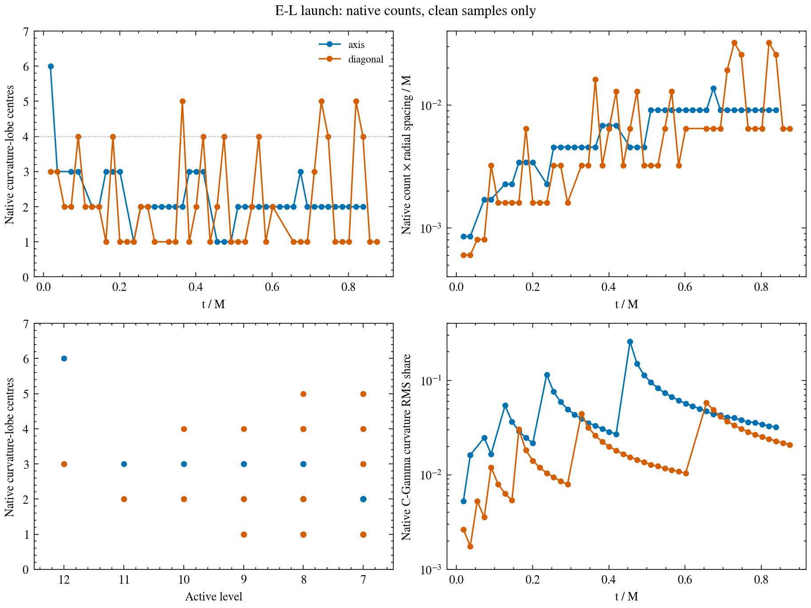

The figure shows the initial 6/3-centre lobes, followed by mostly 1–3-centre transport, and increasing quantized physical widths as the front moves through coarser inner levels. It supports the qualification above rather than a universal two-cell claim.

### A3 — Source-fixed transport ladder

**Classification: outcome (3), on the tested ladder only.** In every ray/time comparison the width continues decreasing, Gamma peak amplitude increases and both Gamma and conditional W_out successive fixed-window RMS differences increase. Width ratios T8/T4 are 0.590–0.603, with no measured saturation; counts in the current/fine cells increase only moderately. This is not outcome (2): the decisive Gamma/W differences do not begin decreasing. It is not a proof that an arbitrarily finer transport sequence lacks a continuum limit.

E-high is a separate source-refined reference, not another rung of the fixed-source transport hierarchy. No Richardson order is assigned to the irregular E-mid→T4→T8 hierarchy ladder. Cartesian receiving counts below mean w/h_recv at the **common 3.5 M square face**, h_recv=7/192,7/768,7/1536 M respectively (E-high 7/288). Along a diagonal native ray the actual centre-count equivalent is smaller by sqrt(2), and is explicitly saved in [front metrics](t10-fronts.csv). At 2.625 M these are prospective receiving counts; at 4.375 M axis/equator are on the receiving side, while the diagonal is still inside the square corner.


| t/M | ray | leg | front/M | width/M | current fine/level cells | 3.5 M receiving cells | Gamma feature peak |
| --- | --- | --- | --- | --- | --- | --- | --- |
| 2.625000 | axis | E-mid | 2.642000 | 0.041472 | 2.275039 | 1.137519 | 3.727264e-07 |
| 2.625000 | axis | E-T4 | 2.610000 | 0.015224 | 3.340530 | 1.670265 | 1.747738e-06 |
| 2.625000 | axis | E-T8 | 2.616500 | 0.009070 | 3.980630 | 1.990315 | 4.112901e-06 |
| 2.625000 | axis | E-high | 2.639500 | 0.029487 | 2.426333 | 1.213166 | 6.016942e-07 |
| 2.625000 | equator | E-mid | 2.642000 | 0.041432 | 2.272857 | 1.136429 | 3.734413e-07 |
| 2.625000 | equator | E-T4 | 2.610000 | 0.015222 | 3.340032 | 1.670016 | 1.751247e-06 |
| 2.625000 | equator | E-T8 | 2.616500 | 0.009066 | 3.978774 | 1.989387 | 4.119192e-06 |
| 2.625000 | equator | E-high | 2.639500 | 0.029468 | 2.424787 | 1.212394 | 6.025523e-07 |
| 2.625000 | diagonal | E-mid | 2.602500 | 0.024079 | 1.320905 | 0.660452 | 6.831927e-07 |
| 2.625000 | diagonal | E-T4 | 2.613000 | 0.012214 | 2.679996 | 1.339998 | 2.527060e-06 |
| 2.625000 | diagonal | E-T8 | 2.617500 | 0.007360 | 3.230016 | 1.615008 | 5.695084e-06 |
| 2.625000 | diagonal | E-high | 2.608500 | 0.017572 | 1.445890 | 0.722945 | 1.315923e-06 |
| 4.375000 | axis | E-mid | 4.391000 | 0.080124 | 2.197678 | 2.197678 | 6.838696e-08 |
| 4.375000 | axis | E-T4 | 4.352500 | 0.022575 | 2.476790 | 2.476790 | 2.284191e-07 |
| 4.375000 | axis | E-T8 | 4.362500 | 0.013328 | 2.924513 | 2.924513 | 5.649176e-07 |
| 4.375000 | axis | E-high | 4.390000 | 0.054133 | 2.227189 | 2.227189 | 8.474617e-08 |
| 4.375000 | equator | E-mid | 4.391000 | 0.080004 | 2.194398 | 2.194398 | 6.839063e-08 |
| 4.375000 | equator | E-T4 | 4.352500 | 0.022571 | 2.476318 | 2.476318 | 2.285907e-07 |
| 4.375000 | equator | E-T8 | 4.362500 | 0.013325 | 2.923825 | 2.923825 | 5.653144e-07 |
| 4.375000 | equator | E-high | 4.390000 | 0.054108 | 2.226144 | 2.226144 | 8.478728e-08 |
| 4.375000 | diagonal | E-mid | 4.389500 | 0.038734 | 2.124834 | 1.062417 | 1.172048e-07 |
| 4.375000 | diagonal | E-T4 | 4.361000 | 0.013528 | 2.968476 | 1.484238 | 5.436757e-07 |
| 4.375000 | diagonal | E-T8 | 4.367000 | 0.008051 | 3.533117 | 1.766559 | 1.233161e-06 |
| 4.375000 | diagonal | E-high | 4.348000 | 0.025932 | 2.133815 | 1.066908 | 1.834209e-07 |

The widths are single curvature lobes, not the entire wave packet. Even T8 supplies only 1.990 axial / 1.615 Cartesian diagonal receiving cells at 2.625 M, and 2.925 / 1.767 at 4.375 M (diagonal radial counts 1.142 / 1.249). Those are below a four-cell receiving condition. Width dependence defeats use of these values as an admitted finite physical resolution envelope.


| t/M | ray | Gamma mid–T4 RMS | Gamma T4–T8 RMS | difference ratio | W_out ratio | beta ratio |
| --- | --- | --- | --- | --- | --- | --- |
| 2.625000 | axis | 5.810905e-07 | 9.398656e-07 | 1.617417 | 1.617269 | 0.841874 |
| 2.625000 | equator | 5.814100e-07 | 9.391682e-07 | 1.615329 | 1.615180 | 0.840683 |
| 2.625000 | diagonal | 7.475139e-07 | 1.122674e-06 | 1.501878 | 1.502795 | 0.847120 |
| 4.375000 | axis | 7.579017e-08 | 1.512010e-07 | 1.994994 | 1.994459 | 0.990006 |
| 4.375000 | equator | 7.582637e-08 | 1.512041e-07 | 1.994084 | 1.993489 | 0.988861 |
| 4.375000 | diagonal | 1.762050e-07 | 2.688095e-07 | 1.525550 | 1.525554 | 0.783361 |

Beta itself has decreasing or nearly unchanged successive differences (ratios 0.783–0.990), while its derivative-related Gamma and W_out do not. This distinction is measured and prevents describing every evolved field as divergent. P8 repeats the Gamma/W decision; the [difference table](t10-profile-differences.csv) retains both reconstructions. Maximum P6/P8 width disagreement is 1.2024% in the near-child-corner E-mid diagonal at 2.625 M; transport-only maxima are 0.1932%. P6/P8 Gamma peak spread is below 0.08% of the transport feature peak. Interpolation sensitivity is far smaller than the growth.

C_Gamma feature RMS fractions at 2.625 M on the axis are 2.002% / 0.6411% / 0.3195% for E-mid/T4/T8; diagonal 5.152% / 0.3691% / 0.1691%. At 4.375 M they are axis 1.124% / 1.632% / 1.054%, diagonal 0.6426% / 0.2586% / 0.1278%. The growing narrow feature remains predominantly metric-consistent Gamma. It is not explained chiefly by the Gamma reduction constraint. This does not rule out a numerical metric/gauge source or AMR transport artifact.

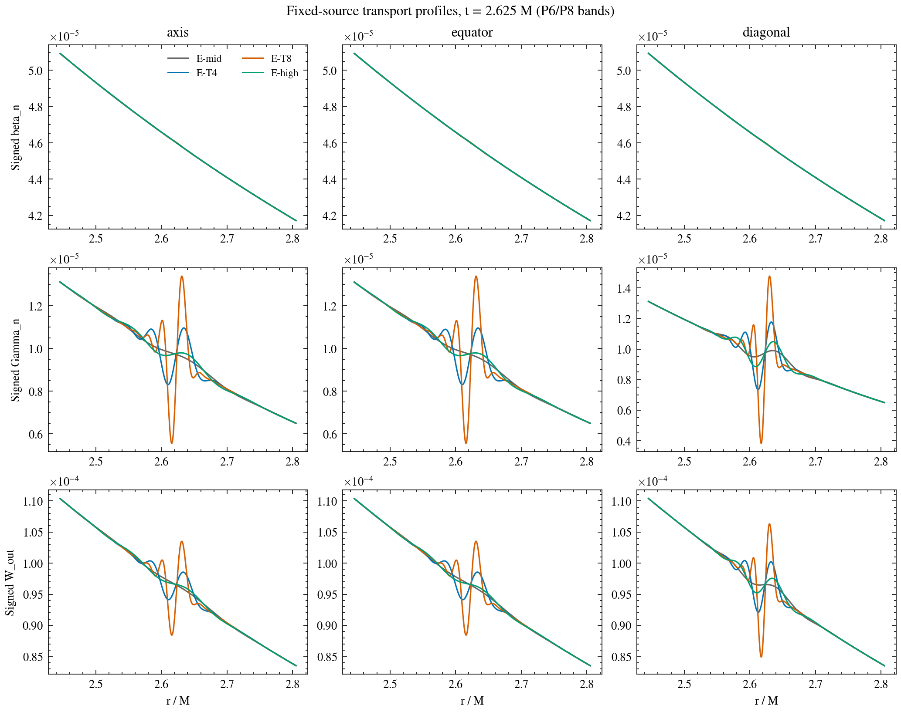

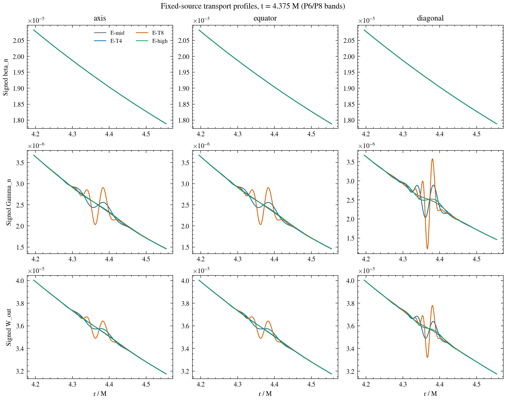

The raw signed Gamma and W_out oscillations grow with transport refinement, while the much smaller beta changes remain nearly invisible on the raw-field scale. The complete P6/P8 signed profiles are retained in the dense caches; [small profile CSV](t10-signed-profiles.csv) thins them without supplying the widths or derivative integrals.

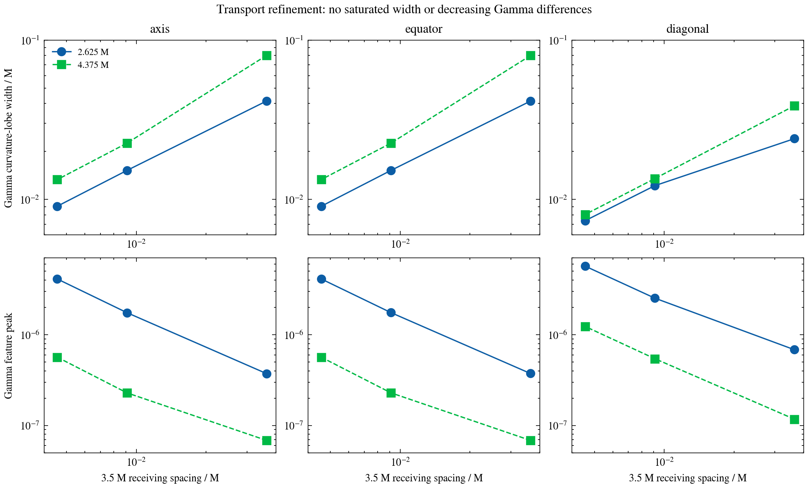

The last transport doubling reduces width by about 0.6 while increasing Gamma amplitude by about 2.3–2.5. No plateau or Cauchy signed characteristic profile is demonstrated.

### Fixed-delta derivative integrals

J is evaluated from the raw signed field by the same T9 C2 reconstruction: endpoint first-derivative difference, with positive/negative integrals separately retained and checked, P8 and half-density reconstruction as sensitivities. [All beta/Gamma/W_out/C_Gamma integrals](t10-jump-integrals.csv) include delta=0.1,0.2,0.4 M, one-sided values and first derivatives. No fixed-delta integral is mistaken for a continuum discontinuity just because a large-window value stabilizes.


| t/M | ray | delta/M | Gamma J mid | T4 | T8 | high source | condition |
| --- | --- | --- | --- | --- | --- | --- | --- |
| 2.625000 | axis | 0.100000 | 9.513846e-06 | 3.633972e-06 | 4.109796e-06 | -4.661527e-06 | single sampled level |
| 2.625000 | axis | 0.200000 | 1.046361e-05 | 9.607159e-06 | 9.749144e-06 | 1.002609e-05 | single sampled level |
| 2.625000 | axis | 0.400000 | 2.006875e-05 | 2.053392e-05 | 2.051803e-05 | 2.010743e-05 | single sampled level |
| 2.625000 | diagonal | 0.100000 | 8.981320e-06 | 4.638762e-06 | 3.790227e-06 | 1.646187e-06 | single sampled level |
| 2.625000 | diagonal | 0.200000 | 1.170971e-05 | 9.752492e-06 | 9.743907e-06 | 9.591209e-06 | child corner in mid/high |
| 2.625000 | diagonal | 0.400000 | 2.156067e-05 | 2.049503e-05 | 2.044090e-05 | 2.041935e-05 | child corner in mid/high |
| 4.375000 | axis | 0.100000 | 1.143139e-06 | 2.270352e-06 | 1.618158e-06 | 2.032360e-06 | single sampled level |
| 4.375000 | axis | 0.200000 | 3.796578e-06 | 3.777431e-06 | 3.754897e-06 | 3.563717e-06 | single sampled level |
| 4.375000 | axis | 0.400000 | 7.647353e-06 | 7.929989e-06 | 7.852974e-06 | 7.653998e-06 | single sampled level |
| 4.375000 | diagonal | 0.100000 | 2.935312e-06 | 1.599640e-06 | 1.566053e-06 | 3.582735e-06 | single sampled level |
| 4.375000 | diagonal | 0.200000 | 3.790459e-06 | 3.760145e-06 | 3.745872e-06 | 3.789534e-06 | single sampled level |
| 4.375000 | diagonal | 0.400000 | 7.659141e-06 | 7.866364e-06 | 7.824246e-06 | 7.961213e-06 | single sampled level |

Large-delta Gamma J at 2.625 M approximately doubles from delta=0.2 to 0.4 M (about 1e-5 to 2e-5), and at 4.375 M from about 3.8e-6 to 7.8e-6. That contains a smooth current-field background. The narrow signed peak growth does not supply a delta-insensitive limiting jump. Oscillatory signed cancellation can stabilize a broad integral while the field profile remains non-Cauchy on this ladder. The raw values and positive/negative parts are reported rather than used as proof of regularity.

### Face error on identical physical masks

The [full constraint comparison](t10-constraint-comparison.csv) covers the five registered times 0.875,1.75,2.625,3.5,4.375 M, all 12 masks and 15 constraints, retaining RMS, maximum, cell counts and coordinate volumes for each leg. These are unchanged uncovered-cell volume weights 2pi*y*h_l^2. The registered radial receiving mask [3.5,4.375] M mixes coarse-side cells near the axis/equator and fine-side cells toward the diagonal because the patches are square; it is not a pure coarse-side operation budget. The geometric mask is identical; finite centre selection gives different counts and quadrature weights. No global or face order is assigned to this nonuniform hierarchy ladder.


| t/M | mask | constraint | E-mid RMS | T4 RMS | T8 RMS | T4 / mid | T8 / T4 |
| --- | --- | --- | --- | --- | --- | --- | --- |
| 3.500000 | far | CGamma | 6.674970e-11 | 5.098194e-12 | 2.023240e-11 | 0.076378 | 3.968543 |
| 3.500000 | far | Ham | 4.203059e-11 | 2.012207e-11 | 8.947289e-11 | 0.478748 | 4.446505 |
| 3.500000 | far | Mom | 3.382084e-11 | 9.195663e-12 | 4.159547e-11 | 0.271893 | 4.523379 |
| 3.500000 | receiving_side_3p5 | CGamma | 1.046837e-09 | 1.165683e-09 | 1.075955e-09 | 1.113529 | 0.923025 |
| 3.500000 | receiving_side_3p5 | Ham | 2.584811e-08 | 8.902193e-08 | 1.400033e-07 | 3.444040 | 1.572683 |
| 3.500000 | receiving_side_3p5 | Mom | 3.813717e-09 | 7.164386e-09 | 8.293870e-09 | 1.878584 | 1.157653 |
| 4.375000 | far | CGamma | 2.483083e-10 | 4.390398e-10 | 4.776377e-10 | 1.768124 | 1.087914 |
| 4.375000 | far | Ham | 7.059968e-09 | 3.209786e-08 | 5.464139e-08 | 4.546460 | 1.702337 |
| 4.375000 | far | Mom | 4.789676e-09 | 2.538443e-08 | 4.439605e-08 | 5.299823 | 1.748948 |
| 4.375000 | receiving_side_3p5 | CGamma | 7.222548e-10 | 1.389501e-09 | 1.508784e-09 | 1.923837 | 1.085847 |
| 4.375000 | receiving_side_3p5 | Ham | 2.547286e-08 | 1.257011e-07 | 2.209077e-07 | 4.934707 | 1.757405 |
| 4.375000 | receiving_side_3p5 | Mom | 1.705341e-08 | 9.466085e-08 | 1.688442e-07 | 5.550845 | 1.783675 |

**No receiving-error suppression is measured.** At 4.375 M receiving-shell Ham grows by 4.9347 then 1.7574, Mom by 5.5508 then 1.7837, C_Gamma by 1.9238 then 1.0858. Far Ham grows by 4.5465 then 1.7023, Mom by 5.2998 then 1.7489. Before the front reaches most of the far shell, its 3.5 M norm has different low floors and nonmonotone C_Gamma; it is not evidence of a resolved passing packet. The sharpened/growing incident profile changes simultaneously, so these norms do not isolate the error of a single interface operation at fixed incident waveform. They directly kill the claim that this transport enlargement alone suppresses the registered endpoint error.

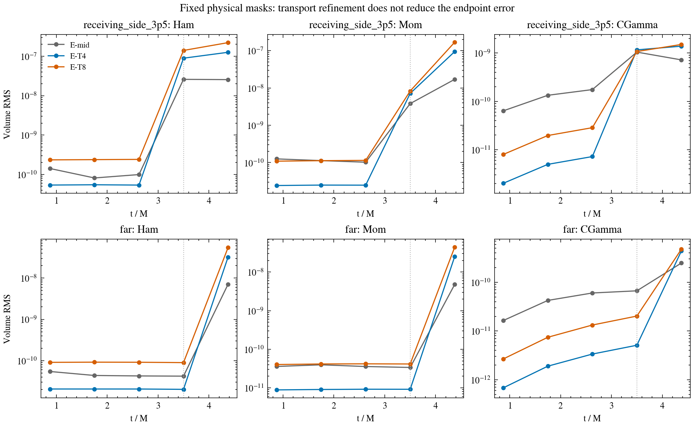

The endpoint receiving and far Hamiltonian/momentum errors grow under the source-fixed transport ladder. Exact counts/weights and the exterior-wake/far-core comparisons remain in the CSVs.

### Causal statement and next ranked step

**Measured:** downstream Gamma/conditional shift-characteristic amplitudes increase, their widths remain transport dependent, their successive signed-profile differences increase, and receiving-shell/far constraint errors increase. The feature is mostly metric-consistent. The earliest saved native source contains a small 6/3-centre lobe; later native transport is mostly 1–3 centres. **Inferred:** transport refinement through T8 has exposed/amplified an unresolved source/transport feature rather than established an admissible continuum pulse. **Unresolved:** whether an initial discrete source, unresolved smooth throat pulse, nonlinear early formation or earlier inner-interface passage generated it. These data locate neither a first RHS operation nor an initial weak discontinuity.

The revised expert ranking therefore favors the **read-only initialized t=0 longitudinal RHS/source audit on levels 12→7**, before another transport enlargement or a 100 M layout price. Decompose beta advection, 0.75*Gamma, -eta*beta, -B_driver, and the geometric/K/Theta/cartoon sources of Gamma, with the frozen native discretization and KO. Determine whether a narrow source is already present before the first update, and whether it lies at the puncture, an inner face or a driver cancellation. This is a source-localization test, not an assertion that A1 proved two-cell birth. If the initial sources are smooth, rank-5 per-stage early-step capture becomes the next test. Test B_driver(0)=0 only if the cheap audit implicates its initialization/cancellation or leaves that specific source ambiguous. A2 passes, so the intermediate launch dt ladder is not the first priority.

There is no measured saturated w(r,t) from which to admit receiving-cell counts along a 100 M chain. Do not turn a single 3.5 M receiving refinement into a convergence certification, choose a universal reduced exterior order, or prescribe level 8 to 100 M from these results. No next experiment was launched.

### Reproduction and retained artifacts

Run `/Users/auroradysis/miniconda3/bin/python Tests/EMSNative/t10-analyze.py extract`, then `analyse`, `audit`, `figures`, with `OPENBLAS_NUM_THREADS=1 OMP_NUM_THREADS=1 VECLIB_MAXIMUM_THREADS=1` and `MPLCONFIGDIR=/private/tmp/ems-t10/mpl` for figures. Extract is the exact numerical/bit comparison check and reads only ray-support boxes. All commands completed well below ten minutes. Public CSVs total about 2 MB, figures are standalone PNG/PDF, and dense selected caches stay on disk with recorded hashes. [COMMIT-MANIFEST-T10.txt](COMMIT-MANIFEST-T10.txt) identifies public outputs, reused/ sealed scripts, controller-verified plot hashes and retained cache hashes. No commit was made.

## T11 — initialized longitudinal RHS and puncture-end source

**READY-EXCEPT:** the t=0 source is localized to the puncture-end cells, and its leading term is identified. It is a nonregular geometric source already present in the continuum RHS of the **actual initialized state**, with an additional O(1) lapse-gradient discretization error in the first cells and a 1/h KO source on the angular extrinsic-curvature components. The shift-driver combination cancels exactly. The native harness is bit-identical to a direct call of the unmodified production kernel. The supplied first coarse-step snapshots cannot certify the inner-cell Taylor expansion or determine how much of the emitted pulse is seeded by geometric Gamma versus KO on A: they skip 4096 finest-level steps before their first sample. This qualification is not deferred as an unreported validation pass.

This is an offline, read-only diagnostic on HEAD bb2d9f3. No production C++, initialization, evolution, gauge, Chombo, finder, parameters or input file is changed, and no commit or evolution run is made. All static-file operations are explicitly t=0. Positive-time analysis reads only E-L's saved numerical fields. Four standalone scientific figures use the sciplot workflow; this report follows the sciwrite evidence/limitation convention.

### Native kernel, saved ghosts and exact controls

[T11RHS.cpp](T11RHS.cpp) is a Tests-only subclass of `CCZ4Cartoon<ExperimentalGauge,FourthOrderDerivatives,CouplingFunction>`. It calls the production protected RHS on native derivatives, separates KO using the production dissipation method, and independently groups the Gamma equation's contributions. It applies the same trace-A removal and 1e-12 chi/lapse floors to the entire input stencil, including ghosts, as `specificEvalRHS`. For a second control it calls the public production `compute` and compares all 28 outputs bit for bit with the native RHS plus sequential native dissipation additions. Arithmetic order matters when two KO directions cancel; the bit control uses the production addition order, whereas separately reported KO is the sum of the two directions.

All three exp-0020 t=0 plots carry every one of the 28 evolved variables, including A and EMS fields, plus six constraints, and three saved ghost cells in both directions. The supplied exp-0019 E-high checkpoint also carries the 28 evolved variables and three ghosts, but has centre 224 and a different hierarchy; it is not substituted for the E-mid source state with centre 336. Plot time is checked to equal zero before any native or continuum preparation. Only selected ray-support boxes on levels 7–12 are read; no whole level is loaded. The streamed seven-by-seven stencils include current-field parity and coarse/fine ghosts exactly as stored. Float64, point transfers, sigma=1, G=1, eta=1, shift Gamma coefficient 0.75 and kappa=(0.1,0,1) match the supplied parameters. The native covariant damping actually uses 0.1*alpha/(0.005+alpha), as in the frozen source.
| rung | native cells | production output bit mismatches | Gamma split defect / ε max(1,sum abs terms) | driver cancellation max | floor cells |
| --- | --- | --- | --- | --- | --- |
| E-low | 17194 | 0 | 2.493814 | 0.0 | 0 |
| E-mid | 26119 | 0 | 2.327365 | 0.0 | 0 |
| E-high | 39494 | 0 | 2.478199 | 0.0 | 0 |

There are 82,807 sampled cells and 2,318,596 production-output components. All are finite. Alpha equals sqrt(chi) bit for bit in the stored numerical fields; the largest initial Gamma component is 1.315519e-12. The split error is at most 2.494 machine epsilons times the stated absolute-term scale. [t11-harness-controls.csv](t11-harness-controls.csv) retains the controls. A separate **108,864-value** comparison of the first three puncture-cell stencil halos with valid same-level owners and exact axis parity has **zero numeric and zero bit differences**, on every rung and level 7–12; see [t11-ghost-controls.csv](t11-ghost-controls.csv). Thus the first-cell source does not result from a wrong parity fill or a same-level seam copy. Its stencil is far from a coarse/fine face.

### Actual initialization and term decomposition

The stored trumpet Killing lapse is not the initialized lapse. `EMSBH_trumpet_read::conformal_decomposition` sets alpha(0)=sqrt(chi), even though the radial reader also reconstructs alpha_K. The geometric data have h_ij=delta_ij, chi=X², K=0 and A_ij=k(3n_i n_j−delta_ij) in the unboosted continuum reconstruction. Numerical metric/K deviations are at floating-point precision. This is a correction to the assumed stationary-lapse picture, not a proposed initialization or gauge change.

`ExperimentalGauge::compute` sets B_driver=0.75*Gamma−eta*beta. Consequently 0.75*Gamma−eta*beta−B_driver is **exactly zero** on every native sampled cell at t=0. The actual gauge equations are alpha_t=advec(alpha)−1.8*alpha*(K−2Theta), beta_t=advec(beta)+0.75*Gamma−eta*beta−B_driver, and B_driver,t=−0.1*B_driver, with native KO added to each. There is no advection in the driver equation, although the generic derivative object computes an unused driver-advection value. The lapse coefficient in the parameter file does not replace the hard-coded 1.8 in ExperimentalGauge.

The table gives signed extrema of Gamma-normal contributions over 0<r<=0.5 M on **E-mid L12**. Native axis profiles use the closest row y=h/2 and label its horizontal coordinate x−336 as r, matching E-L's native provenance; the same-cell continuum comparison uses the actual (x−336,y). Diagonal profiles use x−336=y and r=sqrt(2)*y. Fixed physical P6/P8 axis sampling later uses y=0. Cartesian 2D Laplacian and gradient/divergence terms plus cartoon terms together form the 3D shift-second-derivative block; the longitudinal coefficient is 4/3, not an extra 4/3 multiplying the full Laplacian. The reported curvature width counts connected native centres above half the absolute curvature maximum, using the native fourth-order radial difference of each RHS contribution. `E` denotes an endpoint lobe whose inner side is not bracketed; it is not a complete FWHM. Widths of pure roundoff/zero terms are not physical packets.
| Gamma term | axis extremum | axis r/M | diagonal extremum | diagonal r/M | curvature centres axis / diagonal |
| --- | --- | --- | --- | --- | --- |
| advection | -1.570588e-11 | 6.195068e-03 | -2.013756e-11 | 1.419910e-02 | — / — |
| shift_laplacian_2D | -1.199528e+02 | 1.210531e-03 | -1.200149e+02 | 1.107732e-03 | 3 E / 2 E |
| shift_graddiv_2D | -3.998270e+01 | 1.210531e-03 | -4.000421e+01 | 1.107732e-03 | 3 E / 3 E |
| lapse_A | 1.000623e+02 | 2.136230e-04 | 1.009098e+02 | 3.021086e-04 | 1 E / 1 E |
| chi_A | 2.953581e+02 | 3.560384e-04 | 3.118206e+02 | 1.007029e-04 | 2 E / 2 E |
| K_gradient | 3.595880e-13 | 6.337484e-03 | 4.811926e-13 | 8.156932e-03 | — / — |
| Theta_gradient | 0.000000e+00 | 7.120768e-05 | 0.000000e+00 | 1.007029e-04 | — / — |
| geometry_2D | -2.250816e-13 | 6.337484e-03 | -2.666522e-13 | 9.365367e-03 | — / — |
| cartoon_geometry | -7.354352e-14 | 6.337484e-03 | -8.888406e-14 | 9.365367e-03 | — / — |
| cartoon_shift | -5.240559e+01 | 1.637777e-03 | -5.244947e+01 | 1.510543e-03 | 2 E / 2 E |
| reduction | -1.702767e-13 | 6.337484e-03 | 2.143728e-13 | 3.021086e-04 | — / — |
| matter | -3.994606e+00 | 5.055745e-03 | -3.995132e+00 | 4.934441e-03 | 1 E / 17 |
| KO | 3.987819e-09 | 6.764730e-03 | -5.435512e-09 | 3.796498e-02 | — / — |

The dominant positive Gamma terms are −2*A^ij*partial_j alpha and −3*alpha*A^ij*partial_j chi/chi. The shift-second-derivative block contributes the opposing fractional-power correction. K/Theta gradients, Christoffels of h and hww, reduction damping and Gamma advection have no material initial narrow source. The scalar-momentum matter term is nonzero, but its peak is a broader feature near 0.005 M and is much smaller than the puncture source. All signed profiles, including beta advection/driver/KO, driver decay/KO and lapse advection/slicing/KO, are in [t11-native-profiles.csv](t11-native-profiles.csv); every term/level/ray extremum and width is in [t11-term-peaks.csv](t11-term-peaks.csv). The frozen kernel evaluates all 28 RHS variables; [t11-variable-peaks.csv](t11-variable-peaks.csv) retains physical/advection/KO extrema, including every h/A and EMS component.

The following are **same-cell comparisons** at the closest positive diagonal cell. They use the continuum source at that cell's actual radius, not a fit or a target for evolution.
| rung | h12/M | r/M | Gamma RHS | continuum Gamma RHS | native − continuum | lapse-gradient error | KO(A12) | h12*KO(A12) | KO(alpha) |
| --- | --- | --- | --- | --- | --- | --- | --- | --- | --- |
| E-low | 2.136230e-04 | 1.510543e-04 | 259.237268 | 281.422704 | -22.185436 | -30.249721 | 1.931183e+04 | 4.125452 | 0.342630 |
| E-mid | 1.424154e-04 | 1.007029e-04 | 276.898194 | 300.002273 | -23.104079 | -30.326939 | 2.901031e+04 | 4.131514 | 0.342139 |
| E-high | 9.494358e-05 | 6.713525e-05 | 291.926523 | 315.887311 | -23.960788 | -30.371877 | 4.355244e+04 | 4.135024 | 0.341849 |

The approximately −30.3 lapse-gradient error stays O(1) as the first cell moves inward with h. This is the fourth-order centred stencil differentiating the conical alpha~r/Y0, not an error at a fixed nonzero physical radius. It occupies the first few cells. Native Gamma KO is only about 1e-9–1e-8 and cannot explain a Gamma RHS of hundreds. **KO on A12 is different:** h*KO(A12) approaches approximately 4.14, and its peak grows as 1/h. A_ij has a bounded but direction-dependent puncture limit; applying Cartesian KO to those angular components creates a singular grid-scale RHS. The corresponding source on lapse is O(1), approximately 0.342. E-mid's diagonal L12 maxima of KO(phi), KO(Pi) and KO(Ex) are 0.0837899, 0.943445 and 119608.4 respectively; the covariant electric field also has a singular puncture representation. These are real current-field stencil effects, not new continuum damping or targets. They demonstrate that a Gamma-only KO audit would miss large coupled sources.

### Where the source is, and how it scales

The first Gamma RHS curvature lobe is at 2.5h on the axis and 3.5355h on the diagonal, with one/two counted native centres; both are endpoint lobes. The first two radial stencil points cannot supply a centred five-point second difference, so these are **first evaluable** curvature locations, not proven locations of the exact maximum. The source itself is present at the innermost cell before any update. Its extremum and its curvature are different measurements.
| rung | axis max Gamma RHS | diagonal max Gamma RHS | axis curvature peak | diagonal curvature peak | axis / diagonal lobe centres |
| --- | --- | --- | --- | --- | --- |
| E-low | 2.254272e+02 | 2.592373e+02 | 2.039627e+08 | 1.227036e+08 | 1 / 2 E |
| E-mid | 2.497049e+02 | 2.768982e+02 | 3.841087e+08 | 2.221857e+08 | 1 / 2 E |
| E-high | 2.703411e+02 | 2.919265e+02 | 7.494345e+08 | 4.218065e+08 | 1 / 2 E |

| level | positive axial face/M | E-mid uncovered axis Gamma extremum | E-mid uncovered diagonal Gamma extremum |
| --- | --- | --- | --- |
| 7 | 0.875000000 | -2.556267e-08 | no uncovered cells at r≤0.5 |
| 8 | 0.437500000 | -1.131626e-06 | -1.740602e-07 |
| 9 | 0.218750000 | -3.666605e-05 | -6.721603e-06 |
| 10 | 0.109375000 | -8.146344e-04 | -1.835802e-04 |
| 11 | 0.054687500 | -6.066621e-03 | -2.923129e-03 |
| 12 | 0.027343750 | 2.497049e+02 | 2.768982e+02 |

Actual inner faces are R12=0.02734375, R11=0.0546875, R10=0.109375, R9=0.21875 and R8=0.4375 M; R7=0.875 M is outside the requested interval. Their diagonal corners are sqrt(2) times these values. E-mid's largest Gamma RHS in the three-cell collar of R12 is only 0.00607142 on the axis and 0.00309711 at its diagonal corner, against inner maxima 249.705 and 276.898. Parent levels 7–11 can show a puncture-shaped lobe on **covered** diagnostic cells; those are not added to the source on the active AMR hierarchy. [t11-uncovered-sources.csv](t11-uncovered-sources.csv) distinguishes the active cells, and the profile CSV labels covered cells. A seam may geometrically pass through the puncture, but the ghost-copy control and analytic source show that this does not create the leading source.

RHS self-convergence compares native low−mid and mid−high differences on the same physical P6 sample points, with p=log(D_low_mid/D_mid_high)/log(1.5). All supports within five low-grid cell spacings of a face are excluded; a P8 replay gives the interpolation spread. The first two windows are poorly qualified by interpolation and must not be used as asymptotic orders. Low/negative outer orders at tiny cancelling sources are retained.
| ray | fixed r/M window | low−mid RHS RMS | mid−high RHS RMS | p | P6/P8 spread / mid−high |
| --- | --- | --- | --- | --- | --- |
| axis | 0.0002–0.001 | 2.251690e+00 | 9.462568e-01 | 2.138094 | 3.207111 |
| axis | 0.001–0.005 | 2.390970e-02 | 5.593686e-03 | 3.582665 | 0.702037 |
| axis | 0.005–0.02 | 1.041414e-04 | 2.063089e-05 | 3.992847 | 0.004788 |
| axis | 0.02–0.05 | 3.765977e-07 | 1.040502e-07 | 3.172415 | 0.047451 |
| axis | 0.05–0.1 | 6.260828e-08 | 1.223100e-08 | 4.027285 | 0.008957 |
| axis | 0.1–0.49 | 5.396948e-09 | 1.068548e-09 | 3.994259 | 0.003705 |
| diagonal | 0.0002–0.001 | 8.409528e+00 | 5.806023e+00 | 0.913691 | 0.334760 |
| diagonal | 0.001–0.005 | 2.003954e-03 | 3.257018e-04 | 4.481015 | 15.749513 |
| diagonal | 0.005–0.02 | 2.206474e-05 | 4.345094e-06 | 4.007578 | 0.007411 |
| diagonal | 0.02–0.05 | 1.548503e-08 | 4.561447e-08 | -2.664474 | 0.046765 |
| diagonal | 0.05–0.1 | 2.032933e-09 | 1.626267e-09 | 0.550459 | 0.045592 |
| diagonal | 0.1–0.49 | 1.071889e-10 | 9.297241e-11 | 0.350930 | 0.035357 |

On the resolved 0.005–0.02 M window the Gamma RHS orders are 3.99285/4.00758 on axis/diagonal, with interpolation spread below 0.008 of the finer difference. The spatial source is therefore not globally nonconvergent at fixed r. Its conical first-cell error and increasingly singular curvature track the grid **as r~h→0**. The diagonal outer source is very small: at 0.05–0.1 M its high RMS is 4.463516e-4 but the native/continuum discrepancy is 1.680124e-9. The nonconvergent few-e-9 differences in the cancelling Gamma/K/Theta sources there are consistent with initial field/absolute-coordinate and derivative roundoff, as in T7-E; their precise share is inferred, not established by a new fused-coordinate intervention. They are vastly smaller than the inner O(10–100) source/error. [t11-rhs-orders.csv](t11-rhs-orders.csv) carries all variables and negative orders, and [t11-continuum-errors.csv](t11-continuum-errors.csv) carries the continuum and interpolation comparison.

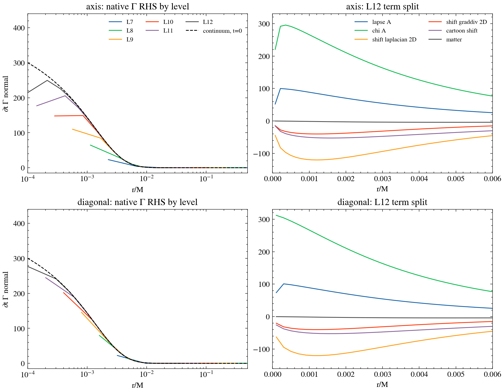

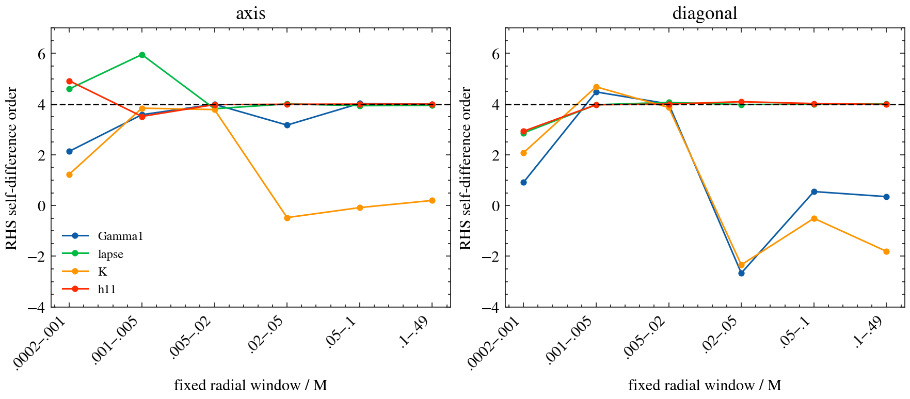

### Continuum reconstruction and regularity

The t=0 continuum diagnostic loads E.trumpet through the actual C++ reader, retaining its inverse compactification, Clenshaw arithmetic and derivative coefficients. Analytic radial jets, followed by analytic Cartesian scalar/vector/tensor derivatives and cartoon contractions, are passed into the **same unmodified CCZ4Cartoon RHS equation**. There is no finite differencing of a radial table and no use of the constraint ODE to force a residual/source to zero. The initialized lapse remains X=sqrt(chi), not alpha_K. Native setter values and analytic values agree to less than 1e-9 on all sampled r>0.001 cells, including A, scalar momentum and electric fields; the readable check asserts this. The profile hash is 2a8de074ae17c0b11d323d4b0933a6bdb7430a5305473c8cc7d4ce37f39fa793.

For radial beta=b(r)n and the unboosted continuum state, the longitudinal Gamma RHS is

`(4/3)*(b''+2*b'/r−2*b/r²) −4*k*alpha' −6*alpha*k*chi'/chi −32*pi*alpha*Pi*phi'`.

Y0=0.13570329494190452, D0=2.2778090227037476 and k0=C*exp(D0)/Y0³=−3.559422033019796. Near the puncture alpha~r/Y0, chi~r²/Y0², beta is linear plus an r^(1+nu) correction, and A has an angular limit k0*(3n_i*n_j−delta_ij). Hence the Gamma-normal source tends to **−16*k0/Y0=419.6711108060989**, with its leading fractional correction scaling as r^(nu−1), nu=1.3372155112113842. The observed correction slope over 1e-8–1e-6 M is 0.337260, consistent with nu−1=0.337216. The source is bounded and locally volume-integrable, but its radial derivative diverges as r^(nu−2) and the vector source has no direction-independent puncture value. It is not a smooth compact continuum pulse.

The radial identities and leading balance have exact CAS witnesses and a separate 60-digit Cartesian differentiation cross-check; [CAS evidence](../../scripts/cas/t11-evidence.md) gives domain, exclusions and status. An independently reconstructed, forward-recurrence 60-digit Chebyshev source agrees with the Float64 C++-reader/CCZ4 result at six radii, with maximum normalized discrepancy 1.626175e-12. That numeric transfer check is CORROBORATED, not a continuum-physics proof. CAS scope: algebraic identity / transfer layer — production physics not certified. [t11-continuum-crosscheck.csv](t11-continuum-crosscheck.csv) retains the samples.

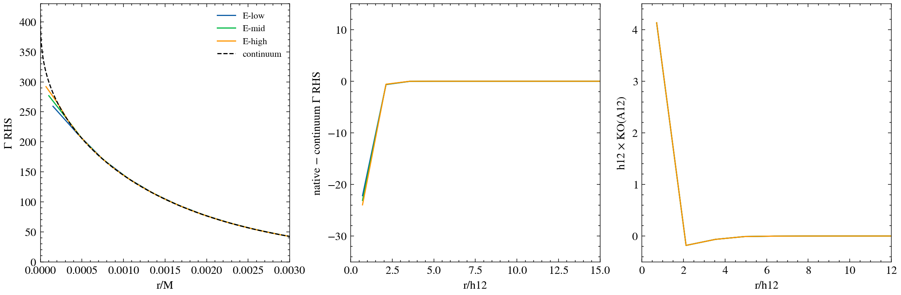

The principal answer is therefore **both**: the continuum initialized RHS itself has a puncture-end nonregular source, and the native puncture-end stencils add a nonuniform first-cell error and singular KO contributions. This is more specific than attributing everything to a smooth fractional-power pulse that merely needs better transport resolution.

### First-step validation and connection to launch

E-L's t0 state is the E-mid source state. Its saved step interval is Δt0=7/384=0.0182291667 M, whereas the finest native step is Δt12=4.45048e-6 M. Its native ray caches carry shift/Gamma/driver, lapse, chi, K, Theta and h; they do **not** carry A or the EMS fields. Those inputs are complete in the t=0 plots, so all native RHS variables are kernel-controlled, but no nonexistent positive-time A/EMS validation is claimed. Current-ray values and first derivatives are remapped to common points by cubic Hermite interpolation, then compared with P6/P8 sampling of the native t=0 RHS. This avoids a linear-profile interpolation error larger than some first-step changes.

For successive saved fields u0,u1,u2, the estimated quadratic term is 0.5*(u2−2*u1+u0). The table uses diagonal supports clean of faces on 0.1≤r≤0.49 M, with 95 common points. All norms are RMS in that fixed physical interval, without cylindrical/volume weighting. The final column subtracts the quadratic estimate and divides by the first change.
| variable | Δt*RHS | first change | first minus Δt*RHS | quadratic estimate | remainder / quadratic | corrected / first |
| --- | --- | --- | --- | --- | --- | --- |
| B1 | 4.402988e-07 | 4.398977e-07 | 4.010686e-10 | 4.005825e-10 | 1.001213 | 0.000001 |
| lapse | 2.700955e-06 | 2.707908e-06 | 7.430703e-09 | 7.394523e-09 | 1.004893 | 0.000022 |
| K | 2.669056e-06 | 2.668597e-06 | 7.670718e-09 | 7.670178e-09 | 1.000070 | 0.000142 |
| Gamma1 | 2.745288e-07 | 1.216246e-07 | 1.734741e-07 | 1.472049e-07 | 1.178453 | 0.271976 |
| shift1 | 3.847176e-09 | 8.265503e-09 | 4.598857e-09 | 3.291458e-09 | 1.397210 | 0.179029 |
| chi | 2.595523e-14 | 1.082832e-10 | 1.082728e-10 | 1.141967e-10 | 0.948125 | 0.090979 |
| h11 | 1.226193e-08 | 1.903052e-08 | 6.910080e-09 | 7.272544e-09 | 0.950160 | 0.020027 |
| Theta | 5.012507e-11 | 1.930882e-12 | 5.003291e-11 | 5.368397e-13 | 93.198984 | 25.877258 |

For B/lapse/K the remainder matches the quadratic estimate to approximately 0.1–0.5%, and the corrected fraction is 1.2e-6, 2.2e-5 and 1.4e-4. Gamma, beta, chi and h have material temporal corrections; their remainder/quadratic ratios are 1.18, 1.40, 0.95 and 0.95. The inner time scale and coupling are not assumed small. Theta is at the finite-difference/initial-rounding source floor: a snapshot RHS does not predict the tiny floating-point step change, and its 93.2 ratio is explicitly a failed Taylor/floor comparison. On the inner 0.0002–0.005 M window, Gamma's Δt*RHS RMS is 2.99558 but the first saved change is only 1.28157e-4; the estimated quadratic term is 1.41728e-4. This **does not validate** the inner Taylor expansion. The source has evolved through thousands of native stages by that snapshot; steps 1–2 cannot reconstruct its initial fine-step second derivative. [t11-step-validation.csv](t11-step-validation.csv) retains both rays/all fields/windows and interpolation/state-replay errors.

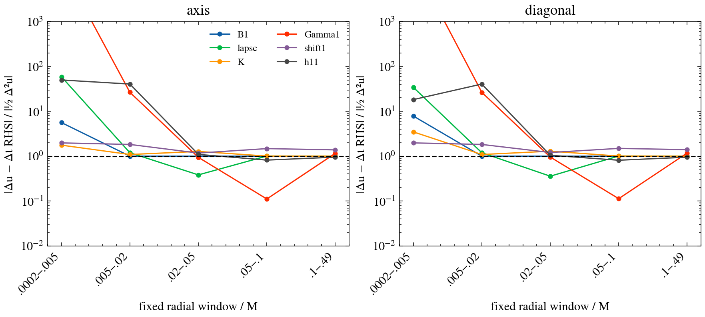

Launch locations are checked in two ways. [t11-launch.csv](t11-launch.csv) retains the given direct native-cell provenance at steps 1–6. Independently, [t11-independent-launch.csv](t11-independent-launch.csv) selects the largest absolute Gamma curvature on the **same fixed 0.003–0.16 M interval at every time**, without using r=t or a predicted face arrival. Its clean-axis fitted speed is 0.975714 with intercept 0.000521661 M (four samples, fit RMS 0.000241374 M); the six clean diagonal samples give 0.984244 with intercept 0.000352845 M and fit RMS 0.000140814 M. P6/P8 position spread is at most 7.12043e-6 M on the clean axis and zero on the diagonal. These fits are compatible with the initial longitudinal shift characteristic speed approximately 1−beta_n, and backtrack to the sub-0.001 M source region. They do not determine the precise emission time or a continuum signal speed: dominant lobe signs change and finite-resolution dispersion remains.
| step | t/M | ray | source level | native curvature-lobe r/M | counted centres | Gamma at lobe | C_Gamma at lobe | clean |
| --- | --- | --- | --- | --- | --- | --- | --- | --- |
| 1 | 0.018229167 | axis | 12 | 0.018585205 | 6 | 5.721666e-03 | 2.671129e-06 | True |
| 1 | 0.018229167 | diagonal | 12 | 0.018630031 | 3 | 6.049118e-03 | 5.203258e-07 | True |
| 2 | 0.036458333 | axis | 11 | 0.035746257 | 3 | -2.122059e-03 | -8.402132e-06 | True |
| 2 | 0.036458333 | diagonal | 12 | 0.035950925 | 3 | -1.556858e-03 | -3.540397e-07 | True |
| 3 | 0.054687500 | axis | 11 | 0.053975423 | unbracketed | -1.434106e-03 | -3.177882e-06 | False |
| 3 | 0.054687500 | diagonal | 11 | 0.054178144 | 2 | -1.064952e-03 | -1.830546e-06 | True |
| 4 | 0.072916667 | axis | 10 | 0.071492513 | 3 | -1.650286e-03 | -1.144572e-05 | True |
| 4 | 0.072916667 | diagonal | 11 | 0.072304661 | 2 | -9.726548e-04 | -1.036502e-06 | True |
| 5 | 0.091145833 | axis | 10 | 0.089721680 | 3 | -1.276236e-03 | -7.349594e-06 | True |
| 5 | 0.091145833 | diagonal | 10 | 0.089826960 | 4 | -1.310467e-03 | -2.884849e-06 | True |
| 6 | 0.109375000 | axis | 10 | 0.107950846 | unbracketed | -1.021384e-03 | -4.764459e-06 | False |
| 6 | 0.109375000 | diagonal | 10 | 0.108356288 | 2 | -8.951130e-04 | -2.667125e-06 | True |

At the first sample the lobe is inside L12, before R12 or its corner, and is mostly metric-consistent Gamma. This supports a puncture launch rather than birth at an inner AMR face. The t=0 source audit establishes that the nonregular source is already present; the cadence cannot show which earliest projection/KO/geometric update supplies the outgoing packet or exclude nonlinear reorganization before 0.018229 M.

### Branch decision and single next experiment

**Branch (ii), puncture-end discretization/regularity first, is supported.** The actual alpha~r cusp and direction-dependent A limit are essential, alongside the fractional correction r^(nu−1); it is not solely the error of differentiating an otherwise smooth source. The geometric Gamma RHS is already hundreds at t=0, its first-cell lapse-gradient error stays O(1), and coupled A KO grows as 1/h. The source and first outgoing packet lie well inside the finest face. Against a claim of complete causal closure, the data do not determine the relative emitted amplitude from these coupled sources.

Branch (i) is not implicated by a cancellation error: the native driver combination is exactly zero, and driver decay/advection/KO have their separately reported sizes. This does not prove that every possible B(0) intervention is ineffective, but the audit supplies no reason to prioritize B(0)=0. Branch (iii)'s **smooth initial RHS** premise is contradicted by the continuum and native puncture-end source, although early-stage instrumentation remains useful to measure its coupled evolution. A new transport enlargement or a 100 M receiving-resolution envelope is not justified by these results.

The next experiment should be **one very short source-refinement ladder with first-stage capture**, preserving the frozen gauge/equations/initialization, point transfers and sigma=1. Keep the existing levels through L12 and their physical faces; compare the baseline with nested L13 and L14 (faces 0.013671875 and 0.0068359375 M), so the new source spacings are h12/2 and h12/4. Use one common Δt0=0.005 M and stop at 0.005 M; the outgoing feature should remain inside every finest face. Compare the emitted current-field profiles on the fixed 0.001–0.004 M interval and at r=0.002 M; retain the innermost cells separately for mechanism attribution. Record the first native RK stages' Gamma split, A/alpha/EMS KO and projections. No positive-time static target or replenished static ghost data is allowed. Diagnostics belong in a Tests-only harness, with no production change.

**Pre-registered reading:** a Cauchy launch requires decreasing successive fixed-window Gamma/metric/shift profile differences (D_13_14/D_12_13≤0.8), differences exceeding five times P6/P8 interpolation spread, and packet amplitudes stabilizing (|A14/A13−1|≤0.1), while clean of all faces. A bounded continuum pulse need not decrease to zero. If the difference ratio is ≥1 while the feature remains ≤3 local centres or its amplitude grows, source refinement has not closed the mechanism; use the stage replay to decide whether the first material change comes from A/alpha KO/projection or the geometric Gamma source. Between 0.8 and 1, or with insufficient interpolation significance, the result is inconclusive. Track both bounded continuum source and h*KO(A): a pointwise 1/h KO peak alone is not a proof of nonconvergence in evolved observables. Do not change B(0), alpha(0), beta(0), gauge, equations or sigma in this test. No experiment was launched in T11.

### Reproduction and provenance

Run `t11-analyze.py build`, `native E-low`, `native E-mid`, `native E-high`, `continuum`, `measure`, `validate`, `ghost-check`, `check`, `figures`, `report` with `/Users/auroradysis/miniconda3/bin/python`, `OPENBLAS_NUM_THREADS=1 OMP_NUM_THREADS=1`, and `MPLCONFIGDIR=/private/tmp/ems-t11/mpl` for figures. The build reuses T7-E's standalone serial Chombo compiler/link helper; its source is entirely in Tests. Run the two CAS scripts listed in the evidence card after preparing the continuum cache. The readable checks assert native output identity, term reconstruction, exact cancellation, finite/floor controls, saved ghost identity and analytic-setter agreement. Each command completed in seconds, below the detached threshold; no long simulation or analysis process was started. Native replay peak RSS was 0.336 GB, one thread, with selected native field reads of 48.3 / 69.9 / 100.8 MB on low/mid/high. Dense caches are retained under /private/tmp/ems-t11 with hashes; public CSVs total approximately 4 MB. No files from other tranches were removed. [COMMIT-MANIFEST-T11.txt](COMMIT-MANIFEST-T11.txt) records the artifacts and frozen source/input provenance.
