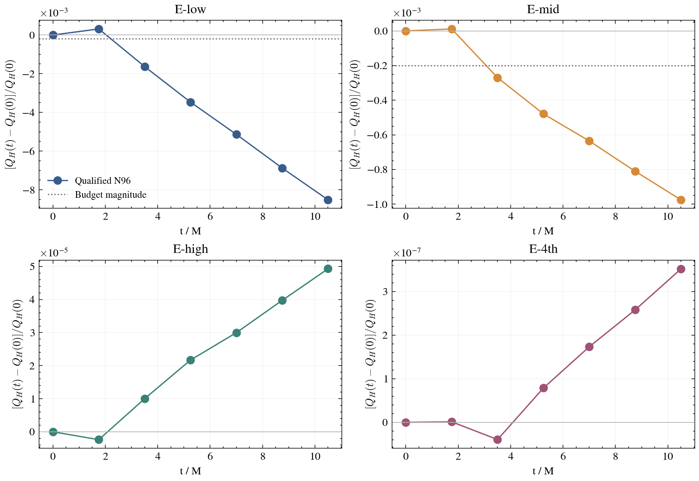
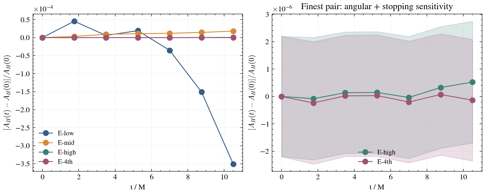
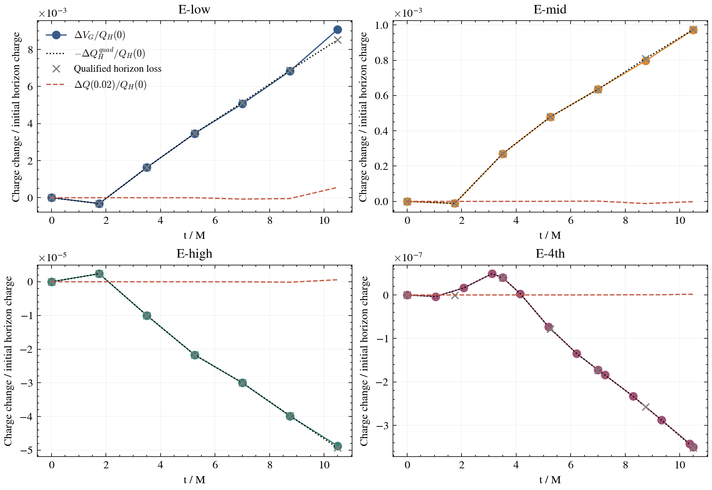
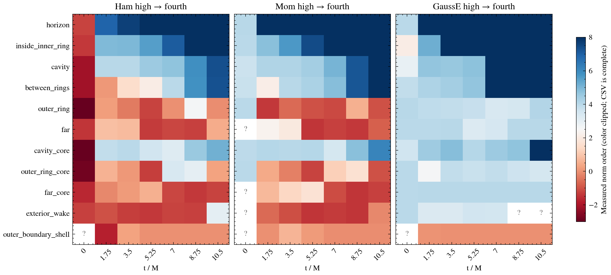

# T15 — exp-0021 four-rung horizon charge

**READY-EXCEPT.** The fourth rung completes 162 coarse steps to numerical t = 10.500000000000009 M, with run.done, chain.done, qualification.done and reduction.done present. All fourteen pulled checkpoints have a signed shell budget in local staging, including ten independently qualified off-ladder surfaces. The sealed post-pull command was attempted exactly and failed at output-directory creation because this worker’s filesystem sandbox denies writes to `/Users/auroradysis/Workspace/EMS/.data/exp-0021/E-4th/`. No file in that input tree changed, and the requested `budget/` destination could not be created. The complete numerical budget is retained under `/private/tmp/ems-t15/E-4th/charge-budget/`, with its 56-row CSV and completion marker; its small results and qualification evidence are copied into this worktree. Consequently this report claims complete checkpoint coverage in staging, **not completion of the contractual post-pull output-placement obligation**.

The late horizon charge rate falls from −1.01225e−3 to −9.96543e−5, then changes sign to +5.54911e−6 and shrinks further to +5.41702e−8 charge units per M. The fourth rung is about 102 times smaller than the high rung. This supports a diminishing, sign-changing numerical charge error over this interval; a nonzero floor is not demonstrated. A floor smaller than the measured errors, multi-term cancellation, or a later change of rate remains possible. The field and constraint masks still contain significant negative orders, so these horizon results do not admit the chain as convergence-certified 100 M production.

## Data and frozen method

The four independently initialized E runs use h0 = 7/8, 7/12, 7/18 and 7/27 M, ratio 3/2, the common physical faces R0 = 336 M and Rl = 112/2^l M for levels 1–12, the original √χ initial lapse, the native ExperimentalGauge, Float64, fixed point-transfer hierarchy, sigma = 1 and CFL = 1/4. This task reads saved numerical fields only. It runs no evolution, SSH, static-profile evaluation, commit, or finder modification. The numerical t = 0 re-found horizon is used only as each rung’s drift baseline. Fixed diagnostic masks likewise select saved data and never enter an evolution.

The governing sources are the [exp-0021 submit contract §§1 and 8](/Users/auroradysis/Workspace/EMS/state/threads/ems-spectral-solver/runs/exp-0021/submissions/exp-0021/submit-contract.md), fork README T7 B and T8, and [consult 6 §4 and rank 4](/Users/auroradysis/Workspace/EMS-deps/worktrees/consult-6-reply.md). The four-rung common tables are read unchanged from `.data/exp-0021`; the reference shell histories are recomputed from exp-0020 current plots at the same seven ladder times. Collection checksums are the operator’s supplied SHA-256-verified provenance, not a new remote verification claim. The pinned Darwin reader verifies against post-pull-reader.sha256 with full SHA-256 `c46ab239edcfc3ccf8c1ac913995d5664964f484266bf542c723e597b39f307d`. Its initialization, RHS and tagging entry points throw; the offline native source diagnostics do not advance the fields.

The unmodified budget.py was imported with its original HERE, parameters, reader, quadratures and qualification thresholds. A writable staging run supplies symlinks to the original checkpoints, histories and qualified shapes. The only runtime instrumentation wraps reader invocation for RSS collection. There are fourteen untouched checkpoint inputs, four on the common ladder (0, 3.5, 7, 10.5 M), and ten off-ladder re-finds. No checkpoint is copied or cropped. Note that the sealed script’s own output spelling is `charge-budget/` plus run-root CSV/done files, whereas this task asks for `budget/`; the sandbox blocked both destinations, so no silent path reinterpretation was made in the input tree.

## Qualified horizon histories and rates

All 56 four-rung ladder measurements (seven times × two angular counts × four rungs) are stage-2 FOUND, have expansion squared ≤ 1e−12 and negative inward expansion. The RMS expansion threshold is therefore 1e−6. The central values below are Nθ = 96. Their N48 counterparts and stage-1 to stage-2 stopping differences remain separate sensitivity measurements. Absolute angular offsets are about 5.14e−5 in area and 1.40e−4 in charge, but largely cancel when each angular resolution is normalized to its own numerical t = 0 measurement.

| rung | A_H(0) | Q_H(0) | max |ΔA/A0| | max |ΔQ/Q0| |
| --- | --- | --- | --- | --- |
| E-low | 0.383694979862 | 1.048453144558 | 3.511202e-04 | 8.520532e-03 |
| E-mid | 0.383694906807 | 1.048453070105 | 1.796269e-05 | 9.750435e-04 |
| E-high | 0.383694894111 | 1.048453059857 | 5.249097e-07 | 4.931294e-05 |
| E-4th | 0.383694891512 | 1.048453055768 | 2.352660e-07 | 3.518145e-07 |

Every requested common time is retained below; exact accumulated numerical times and absolute values are in [t15-horizon-history.csv](t15-horizon-history.csv).

### Relative charge drift from numerical t = 0

| t / M | E-low | E-mid | E-high | E-4th |
| --- | --- | --- | --- | --- |
| 0 | 0.000000e+00 | 0.000000e+00 | 0.000000e+00 | 0.000000e+00 |
| 1.75 | 3.150774e-04 | 1.147559e-05 | -2.378866e-06 | 1.109340e-09 |
| 3.5 | -1.632576e-03 | -2.697194e-04 | 1.002244e-05 | -3.947466e-08 |
| 5.25 | -3.468845e-03 | -4.789047e-04 | 2.169697e-05 | 7.861721e-08 |
| 7 | -5.136615e-03 | -6.350231e-04 | 2.998213e-05 | 1.732682e-07 |
| 8.75 | -6.877237e-03 | -8.099616e-04 | 3.975580e-05 | 2.578449e-07 |
| 10.5 | -8.520532e-03 | -9.750435e-04 | 4.931294e-05 | 3.518145e-07 |

### Relative area drift from numerical t = 0

| t / M | E-low | E-mid | E-high | E-4th |
| --- | --- | --- | --- | --- |
| 0 | 0.000000e+00 | 0.000000e+00 | 0.000000e+00 | 0.000000e+00 |
| 1.75 | 4.543082e-05 | 3.203881e-06 | -7.926128e-08 | -2.352660e-07 |
| 3.5 | 5.920087e-06 | 8.947051e-06 | 1.367982e-07 | 2.236345e-08 |
| 5.25 | 1.926773e-05 | 1.091565e-05 | 1.460203e-07 | 3.187568e-08 |
| 7 | -3.543366e-05 | 1.189772e-05 | -3.665010e-08 | -2.013774e-07 |
| 8.75 | -1.507127e-04 | 1.434495e-05 | 3.285759e-07 | 7.271519e-08 |
| 10.5 | -3.511202e-04 | 1.796269e-05 | 5.249097e-07 | -1.355911e-07 |

For each observable X, the drift angular sensitivity is |ΔX96/X96(0) − ΔX48/X48(0)|. The stopping sensitivity is [δXstop(t) + |X(t)/X(0)| δXstop(0)]/|X(0)|. This is a conservative estimator from the measured stopping increments, not a rigorous bound on observable error. It includes a shared baseline contribution; at t = 0 the algebraic drift itself is exactly zero. The late slope is the unweighted least-squares coefficient at 5.25, 7, 8.75 and 10.5 M, with tolerant ladder matching. Slope angular sensitivity is |s96 − s48|, and stopping sensitivity is Σ|wi|δXstop(ti), where wi are the least-squares slope weights.

| rung | max angular drift A / Q | max stopping drift A / Q |
| --- | --- | --- |
| E-low | 2.187318e-07 / 1.524922e-06 | 2.235455e-06 / 1.051674e-07 |
| E-mid | 2.416222e-08 / 1.724129e-07 | 2.233628e-06 / 6.191644e-09 |
| E-high | 7.231890e-09 / 9.941381e-09 | 2.233888e-06 / 5.444041e-10 |
| E-4th | 1.803621e-09 / 5.878484e-10 | 2.233889e-06 / 1.552688e-11 |

### Late charge rates, 5.25–10.5 M

| rung | dQ_H/d(t/M) | angular + stopping | relative rate / M | native dQ/d(t/M) | fit slope sensitivity |
| --- | --- | --- | --- | --- | --- |
| E-low | -1.012248e-03 | 1.239107e-07 | -9.654676e-04 | -1.007397e-03 | 7.573126e-06 |
| E-mid | -9.965426e-05 | 5.571011e-09 | -9.504885e-05 | -1.006863e-04 | 1.482178e-06 |
| E-high | 5.549108e-06 | 2.262965e-10 | 5.292662e-06 | 5.604772e-06 | 1.404851e-07 |
| E-4th | 5.417019e-08 | 2.215832e-11 | 5.166678e-08 | 5.190546e-08 | 8.272385e-10 |

The last column is sqrt[Σ(Qi−Qfit,i)² / ((n−2)Σ(ti−t̄)²)], a residual-based measure of finite-window curvature with four deterministic samples. It is not a probabilistic confidence interval. The late adjacent-interval slope ranges are E-low: [-1.042835e-03, -9.845243e-04], E-mid: [-1.048085e-04, -9.353305e-05], E-high: [4.963773e-06, 5.855559e-06], E-4th: [5.067121e-08, 5.670695e-08]. The positive finest rate remains resolved against angular/stopping sensitivity and measured fit variability. These rates use the contract’s **5.25–10.5 M** window. T8’s approximate −1.0e−3, −1.1e−4, +5.8e−6 values were relative fits over **1.75–10.5 M**; their different window and normalization must not be mixed with this table.

### Late area rates, 5.25–10.5 M

| rung | dA_H/d(t/M) | angular + stopping | relative rate / M | native relative rate / M | fit slope sensitivity |
| --- | --- | --- | --- | --- | --- |
| E-low | -2.689028e-05 | 2.076236e-07 | -7.008245e-05 | 7.943011e-05 | 5.065538e-06 |
| E-mid | 5.171844e-07 | 1.961610e-07 | 1.347905e-06 | 1.424027e-04 | 9.148540e-08 |
| E-high | 3.292967e-08 | 1.959681e-07 | 8.582253e-08 | 1.226261e-04 | 1.720836e-08 |
| E-4th | -5.005747e-09 | 1.960147e-07 | -1.304617e-08 | 1.221654e-04 | 1.536897e-08 |

Area stopping sensitivity is about 1.96e−7 area units/M (5.11e−7 relative/M) on every rung. It exceeds the high and fourth area slopes, whose central signs are therefore not resolved by this estimator. The fourth maximum sampled relative area drift is 2.35e−7; even adding its measured stopping drift sensitivity (~2.23e−6) leaves it well below the 1e−3 area budget at the qualified ladder times. This does not certify every unsaved native tracking time.

Native fits use all retained printed rows in the registered late window: 25, 37, 55 and 82 samples. E-4th has two finder re-seeds, at completed segment boundaries **3.5 and 7 M** (steps 54 and 108); only the latter lies in the late fit. The evolved-state restart witness is bitwise, but the finder’s tracking variables are not bitwise continuous: the contract records changes in Px, mean expansion, err and K*, although area and charge agreed at nine printed significant digits in the restart test. No jump correction is applied to the native rates. Native area slopes (~+1.2e−4 relative/M on the finest pair) disagree sharply with the independently qualified slopes and are not uncertainty bounds or area-retention evidence. Independent N48/96 re-finds provide the scientific comparison. Native printed precision and unqualified residuals impose additional limitations; see the original native table for every residual, mode and adjacent-row charge tendency.

### Extraction and successive rate ratios

| rung | late common samples | 6/8-node Q-rate spread | 96/192-angle Q-rate spread | common quadrature vs finder rate |
| --- | --- | --- | --- | --- |
| E-low | 4 | 5.834427e-10 | 3.442362e-10 | 1.797766e-08 |
| E-mid | 4 | 3.012317e-11 | 5.478945e-11 | 1.411475e-10 |
| E-high | 4 | 5.387982e-12 | 5.991041e-13 | 9.140577e-12 |
| E-4th | 2 | 7.288614e-14 | 2.203793e-14 | 1.876832e-11 |

These spreads independently sample the numerical N96 shape and current displacement, not a new root solve. For low/mid/high they use all four late times. E-4th checkpoints supply only **7 and 10.5 M** of the four late ladder times, so its extraction-rate spreads describe that endpoint pair. They do not establish a four-time interpolation bound at the unavailable 5.25 and 8.75 M checkpoint states. All fourteen checkpoint-wise spreads are available, including off-ladder times; no interpolation uncertainty at a missing state is invented. Joint 96×64 versus 192×128 quadrature changes are reported separately from 6/8-point sampling. The angular and radial volume resolutions change together in the frozen driver, so their contributions cannot be separated by this run.

| pair | signed fine/coarse rate | |coarse| / |fine| |
| --- | --- | --- |
| E-low → E-mid | 0.09844851 | 10.158 |
| E-mid → E-high | -0.05568360 | 17.959 |
| E-high → E-4th | 0.00976196 | 102.438 |

The reductions in magnitude are 10.16, 17.96 and 102.44. The sign reversal occurs mid → high; high → fourth retains the positive sign and moves strongly toward zero. This is evidence against a floor at the previous high-rung rate. It does not identify a single asymptotic exponent or prove a zero continuum limit. No single-power intercept model is imposed. The finest two horizon-shell GaussE RMS values at 10.5 M decrease by a factor corresponding to measured order 9.852, supporting the diminishing local defect; the global exterior masks behave differently.





## Signed horizon-to-0.02 M Gauss budget

The T7 B identity and normalization are reused unchanged: D^i = √γ F γ^ij E_j, recorded GaussE = F C_E, and Q(0.02) − Q_H = (1/√(2π))∫shell √γ GaussE d³x. The cartoon volume is 2πy dx dy. Recorded GaussE is not multiplied by F again. A positive signed integral corresponds to an outer-minus-horizon flux excess. Both fluxes and volume use the same numerical N96 shape, the even pole continuation and common Gauss–Legendre quadrature; central results use 192×128 and six-node sampling. The shell is entirely on level 12, inside the common 0.02734375 M faces, with no coarse–fine interface in its sampling support. These are frozen-current-field inventories, not time-integrated source tendencies or a decomposition into native/cleaner/KO history.

The fourteen E-4th checkpoint results below include every pulled checkpoint. [t15-checkpoint-budget.csv](t15-checkpoint-budget.csv) retains all four quadrature/interpolation combinations per checkpoint; [t15-shell-history.csv](t15-shell-history.csv) contains their spreads, fluxes and baseline differences. The on-ladder shapes reuse the qualified N96 solves, and the ten off-ladder solves all reach FOUND at stage 2 with expansion squared ≤ 1e−12 and negative inward expansion. There is no missing checkpoint, failed surface qualification, or reader hash mismatch in the staged calculation.

| checkpoint step | t / M | signed volume | Q(0.02)−Q_H | volume−gap | joint quadrature spread (volume) | 6/8 spread (volume / gap) |
| --- | --- | --- | --- | --- | --- | --- |
| 0 | 0.000000000 | -3.993037e-10 | -3.558043e-12 | -3.957457e-10 | 7.703687e-13 | 3.218375e-14 / 4.027001e-12 |
| 16 | 1.037037037 | -4.233925e-09 | -3.807724e-09 | -4.262004e-10 | 3.998850e-13 | 6.295255e-13 / 2.496670e-12 |
| 32 | 2.074074074 | 1.644588e-08 | 1.683173e-08 | -3.858547e-10 | 9.240091e-14 | 7.852529e-13 / 1.661116e-12 |
| 48 | 3.111111111 | 5.071428e-08 | 5.115870e-08 | -4.444261e-10 | 3.965175e-14 | 5.760384e-13 / 3.439915e-12 |
| 54 | 3.500000000 | 4.177790e-08 | 4.224246e-08 | -4.645636e-10 | 1.338804e-13 | 1.000477e-13 / 3.694822e-12 |
| 64 | 4.148148148 | 2.638472e-09 | 3.112772e-09 | -4.742999e-10 | 2.300928e-14 | 5.158429e-13 / 4.191536e-12 |
| 80 | 5.185185185 | -7.727860e-08 | -7.682109e-08 | -4.575127e-10 | 9.743820e-14 | 7.234347e-13 / 4.790834e-12 |
| 96 | 6.222222222 | -1.417966e-07 | -1.413497e-07 | -4.469478e-10 | 2.313941e-13 | 5.461608e-13 / 4.743983e-12 |
| 108 | 7.000000000 | -1.810593e-07 | -1.806123e-07 | -4.470243e-10 | 1.359772e-13 | 4.356198e-13 / 4.576783e-12 |
| 112 | 7.259259259 | -1.935490e-07 | -1.931008e-07 | -4.481890e-10 | 1.157006e-13 | 4.120662e-13 / 4.586775e-12 |
| 128 | 8.296296296 | -2.450322e-07 | -2.445782e-07 | -4.539942e-10 | 3.887219e-14 | 4.143266e-13 / 4.716005e-12 |
| 144 | 9.333333333 | -3.021221e-07 | -3.016653e-07 | -4.568012e-10 | 5.913623e-13 | 4.907064e-13 / 4.767520e-12 |
| 160 | 10.370370370 | -3.594348e-07 | -3.589797e-07 | -4.550365e-10 | 1.593248e-13 | 5.085111e-13 / 4.829470e-12 |
| 162 | 10.500000000 | -3.668918e-07 | -3.664370e-07 | -4.548668e-10 | 1.891667e-13 | 5.066713e-13 / 4.832357e-12 |

### Comparison with horizon charge loss

Taking differences from each numerical t = 0 shell gives ΔV_G ≈ ΔQ(0.02) − ΔQ_H. Thus a shell integral need not equal the qualified horizon charge loss alone: fixed-sphere charge drift and the change between finder and common-quadrature extraction also enter. The table keeps these terms separately at 10.5 M. An outward shell accumulation is associated with horizon loss on low/mid; the negative high/fourth shell inventory accompanies horizon gain. The fourth terminal integral is 139.2 times smaller in magnitude than high’s. Its terminal volume-minus-gap residual is −4.55e−10 (0.124% of the signed inventory); the change of that residual from t = 0 is only −5.91e−11. This is a diminishing signed near-horizon inventory, with the remaining discrepancy retained alongside its sampling spreads.

| rung | terminal signed volume | terminal flux gap | volume−gap | Δ signed volume | −Δ qualified Q_H | −Δ common-quadrature Q_H | ΔQ(0.02) |
| --- | --- | --- | --- | --- | --- | --- | --- |
| E-low | 9.520310e-03 | 9.517464e-03 | 2.846582e-06 | 9.520362e-03 | 8.933378e-03 | 8.931434e-03 | 5.860375e-04 |
| E-mid | 1.020387e-03 | 1.020521e-03 | -1.337308e-07 | 1.020397e-03 | 1.022287e-03 | 1.022260e-03 | -1.739123e-06 |
| E-high | -5.108199e-05 | -5.108069e-05 | -1.300368e-09 | -5.107997e-05 | -5.170231e-05 | -5.170052e-05 | 6.198698e-07 |
| E-4th | -3.668918e-07 | -3.664370e-07 | -4.548668e-10 | -3.664925e-07 | -3.688610e-07 | -3.679103e-07 | 1.476916e-09 |

The full history comparison is in [t15-shell-history.csv](t15-shell-history.csv) and the figure. Exp-0020 is recomputed at all seven common times from the current plots with the sealed exp-0021 budget kernel; this also supplies a direct history rather than only T8’s endpoint inventory. T8’s prose endpoint table selected the 192×128 eight-node values, whereas this report selects six-node values and retains both. The eight-node reference results reproduce T8’s endpoint values. The E-4th checkpoint export uses freshly evaluated current GaussE after diagnostic ghost filling whereas the exp-0020 plots carry the saved diagnostic. These are not identical discrete divergence/flux constructions, so the measured residual is never forced to zero. The shell identity by itself does not isolate a causal Maxwell, cleaner or KO source; that would require the separate historical tendency analysis.



## Conditional 100 M charge budget

The expert’s original requirement remains max |ΔQ_H/Q_H(0)| ≤ 2e−4 through 100 M. The projection below anchors at measured 10.5 M and assumes that the **5.25–10.5 M relative slope persists unchanged** for another 89.5 M. It is a conditional arithmetic projection, not an evolution result, an extension authorization, or a forecast. Its sensitivity combines the endpoint angular/stopping drift estimator with 89.5 times the late angular/stopping plus residual-based slope sensitivity; future changes of slope are not bounded by it.

| rung | measured drift at 10.5 | anchored drift at 100 | projection sensitivity | endpoint-average alternative | 2e−4 budget |
| --- | --- | --- | --- | --- | --- |
| E-high | 4.931294e-05 | 5.230062e-04 | 1.202170e-05 | 4.696471e-04 | exceeds |
| E-4th | 3.518145e-07 | 4.975991e-06 | 7.291946e-08 | 3.350615e-06 | within conditionally |

High projects to +5.23e−4, above budget, and crosses it at about 39.0 M under this particular late-window assumption. The fourth projects to +4.98e−6, about 40 times below budget. The older ~36 M T8 projection used a different late window. Neither crossing time is a prediction. The fourth rung makes horizon charge retention feasible under the stated constant-rate assumption, while the failed field/constraint orders and unqualified intervals prevent a convergence-certified long production admission.

## Four-rung field and constraint orders on fixed masks

The on-cluster reduction contains 2849 rows (37 quantities × 11 masks × seven times) of common-coordinate RMS self-differences. Both adjacent triples are retained: low/mid/high and mid/high/fourth, with order log(Dcoarse/Dfine)/log(3/2). Low-rung uncovered centres and cylindrical coordinate-volume weights are common to all sampled rungs; the registered four-versus-six-node spread and raw differences remain in [t15-field-orders.csv](t15-field-orders.csv). The 924 constraint rows (12 constraints × 11 masks × seven times) contain each rung’s uncovered volume-weighted native RMS and all three pair orders in [t15-constraint-orders.csv](t15-constraint-orders.csv). Reconstructed Z1/Z2/Z, Theta, Lambda and Xi are retained. No new universal order threshold is introduced; the `<3` summary bucket is descriptive.

### Time summary

| t / M | 28 fields: negative L/M/H ; M/H/4 | 28 fields: undefined L/M/H ; M/H/4 | 12 constraints: negative L/M ; M/H ; H/4 | 12 constraints: undefined L/M ; M/H ; H/4 |
| --- | --- | --- | --- | --- |
| 0 | 16 ; 23 | 260 ; 265 | 2 ; 5 ; 10 | 91 ; 91 ; 93 |
| 1.75 | 26 ; 25 | 53 ; 56 | 17 ; 14 ; 16 | 22 ; 22 ; 22 |
| 3.5 | 20 ; 24 | 52 ; 56 | 7 ; 13 ; 21 | 22 ; 22 ; 22 |
| 5.25 | 17 ; 33 | 52 ; 56 | 13 ; 17 ; 30 | 22 ; 22 ; 22 |
| 7 | 13 ; 15 | 52 ; 56 | 8 ; 18 ; 30 | 22 ; 22 ; 23 |
| 8.75 | 25 ; 21 | 52 ; 56 | 7 ; 17 ; 28 | 22 ; 22 ; 24 |
| 10.5 | 10 ; 26 | 52 ; 56 | 5 ; 12 ; 26 | 22 ; 22 ; 24 |

There are 308 evolved-field rows and 132 constraint rows per time. A negative value means the finer difference or norm increases on that measured triple/pair. Undefined values remain blank: field difference denominators below 128ε max(1,field scale) cannot support an order, and constraint pairs require both norms above 1e−13. GaussB and Lambda are exactly zero on all rungs, masks and times. At t = 0 many other field differences and carried constraints are at zero or roundoff. A row’s original status flag only describes its first triple; the second triple’s missing order is counted independently here.

### Mask-and-time summaries

Each entry below is **minimum finite order / count of negative orders / count of undefined orders** within the specified fields or constraints at that mask/time. A minimum is a measured summary, not an asymptotic exponent; the complete values, positive low-order counts, sampling fractions, volumes and coverage counts remain in [t15-field-order-summary.csv](t15-field-order-summary.csv) and [t15-constraint-order-summary.csv](t15-constraint-order-summary.csv).

#### Evolved fields, low/mid/high

| mask | 0 M | 1.75 M | 3.5 M | 5.25 M | 7 M | 8.75 M | 10.5 M |
| --- | --- | --- | --- | --- | --- | --- | --- |
| horizon | -0.90/4/15 | 2.86/0/4 | -0.71/4/4 | -1.90/3/4 | 0.21/0/4 | -0.87/1/4 | -1.40/1/4 |
| inside_inner_ring | -0.88/4/16 | -1.92/1/4 | -1.07/6/4 | 0.58/0/4 | -0.10/1/4 | -4.62/2/4 | -3.69/2/4 |
| cavity | -0.92/4/18 | -0.41/2/4 | 2.06/0/4 | 0.46/0/4 | 0.03/0/4 | -1.73/6/4 | 0.08/0/4 |
| between_rings | 0.21/0/26 | -0.18/2/4 | 2.07/0/4 | 1.44/0/4 | 1.45/0/4 | -0.21/1/4 | 1.03/0/4 |
| outer_ring | ?/0/28 | -0.06/2/6 | -0.55/2/6 | 3.06/0/6 | 3.19/0/6 | -0.81/1/6 | -0.97/4/6 |
| far | ?/0/28 | 3.93/0/6 | 3.87/0/6 | -1.12/2/6 | -0.43/2/6 | 3.80/0/6 | 3.95/0/6 |
| cavity_core | -0.94/4/19 | -0.29/2/4 | 2.43/0/4 | -1.08/7/4 | -2.13/4/4 | -5.67/7/4 | -0.36/1/4 |
| outer_ring_core | 0.12/0/26 | 0.02/0/5 | -0.53/2/4 | 2.11/0/4 | 3.16/0/4 | -1.78/5/4 | -2.33/2/4 |
| far_core | ?/0/28 | 3.88/0/6 | 3.87/0/6 | 3.83/0/6 | -0.76/2/6 | 3.57/0/6 | 3.78/0/6 |
| exterior_wake | ?/0/28 | -1.15/10/6 | -1.41/2/6 | -1.06/2/6 | 3.88/0/6 | 1.85/0/6 | 1.29/0/6 |
| outer_boundary_shell | ?/0/28 | -4.24/7/4 | -1.76/4/4 | -1.82/3/4 | -2.06/4/4 | -0.32/2/4 | 0.35/0/4 |

#### Evolved fields, mid/high/fourth

| mask | 0 M | 1.75 M | 3.5 M | 5.25 M | 7 M | 8.75 M | 10.5 M |
| --- | --- | --- | --- | --- | --- | --- | --- |
| horizon | -1.00/4/15 | -0.56/1/4 | 0.71/0/4 | -1.55/3/4 | -1.37/2/4 | -2.71/3/4 | 0.68/0/4 |
| inside_inner_ring | -2.78/9/16 | -0.74/2/4 | 1.67/0/4 | -2.08/7/4 | -2.58/5/4 | 1.15/0/4 | -1.03/2/4 |
| cavity | -0.98/5/18 | 0.02/0/4 | 2.76/0/4 | 0.47/0/4 | 1.32/0/4 | 0.45/0/4 | -0.33/3/4 |
| between_rings | ?/0/28 | 0.18/0/6 | 1.11/0/6 | 1.88/0/6 | 1.86/0/6 | 1.05/0/6 | 0.71/0/6 |
| outer_ring | ?/0/28 | -0.17/1/6 | -0.29/2/6 | 0.54/0/6 | 3.53/0/6 | -0.16/1/6 | -0.95/9/6 |
| far | ?/0/28 | 3.61/0/6 | 3.57/0/6 | -1.56/7/6 | -1.30/2/6 | 1.88/0/6 | 3.62/0/6 |
| cavity_core | -0.96/5/20 | 0.01/0/4 | 2.89/0/4 | -2.54/7/4 | 0.66/0/4 | -1.45/5/4 | -0.96/4/4 |
| outer_ring_core | ?/0/28 | 0.35/0/6 | -0.29/2/6 | 0.36/0/6 | 2.13/0/6 | -2.09/8/6 | -1.89/2/6 |
| far_core | ?/0/28 | 3.56/0/6 | 3.50/0/6 | 3.28/0/6 | -1.31/3/6 | 1.20/0/6 | 2.58/0/6 |
| exterior_wake | ?/0/28 | -0.88/14/6 | -1.31/11/6 | -1.55/3/6 | 3.43/0/6 | 2.90/0/6 | 2.03/0/6 |
| outer_boundary_shell | ?/0/28 | -0.38/7/4 | -3.01/9/4 | -0.93/6/4 | -2.56/3/4 | -2.64/4/4 | -2.94/6/4 |

#### Constraints, high → fourth

| mask | 0 M | 1.75 M | 3.5 M | 5.25 M | 7 M | 8.75 M | 10.5 M |
| --- | --- | --- | --- | --- | --- | --- | --- |
| horizon | -1.23/1/7 | 5.29/0/2 | 5.48/0/2 | 5.87/0/2 | 5.97/0/2 | 6.28/0/2 | 7.04/0/2 |
| inside_inner_ring | -1.38/1/7 | 4.72/0/2 | 4.88/0/2 | 4.89/0/2 | 4.97/0/2 | 5.19/0/2 | 5.67/0/2 |
| cavity | -2.14/1/7 | 3.96/0/2 | 3.96/0/2 | 3.80/0/2 | 4.31/0/2 | 4.83/0/2 | 4.78/0/2 |
| between_rings | -2.10/1/7 | 0.14/0/2 | 1.55/0/2 | 2.08/0/2 | 2.64/0/2 | 2.97/0/2 | 4.77/0/2 |
| outer_ring | -3.05/1/8 | -1.38/3/2 | -0.65/4/2 | -1.21/4/2 | -1.28/3/2 | -0.24/1/2 | -1.02/4/2 |
| far | -1.42/1/10 | 0.85/0/2 | 0.74/0/2 | -1.42/8/2 | -1.36/6/2 | -1.38/6/2 | -0.79/3/2 |
| cavity_core | -3.47/1/7 | 3.69/0/2 | 3.73/0/2 | 2.71/0/2 | 3.01/0/2 | 4.19/0/2 | 4.62/0/2 |
| outer_ring_core | -2.81/1/8 | 0.36/0/2 | -0.32/3/2 | -1.37/4/2 | 0.05/0/2 | 0.48/0/2 | -1.11/3/2 |
| far_core | -1.65/1/10 | -0.14/2/2 | 0.14/0/2 | 0.55/0/2 | -1.32/7/2 | -1.42/7/2 | -1.27/4/2 |
| exterior_wake | -1.24/1/10 | -1.02/8/2 | -1.31/8/2 | -1.43/8/2 | -1.36/4/3 | -1.44/4/4 | -0.32/2/4 |
| outer_boundary_shell | ?/0/12 | -1.78/3/2 | -0.07/6/2 | -0.06/6/2 | -0.08/10/2 | -0.07/10/2 | -0.07/10/2 |

### Endpoint constraint orders

| mask | Ham L/M ; M/H ; H/4 | Mom L/M ; M/H ; H/4 | GaussE L/M ; M/H ; H/4 | Theta L/M ; M/H ; H/4 |
| --- | --- | --- | --- | --- |
| horizon | 4.496 / 7.478 / 10.841 | 4.974 / 7.868 / 10.136 | 4.766 / 7.505 / 9.852 | 6.139 / 8.279 / 8.062 |
| inside_inner_ring | 5.773 / 9.333 / 9.769 | 5.994 / 8.342 / 11.411 | 5.518 / 7.909 / 12.798 | 6.810 / 9.899 / 6.101 |
| cavity | 7.180 / 10.286 / 7.313 | 6.788 / 10.560 / 9.772 | 6.617 / 10.510 / 15.307 | 8.566 / 9.417 / 4.783 |
| between_rings | 7.179 / 10.286 / 7.291 | 6.787 / 10.561 / 9.756 | 6.617 / 10.510 / 15.306 | 8.566 / 9.414 / 4.770 |
| outer_ring | 4.749 / 4.326 / -0.057 | 4.266 / 1.454 / -1.015 | 5.542 / 5.558 / 4.090 | 5.233 / 4.811 / 1.798 |
| far | 6.778 / 5.379 / 0.448 | 7.014 / 5.169 / -0.784 | 4.117 / 4.061 / 4.037 | 5.219 / 4.075 / 3.511 |
| cavity_core | 8.934 / 10.992 / 5.137 | 8.378 / 12.589 / 6.124 | 8.190 / 12.956 / 12.835 | 9.142 / 7.699 / 4.620 |
| outer_ring_core | 4.968 / 5.843 / 0.293 | 4.616 / 2.343 / -1.022 | 5.231 / 4.306 / 3.446 | 5.046 / 4.117 / 1.758 |
| far_core | 1.287 / -0.409 / -1.213 | 1.340 / -0.460 / -1.258 | 4.082 / 4.056 / 4.038 | 3.942 / 3.770 / 2.057 |
| exterior_wake | 5.359 / 6.907 / 3.040 | 5.877 / 6.809 / -0.147 | 4.203 / 4.071 / undefined | 5.834 / 5.936 / 3.649 |
| outer_boundary_shell | -0.027 / 0.005 / -0.005 | 0.043 / -0.319 / -0.065 | 0.260 / -0.026 / -0.030 | 0.007 / 0.002 / -0.002 |

Horizon-shell endpoint constraint orders continue strongly positive (Ham/Mom/GaussE high→fourth: 10.841/10.136/9.852). Exterior masks do not uniformly improve: far gives 0.448/−0.784/4.037, far_core gives −1.213/−1.258/4.038, and the outer boundary gives approximately −0.005/−0.065/−0.030 for the same constraints. Exterior_wake GaussE high→fourth is undefined at the registered floor rather than a large positive order. Very high orders (e.g. cavity GaussE ~15) can reflect cancellation or approaching a floor and are not assigned as the scheme’s universal order.

Several negative field orders are significant relative to sampling: horizon Gamma1 at 8.75 M has mid/high/fourth order −2.714, with four/six-node spread divided by the smallest difference 4.81e−6. Inside_inner_ring A11 at 7 M has −2.581 with fraction 8.92e−5; cavity_core Aww at 5.25 M has −2.542 with fraction 1.15e−5. Conversely, some outer-boundary field orders are interpolation-sensitive (e.g. 3.5 M Ey has −3.008 but spread/min difference 4.12); their precise exponent is not qualified, and it is retained as measured. The independently reduced nonzero outer-boundary constraints still fail to decrease.

The original √χ gauge launch’s early shift/Gamma pulse studied in T9–T11 crosses these fixed near-hole, ring and exterior masks during this interval, with interface passages near 1.75, 3.5 and 7 M on the axis and later at their corners. The later broad relaxation also contributes. These table norms therefore mix moving pulse, interface response, later relaxation and boundary-fed errors; they are not stationary-error measurements. This explains why a large late bulk order does not repair an earlier negative value or the finer far_core failures. No pulse alignment, mask change, subtraction of a static profile, or retrospective expected-order gate is applied.



## Reproduction, memory and limits

Checkpoints were processed one at a time. The reader uses OMP_NUM_THREADS=4, with OpenBLAS/MKL/VECLIB limited to one; Python reduction and plotting are serial. Peak measured process RSS is **3.618 GB (3,617,882,112 bytes)**, below the 4 GB cap. Every native invocation was wrapped by `/usr/bin/time -l`, but that utility fails its detailed report with `sysctl kern.clockrate: Operation not permitted` in this sandbox. The native return codes and RSS therefore come from `getrusage(RUSAGE_CHILDREN)` in a fresh per-reader child wrapper; Python peaks use `RUSAGE_SELF`. The same kernel counters provide the actual peak RSS, while the denied time output is retained as an explicit instrumentation limitation. A libproc watchdog stops a reader at 3.9 GB; no cap stop occurred. Individual peaks and timings are in [t15-resources.csv](t15-resources.csv), and the original time logs and qualifier outputs are retained in staging.

The exact sealed command attempted from `/Users/auroradysis/Workspace/EMS` was:

```sh
OMP_NUM_THREADS=4 OPENBLAS_NUM_THREADS=1 MKL_NUM_THREADS=1 /usr/bin/python3 state/threads/ems-spectral-solver/runs/exp-0021/submissions/exp-0021/budget.py .data/exp-0021/E-4th E-4th /Users/auroradysis/Workspace/EMS-deps/worktrees/wt-native-t4/Tests/EMSRHFinder/EMSRHCheckpoint2d.Darwin.64.g++-16.gfortran.OPTHIGH.OPENMPCC.ex
```

The writable-staging driver is `/private/tmp/ems-t15/run-budget.py`, using the same original module and pinned reader with staged symlink inputs; it records charge-budget.done = {checkpoints: 14, rows: 56}. Its measurement helper is `/private/tmp/ems-t15/child-measure.py`. `t15-analyze.py tables`, `orders`, `shell` reproduce the low/mid/high numerical reductions; `/private/tmp/ems-t15/finish.py` creates the combined shell summaries and figures, and `/private/tmp/ems-t15/report.py` renders this report. Set OMP/BLAS/VECLIB to one for these serial reductions and MPLCONFIGDIR to `/private/tmp/ems-t15/mpl`. The runnable `t15-analyze.py check` verifies numerical baseline coverage, the four-sample late windows, every direct constraint order and the existing budget kernel checks. Input and artifact hashes, commands, staging paths and peak RSS are recorded in [COMMIT-MANIFEST-T15.txt](COMMIT-MANIFEST-T15.txt). No commit is made and README.md is unchanged.

The task’s remaining external obligation is to place the already computed budget under the authorized `.data/exp-0021/E-4th/budget/` directory from a session with that path writable. The fourth-rung extraction-rate spread at all four late ladder times and qualification of every native tracking time are unavailable from the checkpoint cadence. These coverage limits, the unmeasured long-time rate, and the failed global field/constraint gates remain explicit; none is turned into an admission PASS.
