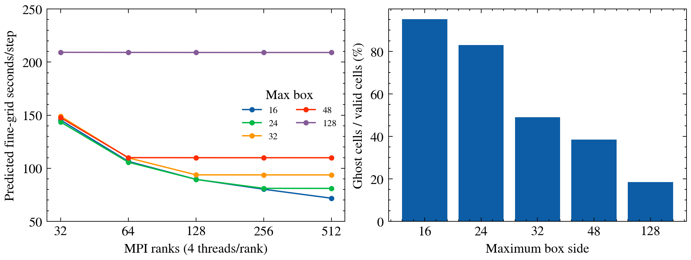

# T18 — critical-path performance of the first binary merger

The final status is **READY-EXCEPT**. Decomposition, initial cell-set replay, all-field neutrality and all three registered timestep windows are complete and verified. Short binary captures fill the missing constraint and temporal-versus-spatial launch evidence. The largest tested value, **dt_multiplier=0.5**, is supported on the low-resolution rung by this finite-window and launch evidence. The leading calibration candidate is size 24 or 16, four nodes of 32 MPI ×4 threads, predicting 44.8 s per coarse step. Its d32 combined planning budget is 13.4–14.1 hours. Cluster calibration and the original T17 horizon/spatial admission remain outstanding; neither the old approximately 20-day forecast nor this new budget is a measured binary cluster runtime.

## Geometry and decomposition

The worktree is 77c5b6f. Production physics and the author's finder are unchanged. The geometry replay uses T17's opt-in two-centre tagging prescription, not the original fork's single midpoint criterion. That prescription is retained in [the T17 production patch](../../../wt-native-t4/Tests/EMSNative/t17-production.patch). At initialization it evaluates the existing radius criterion about both punctures. The native criterion selects cell centres with r < 1.2 R; its gradient thresholds are 1e100 in this draft. The relevant source is [EMSExtractionTaggingCriterion.hpp](../../Source/TaggingCriteria/EMSExtractionTaggingCriterion.hpp:107). The local tag dilation and domain clipping occur in [GRAMRLevel.cpp](../../Source/GRChomboCore/GRAMRLevel.cpp:360). T17's dense representation workaround changes the tag storage, not the chosen cells.

`max_box_size` aliases `max_grid_size`; `min_box_size` aliases `block_factor`. The default block factor is eight, must be a power of two, and must divide the maximum box side: [ChomboParameters.hpp](../../Source/GRChomboCore/ChomboParameters.hpp:109), [validation](../../Source/GRChomboCore/ChomboParameters.hpp:405). The grid buffer is eight, tag buffer three, fill ratio 0.7 and refinement ratio two. Setup passes these to Chombo in [SetupFunctions.hpp](../../Source/GRChomboCore/SetupFunctions.hpp:125).

Chombo's [AMR.cpp](/Users/auroradysis/Workspace/EMS-deps/Chombo/lib/src/AMRTimeDependent/AMR.cpp:1540) constructs level zero by splitting the block-coarsened domain approximately evenly, then refining those boxes by the block factor. On finer levels, [MeshRefine.cpp](/Users/auroradysis/Workspace/EMS-deps/Chombo/lib/src/BoxTools/MeshRefine.cpp:543) coarsens the tags by ceil(block_factor/ref_ratio)=4, builds proper-nesting domains, and adds the support of finer boxes while descending the hierarchy. Its [maximum-size conversion](/Users/auroradysis/Workspace/EMS-deps/Chombo/lib/src/BoxTools/MeshRefine.cpp:651) is max_box_size/(4×2). [BRMeshRefine.cpp](/Users/auroradysis/Workspace/EMS-deps/Chombo/lib/src/BoxTools/BRMeshRefine.cpp:263) accepts sufficiently filled, properly nested boxes, otherwise splits tags at holes or signature inflections. Its [box split](/Users/auroradysis/Workspace/EMS-deps/Chombo/lib/src/BoxTools/BRMeshRefine.cpp:582) bisects recursively; maximum size 24 therefore does not produce uniformly 24×24 boxes.

The geometry-only replay calls the installed BRMeshRefine and LoadBalance implementations. An exact row-interval witness compares the union of every cell with T17's saved census. All five maximum sizes have exactly the same initial cell sets on every level. Size 128 also reproduces the exact original boxes. This is stronger than equality of total cell counts and is recorded in [t18-census-check.csv](t18-census-check.csv). The fine census has 14 levels; the coarse census agrees on levels 0–12. The statement that every refined level has 16 boxes has exceptions at levels 1–3.

| Levels | Valid cells per level | Boxes at 16 | 24 | 32 | 48 | 128 |
|---|---:|---:|---:|---:|---:|---:|
| 0 | 3,276,800 | 12800 | 5778 | 3200 | 1458 | 200 |
| 1 | 147,840 | 646 | 512 | 198 | 128 | 24 |
| 2 | 252,672 | 1612 | 512 | 512 | 128 | 32 |
| 3 | 56,576 | 288 | 160 | 80 | 48 | 8 |
| 4,5,8,11 | 76,160 | 342 | 256 | 110 | 64 | 16 |
| 6,7,9,10,12,13 | 73,984 | 324 | 256 | 100 | 64 | 16 |

Chombo assigns entire boxes to ranks, using valid-cell counts in [LoadBalance.cpp](/Users/auroradysis/Workspace/EMS-deps/Chombo/lib/src/BoxTools/LoadBalance.cpp:111). If ranks outnumber boxes, [its early return](/Users/auroradysis/Workspace/EMS-deps/Chombo/lib/src/BoxTools/LoadBalance.cpp:238) gives each box one rank. [GRAMRLevel::loadBalance](../../Source/GRChomboCore/GRAMRLevel.cpp:552) calls this per level. The box loop is serial across local boxes and OpenMP divides rows inside each box: [BoxLoops.impl.hpp](../../Source/BoxUtils/BoxLoops.impl.hpp:97). Regridding on a level can regenerate all finer levels; it does not redistribute a single box's RHS across several MPI ranks. The recursive fine-level calls are in [AMR.cpp](/Users/auroradysis/Workspace/EMS-deps/Chombo/lib/src/AMRTimeDependent/AMR.cpp:1205). The finest two levels contribute approximately 75% of the cell-substep work.

## Calibrated critical path and its limits

For each level the replay obtains Chombo's actual rank assignments and measures the largest rank load. The proposed model is

\[
 T(P,t) = a\,{4\over t}\sum_l 2^l\max_p\{V_{lp}+\gamma G_{lp}\}
             +\tau\sum_l2^l,
\]

where V is valid cells and G is additional cells in the three-cell halo. The central halo weight is gamma=1/4; zero and one are sensitivity cases, not fitted measurements. OpenMP scaling 4/t is ideal. The second term is an effective per-level-substep remainder. Two timings cannot identify pure MPI synchronization separately from point transfers, OpenMP team creation, regridding and other overhead. This term must not be presented as an independently measured barrier latency.

The retained exp-0023 rank census gives E-low 16,384 valid + 1,572 ghost cells on the heaviest refined-level rank, versus E-high 5,184 + 900. Both have levels 0–14. The 1030/418 s anchors yield a=1.64317e-6 s per weighted cell-substep at four threads and tau=3.86655 ms. The fine binary's sum of substep counts is 16,383, so its effective remainder is 63.35 s/step; the coarse remainder is 31.67 s/step. [The exact rational residual and independent 80-digit solve](t18-model-cas.json) verify the algebra, not the model's physical accuracy.

The predicted current draft at 32×4 is approximately 105/209 s per coarse/fine coarse step. E-high already has the same largest refined box as the binary, with one additional AMR level. Adding a second hole does not double the heaviest rank's box when enough ranks own the two patches separately. T17's 1474.66 s/step fine estimate instead multiplied a total-work normalization by a storage-contaminated local binary/single ratio. The resulting sevenfold difference is a correction to an uncalibrated forecast, not a measured optimization speed-up.

Predicted fine s/step, **four threads per rank**. Coarse values are approximately one half; the complete coarse table is in the CSV.

| Max box | 32 ranks | 64 | 128 | 256 | 512 |
|---:|---:|---:|---:|---:|---:|
| 16 | 145.5 | 106.5 | 89.6 | 80.2 | 71.8 |
| 24 | 143.6 | 105.7 | 89.5 | 81.1 | 81.0 |
| 32 | 149.1 | 109.8 | 93.8 | 93.8 | 93.7 |
| 48 | 147.7 | 110.0 | 109.9 | 109.9 | 109.9 |
| 128 | 209.2 | 209.1 | 209.1 | 209.0 | 209.0 |

All per-level critical loads are in [t18-census-loads.csv](t18-census-loads.csv), and their weighted sums, synchronization terms, halo sensitivity and speed-ups are in [t18-model.csv](t18-model.csv). Among the fine-reference matrix cells, size 24 with four nodes of 32×4 predicts 89.5 s/step: 2.34× faster than the current fine draft within this same model, or 16.5× below T17's planning rate. Size 16 is essentially tied at 89.6. The recommended low-rung calibration target predicts 44.8 s/step with the same sizes/layout. They cannot be distinguished without measurements.

The complete low-rung predictions at four threads per rank are:

| Max box | 32 ranks | 64 | 128 | 256 | 512 |
|---:|---:|---:|---:|---:|---:|
| 16 | 73.1 | 53.3 | 44.8 | 40.1 | 35.9 |
| 24 | 72.1 | 53.0 | 44.8 | 40.5 | 40.5 |
| 32 | 74.6 | 55.0 | 46.9 | 46.9 | 46.9 |
| 48 | 74.0 | 55.1 | 55.0 | 55.0 | 55.0 |
| 128 | 104.7 | 104.6 | 104.6 | 104.6 | 104.6 |

At the finest fine level, the actual ghost/valid ratios are 95.2%, 83.0%, 49.0%, 38.4% and 18.4% for sizes 16,24,32,48,128. Uniform square-box ratios would be 89.1%,56.3%,41.0%,26.6%,9.6%; the actual mix includes smaller rectangles. Point transfers, copies and ghost enforcement see these extra cells, although the expensive RHS mainly visits valid cells. An exchange upper count is four stages × 28 fields × ghost cells × 2^l; [t18-grid-summary.csv](t18-grid-summary.csv) retains it. This counts physical boundary and coarse/fine ghosts too, so multiplying by eight gives a conservative data-volume proxy, not measured MPI traffic. More boxes also mean more messages and more OpenMP team launches. The two-anchor fit cannot price those separately; the matrix must measure them.

The previous E-high two-node trial gained only about 0.6%, consistent with 32 refined boxes already exhausted by 32 ranks. It does not rule out scaling after splitting those boxes. Conversely, zero extra inter-node penalty in this model is optimistic: every additional millisecond per substep costs 16.38 s/fine coarse step or 8.19 s/coarse coarse step. Do not treat the halo-only sensitivity as a confidence interval. A factor 0.5–2 is a planning spread until cluster calibration, and cannot bound unmeasured communication or OpenMP overhead.

## Numerical neutrality

Seven local cases evolved a compact binary analogue with the same levels 0–12, native Float64 fields, geometric initial lapse, RK4, gauge, sigma=1 and point transfers. They completed three synchronized coarse steps, t=1.3125 M_i. The outer grid is 128×64 at h0=1.75; each hole has a fixed 32×16 patch on each refined level, with a four-cell nesting buffer. Every candidate uses exactly the same cell coordinates; only box splitting and OpenMP thread count change. Native initialization reads the supplied binary/CTT data only at numerical t=0. The post-t0 static-reader guard remains enabled.

Sizes 128,16,24,32,48 at one thread, and size 16 at two and four threads, all have zero differing bits in all 28 evolved fields at t=0 and after step three. The comparison includes covered coarse cells. Across all seven controls it checks **8,028,160 Float64 values**; the final-state comparison alone checks 4,014,080. [t18-neutrality.csv](t18-neutrality.csv) retains every field/level result. It compares every valid evolved value, not differently duplicated checkpoint ghosts. This is a same-toolchain, scalar ARM test with one MPI rank; local Chombo is serial. MPI and Zen4 SIMD neutrality are not established by it. Exact initial production coverage is established separately, but these compact controls do not certify later moving/regridded production cell sets.

Measured compact size-16 elapsed times are 129.9/217.3/297.4 s at one/two/four threads, including initialization and output. Other applications are running, so these are not isolated throughput benchmarks. Nevertheless, assuming four-thread scaling on tiny boxes is unsafe. The cluster matrix retains all three layouts. The seven processes peaked at 0.104–0.137 GB RSS. The production build peaked at 0.603 GB; the geometry census at 0.0178 GB. [t18-local-rates.csv](t18-local-rates.csv) retains the local receipts.

## Timestep trials and temporal error

All three registered isolated boosted e8 windows are complete. Each is verified against its own marker, actual-child resource receipt, pinned executable, native stop, complete endpoint history, stage sample counts and all 13 level screens. Exit zero alone is not treated as a pass. [t18-window-audit.csv](t18-window-audit.csv) records these checks; [t18-dt-levels.csv](t18-dt-levels.csv) retains all 39 rows.

The grid has h0=1.75 and finest h=0.00042724609375, matching the low binary rung. Its centre is 40 M_i in L=112, preserving subcell phase by an integer-cell translation, with the closest outer boundary 40 M_i away. The requested finest window is 0.875 M_i, approximately 145 R_h. A fixed r<0.08 collar covers the expected boosted motion. Native geometric lapse, gauge, KO=1, Float64 and point transfers are retained. No stationary profile is evaluated after t=0; subtraction uses stored native initial fields.

| dt_multiplier | Finest steps | Finest stop M_i | Wall seconds | Peak RSS GB | All 13 screens |
|---:|---:|---:|---:|---:|---|
| 0.25 | 8192 | 0.875000000000 | 2024 | 0.747 | PASS |
| 0.375 | 5461 | 0.874946594238 | 1150 | 0.792 | PASS |
| 0.5 | 4096 | 0.875000000000 | 969 | 0.727 | PASS |

All windows satisfy the predeclared screen: finite fields, positive sampled metric and chi/lapse, zero observed floor crossings, puncture |Gamma|/|K|/|Theta|/|Pi| below 1e6, and shift/lapse below two. Maximum puncture field is 0.863297, shift magnitude 0.0541244 and lapse 0.989043; minimum chi/lapse are 4.88291e-6/8.53584e-4. These broad bounds detect blow-up, not accuracy. Floor observations cover registered RK inputs and endpoints; final pre-clamp activation counts were not instrumented. The 0.375 stop is the last finest step before 0.875; its coarser stages extend to later local clocks and are not a synchronized 0.875 snapshot.

| dt_multiplier | Max light speed | Max lapse speed | Max shift speed | Max characteristic C | Minimum proxy margin |
|---:|---:|---:|---:|---:|---:|
| 0.25 | 0.980513 | 1.321978 | 1.071669 | 0.330495 | 1.620393 |
| 0.375 | 0.980513 | 1.321978 | 1.071669 | 0.495742 | 0.746928 |
| 0.5 | 0.980513 | 1.321978 | 1.071669 | 0.660989 | 0.310196 |

Every level reports C=(dt/h) max(light,lapse,shift envelope). The frozen scalar-wave proxy has C_crit=sqrt(3)/2 and margin C_crit/C−1; its exact witness and independent 80-digit check are in [t18-budget.json](t18-budget.json). It excludes full CCZ4 coupling, native upwind advection, KO, Cartoon terms and AMR interfaces, so a positive margin is not a nonlinear stability theorem. All three per-level C/margin pairs follow in timestep order 0.25 / 0.375 / 0.5. The CSV also retains each trial's individual speed maxima on every level.

| Level | C: 0.25 / 0.375 / 0.5 | Margin: 0.25 / 0.375 / 0.5 |
|---:|---:|---:|
| 0 | 0.330461 / 0.495692 / 0.660923 | 1.620655 / 0.747103 / 0.310327 |
| 1 | 0.330495 / 0.495742 / 0.660989 | 1.620393 / 0.746928 / 0.310196 |
| 2 | 0.330042 / 0.495063 / 0.660083 | 1.623988 / 0.749325 / 0.311994 |
| 3 | 0.324984 / 0.487476 / 0.649968 | 1.664825 / 0.776550 / 0.332412 |
| 4 | 0.315198 / 0.472797 / 0.630397 | 1.747558 / 0.831705 / 0.373779 |
| 5 | 0.297347 / 0.446020 / 0.594694 | 1.912508 / 0.941672 / 0.456254 |
| 6 | 0.265715 / 0.398573 / 0.531430 | 2.259226 / 1.172817 / 0.629613 |
| 7 | 0.263565 / 0.395357 / 0.527157 | 2.285812 / 1.190491 / 0.642823 |
| 8 | 0.263676 / 0.395514 / 0.527352 | 2.284431 / 1.189621 / 0.642216 |
| 9 | 0.265497 / 0.398246 / 0.530995 | 2.261897 / 1.174599 / 0.630949 |
| 10 | 0.267246 / 0.400869 / 0.534492 | 2.240554 / 1.160369 / 0.620277 |
| 11 | 0.267826 / 0.401740 / 0.535648 | 2.233532 / 1.155688 / 0.616782 |
| 12 | 0.267917 / 0.401876 / 0.535834 | 2.232437 / 1.154958 / 0.616219 |

The original observer stored Euclidean volume maxima on W=[0.00075,0.0025], without constraints. [t18-launch-common.csv](t18-launch-common.csv) compares all windows at shared clocks 0.000640869140625, 0.00128173828125 and 0.001922607421875 M_i. At the last clock, 0.375/0.5 Gamma maxima change by −0.688%/−2.413% relative to 0.25; lapse by −4.13e-8/−1.59e-7 fraction and shift by +7.81e-6/+3.41e-5 fraction. Differences between scalar norms can conceal field errors, so they do not supply the temporal error below.

The missing constraint and spatial evidence comes from separately registered short binary captures, [t18-launch-registration.json](t18-launch-registration.json). They use a 512×256 base grid, L=896, centre 448, holes 432/464, with every refined box exactly the T17 production box translated by 1024 coarse cells. Coarse dt=0.25/0.375/0.5 and fine dt=0.25 reach the same three launch clocks. The reduced base grid saves memory. Its baseline captures reproduce **81,088 Float64 field values bit for bit** against the original full-domain T17 launches at those clocks and both holes, [t18-launch-full-grid-control.csv](t18-launch-full-grid-control.csv).

Current-field replay uses the existing native Gamma, Hamiltonian, momentum and electric/magnetic Gauss kernels at coupling −0.9, with zero native RHS replay bit mismatches. No static reader participates. Both inward axis/diagonal rays and both holes use the T17 physical W samples, P8 interpolation, P10 control, peak and trapezoidal RMS. Gamma/shift are radial components and Mom is the norm of the interpolated momentum vector. [t18-launch-constraints.csv](t18-launch-constraints.csv) retains instantaneous and native-t0-subtracted norms for Gamma, lapse, shift, C_Gamma, Ham, Mom, GaussE, GaussB, Theta, Lambda and Xi. [t18-launch-comparison.csv](t18-launch-comparison.csv) retains their signed norm differences against dt=0.25 at every clock.

Temporal error is the norm of the difference of native-t0-subtracted coarse profiles; spatial difference is the norm of coarse-minus-fine profiles at dt=0.25. Before analysis, the registered rule required temporal error plus five times its matched P8/P10 spread to be below spatial difference minus five times its matched spread. Linearity permits evaluating interpolation spread on the difference itself. These are differences of profiles, not differences of scalar norms. The worst raw ratios over all 24 hole/ray/clock/norm comparisons per channel are:

| Channel | dt=0.375: worst ratio % | dt=0.5: worst ratio % | dt=0.5 endpoint peak error, maximum over rays/holes |
|---|---:|---:|---:|
| Gamma | 1.21212 | 4.67495 | 4.38495e-05 |
| lapse | 0.00377847 | 0.0155238 | 1.03739e-09 |
| shift | 0.433473 | 1.80706 | 5.84498e-09 |
| C_Gamma | 0.204163 | 0.689403 | 1.20369e-05 |
| Ham | 0.0744348 | 0.324382 | 0.00163933 |
| Mom | 0.0742136 | 0.330326 | 0.27159 |
| GaussE | 0.0380625 | 0.155529 | 0.0151046 |
| GaussB | exact zero | exact zero | 0 |
| Theta | 0.119149 | 0.527944 | 1.70933e-08 |
| Lambda | exact zero | exact zero | 0 |
| Xi | 0.0486071 | 0.218334 | 1.88326e-10 |

Every nonzero channel passes the spread-adjusted rule: 216 launch and 216 instantaneous-state comparisons per candidate timestep. GaussB and Lambda are exactly zero in all compared states; their temporal and spatial differences are zero, so no ratio is assigned. [t18-temporal-spatial.csv](t18-temporal-spatial.csv) retains all errors, spreads and verdicts. Relative subdominance does not establish small absolute constraints or repair the original horizon failures.

**Recommend dt_multiplier=0.5 on the low-resolution rung**, the largest tested value. It passes the registered boundedness window and its binary launch error is subdominant to the actual T17 spatial difference, including every measured nonzero constraint channel. This supports the timestep over the measured windows, not hundreds of M_i of nonlinear evolution. The fine rung has only the short dt=0.25 binary control here and remains a reference at 0.25. [t18-dt-recommendation.json](t18-dt-recommendation.json) records that scope.

The original empty CTT-path invocation aborted before evolution and remains a setup-failure receipt. All subsequent windows and supplemental captures have clear gates. The maximum measured process RSS across completed T18 work is 1.584 GB, below 4e9 bytes; evolution uses two threads, with a single compressor thread for supplemental captures.

## Horizon cost and cadence

No successful full binary qualification cost is available on either rung. Original T17 cases are UPDATE_CAP/FLOOR failures, not converged horizons. Their local elapsed/update ratios are 0.044–0.047 s for coarse N48, 0.048–0.062 for coarse N96, and approximately 0.038–0.040 for both fine N. Those rows describe a shared two-surface solve and must not be summed as two independent clocks. They do not predict how many updates a successful search needs.

The cluster exp-0023 receipts measured roughly 0.11–0.14 s/update at N48 and 0.195–0.207 at N96. Their conservative *per-angular-resolution* full-qualification predictions are about 2006–2445 and 3516–3719 s; these are extrapolated budgets from capped update probes, not successful full solves on the binary grid. A cold N48+N96 angular pair therefore has a conservative planning cost of approximately 5522–6164 s. T17's use of 2006–3719 as a pair cost must not be carried into a sum that actually performs both angular resolutions.

The steady proposal is individual N48 updates every **16 coarse steps at dt=0.5**, retaining the original 14-M_i physical interval (32 steps at 0.25), with native iteration quota one, seeded from each previously qualified numerical surface. Preserve their FOUND/residual status; an unfinished update is not a qualification. Start common searches only at t >= estimated merger−56 M_i or tracked separation <=1 M_i, whichever is earlier; the d32 clock is 250 M_i. Search at physical intervals no larger than 3.5 M_i: **four coarse steps at dt=0.5**, eight at 0.25, six at 0.375. Independent failed probes remain failures and do not prevent later searches. Every found common surface must pass the unchanged three-stage residual and N48/N96 qualification on that frozen numerical checkpoint.

Require strict angular pairs at the two initial individual horizons, first common horizon and post-common endpoint: four pairs minimum. Trigger additional strict checks when warm residual/shape drift makes the previous angular qualification inadequate. Their additional cost is charged explicitly. This is a proposed reduced cadence for T18, not a declaration that T17's full diagnostic protocol has already been changed or admitted. Keeping all 47 T17 cold angular pairs would cost approximately 72–80 hours at these per-N budgets, before common searches and I/O.

To make routine work much less than evolution, enforce a **1% steady wall-time budget**: a routine event on cadence N may spend at most 0.01 N × measured evolution seconds/step. At the 44.8-s low-rung candidate this is about **7.2 s for the two individual updates and 1.8 s for a common-search clock**. Exceeding the budget means deferral or separately charged qualification, never accepting a larger residual. `RH_time_step_freq` is an iteration quota ([RHSurf.hpp](../../Source/RHFinder/RHSurf.hpp:36)), not this physical cadence; scheduling belongs to the checkpoint/probe worker.

Routine single-quota calls can plausibly fit that budget using the observed per-update costs. **Cold strict qualification cannot be guaranteed to remain negligible**: four conservative angular pairs alone reserve 6.1–6.9 hours. A completed warm-cost and convergence measurement on an admitted binary grid is needed to satisfy the negligible-finder-cost claim. No cadence can manufacture convergence from the current failed T17 cases.

## Bounded cluster calibration

The matrix is 5 maximum box sizes ×3 layouts ×3 node counts: **45 finite cells**, now on the low-resolution production grid, levels 0–12, at the recommended **dt=0.5**. Each cell executes five synchronized coarse steps through 4.375 M_i, ignores the first for warm-up, and times steps 2–5 including interval-four coarse regridding before step five. A timestep change does not halve the work per coarse step; it halves the number of steps per physical time. The model's predicted s/step therefore stays unchanged for a fixed rung/layout. Time initialization, regridding, checkpoint output and evolution separately; the total step interval must include coarsest regrid. Preserve moving-centre settings and the per-level box/rank census after regrids. Horizon calls and heavy output are disabled. [t18-cluster-b16.txt](t18-cluster-b16.txt) and its 24/32/48/128 variants retain the original tag radii through level 12, block factor eight and native level-six tracking/regrid interval one. The worker must map and hash-pin profile/CTT paths and use production 77c5b6f plus T17's two-centre patch/dense representation if required. The fixed-patch local observers are not merger executables.

| Max box | 32×4: 1 / 2 / 4 nodes | 64×2: 1 / 2 / 4 nodes | 128×1: 1 / 2 / 4 nodes |
|---:|---:|---:|---:|
| 16 | 73.1 / 53.3 / 44.8 | 74.9 / 58.0 / 48.6 | 84.2 / 65.5 / 48.6 |
| 24 | 72.1 / 53.0 / 44.8 | 74.3 / 57.9 / 49.4 | 84.1 / 67.2 / 67.1 |
| 32 | 74.6 / 55.0 / 46.9 | 78.3 / 62.2 / 62.1 | 92.7 / 92.5 / 92.5 |
| 48 | 74.0 / 55.1 / 55.0 | 78.4 / 78.3 / 78.3 | 125.0 / 124.9 / 124.8 |
| 128 | 104.7 / 104.6 / 104.6 | 177.6 / 177.5 / 177.4 | 323.3 / 323.2 / 323.2 |

All values are central predicted low-rung s/step. [t18-cluster-matrix.csv](t18-cluster-matrix.csv) retains the 45 recommended coarse cells at dt=0.5 and 45 optional fine-reference predictions at dt=0.25, with timestep/rung metadata, halo sensitivity and budgets. Each leaf is capped at 90 minutes and five steps; an incomplete cell is classified as capped. Retain all four post-warmup samples and any regrid pulse. Five steps are a screening sample, not a long-run rate estimate. Repeat the fastest one-node cell and each contender once. Select fastest measured wall time; use multiple nodes only when their gain exceeds the larger observed spread and survives counting regrid/checkpoint work. Overlapping repeated intervals favour one node. The prediction itself is not the decision rule. No SSH, submission or cluster work is performed here.

The original level-six regrid interval one regenerates finer grids 64 times per coarse step. Increasing it to four is a candidate for a later matched moving-grid check. A measured tracker-displacement-plus-stencil guard must remain inside the finest patch, particularly as the holes accelerate. This untested cadence change contributes **zero** to the quoted speed-ups; it must not be combined with the neutral box-splitting claim.

## Run-1 wall-clock budget

The recommended low-rung calibration target uses dt=0.5, size 24 or effectively tied size 16, and four nodes of 32 MPI ×4 threads. At 44.8 predicted s/step, each coarse step advances 0.875 M_i. The nominal budget includes four conservative cold N48/N96 pairs and 1% routine finder work:

| Initial separation | Planned coarse steps | Evolution hours | Combined hours |
|---:|---:|---:|---:|
| 32 | 579 | 7.20 | 13.41–14.12 |
| 12 | 310 | 3.86 | 10.03–10.74 |
| 16 | 353 | 4.39 | 10.57–11.28 |

These are predictions before extra cold common-search attempts, I/O, restarts and additional qualification. Ideal OpenMP scaling and zero additional inter-node penalty require calibration. A 0.5–2 evolution planning spread gives d32 combined 9.8–21.4 h, not a confidence interval. Cold qualification is now comparable to evolution. Retaining all 47 cold pairs would add roughly 72–80 h.

The d12/d16 infall clocks assume 306(d/32)^(3/2), about 70.3/108.2 M_i, followed by 100 initial M_ADM=200.2174604 M_i. They are not solved boosted trajectories. Each shorter separation needs new CTT data and grid, launch and horizon qualification. The actual stop remains first qualified common horizon plus 100 initial M_ADM.

For comparison, the low rung at dt=0.25 predicts d32 combined 20.7–21.4 h; the fine reference at dt=0.25 predicts 35.2–35.9 h. Within the same model, splitting boxes gives 2.34× lower evolution wall time and dt=0.5 gives a further factor of two at fixed low rung, about 4.67× together. Moving from fine to low resolution approximately halves evolution again. **The low-rung budget remains conditional on its outstanding T17 spatial/horizon admission.** Timestep evidence does not replace that admission. [t18-wallclock.csv](t18-wallclock.csv) retains both rungs and all budget components.

## Handoff and reproduction

Production was built in this worktree using local Chombo, DIM=2, O3, double precision and two make jobs. The Tests-only census and observers reuse those objects and the existing measured runner. No production source, finder, equation, gauge, KO, transfer or puncture arithmetic was edited. All retained T18 source/data is under Tests/EMSNative; compiler intermediates are retained under /private/tmp/ems-t18. There is no commit or SSH operation.

Reproduce by building `Examples/EMS` with `CHOMBO_HOME=/Users/auroradysis/Workspace/EMS-deps/Chombo/lib`, `make all DIM=2 -j2`; run `t18-work.py build census`, `t18-work.py census`, `t18-model.py`, `t18-budget.py`; the local setup is `t18-work.py prepare` followed by `t18-run.py --detach /private/tmp/ems-t18/local/plan.json`. The registered full-window worker instead uses `t18-work.py build window`, `t18-finalize.py prepare`, and `t18-run.py --detach /private/tmp/ems-t18/window/plan.json`. Use the provided measured runner for each numerical command. Its environment enforces the 4e9-byte process cap; compiler and analysis receipts use wait4 when macOS denies `/usr/bin/time -l`'s clockrate query. That timer's status one does not replace the actual child status.

The window, job and scientific markers are all zero: `/private/tmp/ems-t18/window/done.exit`, `/private/tmp/ems-t18/window/job/done.exit` and **`/private/tmp/ems-t18/window/scientific.done.exit`**. Each trial also has its own marker and receipt under `/private/tmp/ems-t18/local/dt-{0.25,0.375,0.5}-window`. Supplemental capture/analysis markers `/private/tmp/ems-t18/launch/done.exit` and `/private/tmp/ems-t18/launch-analysis/done.exit` are zero. No T18 numerical job remains pending. Completion markers establish execution status; the separately verified native evidence establishes the limited scientific results.

Supplemental reproduction uses `t18-launch-work.py build`, `t18-launch-work.py prepare`, the measured detached `/private/tmp/ems-t18/launch/plan.json`, then `t18-launch-analyze.py` and `t18-finish.py` under the measured runner. Original receipt verification is `t18-analyze.py`. The supplement consumes the retained full T17 production census/profile evidence and the existing native current-field replay, never a post-t0 stationary solution. [t18-window-results.json](t18-window-results.json) links the verified windows, launch comparison and timestep recommendation; [t18-resources.csv](t18-resources.csv) retains all receipts. The final exception is production readiness: cluster calibration is unperformed and the original T17 horizon/spatial qualification remains unavailable.
