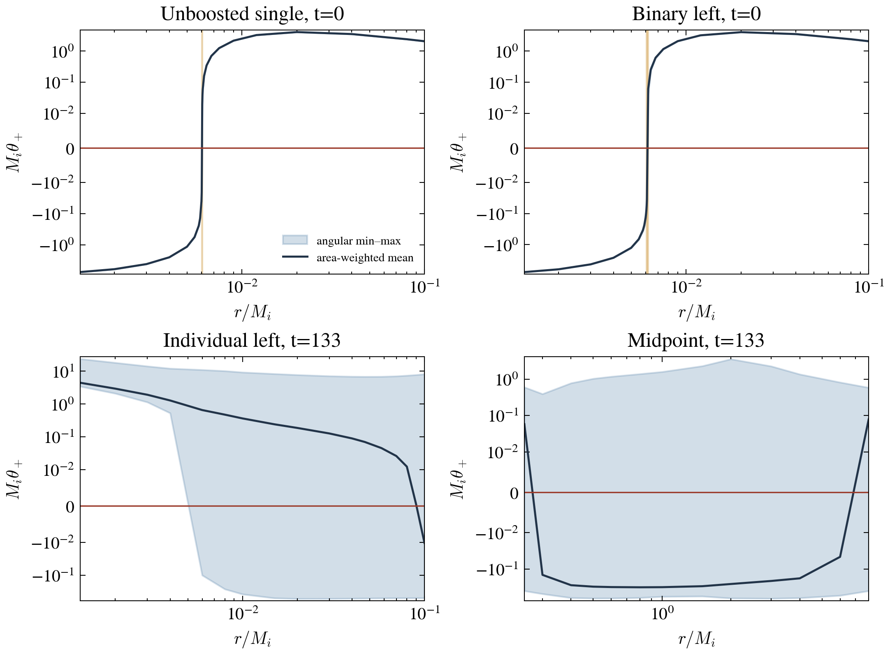

# T25 — signed outgoing expansion on frozen numerical checkpoints

**READY-EXCEPT.** The offline tool, native sign check, local initial-data
regeneration, three requested maps and bracket-seeded searches are complete.
The unboosted N48 search passes all three stages. Both boosted binary holes
have sampled pointwise trapped/untrapped barriers at initialization, but their
bounded N48 searches remain unqualified. At step 152 none of the sampled
individual or common families has a pointwise barrier; there are ten weaker
mean-only crossings. These observations neither locate a late horizon nor
establish that a horizon shrank or disappeared. That original audit ended
before the early positive-time checkpoints were collected. The local
time-resolved continuation below is a completed bounded analysis, with no qualified binary horizon.

## What is evaluated

The map computes the signed outgoing expansion

\[
\theta_+=D_i s^i+K_{ij}s^is^j-K,\qquad
\gamma_{ij}=\widetilde h_{ij}/\chi,\qquad
K_{ij}=(\widetilde A_{ij}+K\widetilde h_{ij}/3)/\chi.
\]

The code uses the convention
\(K_{ij}=-(\partial_t\gamma_{ij}-{\cal L}_\beta\gamma_{ij})/(2\alpha)\):
the metric rate contains \(-2\alpha\widetilde A_{ij}\)
([CCZ4Cartoon.impl.hpp:299](../../Source/Cartoon/CCZ4Cartoon.impl.hpp:299)).
This gives the same outgoing sign as the author's
[RHSurf.hpp:430](../../Source/RHFinder/RHSurf.hpp:430). The lapse is reported
as a surface mean and does not enter the expansion or the horizon equation.

An axisymmetric surface has cylindrical semiaxis \(a\), axial semiaxis \(c\)
and centre \(x_c\). Its implicit equation is
\(F=(x-x_c)^2/c^2+(\rho^2+w^2)/a^2-1=0\).
The normal is the outward normalized gradient of this equation. Its covariant
Hessian gives
\[
D_i s^i={ (\gamma^{ij}-s^is^j)
 (\partial_i\partial_jF-\Gamma^k{}_{ij}\partial_kF)
 \over \sqrt{\gamma^{ij}\partial_iF\partial_jF}}.
\]
Spheres are the case \(a=c\). The geometry is exactly the requested
\(\rho=a\sin\vartheta,\ x-x_c=c\cos\vartheta\); sampling uses the equivalent
polar radial graph
\(f(\theta)=[\cos^2\theta/c^2+\sin^2\theta/a^2]^{-1/2}\).
Its tangent, normal and surface Hessian are analytic. Angular derivatives of
the surface are therefore not inferred from nearest cells or finite angular
differences in the primary map. Cell-centred polar angles avoid the coordinate
poles; the cartoon transverse metric derivatives are retained, including
\(\partial_w h_{xw}=h_{x\rho}/\rho\) and
\(\partial_w h_{\rho w}=(h_{\rho\rho}-h_{ww})/\rho\).

[t25-expansion-map.cpp](t25-expansion-map.cpp) uses the unchanged frozen
RHUnion field query and `AMRInterpolator<Lagrange<4>>`, including its `dx` and
`dy` derivative queries. Ownership is determined by the interpolator's own
finest **valid-box** search, not by sampling nearest-cell values. Stencil
ghosts are filled from the checkpoint's valid evolved fields with the native
production transfers and boundaries. No plot diagnostic ghosts are read.
The map consumes the actual checkpoint hierarchy, not a prescribed hierarchy
template. The old evolution buffer and unused diagnostics are released per
level; only evolution ghosts are filled for maps. No advance or regrid is
possible: the Tests-only level rejects those entry points. The map runs with
one process and one thread. Static and CTT paths are deliberately absent in
every map parameter file; they are used only by the separate t=0 initializers.

The physical metric is inverted directly. The author's finder instead uses
unit-determinant conformal cofactors and the corresponding volume derivative
([RHSurf.hpp:315](../../Source/RHFinder/RHSurf.hpp:315),
[RHSurf.hpp:500](../../Source/RHFinder/RHSurf.hpp:500)). No determinant or
positivity correction is made by the map. A non-positive interpolated chi or
non-positive metric is flagged `INVALID_GEOMETRY`. The initial unboosted
sphere at the linear bracket root agrees with the author's expansion to
\(1.88\times10^{-11}\) pointwise; across its sampled spheres the maximum
disagreement is \(2.94\times10^{-11}\). Initial binary spheres agree to
\(5.67\times10^{-11}\). This confirms the convention on the native initial
control. It is not a promise of identical geometry prescriptions at late
times: interpolation near the late punctures gives determinant deviations as
large as 0.203, and the largest resolved-sphere expansion disagreement with
the finder is 0.147. Both values are retained in the CSVs. No late numerical
surface is certified by the initial sign check.

The charge uses the native EMS displacement flux
\[
Q={1\over\sqrt{2\pi}}\oint
\exp[-2\alpha(f_0+f_1\phi+f_2\phi^2)]\,E_i s^i\,dA.
\]
The stored electric components are **covariant**; this contraction is
identically the requested \(E^i s_i\).
[RHSurf.hpp:584](../../Source/RHFinder/RHSurf.hpp:584) implements the same
coupling and normalization, while
[EMSBH_trumpet_read.impl.hpp:367](../../Source/InitialConditions/EMSBH/EMSBH_trumpet_read.impl.hpp:367)
lowers the electric density with the physical metric. Area, charge and all
means use physical area weights; RMS is \(\sqrt{\int\theta_+^2dA/A}\).
The negative fraction is an **area fraction**, not a count of angles.

Each row reports both local minimum and maximum spacing, x extents, cylindrical
extent, determinant error, and enclosure of each supplied numerical puncture.
Resolution is conservatively the smallest semiaxis divided by the **largest**
local spacing on the surface. A value below 3 is `UNRESOLVED` and never enters
a bracket or a finder seed. Three cells is the requested eligibility rule,
not an accuracy certificate for strongly varying geometry.

[t25-brackets.py](t25-brackets.py) emits the consecutive-input-surface table.
A pointwise pair requires negative expansion at every sampled inner angle
and positive expansion at every sampled outer angle (the reverse direction
is also identified). A mean sign change without these inequalities is
`AVERAGE_ONLY_WEAKER`. Dense sampling can insert a mixed-sign surface between
uniformly negative and uniformly positive surfaces. The additional
`t25-barriers-*` tables retain those tight enclosing barriers, record their
adjacency and the number of intervening surfaces, and discard no input rows.
All intervening geometry must be resolved. These are **sampled** pointwise
inequalities at N96 and N192, not a proof at every continuous angle or of a
continuum MOTS. A mean root is a seed or a trial surface, never a horizon
measurement by itself.

## Validation and initial control

Both controls were regenerated locally with the pinned T17 executable and
`max_steps=stop_time=0`, geometric initial lapse and the static-file guard on.
No evolution occurred. The unboosted control has L0–12, h0=1.75 and
h12=0.00042724609375 M_i, centre x=40 on its L=112 domain. The initial binary
is the T17 d=32 control, centres 2224/2256 in the L=4480 domain, with the same
per-hole spacing and approximately fourteen cells per horizon radius. It is
distinct from the d=16 merger state at t=133. The initial binary companion is
the documented diagnostic n32-r6 file with SHA-256 `46253cb8…`; its data
certification status is unchanged. Full input hashes are in
[t25-audit.json](t25-audit.json).

The implicit-surface formula has an exact flat-space algebra witness and an
independent 50-digit curved-metric check at sixteen sampled points, with worst
residual \(1.07\times10^{-50}\). These checks verify the geometry algebra,
not the accuracy of the evolved data or existence of a horizon
([t25-geometry-verification.json](t25-geometry-verification.json)).

For the single hole the N192 pointwise bracket is r=0.00604–0.00606 M_i.
Its inner expansion range is approximately
[-6.947e-4, -2.848e-4], and the outer range is [0.019128, 0.019537].
Linear interpolation of the area-weighted signed means gives
**r=0.006040488470 M_i**. Evaluating a new numerical surface at that radius
gives **A=0.2245141754, Q=1.0693233457**. It has 14.138 cells per radius,
signed RMS 9.826e-5, and mixed tiny angular signs; it is a bracket-derived
trial sphere, not yet the final fitted surface. N96 to N192 changes the
linear root by 4.87e-10 M_i and A at the linear root by approximately 7.5e-6.

**The card's area benchmark 0.2218 does not describe the supplied progenitor.**
The pinned file's header has A_H=0.22451077798968849, 1.222% higher. The map's
root area agrees with that header and the prior T17 native control. That
header is inspected only as t=0 provenance; it is never an input, seed,
subtraction or target in the expansion map. The discrepancy is reported,
not removed by changing the input or the area normalization.

The unchanged author's N48 finder, seeded from the measured bracket root,
passes squared-expansion stages 1e-7/1e-10/1e-12. Stage residuals are
8.4655e-9, 9.9780e-11 and **9.9961e-13**, using 1/1411/2019 updates and
61.162 s total finder time. Its fitted radial range is
0.006040479697–0.006040494153 M_i; final A=0.2245517229 and Q=1.0695022343
at N48. The N48/N192 area and charge differences include angular quadrature
and surface fitting; they are not spatial error bounds. This is a strict
N48 all-stage pass as requested, **not a newly qualified N48/N96 pair**.
The prior 9.99e-13 result is reproduced without using its fitted shape as a
seed. See [t25-root-single.csv](t25-root-single.csv) and
[t25-finder-single-N48.csv](t25-finder-single-N48.csv).

## Binary at t=0

The initial map contains 1,200 surfaces at each N, spanning two holes,
five centre offsets (-0.001, -0.0005, 0, +0.0005, +0.001 M_i), five axial
aspect ratios c/a (0.85, 0.95, 1, 1.05, 1.15), and twenty-four radii
0.0013–0.1 M_i. Twenty surfaces are unresolved; all remaining surfaces have
valid metric geometry. The fifty consecutive-family sign changes are
mean-only. Twenty-two families nevertheless have tight enclosing pointwise
barriers once intervening mixed-sign surfaces are retained explicitly. The
counts are unchanged at N96 and N192. A shifted centre or spheroid is
therefore **not required for a sampled barrier at t=0**.

The tight centred-sphere pair is identical by reflection at the two holes:

| surface | r (M_i) | signed minimum | signed maximum | area-weighted mean |
|---|---:|---:|---:|---:|
| inner barrier | 0.00608 | -0.0801841 | -0.00735877 | -0.0567711 |
| intervening mixed sphere | 0.00610 | -0.0601846 | +0.0125824 | -0.0367915 |
| outer barrier | 0.00620 | +0.0385480 | +0.1110235 | +0.0618324 |

Linear interpolation across the uniform-sign pair gives
r=0.006137439565 M_i. A new N192 surface at that radius has
A=0.2232824138, Q=1.0693235191, expansion range
[-0.0229732, +0.0496843], mean +3.806e-4 and RMS 0.0208971.
It has 14.365 cells per radius. This signed mean zero estimate is not a
pointwise root. The centred sphere was selected for one bounded search at
each hole because it already supplies the tight resolved barrier and the
least sampled RMS among the near-root surface families; no finder sweep was
launched. Search seeds and their numerical bracket proofs are retained.

| hole | stopping status | updates | finder seconds | final squared expansion | trial A | trial Q |
|---|---|---:|---:|---:|---:|---:|
| left | TIME_CAP | 2336 | 235.029 | 2.27087e-5 | 0.223318623 | 1.069502217 |
| right | TIME_CAP | 2349 | 235.075 | 2.24868e-5 | 0.223318619 | 1.069502217 |

Neither search reaches even the first squared-residual threshold 1e-7;
later stages were not attempted. The differences in update counts reflect
wall caps under concurrent serial searches, not different physics. Both
residuals continue decreasing at the cap. They are about 155 times below
the historical binary value 3.5e-3, and below the historical boosted-single
3.4e-5, but these are **different seeds and update budgets**. The improvement
is an observed bounded-search result, not a spatial or angular convergence
claim. No new boosted-single search was performed.

The initial failure is not absence of a resolved numerical trapped/untrapped
pair in these families. A spherical radius inherited from the unboosted hole
is an inferior binary seed here. The result supports a seed/cap limitation
of those earlier searches, but does not isolate it from the author's flow,
recentring or discretization of the fitted surface. Lapse does not enter
this equation, so changing only initial lapse cannot change a frozen-state
MOTS. All binary stopped areas/charges above remain trial-surface readings.
See [t25-barriers-binary-N192.csv](t25-barriers-binary-N192.csv),
[t25-finder-stages.csv](t25-finder-stages.csv) and the raw retained shapes.

## Step 152, t=133 M_i

The sealed checkpoint supplies the numerical geometry. Track centres are
2239.7740195 and 2240.2259805 (separation 0.451961 M_i); midpoint 2240.
The 188 surfaces per N include per-hole radii from 3h12 to 0.1 M_i,
aspect ratios 0.75/1/1.5/2, and midpoint radii 0.25–8 M_i with aspect
ratios 1/1.5/2/3. All midpoint surfaces enclose both tracked punctures.
Two narrow oblate surfaces fail the three-cell semiaxis rule; 186 surfaces
remain eligible. There is **no sampled pointwise pair** in any eligible
family at either angular N. Ten mean-only crossings persist.

For centred individual spheres, r=0.047 has expansion range
[-0.509753, +6.84821], mean +0.069511 and negative area fraction 0.6134.
At r=0.08 the range is [-0.498515, +7.41647], mean +0.012320 and negative
fraction 0.6482. Even near the weaker mean crossing at r=0.09–0.1, the
surface retains both signs. These do not provide a resolved individual
horizon location.

| midpoint sphere r (M_i) | trial area | trial Q | signed min | signed max | mean |
|---:|---:|---:|---:|---:|---:|
| 0.25 | 283.479 | 2.01855 | -0.399366 | +0.598692 | +0.057524 |
| 0.30 | 370.805 | 2.02678 | -0.481950 | +0.390505 | -0.144610 |
| 0.50 | 595.497 | 2.04383 | -0.639221 | +1.02770 | -0.305073 |
| 1.00 | 811.245 | 2.06636 | -0.573088 | +1.58527 | -0.315138 |
| 8.00 | 1252.782 | 2.09229 | -0.399125 | +0.583533 | +0.077799 |

The midpoint sphere mean changes sign at 0.25–0.3 and again at 6–8 M_i.
Prolate families have weaker mean crossings at a=4–6 (c/a=1.5),
a=3–4 (c/a=2), and a=0.25–0.3 and 2–3 (c/a=3). These are not pointwise
barriers or MOTS areas. No late finder search was launched. This finite
surface family cannot exclude a more general apparent horizon; it does
exclude treating these mean sign flips or coordinate-sphere areas as an
already measured individual/common horizon. The interval t=0 to t=133
does not determine when tracking became unsupported. The unchanged tool
can now be applied to the retained early checkpoints on a compute node.



The shaded envelopes show angular minima/maxima and the line shows the
physical-area-weighted mean for centred spheres at N192. The initial
uniform-sign barriers are narrow, while the late families retain positive
and negative sectors across the mean crossings. No static solution is
plotted or subtracted.

## Reproduction and qualification packet

Build against a clean fork snapshot with the site's **serial** Chombo/HDF5
configuration. From `Tests/EMSNative`, the UCPH and Leonardo build line is
recorded in the C++ header and [t25-build-node.sh](t25-build-node.sh):

```sh
sh t25-build-node.sh ../.. "$CHOMBO_HOME" "$TMPDIR/t25-build" CXX=g++ OPT=HIGH
```

Use the loaded Leonardo GCC 11.5.0 `g++`; on UCPH use that site's configured
GCC/HDF5 compiler. The script defaults to MPI=FALSE, OPENMPCC=FALSE,
PRECISION=DOUBLE, USE_64=TRUE and -j1. The tool also enforces one MPI process
and one OpenMP thread. The build directory contains only the T25 main and
its own GNUmakefile, so Chombo's recursive make cannot pick up other Tests
mains. Native coverage access is enabled in that Tests translation unit
only. No production main or initial-data setter is linked. The site's
`Make.defs.local` supplies HDF5/link flags; serial Chombo libraries must
match this configuration. No remote build or cluster job was executed here.

The local isolated make build passed against the clean archive, using the
available OpenMP library configuration with runtime one thread. It peaked
at 0.539 GB RSS. Its maps and the strict direct-object build's maps are
bit-identical in every recorded value and angular row. This is local build
qualification, not an unperformed GCC11 cluster build. Exact local commands,
objects, library and author-source hashes are in [t25-build.json](t25-build.json).
The pending NaN-abort source changes were not used or changed.

Create a checkpoint parameter file from that run's own parameter file:
keep its domain, parity, transfer and coupling values; set `restart_file`
to the absolute checkpoint path and `hdf5_subpath = ""`, disable all live
tracking/extraction, and supply absent
static/CTT paths. Never increase its `max_level` beyond the stored hierarchy.
Surface CSV columns are `id,family,centre,a,c`; labels and paths must not
contain CSV commas. Each nested family keeps its centre/aspect ratio fixed.

```sh
./t25-expansion-map.ex checkpoint-params.txt \
  map_surfaces=surfaces.csv map_points=192 \
  map_output=map.csv map_angles=angles.csv map_punctures="x1 x2"
python3 t25-brackets.py map.csv brackets.csv --barriers barriers.csv
```

The C++ tool and standard-library bracket script are cluster-portable without
Python numerical packages. `map_angles` retains every signed angular sample,
weight, local level, spacing, lapse/chi and finder comparison. For a
time-resolved series, invoke the same program on each checkpoint with its
own contemporaneous numerical centres, then concatenate the per-checkpoint
CSVs. No time history is inferred from a late snapshot. The local
[t25-work.py](t25-work.py) records the exact initialization/map/seed/search
commands; its local paths are convenience defaults, not cluster input paths.

Optional `map_find=true` takes **one** seed surface and a matching
`map_finder_bracket` CSV. The tool rejects unmatched checkpoint/time/centre,
out-of-bracket axes, non-pointwise proof or unresolved seed before any
finder update. Parameters control angular N, chase, update cap, wall cap,
floor window and all three thresholds; the author algorithm is untouched.
The recorded searches use chase=quota=1, cap=100000, floor_window=100001,
235 s and thresholds 1e-7/1e-10/1e-12. A TIME_CAP or FLOOR is not a pass.
The continuation also permits a recorded weaker mean bracket only under
the explicit Tests-only `map_find_allow_average=true` switch (default false).
That changes the seed admission label, not the author's finder or its
acceptance thresholds; a mean root is never a pointwise horizon measurement.

The measured peak RSS is **1.9999 GB for maps**, 1.932 GB for the binary
bounded finder and 1.268 GB for t=0 initialization. All run caps are met;
each job's own receipt and completion text were checked
([t25-receipts.csv](t25-receipts.csv)). Final-build single/late replays and
the isolated portable-build replay are bit-identical; positive and negative
bracket-guard cases and the unresolved exclusion check pass
([t25-regression.csv](t25-regression.csv)). No run is pending. Earlier local
setup failures and their receipts are retained rather than counted as
evidence. Nothing was evolved, submitted, SSH-accessed or committed.

Small surface/bracket/finder CSVs are in this packet. Angular dumps, native
receipts, regenerated checkpoints and stopped shapes remain under
`/private/tmp/ems-t25/`; their hashes and sizes are in `t25-manifest.txt`.
No bulk checkpoint is copied into the worktree. The required next
time-history reading is precisely the signed map through the retained early
checkpoints, not an extrapolation of a fixed-area radius.

## Time-resolved exp-0024 map, t = 0 to 28 M_i

**READY-EXCEPT: the bounded analysis is complete; no binary horizon search qualifies.**

The matching time-zero state uses exp-0024's d=16, rapidity 0.05778205303580913, geometric initial lapse and compiled ExperimentalGauge. Its companion SHA-256 is `107370ae00d8b69dc3122dc023e34bbff23b90afc8401bb233743c1182e6083c`; both initial inputs match the sealed submission. The d=32 T17 control above is a different initialization and is not substituted into this history. All eight collected checkpoints match their cluster SHA-256. Each uses the contemporaneous centres from `punctures.dat`. Static and CTT paths are absent from every positive-time map and search.

The native finest spacing is h=0.00042724609375 M_i. Spheres span 3h to 0.05 M_i with 4% initial radial spacing. Sign boundaries are bisected up to four times to at most 0.5% local spacing. If no spherical pointwise barrier exists, or it remains wider than 3%, the fixed fallback uses offsets −4, −2, 0, 2, 4 h and c/a=0.5, 0.75, 0.9, 1, 1.1, 1.25, 1.5, 2, with 8% initial radial spacing and the same refinement. Extents under three local cells are ineligible. N96/N192 and actual AMR ownership are retained. The selected endpoint signs agree at both angular resolutions. “Pointwise” here means every sampled angular point; it is not an interval proof between those points.

Before each search, the narrowest available pointwise barrier was selected, with endpoint RMS as the tie-breaker; a negative-to-positive mean pair inside it supplies the linearly interpolated seed. If no pointwise pair exists, one weaker mean pair may seed through `map_find_allow_average=true` (Tests-only, default false). There are eight pointwise-seeded and two mean-seeded searches. No bracket at t≥17.5 means no search there. All ten use the unchanged author finder: N48, chase=quota=1, 235 s cap, update cap 100000, inert floor window 100001, stages 1e-7/1e-10/1e-12. Every search stops at TIME_CAP in stage 1. The native squared residual is area-weighted mean θ₊², not its square root.

After those capped probes, additional maps use only their numerical final centres and a spheroid aspect ratio estimated from their numerical contours. These add no finder searches. They improve the t=0 pointwise width to 1.0025%, but cannot meet the requested few-percent pointwise width at positive time: best post-flow widths are about 38.1%, 30.5% and 22.1–22.7% at t=3.5, 7 and 10.5. The adjacent mean-root interval is narrower (about 0.5%), which does not make its angular expansion vanish. At t=14 only a weaker mean crossing exists. The original seed and receipts remain separate from these post-flow maps.

The table below reports the refined **mean-root trial** semiaxes a/c and physical surface integrals. Even inside a pointwise barrier, a mean root is not a solved marginally outer trapped surface (MOTS). Its finder residual belongs to the single earlier bracket-seeded probe, not to a new search at the refined centre. Hole 0 is the lower-x hole; hole 1 the upper-x hole. All entries are numerical-rung/checkpoint quantities.

| t / M_i | hole | bracket | a / c (M_i) | min extent / h | A trial | Q trial | mean lapse | finder θ² |
|---:|---:|:---|:---|---:|---:|---:|---:|---:|
| 0 | 0 | pointwise | 0.006237246 / 0.006230151 | 14.58211 | 0.2220885 | 1.069324 | 0.03988408 | 6.304415e-05 |
| 0 | 1 | pointwise | 0.006237328 / 0.006229989 | 14.58173 | 0.2220885 | 1.069324 | 0.03988408 | 5.384299e-05 |
| 3.5 | 0 | pointwise | 0.006019113 / 0.005964204 | 13.95964 | 0.2216211 | 1.055557 | 0.04098933 | 0.0002149621 |
| 3.5 | 1 | pointwise | 0.006019152 / 0.005964128 | 13.95947 | 0.2216211 | 1.055558 | 0.04098933 | 0.0002068308 |
| 7 | 0 | pointwise | 0.00579329 / 0.005730467 | 13.41257 | 0.2138431 | 0.9092232 | 0.03781584 | 0.0003733849 |
| 7 | 1 | pointwise | 0.005793626 / 0.00572978 | 13.41096 | 0.213843 | 0.9092288 | 0.03781578 | 0.0002769497 |
| 10.5 | 0 | pointwise | 0.005715181 / 0.005715181 | 13.37679 | 0.194103 | 0.7138401 | 0.03401404 | 0.004616604 |
| 10.5 | 1 | pointwise | 0.005715083 / 0.005715083 | 13.37656 | 0.1941021 | 0.7138393 | 0.03401298 | 0.0105724 |
| 14 | 0 | mean only | 0.004206291 / 0.00413894 | 9.687485 | 0.2317358 | 0.743461 | 0.007787269 | 0.106756 |
| 14 | 1 | mean only | 0.004206066 / 0.004139475 | 9.688737 | 0.2317375 | 0.7434681 | 0.007787266 | 0.1102885 |
| 17.5 | 0 | none sampled | — / — | — | — | — | — | — |
| 17.5 | 1 | none sampled | — / — | — | — | — | — | — |
| 21 | 0 | none sampled | — / — | — | — | — | — | — |
| 21 | 1 | none sampled | — / — | — | — | — | — | — |
| 24.5 | 0 | none sampled | — / — | — | — | — | — | — |
| 24.5 | 1 | none sampled | — / — | — | — | — | — | — |
| 28 | 0 | none sampled | — / — | — | — | — | — | — |
| 28 | 1 | none sampled | — / — | — | — | — | — | — |

The full 18-row table, including χ, K, K−2Θ, signed expansion range/RMS, local spacing and native finder A/Q, is [t25-early-refined-time-table.csv](t25-early-refined-time-table.csv). [t25-early-time-table.csv](t25-early-time-table.csv) retains the preliminary roots and actual finder seed centres. [t25-early-final-brackets.csv](t25-early-final-brackets.csv) gives both semiaxes of each refined barrier and the adjacent mean pair, signed endpoint bounds and the N96 confirmation. Per-checkpoint `t25-early-step*.csv` packets retain the spherical/selected-family map; `*-post-centres.csv`, `*-post-brackets.csv`, `*-post-barriers.csv` and `*-post-roots.csv` retain the additional numerical-centre maps. All remaining families and angular rows stay under `/private/tmp/ems-t25/early/step*/`, indexed by the manifest.

| t / M_i | χ mean (hole 0) | K mean | K−2Θ mean | θ₊ RMS on trial |
|---:|---:|---:|---:|---:|
| 0 | 0.002199606 | 5.245812e-07 | 5.245812e-07 | 0.008108113 |
| 3.5 | 0.002053002 | 0.4031784 | 0.1712479 | 0.137063 |
| 7 | 0.002000595 | 0.5953006 | 0.1218111 | 0.2757969 |
| 10.5 | 0.00233693 | -2.224749 | 0.3045615 | 0.4587069 |
| 14 | 0.001149979 | -6.447753 | 0.5632302 | 0.5648549 |

Angular N96/N192 spreads are reported as sampling differences, not full spatial error bounds ([t25-early-refined-angular-spreads.csv](t25-early-refined-angular-spreads.csv)). The largest A/Q spreads on these ten trials are 7.52e-06 / 3.56e-05. The signed θ₊ RMS grows from about 0.008 at t=0 to 0.137/0.276/0.46/0.57; its tiny mean is cancellation, not a small pointwise residual. The map uses the actual metric inverse, while the author finder uses unit-determinant conformal cofactors. Their maximum θ₊ discrepancy on the refined hole-0 trial grows from 8.7e-10 to 0.00449, 0.00671, 0.0604 and 0.204. This measured geometry-prescription difference is an additional limitation on late finder/map comparisons, not a silently corrected determinant.

### What the time series establishes

The initial narrow, grid-supported barrier and repeated capped flow support the **early finder/seeding/stopping part of case (i)**. Pointwise barriers remain sampled through t=10.5, but their angular zero bands are broad and no solved near-zero surface is obtained. At t=14 the evidence weakens to an average-only crossing; at t=17.5, 21, 24.5 and 28 none of the eligible sampled individual families has a negative-to-positive pointwise or mean pair. This is an absence within the tested families, not proof that no horizon exists. Thus a single one of the consult’s three cases cannot be asserted for the entire window: case (iii) “even early” is contradicted by the early barriers, and case (ii) is not established by qualified horizons.

The mean-root trial first falls below ten cells at the sampled t=14 (9.687/9.689 cells). It never supplies a resolved below-three-cell root. **The times at which an actual horizon falls below ten or three cells are unknown.** There is no accepted horizon whose area stays about 0.2245 while its coordinate radius squeezes; absence of later brackets cannot supply that claim.

The initial refined trial gives A=0.22208851 and Q=1.06932399. Its area is about 1.07% below the isolated progenitor value 0.2245, but agrees with the independent d=16 CTT initial reference A_i=0.2220848223, Q_i=1.06931005935 within 1.7e-5/1.3e-5 relative. Later trial A/Q do not remain at either initial pair: A is about 0.21384/0.19410 at t=7/10.5 and Q about 0.90922/0.71384. Those changes greatly exceed angular quadrature spreads, but the trial is not a MOTS and its pointwise residual increases. **Neither conservation nor a physical loss of horizon area/charge is certified by this series.** Nearest-cell coordinate-sphere areas and warm-tracking output are not substituted for these missing horizon measurements.

### Midpoint at t=28 and receipts

The 20 enclosing midpoint surfaces are spheres and prolates with c/a=1,2,4,8 and axial semiaxes 1.05,1.25,1.5,2,4 times the measured half separation (c=7.56963–28.83668 M_i). All enclose both punctures and exceed 16.47 cells per smallest extent. Every mean expansion is positive (minimum 0.06068095), but some angular sectors are negative (global minimum −0.06285768). No enclosing pointwise or mean barrier pair exists in this sampled set; no midpoint finder is run ([t25-early-midpoint-t28.csv](t25-early-midpoint-t28.csv)). This is the requested sanity test, not a global horizon-exclusion proof.

Each native map/finder receipt was verified independently: its done marker, child return code, no gate, measured RSS and completion text. All ten finder return codes are 1 with finite TIME_CAP stage data; the workflow marker 0 only records completion. The continuation peak RSS is 3.322085 GB; initialization peaks at 2.867 GB. Maps have a 3 GB process cap, initializers/finders a 6 GB cap, with one process/thread and one checkpoint at a time. The regression preserves all 55,944 existing map/angle values bit for bit and verifies the weaker-seed gate off/on. See [t25-early-audit.json](t25-early-audit.json), [t25-early-final-audit.json](t25-early-final-audit.json), [t25-early-finder-stages.csv](t25-early-finder-stages.csv), [t25-early-receipts.csv](t25-early-receipts.csv) and [t25-early-regression.csv](t25-early-regression.csv).

To regenerate the final ledgers/report from completed receipts without probes, run `python3 t25-early-audit.py` then `python3 t25-early-finalize.py` then `python3 t25-manifest.py`. The serial pipeline and post-flow map markers are both 0. No job remains pending. No positive-time static input, evolution, SSH, source change, NaN-abort build or commit is part of this continuation.

